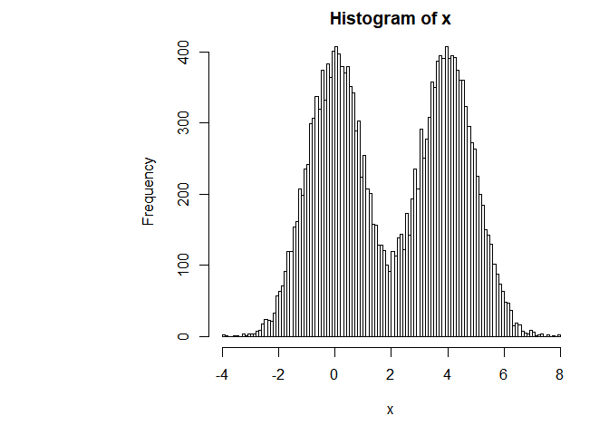
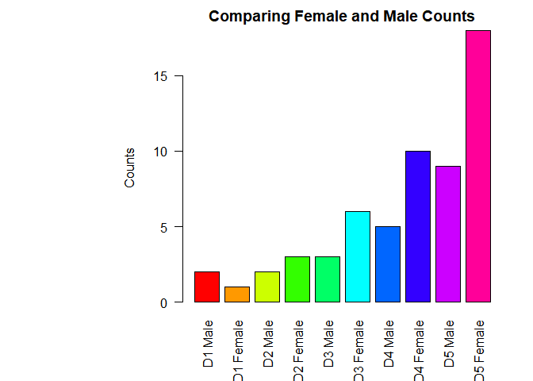

class05: Data exploration and visualization in R
================
Kelsey Dang
Oct 17 2019

``` r
# Class5 Data Visualization
x <- rnorm(1000)

# Calculating stats of x
mean(x)
```

    ## [1] 0.01438206

``` r
sd(x)
```

    ## [1] 1.012918

``` r
# boxplot takes the output from the summary and uses it to plot data
summary(x)
```

    ##      Min.   1st Qu.    Median      Mean   3rd Qu.      Max. 
    ## -3.540483 -0.663521 -0.005756  0.014382  0.663605  3.184955

``` r
boxplot(x)
```

<!-- -->

``` r
hist(x)
rug(x) # Shows the data on the bottom of the plot
```

<!-- -->

``` r
# Section 2 - Scatter Plots
baby <- read.table("bimm143_05_rstats/weight_chart.txt",
                   header = TRUE)

plot(baby$Age, 
     baby$Weight, 
     type= "o",
     pch=15,
     cex=1.5,
     lwd=2,
     ylim=c(2,10),
     ylab="Weight (kg)",
     xlab="Age (months)",
     main = "Baby weight with age")
```

<!-- -->

``` r
# Section 2 - Barplots

# Make sure to put the correct separation, space is the default
mouse <- read.table("bimm143_05_rstats/feature_counts.txt", header=TRUE, sep="\t")

par(mar=c(5, 12, 2, 2))
barplot(mouse$Count,
        horiz = TRUE,
        ylab = "",
        xlim = c(0,80000),
        names.arg = mouse$Feature,
        main = "Number of features in the mouse GRCm38 genome",
        las = 1)
```

<!-- -->

``` r
# Section 2 - Histograms
x <- c(rnorm(10000),rnorm(10000)+4)

# Note*: the more breaks the more detailed the histogram is
# More curves in the graph
hist(x, breaks = 100)
```

<!-- -->

``` r
# Section 3 - Colors!
count <- read.delim("bimm143_05_rstats/male_female_counts.txt", sep = "\t", header = TRUE)
barplot(count$Count,
        names.arg = count$Sample,
        col = rainbow(nrow(count)),
        las = 2,
        ylab = "Counts")
```

<!-- -->

``` r
barplot(count$Count,
        names.arg = count$Sample,
        col = c("blue2", "red2"),
        las = 2,
        ylab = "Counts"
        )
```

<!-- -->
