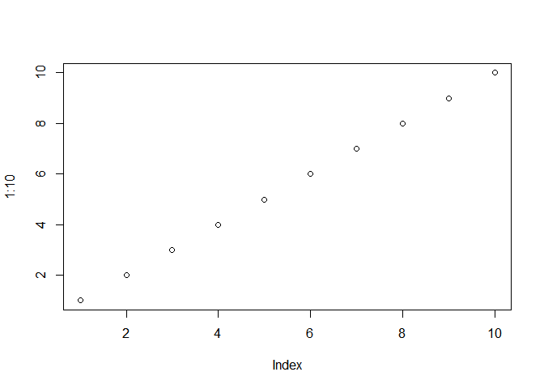
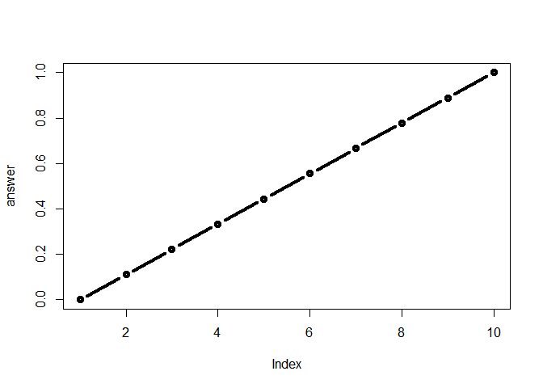

Class6 R Functions
================
Kelsey Dang
10/17/2019

# This is Heading 1

This is my mark from class06 in **BIMM143**.

``` r
# This is to a demo a code chunk
plot(1:10)
```

<!-- -->

## Practice reading files

Here I practice reading 3 different files…

``` r
read.csv("test1.txt")
```

    ##   Col1 Col2 Col3
    ## 1    1    2    3
    ## 2    4    5    6
    ## 3    7    8    9
    ## 4    a    b    c

``` r
read.table("test2.txt", sep="$", header = TRUE)
```

    ##   Col1 Col2 Col3
    ## 1    1    2    3
    ## 2    4    5    6
    ## 3    7    8    9
    ## 4    a    b    c

``` r
read.table("test3.txt", header = TRUE)
```

    ##   X1 X6 a
    ## 1  2  7 b
    ## 2  3  8 c
    ## 3  4  9 d
    ## 4  5 10 e

``` r
# Separated by space and a tab
```

### Creating Functions

``` r
# y is an optional input option
add <- function(x, y=1)
  {
    # Sum the input x and y
    x + y
  }
```

``` r
add(1)
```

    ## [1] 2

``` r
add(5,5)
```

    ## [1] 10

``` r
# These are vectorized, this still works, within num of arguments
add(c(1, 2, 3))
```

    ## [1] 2 3 4

``` r
add(c(1, 2,3), 4)
```

    ## [1] 5 6 7

A new function to re-scale data

``` r
# This function is using the range() function
rescale <- function(x)
{
  rng <- range(x)
  (x - rng[1]) / (rng[2] - rng[1])
}

rescale(1:10)
```

    ##  [1] 0.0000000 0.1111111 0.2222222 0.3333333 0.4444444 0.5555556 0.6666667
    ##  [8] 0.7777778 0.8888889 1.0000000

Test some

``` r
# How would you get your function to work here...
# rescale( c(1,2,NA,3,10) )
# Note* there is an NA, which is different from the numbers provided usually in the vector.
```

``` r
x <- c(1,2,NA,3,10)
# rng <- range(x) ; this gave u errors before, so remove NA
rng <- range(x, na.rm = TRUE)
rng
```

    ## [1]  1 10

``` r
# Redoing the rescale function with removing the NA
rescale2 <- function(x)
{
  rng <- range(x, na.rm = TRUE)
  (x - rng[1]) / (rng[2] - rng[1])
}

rescale2( c(1,2,NA,3,10) )
```

    ## [1] 0.0000000 0.1111111        NA 0.2222222 1.0000000

``` r
rescale3 <- function(x, na.rm=TRUE, plot=FALSE)
{
 rng <-range(x, na.rm=na.rm)
 print("Hello")
 answer <- (x - rng[1]) / (rng[2] - rng[1])
 
 print("is it me you are looking for?")
 if(plot) {
 plot(answer, typ="b", lwd=4)
 }
 print("I can see it in ...")
 return(answer)
}
```

``` r
rescale3(1:10, plot = TRUE)
```

    ## [1] "Hello"
    ## [1] "is it me you are looking for?"

<!-- -->

    ## [1] "I can see it in ..."

    ##  [1] 0.0000000 0.1111111 0.2222222 0.3333333 0.4444444 0.5555556 0.6666667
    ##  [8] 0.7777778 0.8888889 1.0000000

``` r
rescale4 <- function(x, na.rm=TRUE, plot=FALSE)
{
 rng <-range(x, na.rm=na.rm)
 print("Hello")
 answer <- (x - rng[1]) / (rng[2] - rng[1])
 return(answer)
 print("is it me you are looking for?")
 if(plot) {
 plot(answer, typ="b", lwd=4)
 }
 print("I can see it in ...")
 return(answer)
}

rescale4(1:10, plot=TRUE)
```

    ## [1] "Hello"

    ##  [1] 0.0000000 0.1111111 0.2222222 0.3333333 0.4444444 0.5555556 0.6666667
    ##  [8] 0.7777778 0.8888889 1.0000000

## General structure of function

name.of.function \<- function(arg1, arg2){  
statements  
return(something)  
}

## Local vs. Global Environment

It’s not necessary to use return() at the end of the function. The
reason you would want to return an object is it you’ve saved the value
of your statements into an object inside the function.

ex)

``` r
fun1 <- function(x){
  3 * x - 1
}
fun1(5)
```

    ## [1] 14

``` r
fun2 <- function(x){
  y <- 3 * x - 1
}
fun2(5)
# It doesn't print anything because the object y that is saved doesn't exist outside the function and the return() function wasn't used to pass the value of y outside the function.

fun2 <- function(x){
  y <- 3 * x - 1
  return(y)
}
fun2(5)
```

    ## [1] 14

``` r
# print(y)

# I can return the value of y using the return(y) at the end of the function fun2, but can't return the object itself; it's stuck inside the function.
```

## More complex functions

**Calling other functons and passing multiple arguments.**  
First, it is possible to pass multiple arguments into a function and
call other functons within a function.

ex) In this function I’m passing 3args: a matrix, a vector, and a
scalar. In the function body, I first call my previous function
**square.it()** and use it to square the scalar. Then I multiply the
matrix by the vector. Then I multiple those two results together and
return the final object.

``` r
# Write a function that squares an incoming argument
square.it <- function(x) {
 square <- x * x
 return(square)
}

my.fun <- function(X.matrix, y.vec, z.scalar) {
 # use my previous function square.it() and save result
 sq.scalar <- square.it(z.scalar)
 
 # multiply the matrix by the vector using %*% operator
 mult <- X.matrix %*% y.vec
 
 # multiply the resulting objects together to get a final ans
 final <- mult * sq.scalar
 
 # return the result
 return(final)
}
```

When you have multiple args in a function, it’s easier if you name the
arguments in the function call. i.e. declaring args outside before
calling them in the function.

``` r
# save a matrix and a vector object
my.mat <- cbind(c(1, 3, 4), c(5, 4, 3))
my.vec <- c(4, 3)

# pass my.mat and my.vec into the my.fun function
my.fun(my.mat, my.vec, 9)
```

    ##      [,1]
    ## [1,] 1539
    ## [2,] 1944
    ## [3,] 2025

\*\* Returning a list of objects \*\*  
ex)

``` r
another.fun <- function(sq.matrix, vector) {
 # transpose matrix and square the vector
 step1 <- t(sq.matrix)
 step2 <- vector * vector
 
 # save both results in a list and return
 final <- list(step1, step2)
 
 return(final)
}

# call the function and save result in object called outcome
outcome <- another.fun(sq.matrix = cbind(c(1, 2), c(3, 4)),
vector = c(2, 3))

# print the outcome list
print(outcome)
```

    ## [[1]]
    ##      [,1] [,2]
    ## [1,]    1    2
    ## [2,]    3    4
    ## 
    ## [[2]]
    ## [1] 4 9

Now to separate those objects for use in your further code, you can
extract them using the \[\[\]\] operator:

``` r
# Extract first in list
outcome[[1]]
```

    ##      [,1] [,2]
    ## [1,]    1    2
    ## [2,]    3    4

``` r
# Extract second in list
outcome[[2]]
```

    ## [1] 4 9

## Tricks for troubleshooting and debugging

  - Use the Debug() function: use R’s built-in debugger to find at what
    point the error occurs. Indicate which function you want to debug,
    then run the statement calling the function, and R shows you at what
    point the function stops because of errors:

<!-- end list -->

``` r
#debug(my.fun)
#my.fun(X.matrix = my.mat, y.vec = c(2, 3, 6, 4, 1), z.scalar = 9)
```

**Using the stop() and stopifnot() functions to write your own error
messages** Helps the user find the issue immediately.

ex)  
If I know I need dimensions to be the right size, I can check them and
print out a message that says they are incorrect.

``` r
my.second.fun <- function(matrix, vector) {
 if (dim(matrix)[2] != length(vector)) {
 stop("Can't multiply matrix%*%vector because the
dimensions are wrong")
 }
 product <- matrix %*% vector
 return(product)
}

# function works when dimensions are right
my.second.fun(my.mat, c(6, 5))
```

    ##      [,1]
    ## [1,]   31
    ## [2,]   38
    ## [3,]   39
