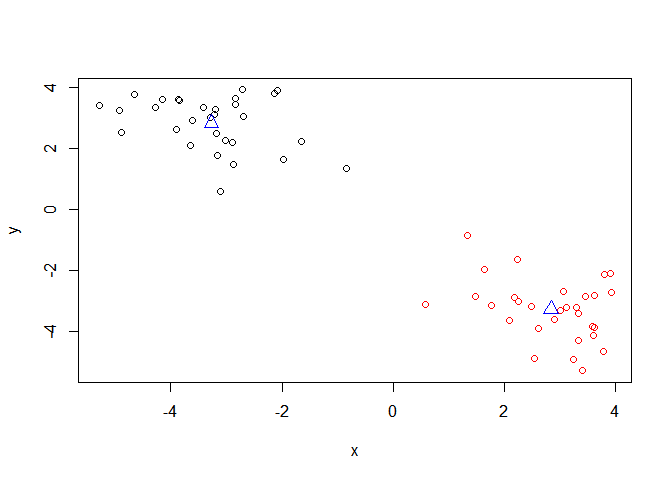
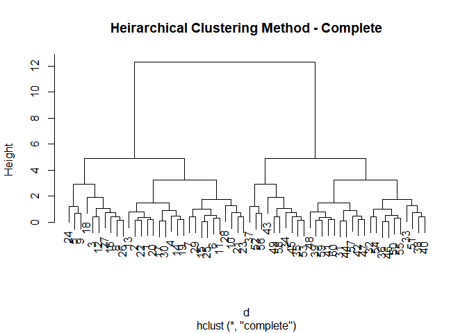

class08
================
Kelsey Dang
10/24/2019

## R Markdown

# Notes:

  - Unsupervised learning: finding structure in unlabeled data  
  - Supervised learning: making predictions based on labeled data;
    predictions like regression or classification
  - Reinforcement learning: making decisions based on past experience
  - Point of the clustering is that you want to group as many points
    together while minimizing the distance between the points  
  - Model selection
      - Best outcome is based on total w/in cluster sym of squares
  - Scree plot
      - elbow point –\> where k is the best  
      - try a range of different k values  
  - For heirarchical clustering there are multiples ways of linkage
      - complete  
      - single
      - average
      - centroid
  - Note:
      - kmeans(x, centers = <int>, nstart = <int>)
      - hclust(dist(x))
  - PCA
      - Each column shows how much each gene is transcribed in each cell
      - inverse correlation: 2 diff types of cells as they are using
        different genes  
      - positively correlated: cells are doing similar things
      - converts the correlations among all cells into a representation
        we can more readily interpret
      - get 2 main things from typical PCA
          - new axis (called PCs or Eigenvalues)
          - Eigenvalues that detail the amount of variance captured by
            each PC

# K-means Clustering \~

``` r
# Generate some example data for clustering
tmp <- c(rnorm(30,-3), rnorm(30,3))
x <- cbind(x=tmp, y=rev(tmp))
plot(x)
```

<!-- -->

Use the kmeans() function setting k to 2 and nstart=20

``` r
k <- kmeans(x, centers = 2, nstart = 20)
```

Inspect/print the results

``` r
k
```

    ## K-means clustering with 2 clusters of sizes 30, 30
    ## 
    ## Cluster means:
    ##           x         y
    ## 1 -3.271436  2.837954
    ## 2  2.837954 -3.271436
    ## 
    ## Clustering vector:
    ##  [1] 1 1 1 1 1 1 1 1 1 1 1 1 1 1 1 1 1 1 1 1 1 1 1 1 1 1 1 1 1 1 2 2 2 2 2
    ## [36] 2 2 2 2 2 2 2 2 2 2 2 2 2 2 2 2 2 2 2 2 2 2 2 2 2
    ## 
    ## Within cluster sum of squares by cluster:
    ## [1] 50.85273 50.85273
    ##  (between_SS / total_SS =  91.7 %)
    ## 
    ## Available components:
    ## 
    ## [1] "cluster"      "centers"      "totss"        "withinss"    
    ## [5] "tot.withinss" "betweenss"    "size"         "iter"        
    ## [9] "ifault"

Q. How many points are in each cluster? \* There are 30 points in each
cluster Q. What ‘component’ of your result object details - cluster
size?

``` r
k$size
```

    ## [1] 30 30

  - cluster assignment/membership?

<!-- end list -->

``` r
k$cluster
```

    ##  [1] 1 1 1 1 1 1 1 1 1 1 1 1 1 1 1 1 1 1 1 1 1 1 1 1 1 1 1 1 1 1 2 2 2 2 2
    ## [36] 2 2 2 2 2 2 2 2 2 2 2 2 2 2 2 2 2 2 2 2 2 2 2 2 2

  - cluster center?

<!-- end list -->

``` r
k$centers
```

    ##           x         y
    ## 1 -3.271436  2.837954
    ## 2  2.837954 -3.271436

Plot x colored by the kmeans cluster assignment and add cluster centers
as blue points

``` r
plot(x, col = k$cluster)
points(k$centers, col="blue", pch = 2, cex = 1.5,)
```

<!-- -->

# Hierarchical Clustering \~

The ‘hclust()’ function requires a distance matrix as input. You can get
this

``` r
# First we need to calculate point (dis)similarity
# as the Euclidean distance between observations
dist_matrix <- dist(x)

# The hclust() function returns a hierarchical
# clustering model
hc <- hclust(d = dist_matrix)

# the print method is not so useful here
hc
```

    ## 
    ## Call:
    ## hclust(d = dist_matrix)
    ## 
    ## Cluster method   : complete 
    ## Distance         : euclidean 
    ## Number of objects: 60

Let’s have a closer look…

``` r
# Our input is a distance matrix from the dist()
# function. Lets make sure we understand it first
dist_matrix <- dist(x)
dim(dist_matrix)
```

    ## NULL

``` r
View( as.matrix(dist_matrix) )
dim(x)
```

    ## [1] 60  2

``` r
dim( as.matrix(dist_matrix) )
```

    ## [1] 60 60

``` r
# Note. symmetrical pairwise distance matrix
```

``` r
# Draws a dendrogram
hc <- hclust(dist(x))
plot(hc)

# With the red line, we can see how many clusters there are, but doesn't actually cut the tree
abline(h = 10, col = "red")
```

<!-- -->

``` r
# Outputs the membership vector;  Cut by height h
# Cut into h groups
cutree(hc, h=10)
```

    ##  [1] 1 1 1 1 1 1 1 1 1 1 1 1 1 1 1 1 1 1 1 1 1 1 1 1 1 1 1 1 1 1 2 2 2 2 2
    ## [36] 2 2 2 2 2 2 2 2 2 2 2 2 2 2 2 2 2 2 2 2 2 2 2 2 2

``` r
# Cute into k groups
cutree(hc, k=4)
```

    ##  [1] 1 1 2 1 2 1 1 2 2 1 1 2 1 1 1 2 1 2 1 1 1 1 1 2 1 2 2 1 1 1 3 3 3 4 4
    ## [36] 3 4 3 3 3 3 3 4 3 4 3 3 3 4 3 3 4 4 3 3 4 3 4 3 3

Linking clusters in hierarchical clustering: \* How is distance between
clusters determined?  
\* There are 4 main methods to determine which cluster should be
linked:  
\- Complete: pairwise similarity between all observations in cluster1
and cluster2, and uses largest of similarities  
\- Single: same as above but uses smallest of similarities  
\- Average: same as abive but uses average of similarities  
\- Centroid: finds centroid of cluster1 and centroid of cluster2, and
uses similarity between two centroids.

Linkage in R:

``` r
# Using different heirarchical clustering methods
d = dist_matrix
hc.complete <- hclust(d, method="complete")
plot(hc.complete, main="Heirarchical Clustering Method - Complete")
```

<!-- -->

``` r
d = dist_matrix
hc.average <- hclust(d, method="average")
plot(hc.average, main="Heirarchical Clustering Method - Average")
```

<!-- -->

``` r
d = dist_matrix
hc.single <- hclust(d, method="single")
plot(hc.single, main="Heirarchical Clustering Method - Single")
```

<!-- -->

# Your Turn\!

Goal:  
\* Examine some real life multivariate data in order to explain, what
<span style="color:red">Principle Component Analysis (PCA)</span>
achieves.

``` r
# Step 1. Generate some example data for clustering
x <- rbind(
 matrix(rnorm(100, mean=0, sd = 0.3), ncol = 2), # c1
 matrix(rnorm(100, mean = 1, sd = 0.3), ncol = 2), # c2
 matrix(c(rnorm(50, mean = 1, sd = 0.3), # c3
 rnorm(50, mean = 0, sd = 0.3)), ncol = 2))
colnames(x) <- c("x", "y")

# Step 2. Plot the data without clustering
plot(x)
```

<!-- -->

``` r
# Step 3. Generate colors for known clusters
# (just so we can compare to hclust results)
col <- as.factor( rep(c("c1","c2","c3"), each=50) )
plot(x, col=col)
```

<!-- -->

Q. Use the dist(), hclust(), plot() and cutree() functions to return 2
and 3 clusters

``` r
# Clustering
hc <- hclust(dist(x))

# Draw tree
plot(hc)
abline(h=2, col="red")
```

<!-- -->

``` r
# Cut the tree into clusters/groups
grps <- cutree(hc, k=3)
grps
```

    ##   [1] 1 1 1 1 1 2 1 1 1 1 1 1 1 1 1 1 1 1 1 1 2 1 1 1 1 1 1 1 1 2 1 1 1 1 1
    ##  [36] 1 1 1 1 2 1 1 1 1 1 1 1 1 1 1 3 3 3 3 3 3 3 2 3 3 3 3 3 3 3 3 3 3 3 3
    ##  [71] 3 3 3 3 3 3 3 3 3 3 3 3 3 3 3 3 3 3 3 3 2 3 3 3 3 3 3 3 3 3 2 2 1 2 2
    ## [106] 2 3 2 2 2 2 2 2 2 3 2 1 2 2 1 3 2 2 2 2 2 3 2 2 1 2 2 1 1 1 2 2 2 2 2
    ## [141] 2 2 3 3 2 2 1 2 2 1

Plot the data colored by their hclust result with k=3

``` r
plot(x, col = grps)
```

<!-- -->

``` r
table(grps)
```

    ## grps
    ##  1  2  3 
    ## 55 41 54

Cross-tabulate i.e. compare our clustering result with the known answer

``` r
table(grps, col)
```

    ##     col
    ## grps c1 c2 c3
    ##    1 46  0  9
    ##    2  4  2 35
    ##    3  0 48  6

## Principal Component Analysis (PCA) \~

Read some example gene expression data

``` r
mydata <- read.csv("https://tinyurl.com/expression-CSV",
 row.names=1) 

head(mydata)
```

    ##        wt1 wt2  wt3  wt4 wt5 ko1 ko2 ko3 ko4 ko5
    ## gene1  439 458  408  429 420  90  88  86  90  93
    ## gene2  219 200  204  210 187 427 423 434 433 426
    ## gene3 1006 989 1030 1017 973 252 237 238 226 210
    ## gene4  783 792  829  856 760 849 856 835 885 894
    ## gene5  181 249  204  244 225 277 305 272 270 279
    ## gene6  460 502  491  491 493 612 594 577 618 638

How many genes are in this dataset?

``` r
dim(mydata)
```

    ## [1] 100  10

``` r
nrow(mydata)
```

    ## [1] 100

Let’s go PCA with the **prcomp()** function.

``` r
# lets do PCA
pca <- prcomp(t(mydata), scale=TRUE)

# A basic PC1 v PC2 2-D plot
plot(pca$x[,1], pca$x[,2]) 
```

<!-- -->

Precent variance is often more informative to look at. Use the square of
pca$sdev, standard deviation, to calculate how much variation in the
original data each PC accounts for:

``` r
# See what is returned by the prcomp() function
attributes(pca) 
```

    ## $names
    ## [1] "sdev"     "rotation" "center"   "scale"    "x"       
    ## 
    ## $class
    ## [1] "prcomp"

``` r
pca.var <- pca$sdev^2
pca.var.per <- round(pca.var/sum(pca.var)*100, 1) 
pca.var.per
```

    ##  [1] 92.6  2.3  1.1  1.1  0.8  0.7  0.6  0.4  0.4  0.0

Making the Scree Plot From the scree plot it is clear to see that PC1
accounted for almost all of the variation in the data. This indicates
that we have successfully reduced a 100 dimensional dataset down to only
one dimension that retains the main essential/principal features of the
original data.

``` r
pca.var <- pca$sdev^2
pca.var.per <- round(pca.var/sum(pca.var)*100, 1)

barplot(pca.var.per, main="Scree Plot",
 xlab="Principal Component", ylab="Percent Variation")
```

<!-- -->

Let’s make our plot a bit more useful

``` r
# A vector of colors for wt and ko samples
colvec <- colnames(mydata)
colvec[grep("wt", colvec)] <- "red"
colvec[grep("ko", colvec)] <- "blue"

# Plot
plot(pca$x[,1], pca$x[,2], col=colvec, pch=16,
 xlab=paste0("PC1 (", pca.var.per[1], "%)"),
 ylab=paste0("PC2 (", pca.var.per[2], "%)")) 

# Add some labels
plot(pca$x[,1], pca$x[,2], col=colvec, pch=16,
 xlab=paste0("PC1 (", pca.var.per[1], "%)"),
 ylab=paste0("PC2 (", pca.var.per[2], "%)"))

# Adding labels to our plot points
text(pca$x[,1], pca$x[,2], labels = colnames(mydata), pos=c(rep(4,5), rep(2,5)))

# Click to identify which sample is which
identify(pca$x[,1], pca$x[,2], labels=colnames(mydata)) 
```

<!-- -->

    ## integer(0)

# PCA Example with UK\_foods - Hands-on Worksheet

Read the data file and set the row.names arg of read.csv() to be the
first column

``` r
x <- read.csv("UK_foods.csv", row.names = 1)
head(x)
```

    ##                England Wales Scotland N.Ireland
    ## Cheese             105   103      103        66
    ## Carcass_meat       245   227      242       267
    ## Other_meat         685   803      750       586
    ## Fish               147   160      122        93
    ## Fats_and_oils      193   235      184       209
    ## Sugars             156   175      147       139

Q1. How many rows and columns are in your new data frame named x? What R
functions could you use to answer this questions? 17 rows, 5 columns

<span style="color:green">Hint: use the **dim()** function, which
returns the number of rows and columns or the **nrow()** and **ncol()**
functions to return each separately.</span>

``` r
dim(x)
```

    ## [1] 17  4

Q2. Which approach to solving the ‘row-names problem’ mentioned above do
you prefer and why? Is one approach more robust than another under
certain circumstances? I prefer to use the row.names=1 to solve the
‘row-names problem’ because using the rownames() function will strip
off a column with each iteration.

### Spotting major differences and trends

A cursory glance over the numbers in this table does not reveal much of
anything. Indeed in general it is difficult to extract meaning in regard
to major differences and trends from any given array of numbers.
Generating regular bar-plots and various pairwise plots does not help
too much either:

``` r
barplot(as.matrix(x), beside=T, col=rainbow(nrow(x)))
```

<!-- -->

Q3: Changing what optional argument in the above barplot() function
results in the following plot? \* Setting **beside=FALSE** in the
barplot() code would have the columns of height portrated as stacked
bars, and if TRUE then the columns are portrayed as juxtaposed bars.

``` r
barplot(as.matrix(x), beside=F, col=rainbow(nrow(x)))
```

<!-- -->

Q4: Generating all pairwise plots may help somewhat. Can you make sense
of the following code and resulting figure? What does it mean if a given
point lies on the diagonal for a given plot? Positive correlation\!
Cells are doing similar things. Points that aren’t in the diagonal line
means, one region is comsuming more of a specific food than another
region.

``` r
pairs(x, col=rainbow(10), pch=16)
```

<!-- -->

Note:  
Even relatively small datasets can prove chalanging to interpertate
Given that it is quite difficult to make sense of even this relatively
small data set. Hopefully, we can clearly see that a powerful analytical
method is absolutely necessary if we wish to observe trends and patterns
in larger datasets.

PCA to the rescue\!  
\* To perform PCA in R there are a lot of functions to chose from and
many packages offer helpful PCA implementations and useful graphing
approaches  
\* However, in this example we’ll use the base R
<span style="color:red">prcomp()</span> function.  
\* <span style="color:red">prcomp()</span> expects the observations to
be rows and the variables to be cols therefore we need to first
transpose our data.frame matrix with the
<span style="color:red">t()</span> transpose function

``` r
# Use the prcomp() PCA function 
pca <- prcomp( t(x) )
summary(pca)
```

    ## Importance of components:
    ##                             PC1      PC2      PC3       PC4
    ## Standard deviation     324.1502 212.7478 73.87622 4.189e-14
    ## Proportion of Variance   0.6744   0.2905  0.03503 0.000e+00
    ## Cumulative Proportion    0.6744   0.9650  1.00000 1.000e+00

Q7. Complete the code below to generate a plot of PC1 vs PC2. The second
line adds text labels over the data points.

``` r
# Plot PC1 vs PC2
plot(pca$x[,1], pca$x[,2], xlab="PC1", ylab="PC2", xlim=c(-270,500))
text(pca$x[,1], pca$x[,2], colnames(x), col=)
```

<!-- -->

Below we can use the square of pca$sdev, which stands for “standard
deviation”, to calculate how much variation in the original data each PC
accounts for.

``` r
v <- round( pca$sdev^2/sum(pca$sdev^2) * 100 )
v
```

    ## [1] 67 29  4  0

``` r
# or the second row here...
z <- summary(pca)
z$importance
```

    ##                              PC1       PC2      PC3          PC4
    ## Standard deviation     324.15019 212.74780 73.87622 4.188568e-14
    ## Proportion of Variance   0.67444   0.29052  0.03503 0.000000e+00
    ## Cumulative Proportion    0.67444   0.96497  1.00000 1.000000e+00

This information can be summarized in a plot of the variances
(eigenvalues) with respect to the principal component number
(eigenvector number), which is given below.

``` r
barplot(v, xlab="Principal Component", ylab="Percent Variation")
```

<!-- -->

We can also consider the influence of each of the original variables
upon the principal components (typically known as **loading scores**).
This information can be obtained from the **prcomp()** returned
$rotation component. It can also be summarized with a call to
**biplot()**, see below:

``` r
## Lets focus on PC1 as it accounts for > 90% of variance 
par(mar=c(10, 3, 0.35, 0))
barplot( pca$rotation[,1], las=2 )
```

<!-- -->

Here we see observations (in this case, foods) with the largest positive
and negative loading scores that effectively “push” N. Ireland to right
positive side of the plot

## Biplots

Another way to see this information together with the main PCA plot is
in a so-called biplot:

``` r
## The inbuilt biplot() can be useful for small datasets 
biplot(pca)
```

<!-- -->
