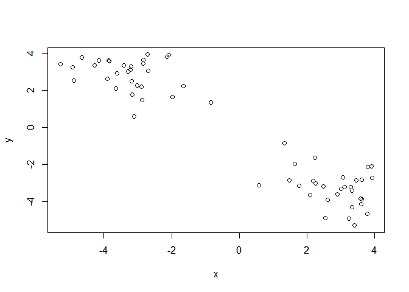
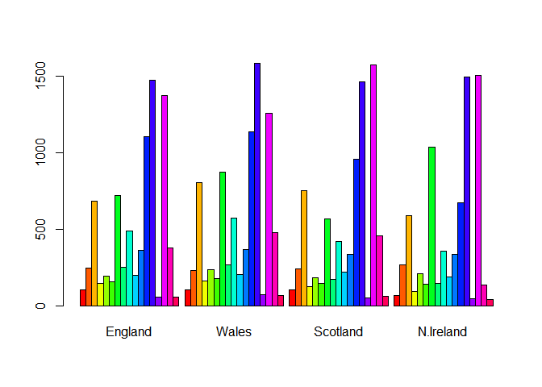

class08
================
Kelsey Dang
10/24/2019

## R Markdown

# Notes:

  - Unsupervised learning: finding structure in unlabeled data  
  - Supervised learning: making predictions based on labeled data;
    predictions like regression or classification
  - Reinforcement learning: making decisions based on past experience
  - Point of the clustering is that you want to group as many points
    together while minimizing the distance between the points  
  - Model selection
      - Best outcome is based on total w/in cluster sym of squares
  - Scree plot
      - elbow point –\> where k is the best  
      - try a range of different k values  
  - For heirarchical clustering there are multiples ways of linkage
      - complete  
      - single
      - average
      - centroid
  - Note:
      - kmeans(x, centers = <int>, nstart = <int>)
      - hclust(dist(x))
  - PCA
      - Each column shows how much each gene is transcribed in each cell
      - inverse correlation: 2 diff types of cells as they are using
        different genes  
      - positively correlated: cells are doing similar things
      - converts the correlations among all cells into a representation
        we can more readily interpret
      - get 2 main things from typical PCA
          - new axis (called PCs or Eigenvalues)
          - Eigenvalues that detail the amount of variance captured by
            each PC

## K-means Clustering \~

``` r
# Generate some example data for clustering
tmp <- c(rnorm(30,-3), rnorm(30,3))
x <- cbind(x=tmp, y=rev(tmp))
plot(x)
```

<!-- -->

Use the kmeans() function setting k to 2 and nstart=20

``` r
k <- kmeans(x, centers = 2, nstart = 20)
```

Inspect/print the results

``` r
k
```

    ## K-means clustering with 2 clusters of sizes 30, 30
    ## 
    ## Cluster means:
    ##           x         y
    ## 1 -3.087991  3.120368
    ## 2  3.120368 -3.087991
    ## 
    ## Clustering vector:
    ##  [1] 1 1 1 1 1 1 1 1 1 1 1 1 1 1 1 1 1 1 1 1 1 1 1 1 1 1 1 1 1 1 2 2 2 2 2
    ## [36] 2 2 2 2 2 2 2 2 2 2 2 2 2 2 2 2 2 2 2 2 2 2 2 2 2
    ## 
    ## Within cluster sum of squares by cluster:
    ## [1] 59.75001 59.75001
    ##  (between_SS / total_SS =  90.6 %)
    ## 
    ## Available components:
    ## 
    ## [1] "cluster"      "centers"      "totss"        "withinss"    
    ## [5] "tot.withinss" "betweenss"    "size"         "iter"        
    ## [9] "ifault"

Q. How many points are in each cluster? \* There are 30 points in each
cluster Q. What ‘component’ of your result object details - cluster
size?

``` r
k$size
```

    ## [1] 30 30

  - cluster assignment/membership?

<!-- end list -->

``` r
k$cluster
```

    ##  [1] 1 1 1 1 1 1 1 1 1 1 1 1 1 1 1 1 1 1 1 1 1 1 1 1 1 1 1 1 1 1 2 2 2 2 2
    ## [36] 2 2 2 2 2 2 2 2 2 2 2 2 2 2 2 2 2 2 2 2 2 2 2 2 2

  - cluster center?

<!-- end list -->

``` r
k$centers
```

    ##           x         y
    ## 1 -3.087991  3.120368
    ## 2  3.120368 -3.087991

Plot x colored by the kmeans cluster assignment and add cluster centers
as blue points

``` r
plot(x, col = k$cluster)
points(k$centers, col="blue", pch = 2, cex = 1.5,)
```

<!-- -->

## Hierarchical Clustering \~

The ‘hclust()’ function requires a distance matrix as input. You can get
this

``` r
# First we need to calculate point (dis)similarity
# as the Euclidean distance between observations
dist_matrix <- dist(x)

# The hclust() function returns a hierarchical
# clustering model
hc <- hclust(d = dist_matrix)
# the print method is not so useful here
hc
```

    ## 
    ## Call:
    ## hclust(d = dist_matrix)
    ## 
    ## Cluster method   : complete 
    ## Distance         : euclidean 
    ## Number of objects: 60

``` r
plot(hc)

# With the red line, we can see how many clusters there are, but doesn't actually cut the tree
abline(h = 10, col = "red")
```

<!-- -->

``` r
# Outputs the membership vector
cutree(hc, h=10)
```

    ##  [1] 1 1 1 1 1 1 1 1 1 1 1 1 1 1 1 1 1 1 1 1 1 1 1 1 1 1 1 1 1 1 2 2 2 2 2
    ## [36] 2 1 2 2 2 2 1 2 2 2 2 2 2 2 2 2 2 2 2 2 2 2 2 2 2

``` r
# Cute into k groups
cutree(hc, k=4)
```

    ##  [1] 1 1 1 1 1 1 1 1 1 1 1 1 1 1 1 1 1 1 2 1 1 1 1 2 1 1 1 1 1 1 3 3 3 3 3
    ## [36] 3 4 3 3 3 3 4 3 3 3 3 3 3 3 3 3 3 3 3 3 3 3 3 3 3

Your Turn\!

``` r
# Step 1. Generate some example data for clustering
x <- rbind(
 matrix(rnorm(100, mean=0, sd = 0.3), ncol = 2), # c1
 matrix(rnorm(100, mean = 1, sd = 0.3), ncol = 2), # c2
 matrix(c(rnorm(50, mean = 1, sd = 0.3), # c3
 rnorm(50, mean = 0, sd = 0.3)), ncol = 2))
colnames(x) <- c("x", "y")

# Step 2. Plot the data without clustering
plot(x)
```

<!-- -->

``` r
# Step 3. Generate colors for known clusters
# (just so we can compare to hclust results)
col <- as.factor( rep(c("c1","c2","c3"), each=50) )
plot(x, col=col)
```

<!-- -->

Q. Use the dist(), hclust(), plot() and cutree() functions to return 2
and 3 clusters Q. How does this compare to your known ‘col’ groups?

``` r
# Clustering
hc <- hclust(dist(x))

# Draw tree
plot(hc)
abline(h=2, col="red")
```

<!-- -->

``` r
# Cut the tree into clusters/groups
grps <- cutree(hc, k=3)
grps
```

    ##   [1] 1 2 1 1 1 1 1 1 1 1 1 1 1 1 1 1 1 1 1 1 1 2 1 1 1 1 1 1 1 1 1 1 1 1 1
    ##  [36] 1 1 1 1 2 1 1 1 1 1 1 1 1 1 1 2 2 2 2 2 2 2 2 2 2 2 2 2 2 2 2 2 2 2 2
    ##  [71] 2 2 2 2 2 2 2 2 2 2 2 2 2 2 2 2 2 2 2 2 2 2 2 2 2 2 2 2 2 2 1 3 1 2 1
    ## [106] 1 3 2 1 2 1 3 3 3 3 1 3 2 2 2 1 1 2 3 3 3 3 3 3 3 1 2 3 3 3 1 3 2 3 3
    ## [141] 1 2 1 3 3 3 1 1 3 3

Plot the data colored by their hclust result with k=3

``` r
plot(x, col = grps)
```

<!-- -->

``` r
table(grps)
```

    ## grps
    ##  1  2  3 
    ## 62 63 25

Cross-tabulate i.e. compare our clustering result with the known answer

``` r
table(grps, col)
```

    ##     col
    ## grps c1 c2 c3
    ##    1 47  0 15
    ##    2  3 50 10
    ##    3  0  0 25

## Principal Component Analysis (PCA) \~

Read some example gene expression data

``` r
mydata <- read.csv("https://tinyurl.com/expression-CSV",
 row.names=1) 

head(mydata)
```

    ##        wt1 wt2  wt3  wt4 wt5 ko1 ko2 ko3 ko4 ko5
    ## gene1  439 458  408  429 420  90  88  86  90  93
    ## gene2  219 200  204  210 187 427 423 434 433 426
    ## gene3 1006 989 1030 1017 973 252 237 238 226 210
    ## gene4  783 792  829  856 760 849 856 835 885 894
    ## gene5  181 249  204  244 225 277 305 272 270 279
    ## gene6  460 502  491  491 493 612 594 577 618 638

How many genes are in this dataset?

``` r
dim(mydata)
```

    ## [1] 100  10

``` r
nrow(mydata)
```

    ## [1] 100

Let’s go PCA with the **prcomp()** function.

``` r
# lets do PCA
pca <- prcomp(t(mydata), scale=TRUE)

# A basic PC1 v PC2 2-D plot
plot(pca$x[,1], pca$x[,2]) 
```

<!-- -->

Precent variance is often more informative to look at

``` r
# See what is returned by the prcomp() function
attributes(pca) 
```

    ## $names
    ## [1] "sdev"     "rotation" "center"   "scale"    "x"       
    ## 
    ## $class
    ## [1] "prcomp"

``` r
pca.var <- pca$sdev^2
pca.var.per <- round(pca.var/sum(pca.var)*100, 1) 
pca.var.per
```

    ##  [1] 92.6  2.3  1.1  1.1  0.8  0.7  0.6  0.4  0.4  0.0

Making the Scree Plot From the scree plot it is clear to see that PC1
accounted for almost all of the variation in the data

``` r
pca.var <- pca$sdev^2
pca.var.per <- round(pca.var/sum(pca.var)*100, 1)

barplot(pca.var.per, main="Scree Plot",
 xlab="Principal Component", ylab="Percent Variation")
```

<!-- -->

Let’s make our plot a bit more useful

``` r
# A vector of colors for wt and ko samples
colvec <- colnames(mydata)
colvec[grep("wt", colvec)] <- "red"
colvec[grep("ko", colvec)] <- "blue"

# Plot
plot(pca$x[,1], pca$x[,2], col=colvec, pch=16,
 xlab=paste0("PC1 (", pca.var.per[1], "%)"),
 ylab=paste0("PC2 (", pca.var.per[2], "%)")) 

# Add some labels
plot(pca$x[,1], pca$x[,2], col=colvec, pch=16,
 xlab=paste0("PC1 (", pca.var.per[1], "%)"),
 ylab=paste0("PC2 (", pca.var.per[2], "%)"))

# Click to identify which sample is which
identify(pca$x[,1], pca$x[,2], labels=colnames(mydata)) 
```

<!-- -->

    ## integer(0)

## PCA Example with UK\_foods

``` r
x <- read.csv("UK_foods.csv", row.names = 1)
head(x)
```

    ##                England Wales Scotland N.Ireland
    ## Cheese             105   103      103        66
    ## Carcass_meat       245   227      242       267
    ## Other_meat         685   803      750       586
    ## Fish               147   160      122        93
    ## Fats_and_oils      193   235      184       209
    ## Sugars             156   175      147       139

Q1. How many rows and columns are in your new data frame named x? What R
functions could you use to answer this questions? rows 17 rows, 5
columns

``` r
dim(x)
```

    ## [1] 17  4

Q2. Which approach to solving the ‘row-names problem’ mentioned above do
you prefer and why? Is one approach more robust than another under
certain circumstances? I prefer to use the row.names=1 to solve the
‘row-names problem’ because using the rownames() function will strip
off a column with each iteration.

``` r
barplot(as.matrix(x), beside=T, col=rainbow(nrow(x)))
```

<!-- -->

Q3: Changing what optional argument in the above barplot() function
results in the following plot?

``` r
barplot(as.matrix(x), beside=F, col=rainbow(nrow(x)))
```

<!-- -->

Q5: Generating all pairwise plots may help somewhat. Can you make sense
of the following code and resulting figure? What does it mean if a given
point lies on the diagonal for a given plot? Positive correlation\!
Cells are doing similar things. Points that aren’t in the diagonal line
means, one region is comsuming more of a specific food than another
region.

``` r
pairs(x, col=rainbow(10), pch=16)
```

<!-- -->

PCA to the rescue\!

``` r
# Use the prcomp() PCA function 
pca <- prcomp( t(x) )
summary(pca)
```

    ## Importance of components:
    ##                             PC1      PC2      PC3       PC4
    ## Standard deviation     324.1502 212.7478 73.87622 4.189e-14
    ## Proportion of Variance   0.6744   0.2905  0.03503 0.000e+00
    ## Cumulative Proportion    0.6744   0.9650  1.00000 1.000e+00

Q7. Complete the code below to generate a plot of PC1 vs PC2. The second
line adds text labels over the data points.

``` r
# Plot PC1 vs PC2
plot(pca$x[,1], pca$x[,2], xlab="PC1", ylab="PC2", xlim=c(-270,500))
text(pca$x[,1], pca$x[,2], colnames(x), col=)
```

<!-- -->
