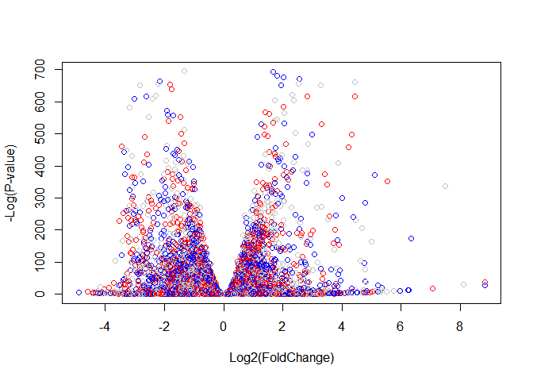

Class15: Genome Annotation and the Interpretation of Gene Lists
================

### About our Input Data

The data for for hands-on session comes from GEO entry: GSE37704, which
is associated with the following publication:  
\* Trapnell C, Hendrickson DG, Sauvageau M, Goff L et al. “Differential
analysis of gene regulation at transcript resolution with RNA-seq”. Nat
Biotechnol 2013 Jan;31(1):46-53.

# Section 1. Differential Expression Analysis

``` r
# Load our data files
metaFile <- "GSE37704_metadata.csv"
countFile <- "GSE37704_featurecounts.csv"

# Import metadata and take a peak
colData = read.csv(metaFile, row.names=1)
head(colData)
```

    ##               condition
    ## SRR493366 control_sirna
    ## SRR493367 control_sirna
    ## SRR493368 control_sirna
    ## SRR493369      hoxa1_kd
    ## SRR493370      hoxa1_kd
    ## SRR493371      hoxa1_kd

Import countdata

``` r
countData = read.csv(countFile, row.names=1)
head(countData)
```

    ##                 length SRR493366 SRR493367 SRR493368 SRR493369 SRR493370
    ## ENSG00000186092    918         0         0         0         0         0
    ## ENSG00000279928    718         0         0         0         0         0
    ## ENSG00000279457   1982        23        28        29        29        28
    ## ENSG00000278566    939         0         0         0         0         0
    ## ENSG00000273547    939         0         0         0         0         0
    ## ENSG00000187634   3214       124       123       205       207       212
    ##                 SRR493371
    ## ENSG00000186092         0
    ## ENSG00000279928         0
    ## ENSG00000279457        46
    ## ENSG00000278566         0
    ## ENSG00000273547         0
    ## ENSG00000187634       258

Remove the troublesome first column from countData

``` r
# Note we need to remove the odd first $length col

## By using '-1' you include everything EXCEPT the first column
countData <- as.matrix(countData[,-1])
head(countData)
```

    ##                 SRR493366 SRR493367 SRR493368 SRR493369 SRR493370
    ## ENSG00000186092         0         0         0         0         0
    ## ENSG00000279928         0         0         0         0         0
    ## ENSG00000279457        23        28        29        29        28
    ## ENSG00000278566         0         0         0         0         0
    ## ENSG00000273547         0         0         0         0         0
    ## ENSG00000187634       124       123       205       207       212
    ##                 SRR493371
    ## ENSG00000186092         0
    ## ENSG00000279928         0
    ## ENSG00000279457        46
    ## ENSG00000278566         0
    ## ENSG00000273547         0
    ## ENSG00000187634       258

Double check that the colnames in countData match the id values in the
colData metadata file.

``` r
colnames(countData)
```

    ## [1] "SRR493366" "SRR493367" "SRR493368" "SRR493369" "SRR493370" "SRR493371"

``` r
rownames(countData)
```

    ##     [1] "ENSG00000186092" "ENSG00000279928" "ENSG00000279457"
    ##     [4] "ENSG00000278566" "ENSG00000273547" "ENSG00000187634"
    ##     [7] "ENSG00000188976" "ENSG00000187961" "ENSG00000187583"
    ##    [10] "ENSG00000187642" "ENSG00000188290" "ENSG00000187608"
    ##    [13] "ENSG00000188157" "ENSG00000237330" "ENSG00000131591"
    ##    [16] "ENSG00000162571" "ENSG00000186891" "ENSG00000186827"
    ##    [19] "ENSG00000078808" "ENSG00000176022" "ENSG00000184163"
    ##    [22] "ENSG00000160087" "ENSG00000162572" "ENSG00000131584"
    ##    [25] "ENSG00000169972" "ENSG00000127054" "ENSG00000224051"
    ##    [28] "ENSG00000169962" "ENSG00000107404" "ENSG00000162576"
    ##    [31] "ENSG00000175756" "ENSG00000221978" "ENSG00000242485"
    ##    [34] "ENSG00000235098" "ENSG00000205116" "ENSG00000179403"
    ##    [37] "ENSG00000215915" "ENSG00000160072" "ENSG00000197785"
    ##    [40] "ENSG00000205090" "ENSG00000160075" "ENSG00000279244"
    ##    [43] "ENSG00000228594" "ENSG00000197530" "ENSG00000189409"
    ##    [46] "ENSG00000248333" "ENSG00000189339" "ENSG00000008128"
    ##    [49] "ENSG00000215790" "ENSG00000008130" "ENSG00000078369"
    ##    [52] "ENSG00000169885" "ENSG00000178821" "ENSG00000142609"
    ##    [55] "ENSG00000187730" "ENSG00000067606" "ENSG00000162585"
    ##    [58] "ENSG00000157933" "ENSG00000116151" "ENSG00000157916"
    ##    [61] "ENSG00000157911" "ENSG00000149527" "ENSG00000157881"
    ##    [64] "ENSG00000197921" "ENSG00000157873" "ENSG00000157870"
    ##    [67] "ENSG00000142606" "ENSG00000215912" "ENSG00000169717"
    ##    [70] "ENSG00000142611" "ENSG00000130762" "ENSG00000162591"
    ##    [73] "ENSG00000158109" "ENSG00000116213" "ENSG00000078900"
    ##    [76] "ENSG00000162592" "ENSG00000235169" "ENSG00000130764"
    ##    [79] "ENSG00000116198" "ENSG00000169598" "ENSG00000198912"
    ##    [82] "ENSG00000196581" "ENSG00000131697" "ENSG00000069424"
    ##    [85] "ENSG00000116254" "ENSG00000116251" "ENSG00000158286"
    ##    [88] "ENSG00000116237" "ENSG00000173673" "ENSG00000158292"
    ##    [91] "ENSG00000097021" "ENSG00000069812" "ENSG00000187017"
    ##    [94] "ENSG00000215788" "ENSG00000171680" "ENSG00000162408"
    ##    [97] "ENSG00000173662" "ENSG00000204859" "ENSG00000162413"
    ##   [100] "ENSG00000116273" "ENSG00000041988" "ENSG00000007923"
    ##   [103] "ENSG00000171735" "ENSG00000049245" "ENSG00000049246"
    ##   [106] "ENSG00000049247" "ENSG00000049249" "ENSG00000116288"
    ##   [109] "ENSG00000116285" "ENSG00000162426" "ENSG00000142599"
    ##   [112] "ENSG00000074800" "ENSG00000131686" "ENSG00000197241"
    ##   [115] "ENSG00000142583" "ENSG00000180758" "ENSG00000049239"
    ##   [118] "ENSG00000171621" "ENSG00000171612" "ENSG00000188807"
    ##   [121] "ENSG00000171608" "ENSG00000171603" "ENSG00000280113"
    ##   [124] "ENSG00000178585" "ENSG00000162441" "ENSG00000173614"
    ##   [127] "ENSG00000162444" "ENSG00000130939" "ENSG00000054523"
    ##   [130] "ENSG00000142657" "ENSG00000251503" "ENSG00000175279"
    ##   [133] "ENSG00000241563" "ENSG00000160049" "ENSG00000142655"
    ##   [136] "ENSG00000130940" "ENSG00000175262" "ENSG00000120948"
    ##   [139] "ENSG00000277726" "ENSG00000009724" "ENSG00000116649"
    ##   [142] "ENSG00000171824" "ENSG00000198793" "ENSG00000171819"
    ##   [145] "ENSG00000120942" "ENSG00000204624" "ENSG00000116661"
    ##   [148] "ENSG00000132879" "ENSG00000116663" "ENSG00000116670"
    ##   [151] "ENSG00000162490" "ENSG00000177674" "ENSG00000215910"
    ##   [154] "ENSG00000177000" "ENSG00000011021" "ENSG00000175206"
    ##   [157] "ENSG00000120937" "ENSG00000116685" "ENSG00000083444"
    ##   [160] "ENSG00000116688" "ENSG00000116691" "ENSG00000120949"
    ##   [163] "ENSG00000028137" "ENSG00000048707" "ENSG00000162496"
    ##   [166] "ENSG00000204518" "ENSG00000188984" "ENSG00000157330"
    ##   [169] "ENSG00000116726" "ENSG00000116721" "ENSG00000239810"
    ##   [172] "ENSG00000179172" "ENSG00000120952" "ENSG00000243073"
    ##   [175] "ENSG00000187545" "ENSG00000204510" "ENSG00000232423"
    ##   [178] "ENSG00000280267" "ENSG00000274764" "ENSG00000229571"
    ##   [181] "ENSG00000277058" "ENSG00000275774" "ENSG00000179412"
    ##   [184] "ENSG00000204505" "ENSG00000279804" "ENSG00000270601"
    ##   [187] "ENSG00000182330" "ENSG00000204501" "ENSG00000204481"
    ##   [190] "ENSG00000204480" "ENSG00000204479" "ENSG00000204478"
    ##   [193] "ENSG00000162494" "ENSG00000162493" "ENSG00000116731"
    ##   [196] "ENSG00000189337" "ENSG00000171729" "ENSG00000142621"
    ##   [199] "ENSG00000142634" "ENSG00000162438" "ENSG00000142615"
    ##   [202] "ENSG00000215704" "ENSG00000132906" "ENSG00000116138"
    ##   [205] "ENSG00000116771" "ENSG00000197312" "ENSG00000215695"
    ##   [208] "ENSG00000116786" "ENSG00000162461" "ENSG00000162460"
    ##   [211] "ENSG00000162458" "ENSG00000233954" "ENSG00000065526"
    ##   [214] "ENSG00000116809" "ENSG00000183888" "ENSG00000173641"
    ##   [217] "ENSG00000186510" "ENSG00000184908" "ENSG00000185519"
    ##   [220] "ENSG00000142627" "ENSG00000142632" "ENSG00000132881"
    ##   [223] "ENSG00000037637" "ENSG00000055070" "ENSG00000187144"
    ##   [226] "ENSG00000157191" "ENSG00000268991" "ENSG00000219481"
    ##   [229] "ENSG00000237847" "ENSG00000279132" "ENSG00000058453"
    ##   [232] "ENSG00000117122" "ENSG00000159363" "ENSG00000117118"
    ##   [235] "ENSG00000117115" "ENSG00000142623" "ENSG00000142619"
    ##   [238] "ENSG00000159339" "ENSG00000280226" "ENSG00000276747"
    ##   [241] "ENSG00000179051" "ENSG00000074964" "ENSG00000117148"
    ##   [244] "ENSG00000117154" "ENSG00000179023" "ENSG00000009709"
    ##   [247] "ENSG00000179002" "ENSG00000255275" "ENSG00000159423"
    ##   [250] "ENSG00000169991" "ENSG00000127481" "ENSG00000127463"
    ##   [253] "ENSG00000053372" "ENSG00000162482" "ENSG00000053371"
    ##   [256] "ENSG00000040487" "ENSG00000077549" "ENSG00000173436"
    ##   [259] "ENSG00000270136" "ENSG00000158747" "ENSG00000158748"
    ##   [262] "ENSG00000162542" "ENSG00000178828" "ENSG00000169914"
    ##   [265] "ENSG00000188784" "ENSG00000188257" "ENSG00000127472"
    ##   [268] "ENSG00000117215" "ENSG00000158786" "ENSG00000187980"
    ##   [271] "ENSG00000162543" "ENSG00000158816" "ENSG00000162545"
    ##   [274] "ENSG00000090432" "ENSG00000183114" "ENSG00000158825"
    ##   [277] "ENSG00000158828" "ENSG00000244038" "ENSG00000117245"
    ##   [280] "ENSG00000189410" "ENSG00000127483" "ENSG00000075151"
    ##   [283] "ENSG00000117298" "ENSG00000142794" "ENSG00000162551"
    ##   [286] "ENSG00000076864" "ENSG00000090686" "ENSG00000187942"
    ##   [289] "ENSG00000142798" "ENSG00000219073" "ENSG00000142789"
    ##   [292] "ENSG00000070831" "ENSG00000162552" "ENSG00000184677"
    ##   [295] "ENSG00000070886" "ENSG00000173372" "ENSG00000159189"
    ##   [298] "ENSG00000173369" "ENSG00000133216" "ENSG00000215906"
    ##   [301] "ENSG00000227868" "ENSG00000004487" "ENSG00000169641"
    ##   [304] "ENSG00000179546" "ENSG00000125944" "ENSG00000125945"
    ##   [307] "ENSG00000204219" "ENSG00000088280" "ENSG00000007968"
    ##   [310] "ENSG00000117318" "ENSG00000197880" "ENSG00000142676"
    ##   [313] "ENSG00000011007" "ENSG00000057757" "ENSG00000011009"
    ##   [316] "ENSG00000117308" "ENSG00000117305" "ENSG00000179163"
    ##   [319] "ENSG00000188822" "ENSG00000189266" "ENSG00000188529"
    ##   [322] "ENSG00000142661" "ENSG00000142677" "ENSG00000185436"
    ##   [325] "ENSG00000158055" "ENSG00000001460" "ENSG00000001461"
    ##   [328] "ENSG00000117602" "ENSG00000184454" "ENSG00000133226"
    ##   [331] "ENSG00000169504" "ENSG00000020633" "ENSG00000117614"
    ##   [334] "ENSG00000117616" "ENSG00000187010" "ENSG00000183726"
    ##   [337] "ENSG00000188672" "ENSG00000204178" "ENSG00000157978"
    ##   [340] "ENSG00000117643" "ENSG00000162430" "ENSG00000255054"
    ##   [343] "ENSG00000117640" "ENSG00000127423" "ENSG00000182749"
    ##   [346] "ENSG00000117632" "ENSG00000158006" "ENSG00000158008"
    ##   [349] "ENSG00000158014" "ENSG00000158022" "ENSG00000175087"
    ##   [352] "ENSG00000197245" "ENSG00000142684" "ENSG00000142675"
    ##   [355] "ENSG00000188782" "ENSG00000130695" "ENSG00000142669"
    ##   [358] "ENSG00000158062" "ENSG00000169442" "ENSG00000176092"
    ##   [361] "ENSG00000176083" "ENSG00000131914" "ENSG00000117682"
    ##   [364] "ENSG00000198830" "ENSG00000117676" "ENSG00000117713"
    ##   [367] "ENSG00000060642" "ENSG00000204160" "ENSG00000175793"
    ##   [370] "ENSG00000142751" "ENSG00000198746" "ENSG00000090273"
    ##   [373] "ENSG00000131910" "ENSG00000175707" "ENSG00000253368"
    ##   [376] "ENSG00000158246" "ENSG00000280403" "ENSG00000090020"
    ##   [379] "ENSG00000142784" "ENSG00000186501" "ENSG00000142765"
    ##   [382] "ENSG00000142733" "ENSG00000142748" "ENSG00000174950"
    ##   [385] "ENSG00000181773" "ENSG00000158195" "ENSG00000126705"
    ##   [388] "ENSG00000000938" "ENSG00000126709" "ENSG00000009780"
    ##   [391] "ENSG00000117758" "ENSG00000117751" "ENSG00000278868"
    ##   [394] "ENSG00000130775" "ENSG00000117748" "ENSG00000130768"
    ##   [397] "ENSG00000158156" "ENSG00000158161" "ENSG00000169403"
    ##   [400] "ENSG00000126698" "ENSG00000130770" "ENSG00000130766"
    ##   [403] "ENSG00000130772" "ENSG00000204138" "ENSG00000180198"
    ##   [406] "ENSG00000180098" "ENSG00000120656" "ENSG00000188060"
    ##   [409] "ENSG00000162419" "ENSG00000198492" "ENSG00000116329"
    ##   [412] "ENSG00000159023" "ENSG00000253304" "ENSG00000116350"
    ##   [415] "ENSG00000116353" "ENSG00000060656" "ENSG00000162510"
    ##   [418] "ENSG00000162511" "ENSG00000162512" "ENSG00000134644"
    ##   [421] "ENSG00000084628" "ENSG00000060688" "ENSG00000121766"
    ##   [424] "ENSG00000121769" "ENSG00000168528" "ENSG00000142910"
    ##   [427] "ENSG00000121764" "ENSG00000162517" "ENSG00000084636"
    ##   [430] "ENSG00000121753" "ENSG00000134668" "ENSG00000184007"
    ##   [433] "ENSG00000121774" "ENSG00000121775" "ENSG00000025800"
    ##   [436] "ENSG00000084652" "ENSG00000160050" "ENSG00000160051"
    ##   [439] "ENSG00000222046" "ENSG00000160055" "ENSG00000084623"
    ##   [442] "ENSG00000183615" "ENSG00000182866" "ENSG00000116478"
    ##   [445] "ENSG00000175130" "ENSG00000162526" "ENSG00000225828"
    ##   [448] "ENSG00000160058" "ENSG00000254553" "ENSG00000273274"
    ##   [451] "ENSG00000160062" "ENSG00000176261" "ENSG00000162521"
    ##   [454] "ENSG00000162520" "ENSG00000162522" "ENSG00000134684"
    ##   [457] "ENSG00000116497" "ENSG00000160097" "ENSG00000121905"
    ##   [460] "ENSG00000121900" "ENSG00000116514" "ENSG00000004455"
    ##   [463] "ENSG00000142920" "ENSG00000116525" "ENSG00000160094"
    ##   [466] "ENSG00000184389" "ENSG00000134686" "ENSG00000121903"
    ##   [469] "ENSG00000121904" "ENSG00000176256" "ENSG00000142698"
    ##   [472] "ENSG00000163866" "ENSG00000189280" "ENSG00000189433"
    ##   [475] "ENSG00000188910" "ENSG00000187513" "ENSG00000116544"
    ##   [478] "ENSG00000271741" "ENSG00000243749" "ENSG00000163867"
    ##   [481] "ENSG00000197056" "ENSG00000116560" "ENSG00000146463"
    ##   [484] "ENSG00000142687" "ENSG00000020129" "ENSG00000116819"
    ##   [487] "ENSG00000126067" "ENSG00000142686" "ENSG00000092853"
    ##   [490] "ENSG00000134698" "ENSG00000092847" "ENSG00000126070"
    ##   [493] "ENSG00000092850" "ENSG00000116863" "ENSG00000171812"
    ##   [496] "ENSG00000054116" "ENSG00000116871" "ENSG00000054118"
    ##   [499] "ENSG00000214193" "ENSG00000142694" "ENSG00000196182"
    ##   [502] "ENSG00000181817" "ENSG00000116885" "ENSG00000116898"
    ##   [505] "ENSG00000119535" "ENSG00000163873" "ENSG00000163874"
    ##   [508] "ENSG00000163875" "ENSG00000163877" "ENSG00000163879"
    ##   [511] "ENSG00000134697" "ENSG00000169218" "ENSG00000116922"
    ##   [514] "ENSG00000134690" "ENSG00000183317" "ENSG00000185090"
    ##   [517] "ENSG00000196449" "ENSG00000197982" "ENSG00000188786"
    ##   [520] "ENSG00000204084" "ENSG00000183431" "ENSG00000183386"
    ##   [523] "ENSG00000183520" "ENSG00000185668" "ENSG00000116954"
    ##   [526] "ENSG00000214114" "ENSG00000274944" "ENSG00000131233"
    ##   [529] "ENSG00000158315" "ENSG00000174574" "ENSG00000168653"
    ##   [532] "ENSG00000127603" "ENSG00000183682" "ENSG00000090621"
    ##   [535] "ENSG00000163909" "ENSG00000116981" "ENSG00000116983"
    ##   [538] "ENSG00000084072" "ENSG00000116985" "ENSG00000198754"
    ##   [541] "ENSG00000043514" "ENSG00000116990" "ENSG00000168389"
    ##   [544] "ENSG00000131236" "ENSG00000131238" "ENSG00000117000"
    ##   [547] "ENSG00000188800" "ENSG00000084073" "ENSG00000049089"
    ##   [550] "ENSG00000084070" "ENSG00000187801" "ENSG00000187815"
    ##   [553] "ENSG00000164002" "ENSG00000117010" "ENSG00000117016"
    ##   [556] "ENSG00000066136" "ENSG00000117013" "ENSG00000179862"
    ##   [559] "ENSG00000171793" "ENSG00000171790" "ENSG00000010803"
    ##   [562] "ENSG00000204060" "ENSG00000127129" "ENSG00000127124"
    ##   [565] "ENSG00000044012" "ENSG00000197273" "ENSG00000198815"
    ##   [568] "ENSG00000177181" "ENSG00000066185" "ENSG00000127125"
    ##   [571] "ENSG00000186409" "ENSG00000171960" "ENSG00000065978"
    ##   [574] "ENSG00000164007" "ENSG00000117385" "ENSG00000164008"
    ##   [577] "ENSG00000177868" "ENSG00000164010" "ENSG00000164011"
    ##   [580] "ENSG00000117394" "ENSG00000186973" "ENSG00000117395"
    ##   [583] "ENSG00000243710" "ENSG00000179178" "ENSG00000253313"
    ##   [586] "ENSG00000066056" "ENSG00000117400" "ENSG00000117399"
    ##   [589] "ENSG00000066322" "ENSG00000159479" "ENSG00000198198"
    ##   [592] "ENSG00000178922" "ENSG00000142949" "ENSG00000066135"
    ##   [595] "ENSG00000126091" "ENSG00000117407" "ENSG00000117408"
    ##   [598] "ENSG00000132768" "ENSG00000117410" "ENSG00000117411"
    ##   [601] "ENSG00000159214" "ENSG00000196517" "ENSG00000171872"
    ##   [604] "ENSG00000178028" "ENSG00000117419" "ENSG00000187147"
    ##   [607] "ENSG00000126106" "ENSG00000198520" "ENSG00000142945"
    ##   [610] "ENSG00000142937" "ENSG00000142959" "ENSG00000173846"
    ##   [613] "ENSG00000188396" "ENSG00000222009" "ENSG00000117425"
    ##   [616] "ENSG00000070785" "ENSG00000126107" "ENSG00000126088"
    ##   [619] "ENSG00000162415" "ENSG00000186603" "ENSG00000132781"
    ##   [622] "ENSG00000132773" "ENSG00000070759" "ENSG00000280670"
    ##   [625] "ENSG00000132763" "ENSG00000117450" "ENSG00000117448"
    ##   [628] "ENSG00000132780" "ENSG00000159588" "ENSG00000159592"
    ##   [631] "ENSG00000159596" "ENSG00000197429" "ENSG00000086015"
    ##   [634] "ENSG00000117461" "ENSG00000278139" "ENSG00000117472"
    ##   [637] "ENSG00000250719" "ENSG00000085998" "ENSG00000171357"
    ##   [640] "ENSG00000085999" "ENSG00000132128" "ENSG00000173660"
    ##   [643] "ENSG00000117481" "ENSG00000117480" "ENSG00000197587"
    ##   [646] "ENSG00000162456" "ENSG00000079277" "ENSG00000142961"
    ##   [649] "ENSG00000123472" "ENSG00000186118" "ENSG00000159658"
    ##   [652] "ENSG00000142973" "ENSG00000187048" "ENSG00000186377"
    ##   [655] "ENSG00000186160" "ENSG00000162365" "ENSG00000162366"
    ##   [658] "ENSG00000162367" "ENSG00000123473" "ENSG00000162368"
    ##   [661] "ENSG00000186790" "ENSG00000186564" "ENSG00000269113"
    ##   [664] "ENSG00000279096" "ENSG00000117834" "ENSG00000132122"
    ##   [667] "ENSG00000186094" "ENSG00000162373" "ENSG00000162374"
    ##   [670] "ENSG00000142700" "ENSG00000185104" "ENSG00000123080"
    ##   [673] "ENSG00000204006" "ENSG00000123091" "ENSG00000085831"
    ##   [676] "ENSG00000085832" "ENSG00000117859" "ENSG00000078618"
    ##   [679] "ENSG00000169213" "ENSG00000117862" "ENSG00000198841"
    ##   [682] "ENSG00000134717" "ENSG00000157077" "ENSG00000154222"
    ##   [685] "ENSG00000085840" "ENSG00000134748" "ENSG00000134744"
    ##   [688] "ENSG00000116157" "ENSG00000182183" "ENSG00000162377"
    ##   [691] "ENSG00000162378" "ENSG00000203995" "ENSG00000121310"
    ##   [694] "ENSG00000116171" "ENSG00000279054" "ENSG00000174348"
    ##   [697] "ENSG00000162383" "ENSG00000157184" "ENSG00000162384"
    ##   [700] "ENSG00000162385" "ENSG00000157193" "ENSG00000143006"
    ##   [703] "ENSG00000174332" "ENSG00000058804" "ENSG00000058799"
    ##   [706] "ENSG00000211452" "ENSG00000081870" "ENSG00000116212"
    ##   [709] "ENSG00000203985" "ENSG00000116209" "ENSG00000116205"
    ##   [712] "ENSG00000157211" "ENSG00000256407" "ENSG00000215883"
    ##   [715] "ENSG00000116221" "ENSG00000157216" "ENSG00000162390"
    ##   [718] "ENSG00000162391" "ENSG00000184313" "ENSG00000271723"
    ##   [721] "ENSG00000243725" "ENSG00000162396" "ENSG00000006555"
    ##   [724] "ENSG00000162398" "ENSG00000116133" "ENSG00000143001"
    ##   [727] "ENSG00000162399" "ENSG00000169174" "ENSG00000162402"
    ##   [730] "ENSG00000162407" "ENSG00000162409" "ENSG00000187889"
    ##   [733] "ENSG00000157131" "ENSG00000021852" "ENSG00000173406"
    ##   [736] "ENSG00000162600" "ENSG00000184292" "ENSG00000162601"
    ##   [739] "ENSG00000177606" "ENSG00000172456" "ENSG00000134709"
    ##   [742] "ENSG00000134716" "ENSG00000162598" "ENSG00000162599"
    ##   [745] "ENSG00000162604" "ENSG00000132849" "ENSG00000240563"
    ##   [748] "ENSG00000132854" "ENSG00000162607" "ENSG00000116641"
    ##   [751] "ENSG00000132855" "ENSG00000125703" "ENSG00000187140"
    ##   [754] "ENSG00000088035" "ENSG00000142856" "ENSG00000203965"
    ##   [757] "ENSG00000079739" "ENSG00000185483" "ENSG00000177414"
    ##   [760] "ENSG00000158966" "ENSG00000162437" "ENSG00000162434"
    ##   [763] "ENSG00000162433" "ENSG00000116675" "ENSG00000213625"
    ##   [766] "ENSG00000116678" "ENSG00000184588" "ENSG00000118473"
    ##   [769] "ENSG00000152760" "ENSG00000172410" "ENSG00000152763"
    ##   [772] "ENSG00000198160" "ENSG00000116704" "ENSG00000203963"
    ##   [775] "ENSG00000162594" "ENSG00000081985" "ENSG00000142864"
    ##   [778] "ENSG00000116717" "ENSG00000172380" "ENSG00000162595"
    ##   [781] "ENSG00000116729" "ENSG00000116745" "ENSG00000024526"
    ##   [784] "ENSG00000033122" "ENSG00000066557" "ENSG00000116754"
    ##   [787] "ENSG00000118454" "ENSG00000197568" "ENSG00000279230"
    ##   [790] "ENSG00000116761" "ENSG00000050628" "ENSG00000132485"
    ##   [793] "ENSG00000172260" "ENSG00000162620" "ENSG00000254685"
    ##   [796] "ENSG00000259030" "ENSG00000116783" "ENSG00000162621"
    ##   [799] "ENSG00000178965" "ENSG00000116791" "ENSG00000162623"
    ##   [802] "ENSG00000162624" "ENSG00000137968" "ENSG00000117054"
    ##   [805] "ENSG00000137955" "ENSG00000057468" "ENSG00000154007"
    ##   [808] "ENSG00000184005" "ENSG00000117069" "ENSG00000142892"
    ##   [811] "ENSG00000154027" "ENSG00000036549" "ENSG00000077254"
    ##   [814] "ENSG00000180488" "ENSG00000162614" "ENSG00000162613"
    ##   [817] "ENSG00000162616" "ENSG00000137960" "ENSG00000122420"
    ##   [820] "ENSG00000137959" "ENSG00000137965" "ENSG00000162618"
    ##   [823] "ENSG00000117114" "ENSG00000137941" "ENSG00000142875"
    ##   [826] "ENSG00000203943" "ENSG00000137976" "ENSG00000117133"
    ##   [829] "ENSG00000174021" "ENSG00000117151" "ENSG00000117155"
    ##   [832] "ENSG00000171517" "ENSG00000153898" "ENSG00000162643"
    ##   [835] "ENSG00000055732" "ENSG00000097096" "ENSG00000162642"
    ##   [838] "ENSG00000142867" "ENSG00000153904" "ENSG00000142871"
    ##   [841] "ENSG00000117174" "ENSG00000171502" "ENSG00000122417"
    ##   [844] "ENSG00000137975" "ENSG00000016490" "ENSG00000016602"
    ##   [847] "ENSG00000097033" "ENSG00000183291" "ENSG00000153936"
    ##   [850] "ENSG00000267561" "ENSG00000143013" "ENSG00000065243"
    ##   [853] "ENSG00000137947" "ENSG00000137944" "ENSG00000213516"
    ##   [856] "ENSG00000117226" "ENSG00000117228" "ENSG00000162645"
    ##   [859] "ENSG00000213512" "ENSG00000162654" "ENSG00000154451"
    ##   [862] "ENSG00000183347" "ENSG00000197147" "ENSG00000171488"
    ##   [865] "ENSG00000271949" "ENSG00000171492" "ENSG00000162664"
    ##   [868] "ENSG00000143032" "ENSG00000122482" "ENSG00000162669"
    ##   [871] "ENSG00000097046" "ENSG00000069702" "ENSG00000137948"
    ##   [874] "ENSG00000172031" "ENSG00000230667" "ENSG00000189195"
    ##   [877] "ENSG00000069712" "ENSG00000203910" "ENSG00000174842"
    ##   [880] "ENSG00000122484" "ENSG00000162676" "ENSG00000067208"
    ##   [883] "ENSG00000122406" "ENSG00000154511" "ENSG00000143033"
    ##   [886] "ENSG00000117500" "ENSG00000122483" "ENSG00000117505"
    ##   [889] "ENSG00000137942" "ENSG00000137936" "ENSG00000067334"
    ##   [892] "ENSG00000023909" "ENSG00000198691" "ENSG00000137962"
    ##   [895] "ENSG00000117528" "ENSG00000117525" "ENSG00000143036"
    ##   [898] "ENSG00000117519" "ENSG00000172339" "ENSG00000152078"
    ##   [901] "ENSG00000271092" "ENSG00000122481" "ENSG00000117569"
    ##   [904] "ENSG00000188641" "ENSG00000162627" "ENSG00000117598"
    ##   [907] "ENSG00000117600" "ENSG00000099260" "ENSG00000156869"
    ##   [910] "ENSG00000162688" "ENSG00000117620" "ENSG00000156875"
    ##   [913] "ENSG00000156876" "ENSG00000122435" "ENSG00000122477"
    ##   [916] "ENSG00000137992" "ENSG00000137996" "ENSG00000079335"
    ##   [919] "ENSG00000181656" "ENSG00000162692" "ENSG00000162694"
    ##   [922] "ENSG00000162695" "ENSG00000117543" "ENSG00000170989"
    ##   [925] "ENSG00000118733" "ENSG00000060718" "ENSG00000185946"
    ##   [928] "ENSG00000240038" "ENSG00000243480" "ENSG00000237763"
    ##   [931] "ENSG00000174876" "ENSG00000187733" "ENSG00000198890"
    ##   [934] "ENSG00000162631" "ENSG00000134215" "ENSG00000085491"
    ##   [937] "ENSG00000196427" "ENSG00000186086" "ENSG00000162636"
    ##   [940] "ENSG00000162639" "ENSG00000134186" "ENSG00000143107"
    ##   [943] "ENSG00000116266" "ENSG00000162641" "ENSG00000274068"
    ##   [946] "ENSG00000121957" "ENSG00000121940" "ENSG00000085433"
    ##   [949] "ENSG00000197780" "ENSG00000215717" "ENSG00000179902"
    ##   [952] "ENSG00000116299" "ENSG00000031698" "ENSG00000143126"
    ##   [955] "ENSG00000134222" "ENSG00000221986" "ENSG00000134243"
    ##   [958] "ENSG00000143106" "ENSG00000143028" "ENSG00000162650"
    ##   [961] "ENSG00000174151" "ENSG00000181754" "ENSG00000156097"
    ##   [964] "ENSG00000065135" "ENSG00000134183" "ENSG00000116337"
    ##   [967] "ENSG00000168765" "ENSG00000213366" "ENSG00000134184"
    ##   [970] "ENSG00000134201" "ENSG00000134202" "ENSG00000198758"
    ##   [973] "ENSG00000184371" "ENSG00000168710" "ENSG00000143093"
    ##   [976] "ENSG00000156150" "ENSG00000186150" "ENSG00000197106"
    ##   [979] "ENSG00000116396" "ENSG00000162775" "ENSG00000168679"
    ##   [982] "ENSG00000134248" "ENSG00000143125" "ENSG00000143105"
    ##   [985] "ENSG00000177301" "ENSG00000177272" "ENSG00000143119"
    ##   [988] "ENSG00000121931" "ENSG00000156171" "ENSG00000134255"
    ##   [991] "ENSG00000162777" "ENSG00000064886" "ENSG00000134216"
    ##   [994] "ENSG00000173947" "ENSG00000085465" "ENSG00000116455"
    ##   [997] "ENSG00000116459" "ENSG00000143110" "ENSG00000121933"
    ##  [1000] "ENSG00000282608" "ENSG00000116473" "ENSG00000197852"
    ##  [1003] "ENSG00000064703" "ENSG00000171385" "ENSG00000143079"
    ##  [1006] "ENSG00000134245" "ENSG00000007341" "ENSG00000116489"
    ##  [1009] "ENSG00000155363" "ENSG00000155366" "ENSG00000271810"
    ##  [1012] "ENSG00000155367" "ENSG00000184599" "ENSG00000155380"
    ##  [1015] "ENSG00000198799" "ENSG00000081026" "ENSG00000116793"
    ##  [1018] "ENSG00000081019" "ENSG00000134242" "ENSG00000188761"
    ##  [1021] "ENSG00000134262" "ENSG00000118655" "ENSG00000163349"
    ##  [1024] "ENSG00000116774" "ENSG00000134207" "ENSG00000197323"
    ##  [1027] "ENSG00000116752" "ENSG00000175984" "ENSG00000116748"
    ##  [1030] "ENSG00000213281" "ENSG00000009307" "ENSG00000052723"
    ##  [1033] "ENSG00000198765" "ENSG00000134200" "ENSG00000134198"
    ##  [1036] "ENSG00000134259" "ENSG00000173218" "ENSG00000118729"
    ##  [1039] "ENSG00000177551" "ENSG00000163393" "ENSG00000173212"
    ##  [1042] "ENSG00000163399" "ENSG00000116815" "ENSG00000143061"
    ##  [1045] "ENSG00000116824" "ENSG00000134247" "ENSG00000134256"
    ##  [1048] "ENSG00000116830" "ENSG00000134253" "ENSG00000134258"
    ##  [1051] "ENSG00000198162" "ENSG00000183508" "ENSG00000196505"
    ##  [1054] "ENSG00000065183" "ENSG00000155761" "ENSG00000092607"
    ##  [1057] "ENSG00000116874" "ENSG00000116882" "ENSG00000203859"
    ##  [1060] "ENSG00000203857" "ENSG00000143067" "ENSG00000092621"
    ##  [1063] "ENSG00000134240" "ENSG00000134193" "ENSG00000134249"
    ##  [1066] "ENSG00000134250" "ENSG00000265808" "ENSG00000278882"
    ##  [1069] "ENSG00000273136" "ENSG00000263353" "ENSG00000281741"
    ##  [1072] "ENSG00000198019" "ENSG00000188610" "ENSG00000171943"
    ##  [1075] "ENSG00000203818" "ENSG00000263513" "ENSG00000271567"
    ##  [1078] "ENSG00000266338" "ENSG00000279782" "ENSG00000196369"
    ##  [1081] "ENSG00000215784" "ENSG00000281571" "ENSG00000256374"
    ##  [1084] "ENSG00000162825" "ENSG00000117262" "ENSG00000174827"
    ##  [1087] "ENSG00000117281" "ENSG00000265491" "ENSG00000186141"
    ##  [1090] "ENSG00000186364" "ENSG00000131788" "ENSG00000198483"
    ##  [1093] "ENSG00000143127" "ENSG00000131779" "ENSG00000265241"
    ##  [1096] "ENSG00000280778" "ENSG00000271601" "ENSG00000272031"
    ##  [1099] "ENSG00000121851" "ENSG00000265972" "ENSG00000168509"
    ##  [1102] "ENSG00000271425" "ENSG00000213240" "ENSG00000264343"
    ##  [1105] "ENSG00000270339" "ENSG00000268043" "ENSG00000131791"
    ##  [1108] "ENSG00000131781" "ENSG00000131778" "ENSG00000116128"
    ##  [1111] "ENSG00000162836" "ENSG00000265107" "ENSG00000121634"
    ##  [1114] "ENSG00000188092" "ENSG00000263956" "ENSG00000280649"
    ##  [1117] "ENSG00000236334" "ENSG00000270629" "ENSG00000178104"
    ##  [1120] "ENSG00000269713" "ENSG00000271383" "ENSG00000263464"
    ##  [1123] "ENSG00000272058" "ENSG00000150337" "ENSG00000203814"
    ##  [1126] "ENSG00000183598" "ENSG00000270882" "ENSG00000203811"
    ##  [1129] "ENSG00000203812" "ENSG00000184678" "ENSG00000272196"
    ##  [1132] "ENSG00000203852" "ENSG00000270276" "ENSG00000184260"
    ##  [1135] "ENSG00000184270" "ENSG00000178096" "ENSG00000159164"
    ##  [1138] "ENSG00000143368" "ENSG00000014914" "ENSG00000264522"
    ##  [1141] "ENSG00000136631" "ENSG00000023902" "ENSG00000143401"
    ##  [1144] "ENSG00000118298" "ENSG00000117362" "ENSG00000118292"
    ##  [1147] "ENSG00000159208" "ENSG00000266472" "ENSG00000278939"
    ##  [1150] "ENSG00000117360" "ENSG00000163125" "ENSG00000143374"
    ##  [1153] "ENSG00000143369" "ENSG00000143382" "ENSG00000143384"
    ##  [1156] "ENSG00000143420" "ENSG00000143457" "ENSG00000143452"
    ##  [1159] "ENSG00000163131" "ENSG00000143387" "ENSG00000143437"
    ##  [1162] "ENSG00000143379" "ENSG00000143418" "ENSG00000143412"
    ##  [1165] "ENSG00000143409" "ENSG00000143363" "ENSG00000163141"
    ##  [1168] "ENSG00000143443" "ENSG00000197622" "ENSG00000213190"
    ##  [1171] "ENSG00000143458" "ENSG00000143434" "ENSG00000163154"
    ##  [1174] "ENSG00000163156" "ENSG00000163155" "ENSG00000163157"
    ##  [1177] "ENSG00000163159" "ENSG00000143398" "ENSG00000159352"
    ##  [1180] "ENSG00000143373" "ENSG00000143393" "ENSG00000143390"
    ##  [1183] "ENSG00000143416" "ENSG00000159377" "ENSG00000143442"
    ##  [1186] "ENSG00000143375" "ENSG00000143367" "ENSG00000143376"
    ##  [1189] "ENSG00000159409" "ENSG00000178796" "ENSG00000143436"
    ##  [1192] "ENSG00000143450" "ENSG00000182134" "ENSG00000213171"
    ##  [1195] "ENSG00000143365" "ENSG00000225556" "ENSG00000196407"
    ##  [1198] "ENSG00000159445" "ENSG00000197747" "ENSG00000163191"
    ##  [1201] "ENSG00000182898" "ENSG00000159450" "ENSG00000215853"
    ##  [1204] "ENSG00000197915" "ENSG00000143631" "ENSG00000143520"
    ##  [1207] "ENSG00000143536" "ENSG00000186207" "ENSG00000244057"
    ##  [1210] "ENSG00000279850" "ENSG00000169509" "ENSG00000185966"
    ##  [1213] "ENSG00000163202" "ENSG00000187238" "ENSG00000185962"
    ##  [1216] "ENSG00000187223" "ENSG00000187180" "ENSG00000159455"
    ##  [1219] "ENSG00000187173" "ENSG00000187170" "ENSG00000198854"
    ##  [1222] "ENSG00000196734" "ENSG00000203786" "ENSG00000240386"
    ##  [1225] "ENSG00000186226" "ENSG00000172155" "ENSG00000197084"
    ##  [1228] "ENSG00000186844" "ENSG00000235942" "ENSG00000163206"
    ##  [1231] "ENSG00000163207" "ENSG00000184148" "ENSG00000169474"
    ##  [1234] "ENSG00000163209" "ENSG00000169469" "ENSG00000163216"
    ##  [1237] "ENSG00000241794" "ENSG00000196805" "ENSG00000203785"
    ##  [1240] "ENSG00000244094" "ENSG00000159516" "ENSG00000203784"
    ##  [1243] "ENSG00000203783" "ENSG00000203782" "ENSG00000159527"
    ##  [1246] "ENSG00000163218" "ENSG00000163220" "ENSG00000163221"
    ##  [1249] "ENSG00000143546" "ENSG00000184330" "ENSG00000197364"
    ##  [1252] "ENSG00000143556" "ENSG00000197956" "ENSG00000196420"
    ##  [1255] "ENSG00000196154" "ENSG00000188015" "ENSG00000196754"
    ##  [1258] "ENSG00000188643" "ENSG00000189334" "ENSG00000189171"
    ##  [1261] "ENSG00000160678" "ENSG00000160679" "ENSG00000143553"
    ##  [1264] "ENSG00000143621" "ENSG00000169418" "ENSG00000143624"
    ##  [1267] "ENSG00000279767" "ENSG00000143554" "ENSG00000143614"
    ##  [1270] "ENSG00000198837" "ENSG00000160741" "ENSG00000143570"
    ##  [1273] "ENSG00000143578" "ENSG00000143543" "ENSG00000143545"
    ##  [1276] "ENSG00000177954" "ENSG00000143552" "ENSG00000143549"
    ##  [1279] "ENSG00000163263" "ENSG00000143612" "ENSG00000143569"
    ##  [1282] "ENSG00000143575" "ENSG00000143595" "ENSG00000143515"
    ##  [1285] "ENSG00000160712" "ENSG00000169291" "ENSG00000163239"
    ##  [1288] "ENSG00000160714" "ENSG00000160716" "ENSG00000160710"
    ##  [1291] "ENSG00000143603" "ENSG00000163344" "ENSG00000163346"
    ##  [1294] "ENSG00000163348" "ENSG00000160691" "ENSG00000173207"
    ##  [1297] "ENSG00000160688" "ENSG00000163352" "ENSG00000160685"
    ##  [1300] "ENSG00000163354" "ENSG00000163357" "ENSG00000143537"
    ##  [1303] "ENSG00000243364" "ENSG00000251246" "ENSG00000143590"
    ##  [1306] "ENSG00000169242" "ENSG00000169241" "ENSG00000179085"
    ##  [1309] "ENSG00000163463" "ENSG00000273088" "ENSG00000163462"
    ##  [1312] "ENSG00000185499" "ENSG00000279986" "ENSG00000279487"
    ##  [1315] "ENSG00000169231" "ENSG00000173171" "ENSG00000177628"
    ##  [1318] "ENSG00000160767" "ENSG00000116521" "ENSG00000176444"
    ##  [1321] "ENSG00000143630" "ENSG00000143627" "ENSG00000160752"
    ##  [1324] "ENSG00000160753" "ENSG00000116539" "ENSG00000125459"
    ##  [1327] "ENSG00000163374" "ENSG00000132676" "ENSG00000116580"
    ##  [1330] "ENSG00000132718" "ENSG00000143622" "ENSG00000132680"
    ##  [1333] "ENSG00000173080" "ENSG00000116584" "ENSG00000163479"
    ##  [1336] "ENSG00000160803" "ENSG00000116586" "ENSG00000132698"
    ##  [1339] "ENSG00000254726" "ENSG00000160789" "ENSG00000196189"
    ##  [1342] "ENSG00000160785" "ENSG00000260238" "ENSG00000160783"
    ##  [1345] "ENSG00000242252" "ENSG00000160781" "ENSG00000198952"
    ##  [1348] "ENSG00000163472" "ENSG00000198715" "ENSG00000189030"
    ##  [1351] "ENSG00000163468" "ENSG00000163467" "ENSG00000132677"
    ##  [1354] "ENSG00000125462" "ENSG00000116604" "ENSG00000183856"
    ##  [1357] "ENSG00000187862" "ENSG00000163382" "ENSG00000160818"
    ##  [1360] "ENSG00000280316" "ENSG00000132702" "ENSG00000132692"
    ##  [1363] "ENSG00000132688" "ENSG00000143320" "ENSG00000143319"
    ##  [1366] "ENSG00000143303" "ENSG00000143314" "ENSG00000143321"
    ##  [1369] "ENSG00000143294" "ENSG00000027869" "ENSG00000198400"
    ##  [1372] "ENSG00000027644" "ENSG00000187800" "ENSG00000160838"
    ##  [1375] "ENSG00000132694" "ENSG00000253831" "ENSG00000117036"
    ##  [1378] "ENSG00000143297" "ENSG00000163518" "ENSG00000160856"
    ##  [1381] "ENSG00000132704" "ENSG00000163534" "ENSG00000073754"
    ##  [1384] "ENSG00000183853" "ENSG00000158473" "ENSG00000158477"
    ##  [1387] "ENSG00000158481" "ENSG00000158485" "ENSG00000158488"
    ##  [1390] "ENSG00000186306" "ENSG00000180708" "ENSG00000173285"
    ##  [1393] "ENSG00000198965" "ENSG00000197532" "ENSG00000186440"
    ##  [1396] "ENSG00000186400" "ENSG00000198967" "ENSG00000163554"
    ##  [1399] "ENSG00000196171" "ENSG00000203757" "ENSG00000180433"
    ##  [1402] "ENSG00000197403" "ENSG00000188340" "ENSG00000163563"
    ##  [1405] "ENSG00000163564" "ENSG00000163565" "ENSG00000163568"
    ##  [1408] "ENSG00000162706" "ENSG00000213088" "ENSG00000179639"
    ##  [1411] "ENSG00000196266" "ENSG00000196184" "ENSG00000184155"
    ##  [1414] "ENSG00000132703" "ENSG00000132693" "ENSG00000158716"
    ##  [1417] "ENSG00000181036" "ENSG00000158714" "ENSG00000188004"
    ##  [1420] "ENSG00000243284" "ENSG00000256029" "ENSG00000213085"
    ##  [1423] "ENSG00000158710" "ENSG00000085552" "ENSG00000162723"
    ##  [1426] "ENSG00000143315" "ENSG00000177807" "ENSG00000162728"
    ##  [1429] "ENSG00000162729" "ENSG00000018625" "ENSG00000132681"
    ##  [1432] "ENSG00000143318" "ENSG00000162734" "ENSG00000132716"
    ##  [1435] "ENSG00000258465" "ENSG00000162735" "ENSG00000122218"
    ##  [1438] "ENSG00000162736" "ENSG00000171786" "ENSG00000162738"
    ##  [1441] "ENSG00000162739" "ENSG00000066294" "ENSG00000117090"
    ##  [1444] "ENSG00000117091" "ENSG00000026751" "ENSG00000122224"
    ##  [1447] "ENSG00000122223" "ENSG00000179914" "ENSG00000158764"
    ##  [1450] "ENSG00000158769" "ENSG00000270149" "ENSG00000215845"
    ##  [1453] "ENSG00000158773" "ENSG00000186517" "ENSG00000278883"
    ##  [1456] "ENSG00000143217" "ENSG00000162755" "ENSG00000143256"
    ##  [1459] "ENSG00000158793" "ENSG00000158796" "ENSG00000143222"
    ##  [1462] "ENSG00000143258" "ENSG00000143224" "ENSG00000158850"
    ##  [1465] "ENSG00000158859" "ENSG00000158864" "ENSG00000158869"
    ##  [1468] "ENSG00000158874" "ENSG00000158882" "ENSG00000143257"
    ##  [1471] "ENSG00000248485" "ENSG00000158887" "ENSG00000143252"
    ##  [1474] "ENSG00000188931" "ENSG00000143226" "ENSG00000173110"
    ##  [1477] "ENSG00000203747" "ENSG00000072694" "ENSG00000162747"
    ##  [1480] "ENSG00000132185" "ENSG00000162746" "ENSG00000081721"
    ##  [1483] "ENSG00000118217" "ENSG00000162745" "ENSG00000198929"
    ##  [1486] "ENSG00000254706" "ENSG00000239887" "ENSG00000171722"
    ##  [1489] "ENSG00000198574" "ENSG00000152332" "ENSG00000117143"
    ##  [1492] "ENSG00000162733" "ENSG00000132196" "ENSG00000185860"
    ##  [1495] "ENSG00000117152" "ENSG00000143248" "ENSG00000143228"
    ##  [1498] "ENSG00000185630" "ENSG00000162761" "ENSG00000143171"
    ##  [1501] "ENSG00000162763" "ENSG00000143198" "ENSG00000143149"
    ##  [1504] "ENSG00000143183" "ENSG00000143179" "ENSG00000188859"
    ##  [1507] "ENSG00000143157" "ENSG00000152382" "ENSG00000143195"
    ##  [1510] "ENSG00000143194" "ENSG00000143167" "ENSG00000198842"
    ##  [1513] "ENSG00000143190" "ENSG00000198821" "ENSG00000143162"
    ##  [1516] "ENSG00000198771" "ENSG00000197965" "ENSG00000143199"
    ##  [1519] "ENSG00000143158" "ENSG00000143164" "ENSG00000143147"
    ##  [1522] "ENSG00000143155" "ENSG00000213064" "ENSG00000143178"
    ##  [1525] "ENSG00000143185" "ENSG00000143184" "ENSG00000143196"
    ##  [1528] "ENSG00000143153" "ENSG00000143156" "ENSG00000117475"
    ##  [1531] "ENSG00000117477" "ENSG00000117479" "ENSG00000198734"
    ##  [1534] "ENSG00000174175" "ENSG00000000460" "ENSG00000188404"
    ##  [1537] "ENSG00000007908" "ENSG00000171806" "ENSG00000000457"
    ##  [1540] "ENSG00000075945" "ENSG00000203740" "ENSG00000120370"
    ##  [1543] "ENSG00000116132" "ENSG00000117501" "ENSG00000007933"
    ##  [1546] "ENSG00000094963" "ENSG00000010932" "ENSG00000076258"
    ##  [1549] "ENSG00000117523" "ENSG00000034971" "ENSG00000117533"
    ##  [1552] "ENSG00000010165" "ENSG00000197959" "ENSG00000135845"
    ##  [1555] "ENSG00000180999" "ENSG00000094975" "ENSG00000117560"
    ##  [1558] "ENSG00000120337" "ENSG00000117586" "ENSG00000117592"
    ##  [1561] "ENSG00000162753" "ENSG00000183831" "ENSG00000076321"
    ##  [1564] "ENSG00000120334" "ENSG00000117593" "ENSG00000185278"
    ##  [1567] "ENSG00000117601" "ENSG00000135870" "ENSG00000152061"
    ##  [1570] "ENSG00000203737" "ENSG00000116161" "ENSG00000120333"
    ##  [1573] "ENSG00000120332" "ENSG00000235750" "ENSG00000116147"
    ##  [1576] "ENSG00000143207" "ENSG00000116183" "ENSG00000152092"
    ##  [1579] "ENSG00000198797" "ENSG00000120341" "ENSG00000075391"
    ##  [1582] "ENSG00000240021" "ENSG00000116191" "ENSG00000116194"
    ##  [1585] "ENSG00000116199" "ENSG00000186283" "ENSG00000143322"
    ##  [1588] "ENSG00000057252" "ENSG00000162779" "ENSG00000116218"
    ##  [1591] "ENSG00000162782" "ENSG00000143340" "ENSG00000169905"
    ##  [1594] "ENSG00000143337" "ENSG00000135837" "ENSG00000116260"
    ##  [1597] "ENSG00000121454" "ENSG00000230124" "ENSG00000143324"
    ##  [1600] "ENSG00000135835" "ENSG00000135823" "ENSG00000153029"
    ##  [1603] "ENSG00000162783" "ENSG00000198216" "ENSG00000179930"
    ##  [1606] "ENSG00000135821" "ENSG00000203730" "ENSG00000121446"
    ##  [1609] "ENSG00000135828" "ENSG00000143333" "ENSG00000135824"
    ##  [1612] "ENSG00000135838" "ENSG00000135829" "ENSG00000157060"
    ##  [1615] "ENSG00000135862" "ENSG00000058085" "ENSG00000157064"
    ##  [1618] "ENSG00000116698" "ENSG00000116701" "ENSG00000162704"
    ##  [1621] "ENSG00000143344" "ENSG00000173627" "ENSG00000198756"
    ##  [1624] "ENSG00000198860" "ENSG00000116667" "ENSG00000116406"
    ##  [1627] "ENSG00000135842" "ENSG00000121481" "ENSG00000121486"
    ##  [1630] "ENSG00000116668" "ENSG00000116679" "ENSG00000143341"
    ##  [1633] "ENSG00000116690" "ENSG00000047410" "ENSG00000157181"
    ##  [1636] "ENSG00000279374" "ENSG00000262180" "ENSG00000116703"
    ##  [1639] "ENSG00000073756" "ENSG00000116711" "ENSG00000162670"
    ##  [1642] "ENSG00000150681" "ENSG00000253148" "ENSG00000090104"
    ##  [1645] "ENSG00000127074" "ENSG00000116741" "ENSG00000116750"
    ##  [1648] "ENSG00000116747" "ENSG00000023572" "ENSG00000134371"
    ##  [1651] "ENSG00000162630" "ENSG00000162687" "ENSG00000000971"
    ##  [1654] "ENSG00000116785" "ENSG00000276911" "ENSG00000244414"
    ##  [1657] "ENSG00000134365" "ENSG00000080910" "ENSG00000134389"
    ##  [1660] "ENSG00000143278" "ENSG00000066279" "ENSG00000177888"
    ##  [1663] "ENSG00000134376" "ENSG00000213047" "ENSG00000203724"
    ##  [1666] "ENSG00000143355" "ENSG00000151414" "ENSG00000151418"
    ##  [1669] "ENSG00000081237" "ENSG00000116833" "ENSG00000162702"
    ##  [1672] "ENSG00000118193" "ENSG00000118197" "ENSG00000118200"
    ##  [1675] "ENSG00000170128" "ENSG00000163362" "ENSG00000116852"
    ##  [1678] "ENSG00000081248" "ENSG00000232237" "ENSG00000116857"
    ##  [1681] "ENSG00000163395" "ENSG00000081277" "ENSG00000118194"
    ##  [1684] "ENSG00000159166" "ENSG00000159173" "ENSG00000174307"
    ##  [1687] "ENSG00000159176" "ENSG00000134369" "ENSG00000198700"
    ##  [1690] "ENSG00000198892" "ENSG00000163431" "ENSG00000134375"
    ##  [1693] "ENSG00000176393" "ENSG00000163435" "ENSG00000170075"
    ##  [1696] "ENSG00000143862" "ENSG00000143851" "ENSG00000133067"
    ##  [1699] "ENSG00000077152" "ENSG00000077157" "ENSG00000143858"
    ##  [1702] "ENSG00000117139" "ENSG00000183155" "ENSG00000117153"
    ##  [1705] "ENSG00000159346" "ENSG00000159348" "ENSG00000163444"
    ##  [1708] "ENSG00000143847" "ENSG00000122180" "ENSG00000163485"
    ##  [1711] "ENSG00000133055" "ENSG00000133048" "ENSG00000133063"
    ##  [1714] "ENSG00000159388" "ENSG00000122176" "ENSG00000188783"
    ##  [1717] "ENSG00000188770" "ENSG00000058668" "ENSG00000122188"
    ##  [1720] "ENSG00000058673" "ENSG00000257315" "ENSG00000182004"
    ##  [1723] "ENSG00000143842" "ENSG00000143845" "ENSG00000143839"
    ##  [1726] "ENSG00000170498" "ENSG00000174567" "ENSG00000143850"
    ##  [1729] "ENSG00000158615" "ENSG00000133056" "ENSG00000198625"
    ##  [1732] "ENSG00000170382" "ENSG00000163531" "ENSG00000184144"
    ##  [1735] "ENSG00000174529" "ENSG00000117222" "ENSG00000133059"
    ##  [1738] "ENSG00000133069" "ENSG00000163545" "ENSG00000162873"
    ##  [1741] "ENSG00000186007" "ENSG00000117266" "ENSG00000174514"
    ##  [1744] "ENSG00000158711" "ENSG00000158715" "ENSG00000069275"
    ##  [1747] "ENSG00000117280" "ENSG00000133065" "ENSG00000162877"
    ##  [1750] "ENSG00000174502" "ENSG00000276600" "ENSG00000196188"
    ##  [1753] "ENSG00000263961" "ENSG00000198049" "ENSG00000196550"
    ##  [1756] "ENSG00000266028" "ENSG00000263528" "ENSG00000266094"
    ##  [1759] "ENSG00000143486" "ENSG00000143479" "ENSG00000162889"
    ##  [1762] "ENSG00000136634" "ENSG00000142224" "ENSG00000162891"
    ##  [1765] "ENSG00000162892" "ENSG00000162894" "ENSG00000162896"
    ##  [1768] "ENSG00000162897" "ENSG00000182795" "ENSG00000123836"
    ##  [1771] "ENSG00000180667" "ENSG00000123843" "ENSG00000123838"
    ##  [1774] "ENSG00000196352" "ENSG00000117322" "ENSG00000203710"
    ##  [1777] "ENSG00000197721" "ENSG00000117335" "ENSG00000174059"
    ##  [1780] "ENSG00000076356" "ENSG00000008118" "ENSG00000196878"
    ##  [1783] "ENSG00000123689" "ENSG00000117594" "ENSG00000009790"
    ##  [1786] "ENSG00000162757" "ENSG00000117595" "ENSG00000117597"
    ##  [1789] "ENSG00000143469" "ENSG00000082497" "ENSG00000054392"
    ##  [1792] "ENSG00000143473" "ENSG00000117625" "ENSG00000082512"
    ##  [1795] "ENSG00000198570" "ENSG00000170385" "ENSG00000117650"
    ##  [1798] "ENSG00000123684" "ENSG00000143493" "ENSG00000143476"
    ##  [1801] "ENSG00000066027" "ENSG00000065600" "ENSG00000117691"
    ##  [1804] "ENSG00000162772" "ENSG00000162771" "ENSG00000123685"
    ##  [1807] "ENSG00000117697" "ENSG00000203705" "ENSG00000185523"
    ##  [1810] "ENSG00000162769" "ENSG00000143494" "ENSG00000174606"
    ##  [1813] "ENSG00000136643" "ENSG00000117707" "ENSG00000143499"
    ##  [1816] "ENSG00000152104" "ENSG00000117724" "ENSG00000082482"
    ##  [1819] "ENSG00000136636" "ENSG00000042781" "ENSG00000196482"
    ##  [1822] "ENSG00000092978" "ENSG00000162814" "ENSG00000067533"
    ##  [1825] "ENSG00000092969" "ENSG00000143353" "ENSG00000196660"
    ##  [1828] "ENSG00000136628" "ENSG00000162813" "ENSG00000067704"
    ##  [1831] "ENSG00000118873" "ENSG00000116141" "ENSG00000162817"
    ##  [1834] "ENSG00000117791" "ENSG00000186205" "ENSG00000136630"
    ##  [1837] "ENSG00000143507" "ENSG00000143512" "ENSG00000143498"
    ##  [1840] "ENSG00000154305" "ENSG00000186063" "ENSG00000162819"
    ##  [1843] "ENSG00000197520" "ENSG00000154309" "ENSG00000187554"
    ##  [1846] "ENSG00000143502" "ENSG00000178395" "ENSG00000203697"
    ##  [1849] "ENSG00000162909" "ENSG00000143514" "ENSG00000143756"
    ##  [1852] "ENSG00000143753" "ENSG00000143748" "ENSG00000143771"
    ##  [1855] "ENSG00000162923" "ENSG00000143786" "ENSG00000185842"
    ##  [1858] "ENSG00000143815" "ENSG00000154380" "ENSG00000143742"
    ##  [1861] "ENSG00000143819" "ENSG00000196187" "ENSG00000243709"
    ##  [1864] "ENSG00000255835" "ENSG00000143811" "ENSG00000143768"
    ##  [1867] "ENSG00000143751" "ENSG00000163041" "ENSG00000182827"
    ##  [1870] "ENSG00000185155" "ENSG00000183814" "ENSG00000143799"
    ##  [1873] "ENSG00000203685" "ENSG00000143772" "ENSG00000143801"
    ##  [1876] "ENSG00000163050" "ENSG00000143776" "ENSG00000181450"
    ##  [1879] "ENSG00000143740" "ENSG00000081692" "ENSG00000185888"
    ##  [1882] "ENSG00000143816" "ENSG00000154342" "ENSG00000143761"
    ##  [1885] "ENSG00000143793" "ENSG00000162910" "ENSG00000143774"
    ##  [1888] "ENSG00000198835" "ENSG00000181873" "ENSG00000162913"
    ##  [1891] "ENSG00000154358" "ENSG00000154370" "ENSG00000162931"
    ##  [1894] "ENSG00000168148" "ENSG00000181218" "ENSG00000196890"
    ##  [1897] "ENSG00000168159" "ENSG00000116574" "ENSG00000177800"
    ##  [1900] "ENSG00000168118" "ENSG00000213029" "ENSG00000154429"
    ##  [1903] "ENSG00000143632" "ENSG00000069248" "ENSG00000135776"
    ##  [1906] "ENSG00000135801" "ENSG00000135763" "ENSG00000143641"
    ##  [1909] "ENSG00000177614" "ENSG00000135775" "ENSG00000135744"
    ##  [1912] "ENSG00000135773" "ENSG00000119280" "ENSG00000143643"
    ##  [1915] "ENSG00000173409" "ENSG00000182118" "ENSG00000119283"
    ##  [1918] "ENSG00000143633" "ENSG00000116906" "ENSG00000116903"
    ##  [1921] "ENSG00000010072" "ENSG00000135766" "ENSG00000270106"
    ##  [1924] "ENSG00000116918" "ENSG00000162946" "ENSG00000116991"
    ##  [1927] "ENSG00000212916" "ENSG00000135778" "ENSG00000135749"
    ##  [1930] "ENSG00000143674" "ENSG00000135750" "ENSG00000183780"
    ##  [1933] "ENSG00000168275" "ENSG00000059588" "ENSG00000168264"
    ##  [1936] "ENSG00000279261" "ENSG00000173726" "ENSG00000188739"
    ##  [1939] "ENSG00000054267" "ENSG00000152904" "ENSG00000116957"
    ##  [1942] "ENSG00000162885" "ENSG00000168243" "ENSG00000143669"
    ##  [1945] "ENSG00000116962" "ENSG00000077585" "ENSG00000086619"
    ##  [1948] "ENSG00000186197" "ENSG00000116977" "ENSG00000119285"
    ##  [1951] "ENSG00000077522" "ENSG00000116984" "ENSG00000244020"
    ##  [1954] "ENSG00000198626" "ENSG00000116996" "ENSG00000270188"
    ##  [1957] "ENSG00000133019" "ENSG00000155816" "ENSG00000180875"
    ##  [1960] "ENSG00000182901" "ENSG00000091483" "ENSG00000117009"
    ##  [1963] "ENSG00000054277" "ENSG00000203668" "ENSG00000162843"
    ##  [1966] "ENSG00000174371" "ENSG00000196289" "ENSG00000197769"
    ##  [1969] "ENSG00000180287" "ENSG00000143702" "ENSG00000054282"
    ##  [1972] "ENSG00000117020" "ENSG00000179456" "ENSG00000173728"
    ##  [1975] "ENSG00000035687" "ENSG00000179397" "ENSG00000121644"
    ##  [1978] "ENSG00000203667" "ENSG00000277877" "ENSG00000153187"
    ##  [1981] "ENSG00000203666" "ENSG00000162849" "ENSG00000185420"
    ##  [1984] "ENSG00000162851" "ENSG00000162852" "ENSG00000143653"
    ##  [1987] "ENSG00000153207" "ENSG00000197472" "ENSG00000135747"
    ##  [1990] "ENSG00000277462" "ENSG00000188295" "ENSG00000196418"
    ##  [1993] "ENSG00000162714" "ENSG00000162711" "ENSG00000177535"
    ##  [1996] "ENSG00000169224" "ENSG00000196242" "ENSG00000177489"
    ##  [1999] "ENSG00000177476" "ENSG00000197437" "ENSG00000169214"
    ##  [2002] "ENSG00000241128" "ENSG00000153230" "ENSG00000221888"
    ##  [2005] "ENSG00000196772" "ENSG00000197591" "ENSG00000162722"
    ##  [2008] "ENSG00000238243" "ENSG00000177462" "ENSG00000177275"
    ##  [2011] "ENSG00000196071" "ENSG00000196936" "ENSG00000187080"
    ##  [2014] "ENSG00000197454" "ENSG00000203663" "ENSG00000198128"
    ##  [2017] "ENSG00000162727" "ENSG00000198601" "ENSG00000228198"
    ##  [2020] "ENSG00000171180" "ENSG00000177212" "ENSG00000177201"
    ##  [2023] "ENSG00000177186" "ENSG00000177174" "ENSG00000196944"
    ##  [2026] "ENSG00000198104" "ENSG00000175143" "ENSG00000196240"
    ##  [2029] "ENSG00000196539" "ENSG00000203661" "ENSG00000188558"
    ##  [2032] "ENSG00000182783" "ENSG00000183310" "ENSG00000184022"
    ##  [2035] "ENSG00000183130" "ENSG00000177151" "ENSG00000187701"
    ##  [2038] "ENSG00000189181" "ENSG00000259823" "ENSG00000175137"
    ##  [2041] "ENSG00000171161" "ENSG00000171163" "ENSG00000185220"
    ##  [2044] "ENSG00000184731" "ENSG00000035115" "ENSG00000143727"
    ##  [2047] "ENSG00000189292" "ENSG00000151353" "ENSG00000280360"
    ##  [2050] "ENSG00000172554" "ENSG00000115705" "ENSG00000130508"
    ##  [2053] "ENSG00000186487" "ENSG00000032389" "ENSG00000171853"
    ##  [2056] "ENSG00000182551" "ENSG00000255767" "ENSG00000171865"
    ##  [2059] "ENSG00000171863" "ENSG00000118004" "ENSG00000151360"
    ##  [2062] "ENSG00000214866" "ENSG00000176887" "ENSG00000134326"
    ##  [2065] "ENSG00000134321" "ENSG00000151692" "ENSG00000115738"
    ##  [2068] "ENSG00000134313" "ENSG00000143797" "ENSG00000151693"
    ##  [2071] "ENSG00000119185" "ENSG00000119203" "ENSG00000134330"
    ##  [2074] "ENSG00000151694" "ENSG00000134308" "ENSG00000115750"
    ##  [2077] "ENSG00000134317" "ENSG00000172059" "ENSG00000205795"
    ##  [2080] "ENSG00000171848" "ENSG00000115756" "ENSG00000115758"
    ##  [2083] "ENSG00000115761" "ENSG00000143882" "ENSG00000143870"
    ##  [2086] "ENSG00000162975" "ENSG00000150873" "ENSG00000162976"
    ##  [2089] "ENSG00000134318" "ENSG00000169016" "ENSG00000196208"
    ##  [2092] "ENSG00000169006" "ENSG00000134324" "ENSG00000071575"
    ##  [2095] "ENSG00000162981" "ENSG00000151779" "ENSG00000079785"
    ##  [2098] "ENSG00000134323" "ENSG00000197872" "ENSG00000214842"
    ##  [2101] "ENSG00000163032" "ENSG00000163029" "ENSG00000178295"
    ##  [2104] "ENSG00000151379" "ENSG00000170745" "ENSG00000240857"
    ##  [2107] "ENSG00000250741" "ENSG00000185013" "ENSG00000143867"
    ##  [2110] "ENSG00000183891" "ENSG00000118965" "ENSG00000132031"
    ##  [2113] "ENSG00000068697" "ENSG00000115884" "ENSG00000055917"
    ##  [2116] "ENSG00000143878" "ENSG00000118960" "ENSG00000143869"
    ##  [2119] "ENSG00000118961" "ENSG00000084674" "ENSG00000218819"
    ##  [2122] "ENSG00000119771" "ENSG00000119778" "ENSG00000173960"
    ##  [2125] "ENSG00000205639" "ENSG00000163026" "ENSG00000119782"
    ##  [2128] "ENSG00000115128" "ENSG00000219626" "ENSG00000115129"
    ##  [2131] "ENSG00000176732" "ENSG00000276087" "ENSG00000186453"
    ##  [2134] "ENSG00000198399" "ENSG00000084676" "ENSG00000184924"
    ##  [2137] "ENSG00000138092" "ENSG00000138031" "ENSG00000115137"
    ##  [2140] "ENSG00000084710" "ENSG00000115138" "ENSG00000119772"
    ##  [2143] "ENSG00000138101" "ENSG00000143970" "ENSG00000084731"
    ##  [2146] "ENSG00000084733" "ENSG00000157833" "ENSG00000084754"
    ##  [2149] "ENSG00000138029" "ENSG00000173567" "ENSG00000138018"
    ##  [2152] "ENSG00000157856" "ENSG00000115155" "ENSG00000173557"
    ##  [2155] "ENSG00000157884" "ENSG00000171303" "ENSG00000213699"
    ##  [2158] "ENSG00000115163" "ENSG00000157851" "ENSG00000084764"
    ##  [2161] "ENSG00000119777" "ENSG00000084693" "ENSG00000228474"
    ##  [2164] "ENSG00000138080" "ENSG00000138030" "ENSG00000138028"
    ##  [2167] "ENSG00000143994" "ENSG00000138073" "ENSG00000186143"
    ##  [2170] "ENSG00000163792" "ENSG00000138074" "ENSG00000138085"
    ##  [2173] "ENSG00000084774" "ENSG00000115194" "ENSG00000163793"
    ##  [2176] "ENSG00000138100" "ENSG00000163794" "ENSG00000115204"
    ##  [2179] "ENSG00000115207" "ENSG00000115211" "ENSG00000115234"
    ##  [2182] "ENSG00000163795" "ENSG00000115241" "ENSG00000115216"
    ##  [2185] "ENSG00000157992" "ENSG00000138002" "ENSG00000115226"
    ##  [2188] "ENSG00000084734" "ENSG00000233438" "ENSG00000280034"
    ##  [2191] "ENSG00000221843" "ENSG00000243943" "ENSG00000176714"
    ##  [2194] "ENSG00000198522" "ENSG00000119760" "ENSG00000163798"
    ##  [2197] "ENSG00000243147" "ENSG00000171174" "ENSG00000158019"
    ##  [2200] "ENSG00000075426" "ENSG00000163803" "ENSG00000213639"
    ##  [2203] "ENSG00000163806" "ENSG00000171103" "ENSG00000163811"
    ##  [2206] "ENSG00000189350" "ENSG00000179270" "ENSG00000115295"
    ##  [2209] "ENSG00000171094" "ENSG00000119801" "ENSG00000213626"
    ##  [2212] "ENSG00000172954" "ENSG00000162949" "ENSG00000158089"
    ##  [2215] "ENSG00000214711" "ENSG00000013016" "ENSG00000158125"
    ##  [2218] "ENSG00000277893" "ENSG00000162959" "ENSG00000162961"
    ##  [2221] "ENSG00000021574" "ENSG00000152683" "ENSG00000091106"
    ##  [2224] "ENSG00000119820" "ENSG00000115760" "ENSG00000018699"
    ##  [2227] "ENSG00000049323" "ENSG00000152689" "ENSG00000119812"
    ##  [2230] "ENSG00000150938" "ENSG00000171055" "ENSG00000205221"
    ##  [2233] "ENSG00000115808" "ENSG00000008869" "ENSG00000152133"
    ##  [2236] "ENSG00000055332" "ENSG00000138068" "ENSG00000218739"
    ##  [2239] "ENSG00000115816" "ENSG00000003509" "ENSG00000115825"
    ##  [2242] "ENSG00000115828" "ENSG00000163171" "ENSG00000115841"
    ##  [2245] "ENSG00000138061" "ENSG00000119787" "ENSG00000143889"
    ##  [2248] "ENSG00000143891" "ENSG00000115875" "ENSG00000152147"
    ##  [2251] "ENSG00000163214" "ENSG00000188010" "ENSG00000214694"
    ##  [2254] "ENSG00000115904" "ENSG00000205111" "ENSG00000011566"
    ##  [2257] "ENSG00000152154" "ENSG00000138050" "ENSG00000183023"
    ##  [2260] "ENSG00000205086" "ENSG00000162878" "ENSG00000143924"
    ##  [2263] "ENSG00000115944" "ENSG00000171126" "ENSG00000057935"
    ##  [2266] "ENSG00000162881" "ENSG00000162882" "ENSG00000152518"
    ##  [2269] "ENSG00000115970" "ENSG00000152527" "ENSG00000138036"
    ##  [2272] "ENSG00000138075" "ENSG00000143921" "ENSG00000138095"
    ##  [2275] "ENSG00000138032" "ENSG00000138079" "ENSG00000138078"
    ##  [2278] "ENSG00000143919" "ENSG00000138083" "ENSG00000170577"
    ##  [2281] "ENSG00000068784" "ENSG00000171132" "ENSG00000116016"
    ##  [2284] "ENSG00000187600" "ENSG00000250565" "ENSG00000119729"
    ##  [2287] "ENSG00000151665" "ENSG00000119878" "ENSG00000171150"
    ##  [2290] "ENSG00000180398" "ENSG00000068724" "ENSG00000239605"
    ##  [2293] "ENSG00000273269" "ENSG00000143933" "ENSG00000119888"
    ##  [2296] "ENSG00000095002" "ENSG00000184261" "ENSG00000116062"
    ##  [2299] "ENSG00000138081" "ENSG00000170802" "ENSG00000162869"
    ##  [2302] "ENSG00000243244" "ENSG00000068781" "ENSG00000242441"
    ##  [2305] "ENSG00000279956" "ENSG00000138039" "ENSG00000170820"
    ##  [2308] "ENSG00000179915" "ENSG00000115239" "ENSG00000270898"
    ##  [2311] "ENSG00000143942" "ENSG00000068912" "ENSG00000119737"
    ##  [2314] "ENSG00000068878" "ENSG00000170634" "ENSG00000178021"
    ##  [2317] "ENSG00000177994" "ENSG00000115306" "ENSG00000214595"
    ##  [2320] "ENSG00000115310" "ENSG00000162994" "ENSG00000143947"
    ##  [2323] "ENSG00000085760" "ENSG00000115355" "ENSG00000163001"
    ##  [2326] "ENSG00000275052" "ENSG00000138035" "ENSG00000115380"
    ##  [2329] "ENSG00000055813" "ENSG00000028116" "ENSG00000115392"
    ##  [2332] "ENSG00000119866" "ENSG00000115421" "ENSG00000162924"
    ##  [2335] "ENSG00000162927" "ENSG00000162928" "ENSG00000162929"
    ##  [2338] "ENSG00000237651" "ENSG00000173209" "ENSG00000115464"
    ##  [2341] "ENSG00000082898" "ENSG00000170264" "ENSG00000115484"
    ##  [2344] "ENSG00000173163" "ENSG00000280544" "ENSG00000170340"
    ##  [2347] "ENSG00000186889" "ENSG00000115504" "ENSG00000115507"
    ##  [2350] "ENSG00000143951" "ENSG00000014641" "ENSG00000281071"
    ##  [2353] "ENSG00000169764" "ENSG00000143952" "ENSG00000197329"
    ##  [2356] "ENSG00000119862" "ENSG00000119844" "ENSG00000279644"
    ##  [2359] "ENSG00000179833" "ENSG00000115902" "ENSG00000011523"
    ##  [2362] "ENSG00000138069" "ENSG00000138071" "ENSG00000198369"
    ##  [2365] "ENSG00000143995" "ENSG00000143971" "ENSG00000197223"
    ##  [2368] "ENSG00000243667" "ENSG00000273398" "ENSG00000115946"
    ##  [2371] "ENSG00000221823" "ENSG00000119865" "ENSG00000115956"
    ##  [2374] "ENSG00000204923" "ENSG00000169621" "ENSG00000169618"
    ##  [2377] "ENSG00000163219" "ENSG00000163217" "ENSG00000183607"
    ##  [2380] "ENSG00000169605" "ENSG00000169604" "ENSG00000198380"
    ##  [2383] "ENSG00000169599" "ENSG00000115977" "ENSG00000196975"
    ##  [2386] "ENSG00000087338" "ENSG00000124380" "ENSG00000059728"
    ##  [2389] "ENSG00000279229" "ENSG00000244617" "ENSG00000169564"
    ##  [2392] "ENSG00000115998" "ENSG00000116001" "ENSG00000116005"
    ##  [2395] "ENSG00000143977" "ENSG00000035141" "ENSG00000163235"
    ##  [2398] "ENSG00000075340" "ENSG00000183733" "ENSG00000152672"
    ##  [2401] "ENSG00000116031" "ENSG00000116035" "ENSG00000116039"
    ##  [2404] "ENSG00000258881" "ENSG00000144031" "ENSG00000144043"
    ##  [2407] "ENSG00000124357" "ENSG00000124370" "ENSG00000124383"
    ##  [2410] "ENSG00000124374" "ENSG00000075292" "ENSG00000135636"
    ##  [2413] "ENSG00000003137" "ENSG00000144036" "ENSG00000116096"
    ##  [2416] "ENSG00000135638" "ENSG00000144040" "ENSG00000135631"
    ##  [2419] "ENSG00000214513" "ENSG00000135632" "ENSG00000135617"
    ##  [2422] "ENSG00000135624" "ENSG00000163013" "ENSG00000135625"
    ##  [2425] "ENSG00000116127" "ENSG00000144035" "ENSG00000144034"
    ##  [2428] "ENSG00000144048" "ENSG00000187833" "ENSG00000124356"
    ##  [2431] "ENSG00000163017" "ENSG00000114956" "ENSG00000187605"
    ##  [2434] "ENSG00000163170" "ENSG00000114978" "ENSG00000065911"
    ##  [2437] "ENSG00000264324" "ENSG00000188687" "ENSG00000204843"
    ##  [2440] "ENSG00000159239" "ENSG00000005448" "ENSG00000114993"
    ##  [2443] "ENSG00000115274" "ENSG00000274049" "ENSG00000239779"
    ##  [2446] "ENSG00000115275" "ENSG00000204822" "ENSG00000135637"
    ##  [2449] "ENSG00000115282" "ENSG00000179528" "ENSG00000115289"
    ##  [2452] "ENSG00000115297" "ENSG00000144045" "ENSG00000115307"
    ##  [2455] "ENSG00000115317" "ENSG00000115318" "ENSG00000115325"
    ##  [2458] "ENSG00000159374" "ENSG00000135622" "ENSG00000159399"
    ##  [2461] "ENSG00000115350" "ENSG00000115353" "ENSG00000115363"
    ##  [2464] "ENSG00000115364" "ENSG00000005436" "ENSG00000176204"
    ##  [2467] "ENSG00000143954" "ENSG00000172023" "ENSG00000115386"
    ##  [2470] "ENSG00000172016" "ENSG00000066032" "ENSG00000162951"
    ##  [2473] "ENSG00000163541" "ENSG00000115423" "ENSG00000186854"
    ##  [2476] "ENSG00000279992" "ENSG00000034510" "ENSG00000176407"
    ##  [2479] "ENSG00000152284" "ENSG00000152291" "ENSG00000042445"
    ##  [2482] "ENSG00000115459" "ENSG00000042493" "ENSG00000152292"
    ##  [2485] "ENSG00000168906" "ENSG00000115486" "ENSG00000118640"
    ##  [2488] "ENSG00000281331" "ENSG00000168899" "ENSG00000168894"
    ##  [2491] "ENSG00000168890" "ENSG00000168883" "ENSG00000168887"
    ##  [2494] "ENSG00000168878" "ENSG00000115523" "ENSG00000168874"
    ##  [2497] "ENSG00000115525" "ENSG00000068654" "ENSG00000132300"
    ##  [2500] "ENSG00000132305" "ENSG00000132313" "ENSG00000068615"
    ##  [2503] "ENSG00000115548" "ENSG00000115561" "ENSG00000249884"
    ##  [2506] "ENSG00000239305" "ENSG00000153561" "ENSG00000153563"
    ##  [2509] "ENSG00000172116" "ENSG00000187627" "ENSG00000183281"
    ##  [2512] "ENSG00000125551" "ENSG00000185304" "ENSG00000172086"
    ##  [2515] "ENSG00000115593" "ENSG00000163586" "ENSG00000144115"
    ##  [2518] "ENSG00000214336" "ENSG00000172073" "ENSG00000172071"
    ##  [2521] "ENSG00000153574" "ENSG00000259916" "ENSG00000163060"
    ##  [2524] "ENSG00000172005" "ENSG00000144029" "ENSG00000144026"
    ##  [2527] "ENSG00000275111" "ENSG00000233757" "ENSG00000155066"
    ##  [2530] "ENSG00000115041" "ENSG00000115042" "ENSG00000144015"
    ##  [2533] "ENSG00000174501" "ENSG00000186281" "ENSG00000274286"
    ##  [2536] "ENSG00000188886" "ENSG00000158050" "ENSG00000084090"
    ##  [2539] "ENSG00000135956" "ENSG00000144021" "ENSG00000144028"
    ##  [2542] "ENSG00000198885" "ENSG00000121152" "ENSG00000163121"
    ##  [2545] "ENSG00000196843" "ENSG00000114982" "ENSG00000249715"
    ##  [2548] "ENSG00000114988" "ENSG00000158158" "ENSG00000168763"
    ##  [2551] "ENSG00000163126" "ENSG00000213337" "ENSG00000168758"
    ##  [2554] "ENSG00000168754" "ENSG00000144199" "ENSG00000135976"
    ##  [2557] "ENSG00000196912" "ENSG00000135940" "ENSG00000115073"
    ##  [2560] "ENSG00000115085" "ENSG00000075568" "ENSG00000168658"
    ##  [2563] "ENSG00000144191" "ENSG00000040933" "ENSG00000183513"
    ##  [2566] "ENSG00000115446" "ENSG00000071073" "ENSG00000196872"
    ##  [2569] "ENSG00000135951" "ENSG00000273045" "ENSG00000241962"
    ##  [2572] "ENSG00000144182" "ENSG00000273155" "ENSG00000158411"
    ##  [2575] "ENSG00000185414" "ENSG00000185674" "ENSG00000144214"
    ##  [2578] "ENSG00000115514" "ENSG00000158417" "ENSG00000135945"
    ##  [2581] "ENSG00000144218" "ENSG00000170500" "ENSG00000115526"
    ##  [2584] "ENSG00000204640" "ENSG00000115539" "ENSG00000170485"
    ##  [2587] "ENSG00000071082" "ENSG00000204634" "ENSG00000158435"
    ##  [2590] "ENSG00000163162" "ENSG00000175874" "ENSG00000196460"
    ##  [2593] "ENSG00000071054" "ENSG00000115590" "ENSG00000115594"
    ##  [2596] "ENSG00000115598" "ENSG00000115602" "ENSG00000115604"
    ##  [2599] "ENSG00000115607" "ENSG00000180251" "ENSG00000115616"
    ##  [2602] "ENSG00000135953" "ENSG00000170417" "ENSG00000198914"
    ##  [2605] "ENSG00000135972" "ENSG00000135973" "ENSG00000135966"
    ##  [2608] "ENSG00000135974" "ENSG00000115641" "ENSG00000071051"
    ##  [2611] "ENSG00000119147" "ENSG00000115652" "ENSG00000153165"
    ##  [2614] "ENSG00000144057" "ENSG00000196862" "ENSG00000115665"
    ##  [2617] "ENSG00000196228" "ENSG00000198203" "ENSG00000198075"
    ##  [2620] "ENSG00000135968" "ENSG00000169756" "ENSG00000153201"
    ##  [2623] "ENSG00000163006" "ENSG00000135960" "ENSG00000172985"
    ##  [2626] "ENSG00000279515" "ENSG00000186522" "ENSG00000198142"
    ##  [2629] "ENSG00000015568" "ENSG00000256977" "ENSG00000144063"
    ##  [2632] "ENSG00000144061" "ENSG00000175701" "ENSG00000257207"
    ##  [2635] "ENSG00000256671" "ENSG00000183054" "ENSG00000169679"
    ##  [2638] "ENSG00000153093" "ENSG00000153094" "ENSG00000153107"
    ##  [2641] "ENSG00000153208" "ENSG00000153214" "ENSG00000144152"
    ##  [2644] "ENSG00000144161" "ENSG00000188177" "ENSG00000169629"
    ##  [2647] "ENSG00000114999" "ENSG00000125630" "ENSG00000125611"
    ##  [2650] "ENSG00000144136" "ENSG00000144130" "ENSG00000169607"
    ##  [2653] "ENSG00000115008" "ENSG00000125538" "ENSG00000125571"
    ##  [2656] "ENSG00000136688" "ENSG00000136694" "ENSG00000136696"
    ##  [2659] "ENSG00000136695" "ENSG00000136697" "ENSG00000136689"
    ##  [2662] "ENSG00000125637" "ENSG00000125618" "ENSG00000136682"
    ##  [2665] "ENSG00000184492" "ENSG00000144134" "ENSG00000115084"
    ##  [2668] "ENSG00000115091" "ENSG00000175497" "ENSG00000088205"
    ##  [2671] "ENSG00000125633" "ENSG00000125629" "ENSG00000163064"
    ##  [2674] "ENSG00000019169" "ENSG00000144119" "ENSG00000115107"
    ##  [2677] "ENSG00000186132" "ENSG00000155368" "ENSG00000171227"
    ##  [2680] "ENSG00000080293" "ENSG00000163075" "ENSG00000144120"
    ##  [2683] "ENSG00000088179" "ENSG00000115109" "ENSG00000226479"
    ##  [2686] "ENSG00000144118" "ENSG00000281676" "ENSG00000163083"
    ##  [2689] "ENSG00000074047" "ENSG00000115112" "ENSG00000074054"
    ##  [2692] "ENSG00000155438" "ENSG00000211460" "ENSG00000155052"
    ##  [2695] "ENSG00000136732" "ENSG00000136717" "ENSG00000186684"
    ##  [2698] "ENSG00000163161" "ENSG00000169967" "ENSG00000115718"
    ##  [2701] "ENSG00000163166" "ENSG00000169994" "ENSG00000072163"
    ##  [2704] "ENSG00000144230" "ENSG00000136709" "ENSG00000173349"
    ##  [2707] "ENSG00000144231" "ENSG00000144233" "ENSG00000136715"
    ##  [2710] "ENSG00000136731" "ENSG00000136720" "ENSG00000222014"
    ##  [2713] "ENSG00000196604" "ENSG00000152076" "ENSG00000136699"
    ##  [2716] "ENSG00000152082" "ENSG00000152086" "ENSG00000136710"
    ##  [2719] "ENSG00000136718" "ENSG00000072135" "ENSG00000196834"
    ##  [2722] "ENSG00000152093" "ENSG00000184761" "ENSG00000183292"
    ##  [2725] "ENSG00000136698" "ENSG00000222038" "ENSG00000173302"
    ##  [2728] "ENSG00000178171" "ENSG00000136002" "ENSG00000152102"
    ##  [2731] "ENSG00000115762" "ENSG00000188219" "ENSG00000173272"
    ##  [2734] "ENSG00000075886" "ENSG00000163040" "ENSG00000163046"
    ##  [2737] "ENSG00000183840" "ENSG00000150551" "ENSG00000176771"
    ##  [2740] "ENSG00000152127" "ENSG00000152128" "ENSG00000153086"
    ##  [2743] "ENSG00000082258" "ENSG00000176601" "ENSG00000115839"
    ##  [2746] "ENSG00000121988" "ENSG00000048991" "ENSG00000144224"
    ##  [2749] "ENSG00000115850" "ENSG00000076003" "ENSG00000115866"
    ##  [2752] "ENSG00000121966" "ENSG00000144229" "ENSG00000150540"
    ##  [2755] "ENSG00000144228" "ENSG00000144227" "ENSG00000168702"
    ##  [2758] "ENSG00000115919" "ENSG00000075884" "ENSG00000121964"
    ##  [2761] "ENSG00000169554" "ENSG00000121989" "ENSG00000115947"
    ##  [2764] "ENSG00000204406" "ENSG00000135999" "ENSG00000168280"
    ##  [2767] "ENSG00000150556" "ENSG00000187123" "ENSG00000168288"
    ##  [2770] "ENSG00000115963" "ENSG00000184898" "ENSG00000123609"
    ##  [2773] "ENSG00000123610" "ENSG00000080345" "ENSG00000183091"
    ##  [2776] "ENSG00000162980" "ENSG00000182389" "ENSG00000115145"
    ##  [2779] "ENSG00000157827" "ENSG00000196504" "ENSG00000177917"
    ##  [2782] "ENSG00000177519" "ENSG00000144278" "ENSG00000162989"
    ##  [2785] "ENSG00000153234" "ENSG00000115159" "ENSG00000136542"
    ##  [2788] "ENSG00000136541" "ENSG00000115165" "ENSG00000123612"
    ##  [2791] "ENSG00000115170" "ENSG00000007001" "ENSG00000153237"
    ##  [2794] "ENSG00000144283" "ENSG00000281472" "ENSG00000163331"
    ##  [2797] "ENSG00000115183" "ENSG00000196151" "ENSG00000123636"
    ##  [2800] "ENSG00000136536" "ENSG00000241399" "ENSG00000248672"
    ##  [2803] "ENSG00000054219" "ENSG00000153246" "ENSG00000115221"
    ##  [2806] "ENSG00000153250" "ENSG00000136560" "ENSG00000115233"
    ##  [2809] "ENSG00000136535" "ENSG00000144290" "ENSG00000197635"
    ##  [2812] "ENSG00000115263" "ENSG00000078098" "ENSG00000115267"
    ##  [2815] "ENSG00000115271" "ENSG00000184611" "ENSG00000182263"
    ##  [2818] "ENSG00000115290" "ENSG00000082438" "ENSG00000169507"
    ##  [2821] "ENSG00000153253" "ENSG00000136531" "ENSG00000178662"
    ##  [2824] "ENSG00000115339" "ENSG00000123607" "ENSG00000144285"
    ##  [2827] "ENSG00000169432" "ENSG00000136546" "ENSG00000163092"
    ##  [2830] "ENSG00000172318" "ENSG00000198648" "ENSG00000172292"
    ##  [2833] "ENSG00000163072" "ENSG00000152253" "ENSG00000152254"
    ##  [2836] "ENSG00000073734" "ENSG00000073737" "ENSG00000081479"
    ##  [2839] "ENSG00000163093" "ENSG00000251569" "ENSG00000239474"
    ##  [2842] "ENSG00000138399" "ENSG00000138398" "ENSG00000154479"
    ##  [2845] "ENSG00000144362" "ENSG00000213160" "ENSG00000138385"
    ##  [2848] "ENSG00000138382" "ENSG00000144357" "ENSG00000071909"
    ##  [2851] "ENSG00000204335" "ENSG00000204334" "ENSG00000128683"
    ##  [2854] "ENSG00000115806" "ENSG00000198586" "ENSG00000123600"
    ##  [2857] "ENSG00000115827" "ENSG00000071967" "ENSG00000077380"
    ##  [2860] "ENSG00000115840" "ENSG00000128708" "ENSG00000172878"
    ##  [2863] "ENSG00000144355" "ENSG00000115844" "ENSG00000091409"
    ##  [2866] "ENSG00000152256" "ENSG00000091428" "ENSG00000091436"
    ##  [2869] "ENSG00000144354" "ENSG00000172845" "ENSG00000138430"
    ##  [2872] "ENSG00000217236" "ENSG00000138433" "ENSG00000144306"
    ##  [2875] "ENSG00000163328" "ENSG00000115935" "ENSG00000138435"
    ##  [2878] "ENSG00000128656" "ENSG00000115966" "ENSG00000154518"
    ##  [2881] "ENSG00000144320" "ENSG00000174279" "ENSG00000128714"
    ##  [2884] "ENSG00000170178" "ENSG00000128713" "ENSG00000128710"
    ##  [2887] "ENSG00000128709" "ENSG00000175879" "ENSG00000128652"
    ##  [2890] "ENSG00000278500" "ENSG00000170166" "ENSG00000128645"
    ##  [2893] "ENSG00000128654" "ENSG00000170144" "ENSG00000116044"
    ##  [2896] "ENSG00000018510" "ENSG00000196659" "ENSG00000197557"
    ##  [2899] "ENSG00000128655" "ENSG00000155636" "ENSG00000079156"
    ##  [2902] "ENSG00000180228" "ENSG00000204311" "ENSG00000079150"
    ##  [2905] "ENSG00000116095" "ENSG00000155657" "ENSG00000163492"
    ##  [2908] "ENSG00000187231" "ENSG00000144331" "ENSG00000163510"
    ##  [2911] "ENSG00000170035" "ENSG00000115232" "ENSG00000188452"
    ##  [2914] "ENSG00000162992" "ENSG00000138434" "ENSG00000150722"
    ##  [2917] "ENSG00000115252" "ENSG00000077232" "ENSG00000162998"
    ##  [2920] "ENSG00000061676" "ENSG00000162999" "ENSG00000163002"
    ##  [2923] "ENSG00000170396" "ENSG00000188738" "ENSG00000065548"
    ##  [2926] "ENSG00000281192" "ENSG00000138448" "ENSG00000144369"
    ##  [2929] "ENSG00000163012" "ENSG00000064989" "ENSG00000003436"
    ##  [2932] "ENSG00000144366" "ENSG00000174325" "ENSG00000168542"
    ##  [2935] "ENSG00000204262" "ENSG00000115368" "ENSG00000138449"
    ##  [2938] "ENSG00000138381" "ENSG00000151687" "ENSG00000128694"
    ##  [2941] "ENSG00000128699" "ENSG00000064933" "ENSG00000187699"
    ##  [2944] "ENSG00000138379" "ENSG00000198130" "ENSG00000151689"
    ##  [2947] "ENSG00000151690" "ENSG00000189362" "ENSG00000138386"
    ##  [2950] "ENSG00000115419" "ENSG00000115415" "ENSG00000138378"
    ##  [2953] "ENSG00000128641" "ENSG00000173559" "ENSG00000168497"
    ##  [2956] "ENSG00000144339" "ENSG00000196950" "ENSG00000118997"
    ##  [2959] "ENSG00000081320" "ENSG00000138411" "ENSG00000144395"
    ##  [2962] "ENSG00000119041" "ENSG00000187944" "ENSG00000197121"
    ##  [2965] "ENSG00000065413" "ENSG00000115524" "ENSG00000115520"
    ##  [2968] "ENSG00000144381" "ENSG00000115541" "ENSG00000270757"
    ##  [2971] "ENSG00000115540" "ENSG00000162944" "ENSG00000247626"
    ##  [2974] "ENSG00000152430" "ENSG00000115896" "ENSG00000119042"
    ##  [2977] "ENSG00000226124" "ENSG00000178074" "ENSG00000162971"
    ##  [2980] "ENSG00000162972" "ENSG00000196141" "ENSG00000155729"
    ##  [2983] "ENSG00000163535" "ENSG00000138356" "ENSG00000280298"
    ##  [2986] "ENSG00000082153" "ENSG00000013441" "ENSG00000240344"
    ##  [2989] "ENSG00000196290" "ENSG00000115942" "ENSG00000155744"
    ##  [2992] "ENSG00000119013" "ENSG00000003402" "ENSG00000003400"
    ##  [2995] "ENSG00000064012" "ENSG00000155749" "ENSG00000115993"
    ##  [2998] "ENSG00000082146" "ENSG00000155754" "ENSG00000155755"
    ##  [3001] "ENSG00000082126" "ENSG00000003393" "ENSG00000138395"
    ##  [3004] "ENSG00000155760" "ENSG00000182329" "ENSG00000116030"
    ##  [3007] "ENSG00000055044" "ENSG00000204217" "ENSG00000138439"
    ##  [3010] "ENSG00000163596" "ENSG00000138442" "ENSG00000138380"
    ##  [3013] "ENSG00000144426" "ENSG00000119004" "ENSG00000138443"
    ##  [3016] "ENSG00000173166" "ENSG00000178562" "ENSG00000163599"
    ##  [3019] "ENSG00000163600" "ENSG00000116117" "ENSG00000118257"
    ##  [3022] "ENSG00000114933" "ENSG00000023228" "ENSG00000114942"
    ##  [3025] "ENSG00000183671" "ENSG00000204186" "ENSG00000279921"
    ##  [3028] "ENSG00000114948" "ENSG00000232125" "ENSG00000138400"
    ##  [3031] "ENSG00000118246" "ENSG00000144410" "ENSG00000118263"
    ##  [3034] "ENSG00000118260" "ENSG00000144401" "ENSG00000163249"
    ##  [3037] "ENSG00000163251" "ENSG00000178385" "ENSG00000118231"
    ##  [3040] "ENSG00000163254" "ENSG00000182187" "ENSG00000168582"
    ##  [3043] "ENSG00000188674" "ENSG00000138413" "ENSG00000115020"
    ##  [3046] "ENSG00000144407" "ENSG00000078018" "ENSG00000144406"
    ##  [3049] "ENSG00000197713" "ENSG00000144445" "ENSG00000115361"
    ##  [3052] "ENSG00000279317" "ENSG00000168530" "ENSG00000115365"
    ##  [3055] "ENSG00000021826" "ENSG00000178568" "ENSG00000030419"
    ##  [3058] "ENSG00000144451" "ENSG00000174453" "ENSG00000138376"
    ##  [3061] "ENSG00000144452" "ENSG00000138363" "ENSG00000115414"
    ##  [3064] "ENSG00000118242" "ENSG00000115425" "ENSG00000163449"
    ##  [3067] "ENSG00000079246" "ENSG00000144583" "ENSG00000138375"
    ##  [3070] "ENSG00000197756" "ENSG00000115457" "ENSG00000115461"
    ##  [3073] "ENSG00000118245" "ENSG00000278951" "ENSG00000231672"
    ##  [3076] "ENSG00000079308" "ENSG00000188282" "ENSG00000180871"
    ##  [3079] "ENSG00000163464" "ENSG00000163466" "ENSG00000179921"
    ##  [3082] "ENSG00000127837" "ENSG00000127838" "ENSG00000135926"
    ##  [3085] "ENSG00000158428" "ENSG00000018280" "ENSG00000144579"
    ##  [3088] "ENSG00000127831" "ENSG00000135913" "ENSG00000144580"
    ##  [3091] "ENSG00000115556" "ENSG00000115568" "ENSG00000074582"
    ##  [3094] "ENSG00000163481" "ENSG00000163482" "ENSG00000135912"
    ##  [3097] "ENSG00000135929" "ENSG00000115592" "ENSG00000115596"
    ##  [3100] "ENSG00000135925" "ENSG00000171450" "ENSG00000163497"
    ##  [3103] "ENSG00000163499" "ENSG00000181378" "ENSG00000163501"
    ##  [3106] "ENSG00000187736" "ENSG00000280537" "ENSG00000213901"
    ##  [3109] "ENSG00000115649" "ENSG00000144567" "ENSG00000158552"
    ##  [3112] "ENSG00000115657" "ENSG00000198925" "ENSG00000163516"
    ##  [3115] "ENSG00000163521" "ENSG00000115661" "ENSG00000127824"
    ##  [3118] "ENSG00000243910" "ENSG00000135924" "ENSG00000054356"
    ##  [3121] "ENSG00000182698" "ENSG00000123992" "ENSG00000175084"
    ##  [3124] "ENSG00000072195" "ENSG00000144591" "ENSG00000072182"
    ##  [3127] "ENSG00000123989" "ENSG00000188760" "ENSG00000124006"
    ##  [3130] "ENSG00000123999" "ENSG00000144589" "ENSG00000114923"
    ##  [3133] "ENSG00000116106" "ENSG00000135903" "ENSG00000163081"
    ##  [3136] "ENSG00000163082" "ENSG00000116120" "ENSG00000124003"
    ##  [3139] "ENSG00000123983" "ENSG00000152049" "ENSG00000171951"
    ##  [3142] "ENSG00000152056" "ENSG00000085449" "ENSG00000135900"
    ##  [3145] "ENSG00000135919" "ENSG00000124019" "ENSG00000036257"
    ##  [3148] "ENSG00000135905" "ENSG00000144460" "ENSG00000169047"
    ##  [3151] "ENSG00000144468" "ENSG00000081052" "ENSG00000169031"
    ##  [3154] "ENSG00000168958" "ENSG00000168955" "ENSG00000173744"
    ##  [3157] "ENSG00000042304" "ENSG00000135917" "ENSG00000115009"
    ##  [3160] "ENSG00000123977" "ENSG00000153820" "ENSG00000153823"
    ##  [3163] "ENSG00000187957" "ENSG00000153827" "ENSG00000153832"
    ##  [3166] "ENSG00000163053" "ENSG00000135899" "ENSG00000280755"
    ##  [3169] "ENSG00000079263" "ENSG00000185404" "ENSG00000067066"
    ##  [3172] "ENSG00000135932" "ENSG00000135916" "ENSG00000135898"
    ##  [3175] "ENSG00000173699" "ENSG00000204128" "ENSG00000173692"
    ##  [3178] "ENSG00000135914" "ENSG00000135931" "ENSG00000156966"
    ##  [3181] "ENSG00000115053" "ENSG00000171596" "ENSG00000177673"
    ##  [3184] "ENSG00000187514" "ENSG00000156973" "ENSG00000144524"
    ##  [3187] "ENSG00000163273" "ENSG00000144535" "ENSG00000163283"
    ##  [3190] "ENSG00000163286" "ENSG00000163295" "ENSG00000171551"
    ##  [3193] "ENSG00000237412" "ENSG00000135902" "ENSG00000196811"
    ##  [3196] "ENSG00000221944" "ENSG00000135930" "ENSG00000115468"
    ##  [3199] "ENSG00000204120" "ENSG00000115474" "ENSG00000182600"
    ##  [3202] "ENSG00000066248" "ENSG00000115488" "ENSG00000168918"
    ##  [3205] "ENSG00000085978" "ENSG00000130561" "ENSG00000077044"
    ##  [3208] "ENSG00000085982" "ENSG00000242366" "ENSG00000242515"
    ##  [3211] "ENSG00000241119" "ENSG00000244122" "ENSG00000167165"
    ##  [3214] "ENSG00000240224" "ENSG00000244474" "ENSG00000243135"
    ##  [3217] "ENSG00000241635" "ENSG00000185038" "ENSG00000123485"
    ##  [3220] "ENSG00000144481" "ENSG00000072080" "ENSG00000188042"
    ##  [3223] "ENSG00000130147" "ENSG00000157985" "ENSG00000168505"
    ##  [3226] "ENSG00000182177" "ENSG00000132321" "ENSG00000144476"
    ##  [3229] "ENSG00000198612" "ENSG00000163359" "ENSG00000115648"
    ##  [3232] "ENSG00000071677" "ENSG00000124839" "ENSG00000124831"
    ##  [3235] "ENSG00000177483" "ENSG00000132329" "ENSG00000184182"
    ##  [3238] "ENSG00000258984" "ENSG00000132330" "ENSG00000144488"
    ##  [3241] "ENSG00000168427" "ENSG00000178752" "ENSG00000132323"
    ##  [3244] "ENSG00000144485" "ENSG00000132326" "ENSG00000204104"
    ##  [3247] "ENSG00000065802" "ENSG00000233608" "ENSG00000068024"
    ##  [3250] "ENSG00000280260" "ENSG00000130414" "ENSG00000182083"
    ##  [3253] "ENSG00000221961" "ENSG00000178586" "ENSG00000172428"
    ##  [3256] "ENSG00000178602" "ENSG00000063660" "ENSG00000144504"
    ##  [3259] "ENSG00000188542" "ENSG00000142327" "ENSG00000142330"
    ##  [3262] "ENSG00000178623" "ENSG00000185176" "ENSG00000184945"
    ##  [3265] "ENSG00000130294" "ENSG00000172482" "ENSG00000172478"
    ##  [3268] "ENSG00000226321" "ENSG00000162804" "ENSG00000122085"
    ##  [3271] "ENSG00000115687" "ENSG00000115685" "ENSG00000146205"
    ##  [3274] "ENSG00000115677" "ENSG00000168385" "ENSG00000006607"
    ##  [3277] "ENSG00000115694" "ENSG00000176720" "ENSG00000176946"
    ##  [3280] "ENSG00000168397" "ENSG00000168393" "ENSG00000168395"
    ##  [3283] "ENSG00000180902" "ENSG00000154252" "ENSG00000204099"
    ##  [3286] "ENSG00000188389" "ENSG00000188011" "ENSG00000134121"
    ##  [3289] "ENSG00000134115" "ENSG00000144619" "ENSG00000091181"
    ##  [3292] "ENSG00000072756" "ENSG00000281584" "ENSG00000113851"
    ##  [3295] "ENSG00000144455" "ENSG00000175928" "ENSG00000170364"
    ##  [3298] "ENSG00000150995" "ENSG00000134107" "ENSG00000134108"
    ##  [3301] "ENSG00000134109" "ENSG00000196277" "ENSG00000071282"
    ##  [3304] "ENSG00000125046" "ENSG00000182533" "ENSG00000180914"
    ##  [3307] "ENSG00000070950" "ENSG00000196220" "ENSG00000134077"
    ##  [3310] "ENSG00000168137" "ENSG00000156959" "ENSG00000163719"
    ##  [3313] "ENSG00000144550" "ENSG00000156983" "ENSG00000114026"
    ##  [3316] "ENSG00000134072" "ENSG00000171148" "ENSG00000241553"
    ##  [3319] "ENSG00000250151" "ENSG00000214021" "ENSG00000156990"
    ##  [3322] "ENSG00000187288" "ENSG00000171135" "ENSG00000163701"
    ##  [3325] "ENSG00000163702" "ENSG00000163703" "ENSG00000163704"
    ##  [3328] "ENSG00000125037" "ENSG00000144554" "ENSG00000163705"
    ##  [3331] "ENSG00000254999" "ENSG00000134086" "ENSG00000134070"
    ##  [3334] "ENSG00000157014" "ENSG00000272410" "ENSG00000157017"
    ##  [3337] "ENSG00000157020" "ENSG00000157087" "ENSG00000132164"
    ##  [3340] "ENSG00000157103" "ENSG00000196639" "ENSG00000197548"
    ##  [3343] "ENSG00000144560" "ENSG00000144559" "ENSG00000157152"
    ##  [3346] "ENSG00000157150" "ENSG00000132170" "ENSG00000154743"
    ##  [3349] "ENSG00000225526" "ENSG00000075975" "ENSG00000132155"
    ##  [3352] "ENSG00000088726" "ENSG00000144712" "ENSG00000144713"
    ##  [3355] "ENSG00000144711" "ENSG00000132182" "ENSG00000163517"
    ##  [3358] "ENSG00000163520" "ENSG00000154764" "ENSG00000180438"
    ##  [3361] "ENSG00000163528" "ENSG00000170876" "ENSG00000268279"
    ##  [3364] "ENSG00000154767" "ENSG00000170860" "ENSG00000131389"
    ##  [3367] "ENSG00000144596" "ENSG00000154781" "ENSG00000131379"
    ##  [3370] "ENSG00000154783" "ENSG00000177463" "ENSG00000131368"
    ##  [3373] "ENSG00000131381" "ENSG00000131375" "ENSG00000131370"
    ##  [3376] "ENSG00000206562" "ENSG00000144597" "ENSG00000206561"
    ##  [3379] "ENSG00000131373" "ENSG00000169814" "ENSG00000206560"
    ##  [3382] "ENSG00000131386" "ENSG00000154813" "ENSG00000154814"
    ##  [3385] "ENSG00000131378" "ENSG00000092345" "ENSG00000154822"
    ##  [3388] "ENSG00000131374" "ENSG00000182568" "ENSG00000183960"
    ##  [3391] "ENSG00000163576" "ENSG00000144566" "ENSG00000183977"
    ##  [3394] "ENSG00000114166" "ENSG00000129810" "ENSG00000151789"
    ##  [3397] "ENSG00000182247" "ENSG00000170142" "ENSG00000197885"
    ##  [3400] "ENSG00000174748" "ENSG00000174738" "ENSG00000151090"
    ##  [3403] "ENSG00000077092" "ENSG00000077097" "ENSG00000151092"
    ##  [3406] "ENSG00000151093" "ENSG00000179796" "ENSG00000163491"
    ##  [3409] "ENSG00000033867" "ENSG00000163508" "ENSG00000187118"
    ##  [3412] "ENSG00000163512" "ENSG00000206559" "ENSG00000144642"
    ##  [3415] "ENSG00000163513" "ENSG00000144644" "ENSG00000163527"
    ##  [3418] "ENSG00000144645" "ENSG00000197385" "ENSG00000152642"
    ##  [3421] "ENSG00000170293" "ENSG00000153551" "ENSG00000091317"
    ##  [3424] "ENSG00000144635" "ENSG00000182973" "ENSG00000206557"
    ##  [3427] "ENSG00000183813" "ENSG00000170266" "ENSG00000188167"
    ##  [3430] "ENSG00000170275" "ENSG00000173705" "ENSG00000153558"
    ##  [3433] "ENSG00000153560" "ENSG00000163539" "ENSG00000170248"
    ##  [3436] "ENSG00000172995" "ENSG00000144681" "ENSG00000163673"
    ##  [3439] "ENSG00000168016" "ENSG00000178567" "ENSG00000076242"
    ##  [3442] "ENSG00000093167" "ENSG00000144674" "ENSG00000144668"
    ##  [3445] "ENSG00000144677" "ENSG00000136059" "ENSG00000187091"
    ##  [3448] "ENSG00000008226" "ENSG00000060971" "ENSG00000172936"
    ##  [3451] "ENSG00000172939" "ENSG00000172940" "ENSG00000144671"
    ##  [3454] "ENSG00000093217" "ENSG00000114739" "ENSG00000157036"
    ##  [3457] "ENSG00000183873" "ENSG00000185313" "ENSG00000168356"
    ##  [3460] "ENSG00000114742" "ENSG00000114745" "ENSG00000168026"
    ##  [3463] "ENSG00000144655" "ENSG00000168334" "ENSG00000168329"
    ##  [3466] "ENSG00000179934" "ENSG00000144659" "ENSG00000168028"
    ##  [3469] "ENSG00000168314" "ENSG00000170011" "ENSG00000114784"
    ##  [3472] "ENSG00000168032" "ENSG00000188846" "ENSG00000177873"
    ##  [3475] "ENSG00000177842" "ENSG00000172888" "ENSG00000168036"
    ##  [3478] "ENSG00000168038" "ENSG00000182606" "ENSG00000187094"
    ##  [3481] "ENSG00000157093" "ENSG00000114812" "ENSG00000093183"
    ##  [3484] "ENSG00000008324" "ENSG00000114857" "ENSG00000114853"
    ##  [3487] "ENSG00000157119" "ENSG00000244607" "ENSG00000010282"
    ##  [3490] "ENSG00000280571" "ENSG00000181061" "ENSG00000144648"
    ##  [3493] "ENSG00000273291" "ENSG00000240747" "ENSG00000180432"
    ##  [3496] "ENSG00000182983" "ENSG00000144649" "ENSG00000144647"
    ##  [3499] "ENSG00000163788" "ENSG00000160746" "ENSG00000011198"
    ##  [3502] "ENSG00000173769" "ENSG00000179152" "ENSG00000185219"
    ##  [3505] "ENSG00000178917" "ENSG00000196345" "ENSG00000144792"
    ##  [3508] "ENSG00000186448" "ENSG00000169981" "ENSG00000196653"
    ##  [3511] "ENSG00000186446" "ENSG00000163807" "ENSG00000163808"
    ##  [3514] "ENSG00000169964" "ENSG00000163810" "ENSG00000163812"
    ##  [3517] "ENSG00000075914" "ENSG00000163815" "ENSG00000163814"
    ##  [3520] "ENSG00000249992" "ENSG00000011376" "ENSG00000144791"
    ##  [3523] "ENSG00000211456" "ENSG00000163817" "ENSG00000163818"
    ##  [3526] "ENSG00000173585" "ENSG00000163820" "ENSG00000172215"
    ##  [3529] "ENSG00000173578" "ENSG00000183625" "ENSG00000163823"
    ##  [3532] "ENSG00000121807" "ENSG00000160791" "ENSG00000121797"
    ##  [3535] "ENSG00000012223" "ENSG00000163825" "ENSG00000163827"
    ##  [3538] "ENSG00000241186" "ENSG00000178038" "ENSG00000181585"
    ##  [3541] "ENSG00000206549" "ENSG00000261603" "ENSG00000188086"
    ##  [3544] "ENSG00000178055" "ENSG00000160808" "ENSG00000160801"
    ##  [3547] "ENSG00000160799" "ENSG00000160796" "ENSG00000181555"
    ##  [3550] "ENSG00000088727" "ENSG00000114648" "ENSG00000076201"
    ##  [3553] "ENSG00000114650" "ENSG00000163832" "ENSG00000114646"
    ##  [3556] "ENSG00000173473" "ENSG00000132153" "ENSG00000047849"
    ##  [3559] "ENSG00000164045" "ENSG00000164047" "ENSG00000164048"
    ##  [3562] "ENSG00000172113" "ENSG00000229453" "ENSG00000164049"
    ##  [3565] "ENSG00000164050" "ENSG00000164051" "ENSG00000232112"
    ##  [3568] "ENSG00000164053" "ENSG00000213689" "ENSG00000164054"
    ##  [3571] "ENSG00000114268" "ENSG00000145040" "ENSG00000114270"
    ##  [3574] "ENSG00000010256" "ENSG00000183396" "ENSG00000225697"
    ##  [3577] "ENSG00000008300" "ENSG00000213672" "ENSG00000068745"
    ##  [3580] "ENSG00000114302" "ENSG00000178537" "ENSG00000221883"
    ##  [3583] "ENSG00000177479" "ENSG00000178467" "ENSG00000178252"
    ##  [3586] "ENSG00000178149" "ENSG00000178057" "ENSG00000178035"
    ##  [3589] "ENSG00000198218" "ENSG00000172053" "ENSG00000172046"
    ##  [3592] "ENSG00000172037" "ENSG00000177352" "ENSG00000185909"
    ##  [3595] "ENSG00000236980" "ENSG00000173421" "ENSG00000188315"
    ##  [3598] "ENSG00000114316" "ENSG00000233276" "ENSG00000067560"
    ##  [3601] "ENSG00000145022" "ENSG00000145020" "ENSG00000145029"
    ##  [3604] "ENSG00000173402" "ENSG00000164061" "ENSG00000164062"
    ##  [3607] "ENSG00000173531" "ENSG00000164068" "ENSG00000176020"
    ##  [3610] "ENSG00000173540" "ENSG00000176095" "ENSG00000187492"
    ##  [3613] "ENSG00000185614" "ENSG00000182179" "ENSG00000183763"
    ##  [3616] "ENSG00000164076" "ENSG00000164078" "ENSG00000164077"
    ##  [3619] "ENSG00000004534" "ENSG00000003756" "ENSG00000001617"
    ##  [3622] "ENSG00000114349" "ENSG00000188338" "ENSG00000114353"
    ##  [3625] "ENSG00000012171" "ENSG00000179564" "ENSG00000214706"
    ##  [3628] "ENSG00000186792" "ENSG00000243477" "ENSG00000114378"
    ##  [3631] "ENSG00000068001" "ENSG00000114383" "ENSG00000068028"
    ##  [3634] "ENSG00000004838" "ENSG00000114388" "ENSG00000114395"
    ##  [3637] "ENSG00000272104" "ENSG00000126062" "ENSG00000007402"
    ##  [3640] "ENSG00000088543" "ENSG00000114735" "ENSG00000114737"
    ##  [3643] "ENSG00000114738" "ENSG00000088538" "ENSG00000145050"
    ##  [3646] "ENSG00000259956" "ENSG00000145041" "ENSG00000164080"
    ##  [3649] "ENSG00000164081" "ENSG00000164082" "ENSG00000214686"
    ##  [3652] "ENSG00000229972" "ENSG00000184345" "ENSG00000214681"
    ##  [3655] "ENSG00000173389" "ENSG00000114767" "ENSG00000041880"
    ##  [3658] "ENSG00000180929" "ENSG00000090097" "ENSG00000114779"
    ##  [3661] "ENSG00000248487" "ENSG00000114786" "ENSG00000243989"
    ##  [3664] "ENSG00000162244" "ENSG00000164086" "ENSG00000164087"
    ##  [3667] "ENSG00000023330" "ENSG00000239732" "ENSG00000173366"
    ##  [3670] "ENSG00000247596" "ENSG00000164088" "ENSG00000164091"
    ##  [3673] "ENSG00000168237" "ENSG00000114841" "ENSG00000163930"
    ##  [3676] "ENSG00000010318" "ENSG00000010319" "ENSG00000114854"
    ##  [3679] "ENSG00000010322" "ENSG00000010327" "ENSG00000168268"
    ##  [3682] "ENSG00000168273" "ENSG00000163939" "ENSG00000163938"
    ##  [3685] "ENSG00000016864" "ENSG00000114902" "ENSG00000114904"
    ##  [3688] "ENSG00000055957" "ENSG00000162267" "ENSG00000055955"
    ##  [3691] "ENSG00000243696" "ENSG00000272573" "ENSG00000248592"
    ##  [3694] "ENSG00000213533" "ENSG00000163935" "ENSG00000272305"
    ##  [3697] "ENSG00000163933" "ENSG00000163932" "ENSG00000163931"
    ##  [3700] "ENSG00000272886" "ENSG00000157388" "ENSG00000016391"
    ##  [3703] "ENSG00000056736" "ENSG00000113812" "ENSG00000113811"
    ##  [3706] "ENSG00000157445" "ENSG00000144771" "ENSG00000114251"
    ##  [3709] "ENSG00000187672" "ENSG00000180376" "ENSG00000163946"
    ##  [3712] "ENSG00000163947" "ENSG00000186451" "ENSG00000144730"
    ##  [3715] "ENSG00000163666" "ENSG00000157500" "ENSG00000239388"
    ##  [3718] "ENSG00000174844" "ENSG00000174840" "ENSG00000168374"
    ##  [3721] "ENSG00000174839" "ENSG00000163681" "ENSG00000136068"
    ##  [3724] "ENSG00000163687" "ENSG00000163686" "ENSG00000163684"
    ##  [3727] "ENSG00000255154" "ENSG00000168297" "ENSG00000168291"
    ##  [3730] "ENSG00000168301" "ENSG00000168306" "ENSG00000168309"
    ##  [3733] "ENSG00000198643" "ENSG00000163689" "ENSG00000189283"
    ##  [3736] "ENSG00000144724" "ENSG00000114405" "ENSG00000153266"
    ##  [3739] "ENSG00000163618" "ENSG00000163630" "ENSG00000188817"
    ##  [3742] "ENSG00000163632" "ENSG00000163634" "ENSG00000163635"
    ##  [3745] "ENSG00000163636" "ENSG00000163637" "ENSG00000163638"
    ##  [3748] "ENSG00000151276" "ENSG00000144741" "ENSG00000144749"
    ##  [3751] "ENSG00000163376" "ENSG00000172340" "ENSG00000183662"
    ##  [3754] "ENSG00000163377" "ENSG00000163378" "ENSG00000144747"
    ##  [3757] "ENSG00000144744" "ENSG00000144746" "ENSG00000163380"
    ##  [3760] "ENSG00000114541" "ENSG00000187098" "ENSG00000114861"
    ##  [3763] "ENSG00000163412" "ENSG00000170837" "ENSG00000163421"
    ##  [3766] "ENSG00000163602" "ENSG00000144736" "ENSG00000172986"
    ##  [3769] "ENSG00000163605" "ENSG00000255423" "ENSG00000121440"
    ##  [3772] "ENSG00000113805" "ENSG00000172969" "ENSG00000227124"
    ##  [3775] "ENSG00000185008" "ENSG00000169855" "ENSG00000114480"
    ##  [3778] "ENSG00000175161" "ENSG00000206538" "ENSG00000083937"
    ##  [3781] "ENSG00000064835" "ENSG00000179097" "ENSG00000163320"
    ##  [3784] "ENSG00000175105" "ENSG00000179021" "ENSG00000044524"
    ##  [3787] "ENSG00000184500" "ENSG00000169379" "ENSG00000178750"
    ##  [3790] "ENSG00000178700" "ENSG00000178694" "ENSG00000269028"
    ##  [3793] "ENSG00000080224" "ENSG00000113966" "ENSG00000080200"
    ##  [3796] "ENSG00000170854" "ENSG00000183185" "ENSG00000196578"
    ##  [3799] "ENSG00000231192" "ENSG00000236032" "ENSG00000233412"
    ##  [3802] "ENSG00000230301" "ENSG00000197938" "ENSG00000196098"
    ##  [3805] "ENSG00000206536" "ENSG00000232382" "ENSG00000231861"
    ##  [3808] "ENSG00000080822" "ENSG00000080819" "ENSG00000154165"
    ##  [3811] "ENSG00000064225" "ENSG00000057019" "ENSG00000144810"
    ##  [3814] "ENSG00000184220" "ENSG00000168386" "ENSG00000235156"
    ##  [3817] "ENSG00000036054" "ENSG00000114021" "ENSG00000154174"
    ##  [3820] "ENSG00000206535" "ENSG00000181458" "ENSG00000144820"
    ##  [3823] "ENSG00000114354" "ENSG00000154175" "ENSG00000081148"
    ##  [3826] "ENSG00000138468" "ENSG00000174173" "ENSG00000081154"
    ##  [3829] "ENSG00000066422" "ENSG00000114391" "ENSG00000182504"
    ##  [3832] "ENSG00000144815" "ENSG00000144802" "ENSG00000170044"
    ##  [3835] "ENSG00000170017" "ENSG00000114423" "ENSG00000138483"
    ##  [3838] "ENSG00000114439" "ENSG00000196776" "ENSG00000114446"
    ##  [3841] "ENSG00000114455" "ENSG00000144821" "ENSG00000163507"
    ##  [3844] "ENSG00000280684" "ENSG00000198919" "ENSG00000163515"
    ##  [3847] "ENSG00000163519" "ENSG00000138472" "ENSG00000114487"
    ##  [3850] "ENSG00000163530" "ENSG00000121570" "ENSG00000177707"
    ##  [3853] "ENSG00000153283" "ENSG00000177494" "ENSG00000240891"
    ##  [3856] "ENSG00000144824" "ENSG00000144827" "ENSG00000144834"
    ##  [3859] "ENSG00000176040" "ENSG00000114529" "ENSG00000174500"
    ##  [3862] "ENSG00000172139" "ENSG00000091972" "ENSG00000186265"
    ##  [3865] "ENSG00000144848" "ENSG00000138459" "ENSG00000091986"
    ##  [3868] "ENSG00000206531" "ENSG00000163606" "ENSG00000163607"
    ##  [3871] "ENSG00000163608" "ENSG00000144857" "ENSG00000206530"
    ##  [3874] "ENSG00000163611" "ENSG00000072858" "ENSG00000176542"
    ##  [3877] "ENSG00000121579" "ENSG00000114573" "ENSG00000178075"
    ##  [3880] "ENSG00000184307" "ENSG00000163617" "ENSG00000151576"
    ##  [3883] "ENSG00000151577" "ENSG00000174255" "ENSG00000181847"
    ##  [3886] "ENSG00000181722" "ENSG00000279131" "ENSG00000279380"
    ##  [3889] "ENSG00000172020" "ENSG00000185565" "ENSG00000144847"
    ##  [3892] "ENSG00000163424" "ENSG00000251012" "ENSG00000114638"
    ##  [3895] "ENSG00000121578" "ENSG00000031081" "ENSG00000176142"
    ##  [3898] "ENSG00000163389" "ENSG00000113845" "ENSG00000121594"
    ##  [3901] "ENSG00000144843" "ENSG00000144837" "ENSG00000121577"
    ##  [3904] "ENSG00000138495" "ENSG00000183833" "ENSG00000144852"
    ##  [3907] "ENSG00000082701" "ENSG00000175697" "ENSG00000163428"
    ##  [3910] "ENSG00000163430" "ENSG00000065518" "ENSG00000113924"
    ##  [3913] "ENSG00000144840" "ENSG00000153767" "ENSG00000145087"
    ##  [3916] "ENSG00000051341" "ENSG00000186103" "ENSG00000163833"
    ##  [3919] "ENSG00000180353" "ENSG00000173230" "ENSG00000173226"
    ##  [3922] "ENSG00000145088" "ENSG00000163406" "ENSG00000145103"
    ##  [3925] "ENSG00000114013" "ENSG00000036828" "ENSG00000121552"
    ##  [3928] "ENSG00000160124" "ENSG00000114023" "ENSG00000196981"
    ##  [3931] "ENSG00000114030" "ENSG00000138496" "ENSG00000163840"
    ##  [3934] "ENSG00000173200" "ENSG00000173193" "ENSG00000169087"
    ##  [3937] "ENSG00000138463" "ENSG00000082684" "ENSG00000065485"
    ##  [3940] "ENSG00000121542" "ENSG00000173175" "ENSG00000206527"
    ##  [3943] "ENSG00000065534" "ENSG00000175455" "ENSG00000065371"
    ##  [3946] "ENSG00000160145" "ENSG00000114491" "ENSG00000082781"
    ##  [3949] "ENSG00000173702" "ENSG00000173706" "ENSG00000221955"
    ##  [3952] "ENSG00000163848" "ENSG00000114520" "ENSG00000144909"
    ##  [3955] "ENSG00000189366" "ENSG00000114547" "ENSG00000114544"
    ##  [3958] "ENSG00000144908" "ENSG00000163884" "ENSG00000163885"
    ##  [3961] "ENSG00000070476" "ENSG00000159650" "ENSG00000180767"
    ##  [3964] "ENSG00000180697" "ENSG00000197763" "ENSG00000206483"
    ##  [3967] "ENSG00000159685" "ENSG00000114554" "ENSG00000163870"
    ##  [3970] "ENSG00000073111" "ENSG00000114631" "ENSG00000114626"
    ##  [3973] "ENSG00000074416" "ENSG00000187715" "ENSG00000058262"
    ##  [3976] "ENSG00000175792" "ENSG00000132394" "ENSG00000179407"
    ##  [3979] "ENSG00000179348" "ENSG00000163902" "ENSG00000075785"
    ##  [3982] "ENSG00000177646" "ENSG00000114656" "ENSG00000187695"
    ##  [3985] "ENSG00000114654" "ENSG00000169704" "ENSG00000172780"
    ##  [3988] "ENSG00000261796" "ENSG00000240682" "ENSG00000169714"
    ##  [3991] "ENSG00000181789" "ENSG00000183624" "ENSG00000184897"
    ##  [3994] "ENSG00000172771" "ENSG00000129071" "ENSG00000163913"
    ##  [3997] "ENSG00000163914" "ENSG00000178804" "ENSG00000004399"
    ##  [4000] "ENSG00000172765" "ENSG00000170893" "ENSG00000251287"
    ##  [4003] "ENSG00000172752" "ENSG00000206384" "ENSG00000196455"
    ##  [4006] "ENSG00000017260" "ENSG00000280127" "ENSG00000034533"
    ##  [4009] "ENSG00000114670" "ENSG00000198585" "ENSG00000114686"
    ##  [4012] "ENSG00000196353" "ENSG00000014257" "ENSG00000138246"
    ##  [4015] "ENSG00000240303" "ENSG00000274810" "ENSG00000129048"
    ##  [4018] "ENSG00000081307" "ENSG00000113971" "ENSG00000144868"
    ##  [4021] "ENSG00000170819" "ENSG00000091527" "ENSG00000163781"
    ##  [4024] "ENSG00000091513" "ENSG00000144867" "ENSG00000154917"
    ##  [4027] "ENSG00000221972" "ENSG00000174640" "ENSG00000163785"
    ##  [4030] "ENSG00000114019" "ENSG00000129055" "ENSG00000182923"
    ##  [4033] "ENSG00000154928" "ENSG00000174611" "ENSG00000073711"
    ##  [4036] "ENSG00000174579" "ENSG00000114054" "ENSG00000118007"
    ##  [4039] "ENSG00000168917" "ENSG00000158092" "ENSG00000174564"
    ##  [4042] "ENSG00000168875" "ENSG00000066405" "ENSG00000158163"
    ##  [4045] "ENSG00000118017" "ENSG00000138231" "ENSG00000114098"
    ##  [4048] "ENSG00000181322" "ENSG00000158186" "ENSG00000158220"
    ##  [4051] "ENSG00000114107" "ENSG00000158234" "ENSG00000051382"
    ##  [4054] "ENSG00000183770" "ENSG00000206262" "ENSG00000206260"
    ##  [4057] "ENSG00000175110" "ENSG00000184814" "ENSG00000233701"
    ##  [4060] "ENSG00000184432" "ENSG00000114113" "ENSG00000114115"
    ##  [4063] "ENSG00000163864" "ENSG00000158258" "ENSG00000155890"
    ##  [4066] "ENSG00000114120" "ENSG00000175093" "ENSG00000155893"
    ##  [4069] "ENSG00000177311" "ENSG00000155903" "ENSG00000280530"
    ##  [4072] "ENSG00000114125" "ENSG00000114124" "ENSG00000069849"
    ##  [4075] "ENSG00000114126" "ENSG00000175066" "ENSG00000114127"
    ##  [4078] "ENSG00000175054" "ENSG00000120756" "ENSG00000144935"
    ##  [4081] "ENSG00000163710" "ENSG00000188582" "ENSG00000163714"
    ##  [4084] "ENSG00000175040" "ENSG00000181804" "ENSG00000181744"
    ##  [4087] "ENSG00000152952" "ENSG00000114698" "ENSG00000163746"
    ##  [4090] "ENSG00000188313" "ENSG00000231213" "ENSG00000174963"
    ##  [4093] "ENSG00000152977" "ENSG00000144891" "ENSG00000153002"
    ##  [4096] "ENSG00000163751" "ENSG00000163754" "ENSG00000071794"
    ##  [4099] "ENSG00000163755" "ENSG00000047457" "ENSG00000163762"
    ##  [4102] "ENSG00000169908" "ENSG00000169903" "ENSG00000018408"
    ##  [4105] "ENSG00000114744" "ENSG00000206199" "ENSG00000082996"
    ##  [4108] "ENSG00000070087" "ENSG00000196428" "ENSG00000120742"
    ##  [4111] "ENSG00000144895" "ENSG00000198843" "ENSG00000163645"
    ##  [4114] "ENSG00000181788" "ENSG00000280141" "ENSG00000260234"
    ##  [4117] "ENSG00000163646" "ENSG00000144893" "ENSG00000174946"
    ##  [4120] "ENSG00000174944" "ENSG00000138271" "ENSG00000181631"
    ##  [4123] "ENSG00000169313" "ENSG00000152580" "ENSG00000197953"
    ##  [4126] "ENSG00000114771" "ENSG00000198829" "ENSG00000152601"
    ##  [4129] "ENSG00000221962" "ENSG00000169860" "ENSG00000181467"
    ##  [4132] "ENSG00000114790" "ENSG00000174953" "ENSG00000174948"
    ##  [4135] "ENSG00000196549" "ENSG00000114805" "ENSG00000174928"
    ##  [4138] "ENSG00000169359" "ENSG00000163655" "ENSG00000169282"
    ##  [4141] "ENSG00000114850" "ENSG00000163659" "ENSG00000197980"
    ##  [4144] "ENSG00000163660" "ENSG00000197415" "ENSG00000163661"
    ##  [4147] "ENSG00000174899" "ENSG00000168779" "ENSG00000174891"
    ##  [4150] "ENSG00000178053" "ENSG00000168827" "ENSG00000079257"
    ##  [4153] "ENSG00000118849" "ENSG00000118855" "ENSG00000250588"
    ##  [4156] "ENSG00000214216" "ENSG00000151967" "ENSG00000168811"
    ##  [4159] "ENSG00000180044" "ENSG00000248710" "ENSG00000068885"
    ##  [4162] "ENSG00000113810" "ENSG00000213186" "ENSG00000186432"
    ##  [4165] "ENSG00000179674" "ENSG00000163590" "ENSG00000169255"
    ##  [4168] "ENSG00000169251" "ENSG00000196542" "ENSG00000182447"
    ##  [4171] "ENSG00000090402" "ENSG00000121871" "ENSG00000114200"
    ##  [4174] "ENSG00000169064" "ENSG00000114204" "ENSG00000174776"
    ##  [4177] "ENSG00000114209" "ENSG00000163536" "ENSG00000173905"
    ##  [4180] "ENSG00000085276" "ENSG00000281137" "ENSG00000184378"
    ##  [4183] "ENSG00000085274" "ENSG00000171757" "ENSG00000188306"
    ##  [4186] "ENSG00000114248" "ENSG00000187033" "ENSG00000008952"
    ##  [4189] "ENSG00000173890" "ENSG00000173889" "ENSG00000163558"
    ##  [4192] "ENSG00000136603" "ENSG00000013297" "ENSG00000013293"
    ##  [4195] "ENSG00000163584" "ENSG00000163577" "ENSG00000163581"
    ##  [4198] "ENSG00000154310" "ENSG00000075651" "ENSG00000186329"
    ##  [4201] "ENSG00000075420" "ENSG00000121853" "ENSG00000121858"
    ##  [4204] "ENSG00000144959" "ENSG00000114346" "ENSG00000144962"
    ##  [4207] "ENSG00000169760" "ENSG00000177694" "ENSG00000177565"
    ##  [4210] "ENSG00000197584" "ENSG00000275163" "ENSG00000172667"
    ##  [4213] "ENSG00000121879" "ENSG00000171121" "ENSG00000121864"
    ##  [4216] "ENSG00000171109" "ENSG00000114450" "ENSG00000136518"
    ##  [4219] "ENSG00000136522" "ENSG00000136521" "ENSG00000058056"
    ##  [4222] "ENSG00000114757" "ENSG00000163728" "ENSG00000145075"
    ##  [4225] "ENSG00000114416" "ENSG00000205981" "ENSG00000181449"
    ##  [4228] "ENSG00000058063" "ENSG00000043093" "ENSG00000078070"
    ##  [4231] "ENSG00000078081" "ENSG00000053524" "ENSG00000176597"
    ##  [4234] "ENSG00000172578" "ENSG00000114796" "ENSG00000163872"
    ##  [4237] "ENSG00000180834" "ENSG00000175193" "ENSG00000114770"
    ##  [4240] "ENSG00000186090" "ENSG00000178084" "ENSG00000186038"
    ##  [4243] "ENSG00000145191" "ENSG00000161202" "ENSG00000161203"
    ##  [4246] "ENSG00000161204" "ENSG00000145198" "ENSG00000214160"
    ##  [4249] "ENSG00000145194" "ENSG00000163888" "ENSG00000175166"
    ##  [4252] "ENSG00000114867" "ENSG00000175182" "ENSG00000114859"
    ##  [4255] "ENSG00000163882" "ENSG00000090534" "ENSG00000090539"
    ##  [4258] "ENSG00000182580" "ENSG00000177383" "ENSG00000156931"
    ##  [4261] "ENSG00000187068" "ENSG00000113790" "ENSG00000073803"
    ##  [4264] "ENSG00000163900" "ENSG00000163898" "ENSG00000163904"
    ##  [4267] "ENSG00000073792" "ENSG00000136527" "ENSG00000244405"
    ##  [4270] "ENSG00000058866" "ENSG00000213139" "ENSG00000113838"
    ##  [4273] "ENSG00000090520" "ENSG00000145192" "ENSG00000090512"
    ##  [4276] "ENSG00000113905" "ENSG00000113889" "ENSG00000156976"
    ##  [4279] "ENSG00000163918" "ENSG00000181092" "ENSG00000073849"
    ##  [4282] "ENSG00000163923" "ENSG00000175077" "ENSG00000127241"
    ##  [4285] "ENSG00000136514" "ENSG00000157005" "ENSG00000198471"
    ##  [4288] "ENSG00000113916" "ENSG00000145012" "ENSG00000188001"
    ##  [4291] "ENSG00000073282" "ENSG00000090530" "ENSG00000163347"
    ##  [4294] "ENSG00000113946" "ENSG00000198398" "ENSG00000196083"
    ##  [4297] "ENSG00000205835" "ENSG00000188729" "ENSG00000188958"
    ##  [4300] "ENSG00000152492" "ENSG00000253548" "ENSG00000114279"
    ##  [4303] "ENSG00000180611" "ENSG00000127252" "ENSG00000187527"
    ##  [4306] "ENSG00000127249" "ENSG00000198836" "ENSG00000114315"
    ##  [4309] "ENSG00000178772" "ENSG00000172061" "ENSG00000178732"
    ##  [4312] "ENSG00000133657" "ENSG00000145014" "ENSG00000041802"
    ##  [4315] "ENSG00000185112" "ENSG00000173950" "ENSG00000114331"
    ##  [4318] "ENSG00000184203" "ENSG00000189058" "ENSG00000176945"
    ##  [4321] "ENSG00000145113" "ENSG00000061938" "ENSG00000072274"
    ##  [4324] "ENSG00000163958" "ENSG00000163959" "ENSG00000161217"
    ##  [4327] "ENSG00000272741" "ENSG00000213123" "ENSG00000273331"
    ##  [4330] "ENSG00000145107" "ENSG00000163960" "ENSG00000163961"
    ##  [4333] "ENSG00000214097" "ENSG00000185798" "ENSG00000174013"
    ##  [4336] "ENSG00000174004" "ENSG00000163964" "ENSG00000174007"
    ##  [4339] "ENSG00000180370" "ENSG00000119231" "ENSG00000114503"
    ##  [4342] "ENSG00000270170" "ENSG00000119227" "ENSG00000163975"
    ##  [4345] "ENSG00000075711" "ENSG00000161267" "ENSG00000145016"
    ##  [4348] "ENSG00000122068" "ENSG00000186001" "ENSG00000114473"
    ##  [4351] "ENSG00000182899" "ENSG00000185621" "ENSG00000272602"
    ##  [4354] "ENSG00000250312" "ENSG00000186777" "ENSG00000131127"
    ##  [4357] "ENSG00000182903" "ENSG00000174227" "ENSG00000133256"
    ##  [4360] "ENSG00000169020" "ENSG00000215375" "ENSG00000169026"
    ##  [4363] "ENSG00000185619" "ENSG00000168993" "ENSG00000178950"
    ##  [4366] "ENSG00000127419" "ENSG00000145214" "ENSG00000145217"
    ##  [4369] "ENSG00000127415" "ENSG00000127418" "ENSG00000178222"
    ##  [4372] "ENSG00000159674" "ENSG00000159692" "ENSG00000090316"
    ##  [4375] "ENSG00000163945" "ENSG00000179979" "ENSG00000235608"
    ##  [4378] "ENSG00000174137" "ENSG00000163950" "ENSG00000168936"
    ##  [4381] "ENSG00000013810" "ENSG00000068078" "ENSG00000168924"
    ##  [4384] "ENSG00000109685" "ENSG00000185049" "ENSG00000243449"
    ##  [4387] "ENSG00000185818" "ENSG00000130997" "ENSG00000214367"
    ##  [4390] "ENSG00000123933" "ENSG00000159733" "ENSG00000249428"
    ##  [4393] "ENSG00000063978" "ENSG00000125386" "ENSG00000168884"
    ##  [4396] "ENSG00000087266" "ENSG00000087274" "ENSG00000109736"
    ##  [4399] "ENSG00000087269" "ENSG00000125388" "ENSG00000197386"
    ##  [4402] "ENSG00000188981" "ENSG00000159788" "ENSG00000109758"
    ##  [4405] "ENSG00000175920" "ENSG00000163956" "ENSG00000280230"
    ##  [4408] "ENSG00000184160" "ENSG00000163982" "ENSG00000132406"
    ##  [4411] "ENSG00000145220" "ENSG00000168826" "ENSG00000168824"
    ##  [4414] "ENSG00000168818" "ENSG00000163132" "ENSG00000170891"
    ##  [4417] "ENSG00000152953" "ENSG00000173040" "ENSG00000072840"
    ##  [4420] "ENSG00000072832" "ENSG00000181215" "ENSG00000152969"
    ##  [4423] "ENSG00000109501" "ENSG00000074211" "ENSG00000013288"
    ##  [4426] "ENSG00000179010" "ENSG00000163993" "ENSG00000178988"
    ##  [4429] "ENSG00000186222" "ENSG00000170871" "ENSG00000132405"
    ##  [4432] "ENSG00000173013" "ENSG00000173011" "ENSG00000109519"
    ##  [4435] "ENSG00000184985" "ENSG00000178597" "ENSG00000196526"
    ##  [4438] "ENSG00000163995" "ENSG00000125089" "ENSG00000281359"
    ##  [4441] "ENSG00000170801" "ENSG00000087008" "ENSG00000155275"
    ##  [4444] "ENSG00000155269" "ENSG00000109625" "ENSG00000215612"
    ##  [4447] "ENSG00000229924" "ENSG00000231396" "ENSG00000233136"
    ##  [4450] "ENSG00000227551" "ENSG00000232399" "ENSG00000223569"
    ##  [4453] "ENSG00000249104" "ENSG00000250844" "ENSG00000248920"
    ##  [4456] "ENSG00000250745" "ENSG00000249811" "ENSG00000248933"
    ##  [4459] "ENSG00000250913" "ENSG00000232264" "ENSG00000230430"
    ##  [4462] "ENSG00000229579" "ENSG00000227140" "ENSG00000235780"
    ##  [4465] "ENSG00000231051" "ENSG00000231637" "ENSG00000228856"
    ##  [4468] "ENSG00000186146" "ENSG00000109667" "ENSG00000169676"
    ##  [4471] "ENSG00000071127" "ENSG00000178163" "ENSG00000109684"
    ##  [4474] "ENSG00000002587" "ENSG00000157869" "ENSG00000109705"
    ##  [4477] "ENSG00000038219" "ENSG00000281620" "ENSG00000137449"
    ##  [4480] "ENSG00000163145" "ENSG00000048342" "ENSG00000118564"
    ##  [4483] "ENSG00000237765" "ENSG00000109743" "ENSG00000004468"
    ##  [4486] "ENSG00000137440" "ENSG00000137441" "ENSG00000007062"
    ##  [4489] "ENSG00000169762" "ENSG00000169744" "ENSG00000151552"
    ##  [4492] "ENSG00000249581" "ENSG00000002549" "ENSG00000118579"
    ##  [4495] "ENSG00000047662" "ENSG00000163257" "ENSG00000109805"
    ##  [4498] "ENSG00000178177" "ENSG00000145147" "ENSG00000163138"
    ##  [4501] "ENSG00000185774" "ENSG00000152990" "ENSG00000109819"
    ##  [4504] "ENSG00000109606" "ENSG00000109610" "ENSG00000181982"
    ##  [4507] "ENSG00000153012" "ENSG00000109618" "ENSG00000281028"
    ##  [4510] "ENSG00000038210" "ENSG00000168228" "ENSG00000053900"
    ##  [4513] "ENSG00000157765" "ENSG00000091490" "ENSG00000250317"
    ##  [4516] "ENSG00000168214" "ENSG00000163394" "ENSG00000109680"
    ##  [4519] "ENSG00000109689" "ENSG00000169851" "ENSG00000047365"
    ##  [4522] "ENSG00000197057" "ENSG00000174145" "ENSG00000154274"
    ##  [4525] "ENSG00000181826" "ENSG00000169299" "ENSG00000279386"
    ##  [4528] "ENSG00000065882" "ENSG00000250254" "ENSG00000109787"
    ##  [4531] "ENSG00000174123" "ENSG00000174125" "ENSG00000174130"
    ##  [4534] "ENSG00000197712" "ENSG00000121895" "ENSG00000109790"
    ##  [4537] "ENSG00000157796" "ENSG00000035928" "ENSG00000134962"
    ##  [4540] "ENSG00000163682" "ENSG00000121897" "ENSG00000109814"
    ##  [4543] "ENSG00000163683" "ENSG00000078140" "ENSG00000121892"
    ##  [4546] "ENSG00000078177" "ENSG00000168421" "ENSG00000174343"
    ##  [4549] "ENSG00000163694" "ENSG00000179299" "ENSG00000163697"
    ##  [4552] "ENSG00000154277" "ENSG00000064042" "ENSG00000109132"
    ##  [4555] "ENSG00000109133" "ENSG00000182308" "ENSG00000014824"
    ##  [4558] "ENSG00000188848" "ENSG00000178343" "ENSG00000124406"
    ##  [4561] "ENSG00000215203" "ENSG00000183783" "ENSG00000177752"
    ##  [4564] "ENSG00000151806" "ENSG00000163281" "ENSG00000163285"
    ##  [4567] "ENSG00000151834" "ENSG00000170516" "ENSG00000109158"
    ##  [4570] "ENSG00000163288" "ENSG00000169019" "ENSG00000145246"
    ##  [4573] "ENSG00000145244" "ENSG00000170448" "ENSG00000163293"
    ##  [4576] "ENSG00000198515" "ENSG00000074966" "ENSG00000135605"
    ##  [4579] "ENSG00000109171" "ENSG00000145248" "ENSG00000182223"
    ##  [4582] "ENSG00000075539" "ENSG00000109180" "ENSG00000145247"
    ##  [4585] "ENSG00000109182" "ENSG00000109184" "ENSG00000188993"
    ##  [4588] "ENSG00000163069" "ENSG00000163071" "ENSG00000109189"
    ##  [4591] "ENSG00000226887" "ENSG00000128045" "ENSG00000184178"
    ##  [4594] "ENSG00000145216" "ENSG00000282278" "ENSG00000072201"
    ##  [4597] "ENSG00000109220" "ENSG00000180613" "ENSG00000134853"
    ##  [4600] "ENSG00000157404" "ENSG00000128052" "ENSG00000128039"
    ##  [4603] "ENSG00000134851" "ENSG00000134852" "ENSG00000163440"
    ##  [4606] "ENSG00000109255" "ENSG00000090989" "ENSG00000174799"
    ##  [4609] "ENSG00000109265" "ENSG00000157426" "ENSG00000128059"
    ##  [4612] "ENSG00000128050" "ENSG00000174780" "ENSG00000196503"
    ##  [4615] "ENSG00000249693" "ENSG00000171476" "ENSG00000128040"
    ##  [4618] "ENSG00000084093" "ENSG00000084092" "ENSG00000047315"
    ##  [4621] "ENSG00000163453" "ENSG00000150471" "ENSG00000205678"
    ##  [4624] "ENSG00000145242" "ENSG00000145241" "ENSG00000035720"
    ##  [4627] "ENSG00000033178" "ENSG00000109163" "ENSG00000153802"
    ##  [4630] "ENSG00000187054" "ENSG00000198092" "ENSG00000185873"
    ##  [4633] "ENSG00000083896" "ENSG00000087128" "ENSG00000197888"
    ##  [4636] "ENSG00000196620" "ENSG00000109181" "ENSG00000135220"
    ##  [4639] "ENSG00000213759" "ENSG00000171234" "ENSG00000135226"
    ##  [4642] "ENSG00000156096" "ENSG00000173610" "ENSG00000270386"
    ##  [4645] "ENSG00000271271" "ENSG00000173597" "ENSG00000109193"
    ##  [4648] "ENSG00000126545" "ENSG00000135222" "ENSG00000126549"
    ##  [4651] "ENSG00000279857" "ENSG00000205649" "ENSG00000126550"
    ##  [4654] "ENSG00000187533" "ENSG00000109205" "ENSG00000181617"
    ##  [4657] "ENSG00000171209" "ENSG00000145309" "ENSG00000109208"
    ##  [4660] "ENSG00000171201" "ENSG00000171199" "ENSG00000171195"
    ##  [4663] "ENSG00000187689" "ENSG00000178522" "ENSG00000132464"
    ##  [4666] "ENSG00000132465" "ENSG00000132467" "ENSG00000018189"
    ##  [4669] "ENSG00000132463" "ENSG00000173542" "ENSG00000156136"
    ##  [4672] "ENSG00000080493" "ENSG00000145321" "ENSG00000056291"
    ##  [4675] "ENSG00000156140" "ENSG00000163626" "ENSG00000132466"
    ##  [4678] "ENSG00000163631" "ENSG00000081051" "ENSG00000079557"
    ##  [4681] "ENSG00000169435" "ENSG00000169429" "ENSG00000124875"
    ##  [4684] "ENSG00000109272" "ENSG00000163739" "ENSG00000163737"
    ##  [4687] "ENSG00000163736" "ENSG00000163735" "ENSG00000163734"
    ##  [4690] "ENSG00000081041" "ENSG00000163738" "ENSG00000182585"
    ##  [4693] "ENSG00000124882" "ENSG00000109321" "ENSG00000174808"
    ##  [4696] "ENSG00000169116" "ENSG00000163743" "ENSG00000174796"
    ##  [4699] "ENSG00000174792" "ENSG00000138769" "ENSG00000138757"
    ##  [4702] "ENSG00000138768" "ENSG00000156194" "ENSG00000138744"
    ##  [4705] "ENSG00000198301" "ENSG00000279909" "ENSG00000280671"
    ##  [4708] "ENSG00000138755" "ENSG00000156219" "ENSG00000169245"
    ##  [4711] "ENSG00000169248" "ENSG00000138750" "ENSG00000138760"
    ##  [4714] "ENSG00000189157" "ENSG00000272414" "ENSG00000118804"
    ##  [4717] "ENSG00000163749" "ENSG00000138771" "ENSG00000186212"
    ##  [4720] "ENSG00000138758" "ENSG00000118816" "ENSG00000138764"
    ##  [4723] "ENSG00000156234" "ENSG00000138767" "ENSG00000169288"
    ##  [4726] "ENSG00000138759" "ENSG00000138772" "ENSG00000138756"
    ##  [4729] "ENSG00000163291" "ENSG00000156269" "ENSG00000196475"
    ##  [4732] "ENSG00000163297" "ENSG00000152784" "ENSG00000138675"
    ##  [4735] "ENSG00000197826" "ENSG00000152785" "ENSG00000138669"
    ##  [4738] "ENSG00000138670" "ENSG00000138668" "ENSG00000152795"
    ##  [4741] "ENSG00000145293" "ENSG00000249242" "ENSG00000145284"
    ##  [4744] "ENSG00000138674" "ENSG00000168152" "ENSG00000189308"
    ##  [4747] "ENSG00000138663" "ENSG00000145287" "ENSG00000173085"
    ##  [4750] "ENSG00000173083" "ENSG00000163312" "ENSG00000163319"
    ##  [4753] "ENSG00000163322" "ENSG00000138678" "ENSG00000163623"
    ##  [4756] "ENSG00000163624" "ENSG00000163625" "ENSG00000138639"
    ##  [4759] "ENSG00000109339" "ENSG00000163629" "ENSG00000145283"
    ##  [4762] "ENSG00000163633" "ENSG00000172493" "ENSG00000145332"
    ##  [4765] "ENSG00000170509" "ENSG00000198189" "ENSG00000170502"
    ##  [4768] "ENSG00000152583" "ENSG00000152591" "ENSG00000152592"
    ##  [4771] "ENSG00000029559" "ENSG00000152595" "ENSG00000118785"
    ##  [4774] "ENSG00000118762" "ENSG00000118777" "ENSG00000163644"
    ##  [4777] "ENSG00000138642" "ENSG00000138646" "ENSG00000145337"
    ##  [4780] "ENSG00000138641" "ENSG00000255072" "ENSG00000177432"
    ##  [4783] "ENSG00000138640" "ENSG00000180346" "ENSG00000185477"
    ##  [4786] "ENSG00000145335" "ENSG00000138722" "ENSG00000184305"
    ##  [4789] "ENSG00000152208" "ENSG00000172238" "ENSG00000163104"
    ##  [4792] "ENSG00000163106" "ENSG00000163110" "ENSG00000138696"
    ##  [4795] "ENSG00000182168" "ENSG00000163114" "ENSG00000163116"
    ##  [4798] "ENSG00000138698" "ENSG00000168785" "ENSG00000151247"
    ##  [4801] "ENSG00000164024" "ENSG00000197894" "ENSG00000198099"
    ##  [4804] "ENSG00000172955" "ENSG00000187758" "ENSG00000196616"
    ##  [4807] "ENSG00000248144" "ENSG00000196344" "ENSG00000138813"
    ##  [4810] "ENSG00000145331" "ENSG00000138823" "ENSG00000248713"
    ##  [4813] "ENSG00000070190" "ENSG00000109270" "ENSG00000164031"
    ##  [4816] "ENSG00000164032" "ENSG00000145358" "ENSG00000164035"
    ##  [4819] "ENSG00000138814" "ENSG00000153064" "ENSG00000138821"
    ##  [4822] "ENSG00000109320" "ENSG00000109323" "ENSG00000109332"
    ##  [4825] "ENSG00000145354" "ENSG00000164037" "ENSG00000164038"
    ##  [4828] "ENSG00000164039" "ENSG00000138778" "ENSG00000169836"
    ##  [4831] "ENSG00000168772" "ENSG00000168769" "ENSG00000138777"
    ##  [4834] "ENSG00000236699" "ENSG00000138785" "ENSG00000138780"
    ##  [4837] "ENSG00000168743" "ENSG00000145348" "ENSG00000164022"
    ##  [4840] "ENSG00000155011" "ENSG00000138801" "ENSG00000164023"
    ##  [4843] "ENSG00000155016" "ENSG00000138796" "ENSG00000138795"
    ##  [4846] "ENSG00000109475" "ENSG00000198856" "ENSG00000164089"
    ##  [4849] "ENSG00000188517" "ENSG00000138802" "ENSG00000005059"
    ##  [4852] "ENSG00000138794" "ENSG00000123739" "ENSG00000205403"
    ##  [4855] "ENSG00000109534" "ENSG00000180245" "ENSG00000183423"
    ##  [4858] "ENSG00000138798" "ENSG00000170522" "ENSG00000138792"
    ##  [4861] "ENSG00000164093" "ENSG00000174749" "ENSG00000138660"
    ##  [4864] "ENSG00000145365" "ENSG00000073331" "ENSG00000178403"
    ##  [4867] "ENSG00000138658" "ENSG00000174720" "ENSG00000145362"
    ##  [4870] "ENSG00000145349" "ENSG00000180801" "ENSG00000174607"
    ##  [4873] "ENSG00000138653" "ENSG00000270394" "ENSG00000174599"
    ##  [4876] "ENSG00000164100" "ENSG00000164099" "ENSG00000145388"
    ##  [4879] "ENSG00000150961" "ENSG00000172403" "ENSG00000172399"
    ##  [4882] "ENSG00000145390" "ENSG00000164096" "ENSG00000145384"
    ##  [4885] "ENSG00000138735" "ENSG00000164109" "ENSG00000138738"
    ##  [4888] "ENSG00000173376" "ENSG00000050730" "ENSG00000186867"
    ##  [4891] "ENSG00000164111" "ENSG00000164112" "ENSG00000123737"
    ##  [4894] "ENSG00000145386" "ENSG00000138686" "ENSG00000138741"
    ##  [4897] "ENSG00000138688" "ENSG00000164113" "ENSG00000109471"
    ##  [4900] "ENSG00000138684" "ENSG00000181004" "ENSG00000138685"
    ##  [4903] "ENSG00000170917" "ENSG00000145375" "ENSG00000164056"
    ##  [4906] "ENSG00000151458" "ENSG00000196159" "ENSG00000164066"
    ##  [4909] "ENSG00000151475" "ENSG00000164070" "ENSG00000142731"
    ##  [4912] "ENSG00000164073" "ENSG00000164074" "ENSG00000138709"
    ##  [4915] "ENSG00000164040" "ENSG00000077684" "ENSG00000151466"
    ##  [4918] "ENSG00000151470" "ENSG00000138650" "ENSG00000254535"
    ##  [4921] "ENSG00000189184" "ENSG00000151012" "ENSG00000151014"
    ##  [4924] "ENSG00000109381" "ENSG00000137463" "ENSG00000109390"
    ##  [4927] "ENSG00000164134" "ENSG00000172007" "ENSG00000145391"
    ##  [4930] "ENSG00000085871" "ENSG00000196782" "ENSG00000153130"
    ##  [4933] "ENSG00000153132" "ENSG00000205301" "ENSG00000179387"
    ##  [4936] "ENSG00000109424" "ENSG00000109436" "ENSG00000170153"
    ##  [4939] "ENSG00000109445" "ENSG00000164136" "ENSG00000109452"
    ##  [4942] "ENSG00000170185" "ENSG00000109458" "ENSG00000153147"
    ##  [4945] "ENSG00000183090" "ENSG00000197465" "ENSG00000250361"
    ##  [4948] "ENSG00000170180" "ENSG00000164161" "ENSG00000164162"
    ##  [4951] "ENSG00000164163" "ENSG00000164164" "ENSG00000170365"
    ##  [4954] "ENSG00000151611" "ENSG00000237136" "ENSG00000151612"
    ##  [4957] "ENSG00000164167" "ENSG00000120519" "ENSG00000151615"
    ##  [4960] "ENSG00000137473" "ENSG00000151617" "ENSG00000164168"
    ##  [4963] "ENSG00000164169" "ENSG00000071205" "ENSG00000151623"
    ##  [4966] "ENSG00000170390" "ENSG00000198589" "ENSG00000181541"
    ##  [4969] "ENSG00000145425" "ENSG00000109686" "ENSG00000189099"
    ##  [4972] "ENSG00000164142" "ENSG00000059691" "ENSG00000109670"
    ##  [4975] "ENSG00000170006" "ENSG00000164144" "ENSG00000169989"
    ##  [4978] "ENSG00000137460" "ENSG00000109654" "ENSG00000121211"
    ##  [4981] "ENSG00000121210" "ENSG00000137462" "ENSG00000145428"
    ##  [4984] "ENSG00000145423" "ENSG00000197410" "ENSG00000171566"
    ##  [4987] "ENSG00000171564" "ENSG00000171560" "ENSG00000171557"
    ##  [4990] "ENSG00000121207" "ENSG00000151962" "ENSG00000185149"
    ##  [4993] "ENSG00000164114" "ENSG00000164116" "ENSG00000061918"
    ##  [4996] "ENSG00000256394" "ENSG00000151790" "ENSG00000256043"
    ##  [4999] "ENSG00000145431" "ENSG00000109738" "ENSG00000120251"
    ##  [5002] "ENSG00000164125" "ENSG00000164124" "ENSG00000171509"
    ##  [5005] "ENSG00000205208" "ENSG00000171503" "ENSG00000171497"
    ##  [5008] "ENSG00000052795" "ENSG00000164123" "ENSG00000109756"
    ##  [5011] "ENSG00000168843" "ENSG00000145414" "ENSG00000164128"
    ##  [5014] "ENSG00000164129" "ENSG00000151005" "ENSG00000198498"
    ##  [5017] "ENSG00000145416" "ENSG00000248329" "ENSG00000183439"
    ##  [5020] "ENSG00000250486" "ENSG00000176979" "ENSG00000170088"
    ##  [5023] "ENSG00000109466" "ENSG00000052802" "ENSG00000109472"
    ##  [5026] "ENSG00000038295" "ENSG00000196104" "ENSG00000109511"
    ##  [5029] "ENSG00000137628" "ENSG00000181381" "ENSG00000129116"
    ##  [5032] "ENSG00000145439" "ENSG00000154447" "ENSG00000137601"
    ##  [5035] "ENSG00000109572" "ENSG00000056050" "ENSG00000198948"
    ##  [5038] "ENSG00000109576" "ENSG00000174473" "ENSG00000109586"
    ##  [5041] "ENSG00000164104" "ENSG00000164105" "ENSG00000164106"
    ##  [5044] "ENSG00000164107" "ENSG00000164117" "ENSG00000164118"
    ##  [5047] "ENSG00000164120" "ENSG00000145451" "ENSG00000168594"
    ##  [5050] "ENSG00000150625" "ENSG00000150627" "ENSG00000150628"
    ##  [5053] "ENSG00000164122" "ENSG00000129128" "ENSG00000150630"
    ##  [5056] "ENSG00000109674" "ENSG00000038002" "ENSG00000218336"
    ##  [5059] "ENSG00000129187" "ENSG00000151718" "ENSG00000177300"
    ##  [5062] "ENSG00000185758" "ENSG00000168564" "ENSG00000168556"
    ##  [5065] "ENSG00000182552" "ENSG00000168538" "ENSG00000173320"
    ##  [5068] "ENSG00000164303" "ENSG00000168310" "ENSG00000164305"
    ##  [5071] "ENSG00000164306" "ENSG00000151725" "ENSG00000151726"
    ##  [5074] "ENSG00000187821" "ENSG00000151729" "ENSG00000164323"
    ##  [5077] "ENSG00000109762" "ENSG00000109771" "ENSG00000186352"
    ##  [5080] "ENSG00000109775" "ENSG00000205129" "ENSG00000168491"
    ##  [5083] "ENSG00000154553" "ENSG00000154556" "ENSG00000164342"
    ##  [5086] "ENSG00000109794" "ENSG00000145476" "ENSG00000164344"
    ##  [5089] "ENSG00000088926" "ENSG00000272297" "ENSG00000168412"
    ##  [5092] "ENSG00000083857" "ENSG00000179059" "ENSG00000179046"
    ##  [5095] "ENSG00000184108" "ENSG00000109536" "ENSG00000205097"
    ##  [5098] "ENSG00000260596" "ENSG00000153404" "ENSG00000185028"
    ##  [5101] "ENSG00000164366" "ENSG00000073578" "ENSG00000249915"
    ##  [5104] "ENSG00000063438" "ENSG00000180104" "ENSG00000066230"
    ##  [5107] "ENSG00000112877" "ENSG00000171368" "ENSG00000206077"
    ##  [5110] "ENSG00000188818" "ENSG00000028310" "ENSG00000071539"
    ##  [5113] "ENSG00000145506" "ENSG00000113504" "ENSG00000174358"
    ##  [5116] "ENSG00000164363" "ENSG00000164362" "ENSG00000049656"
    ##  [5119] "ENSG00000142319" "ENSG00000153395" "ENSG00000171421"
    ##  [5122] "ENSG00000145494" "ENSG00000113430" "ENSG00000170561"
    ##  [5125] "ENSG00000186493" "ENSG00000170549" "ENSG00000145536"
    ##  [5128] "ENSG00000164151" "ENSG00000133398" "ENSG00000215218"
    ##  [5131] "ENSG00000037474" "ENSG00000145545" "ENSG00000112941"
    ##  [5134] "ENSG00000282558" "ENSG00000078295" "ENSG00000215217"
    ##  [5137] "ENSG00000124275" "ENSG00000124279" "ENSG00000112902"
    ##  [5140] "ENSG00000169777" "ENSG00000150756" "ENSG00000150753"
    ##  [5143] "ENSG00000164237" "ENSG00000145495" "ENSG00000145491"
    ##  [5146] "ENSG00000164236" "ENSG00000112977" "ENSG00000169862"
    ##  [5149] "ENSG00000039139" "ENSG00000038382" "ENSG00000281325"
    ##  [5152] "ENSG00000145569" "ENSG00000154124" "ENSG00000154122"
    ##  [5155] "ENSG00000183580" "ENSG00000183654" "ENSG00000173545"
    ##  [5158] "ENSG00000154153" "ENSG00000145555" "ENSG00000176788"
    ##  [5161] "ENSG00000145526" "ENSG00000154162" "ENSG00000164256"
    ##  [5164] "ENSG00000040731" "ENSG00000113100" "ENSG00000113361"
    ##  [5167] "ENSG00000113360" "ENSG00000082213" "ENSG00000133401"
    ##  [5170] "ENSG00000113384" "ENSG00000150712" "ENSG00000056097"
    ##  [5173] "ENSG00000113387" "ENSG00000113389" "ENSG00000113407"
    ##  [5176] "ENSG00000151388" "ENSG00000182631" "ENSG00000164175"
    ##  [5179] "ENSG00000242110" "ENSG00000273294" "ENSG00000082196"
    ##  [5182] "ENSG00000039560" "ENSG00000205838" "ENSG00000113456"
    ##  [5185] "ENSG00000113460" "ENSG00000168724" "ENSG00000113492"
    ##  [5188] "ENSG00000113494" "ENSG00000152582" "ENSG00000168685"
    ##  [5191] "ENSG00000152611" "ENSG00000145626" "ENSG00000168671"
    ##  [5194] "ENSG00000164187" "ENSG00000145604" "ENSG00000152620"
    ##  [5197] "ENSG00000164188" "ENSG00000079215" "ENSG00000164190"
    ##  [5200] "ENSG00000197603" "ENSG00000113569" "ENSG00000082068"
    ##  [5203] "ENSG00000168621" "ENSG00000164318" "ENSG00000113594"
    ##  [5206] "ENSG00000145623" "ENSG00000164327" "ENSG00000082074"
    ##  [5209] "ENSG00000113600" "ENSG00000153071" "ENSG00000171522"
    ##  [5212] "ENSG00000113638" "ENSG00000132356" "ENSG00000279126"
    ##  [5215] "ENSG00000145592" "ENSG00000132357" "ENSG00000112936"
    ##  [5218] "ENSG00000171495" "ENSG00000039537" "ENSG00000182836"
    ##  [5221] "ENSG00000083720" "ENSG00000205765" "ENSG00000151876"
    ##  [5224] "ENSG00000112964" "ENSG00000198865" "ENSG00000250722"
    ##  [5227] "ENSG00000177721" "ENSG00000172262" "ENSG00000177453"
    ##  [5230] "ENSG00000112972" "ENSG00000151882" "ENSG00000151881"
    ##  [5233] "ENSG00000172244" "ENSG00000172239" "ENSG00000112992"
    ##  [5236] "ENSG00000070193" "ENSG00000112996" "ENSG00000164588"
    ##  [5239] "ENSG00000170571" "ENSG00000151883" "ENSG00000016082"
    ##  [5242] "ENSG00000213949" "ENSG00000152684" "ENSG00000164171"
    ##  [5245] "ENSG00000164172" "ENSG00000134363" "ENSG00000164258"
    ##  [5248] "ENSG00000185305" "ENSG00000169271" "ENSG00000178996"
    ##  [5251] "ENSG00000164283" "ENSG00000113088" "ENSG00000145649"
    ##  [5254] "ENSG00000164287" "ENSG00000164294" "ENSG00000234602"
    ##  [5257] "ENSG00000152669" "ENSG00000067248" "ENSG00000039123"
    ##  [5260] "ENSG00000067113" "ENSG00000177058" "ENSG00000152670"
    ##  [5263] "ENSG00000164509" "ENSG00000279768" "ENSG00000134352"
    ##  [5266] "ENSG00000164512" "ENSG00000225940" "ENSG00000095015"
    ##  [5269] "ENSG00000155542" "ENSG00000155545" "ENSG00000062194"
    ##  [5272] "ENSG00000169067" "ENSG00000145632" "ENSG00000175857"
    ##  [5275] "ENSG00000152932" "ENSG00000113448" "ENSG00000280447"
    ##  [5278] "ENSG00000035499" "ENSG00000164181" "ENSG00000049167"
    ##  [5281] "ENSG00000164182" "ENSG00000188725" "ENSG00000130449"
    ##  [5284] "ENSG00000068796" "ENSG00000086189" "ENSG00000086200"
    ##  [5287] "ENSG00000186105" "ENSG00000178394" "ENSG00000164197"
    ##  [5290] "ENSG00000186479" "ENSG00000145642" "ENSG00000153006"
    ##  [5293] "ENSG00000153015" "ENSG00000049192" "ENSG00000123219"
    ##  [5296] "ENSG00000113593" "ENSG00000113595" "ENSG00000113597"
    ##  [5299] "ENSG00000253251" "ENSG00000197860" "ENSG00000123213"
    ##  [5302] "ENSG00000112851" "ENSG00000153914" "ENSG00000069020"
    ##  [5305] "ENSG00000134061" "ENSG00000145675" "ENSG00000145740"
    ##  [5308] "ENSG00000134057" "ENSG00000153044" "ENSG00000134056"
    ##  [5311] "ENSG00000134058" "ENSG00000183323" "ENSG00000085231"
    ##  [5314] "ENSG00000273841" "ENSG00000152942" "ENSG00000152939"
    ##  [5317] "ENSG00000197822" "ENSG00000183474" "ENSG00000205572"
    ##  [5320] "ENSG00000205571" "ENSG00000172058" "ENSG00000172062"
    ##  [5323] "ENSG00000249437" "ENSG00000145736" "ENSG00000145734"
    ##  [5326] "ENSG00000131844" "ENSG00000164326" "ENSG00000131711"
    ##  [5329] "ENSG00000113048" "ENSG00000049883" "ENSG00000178175"
    ##  [5332] "ENSG00000083312" "ENSG00000157107" "ENSG00000157111"
    ##  [5335] "ENSG00000164325" "ENSG00000251493" "ENSG00000145741"
    ##  [5338] "ENSG00000164331" "ENSG00000164338" "ENSG00000214944"
    ##  [5341] "ENSG00000171617" "ENSG00000049860" "ENSG00000164347"
    ##  [5344] "ENSG00000164346" "ENSG00000198780" "ENSG00000176928"
    ##  [5347] "ENSG00000145700" "ENSG00000113161" "ENSG00000113163"
    ##  [5350] "ENSG00000122008" "ENSG00000189045" "ENSG00000152359"
    ##  [5353] "ENSG00000122012" "ENSG00000254893" "ENSG00000145703"
    ##  [5356] "ENSG00000164220" "ENSG00000181104" "ENSG00000164251"
    ##  [5359] "ENSG00000171643" "ENSG00000145708" "ENSG00000164252"
    ##  [5362] "ENSG00000132846" "ENSG00000113231" "ENSG00000164253"
    ##  [5365] "ENSG00000171540" "ENSG00000171530" "ENSG00000132842"
    ##  [5368] "ENSG00000085365" "ENSG00000145685" "ENSG00000113273"
    ##  [5371] "ENSG00000132837" "ENSG00000132840" "ENSG00000145692"
    ##  [5374] "ENSG00000152409" "ENSG00000152413" "ENSG00000164329"
    ##  [5377] "ENSG00000164309" "ENSG00000177034" "ENSG00000113296"
    ##  [5380] "ENSG00000164300" "ENSG00000164299" "ENSG00000039319"
    ##  [5383] "ENSG00000152380" "ENSG00000189127" "ENSG00000228716"
    ##  [5386] "ENSG00000113318" "ENSG00000113319" "ENSG00000131730"
    ##  [5389] "ENSG00000131732" "ENSG00000172497" "ENSG00000145687"
    ##  [5392] "ENSG00000152348" "ENSG00000186468" "ENSG00000205464"
    ##  [5395] "ENSG00000174695" "ENSG00000152422" "ENSG00000038427"
    ##  [5398] "ENSG00000145681" "ENSG00000164176" "ENSG00000127184"
    ##  [5401] "ENSG00000145715" "ENSG00000134480" "ENSG00000164180"
    ##  [5404] "ENSG00000081189" "ENSG00000153140" "ENSG00000176055"
    ##  [5407] "ENSG00000113356" "ENSG00000176018" "ENSG00000164199"
    ##  [5410] "ENSG00000113369" "ENSG00000175745" "ENSG00000113391"
    ##  [5413] "ENSG00000248483" "ENSG00000185261" "ENSG00000133302"
    ##  [5416] "ENSG00000175471" "ENSG00000153347" "ENSG00000198677"
    ##  [5419] "ENSG00000164291" "ENSG00000178015" "ENSG00000175449"
    ##  [5422] "ENSG00000145757" "ENSG00000164292" "ENSG00000173221"
    ##  [5425] "ENSG00000118985" "ENSG00000175426" "ENSG00000153113"
    ##  [5428] "ENSG00000164307" "ENSG00000164308" "ENSG00000113441"
    ##  [5431] "ENSG00000145721" "ENSG00000058729" "ENSG00000174136"
    ##  [5434] "ENSG00000279232" "ENSG00000153922" "ENSG00000174132"
    ##  [5437] "ENSG00000113532" "ENSG00000173930" "ENSG00000205359"
    ##  [5440] "ENSG00000145730" "ENSG00000145723" "ENSG00000145725"
    ##  [5443] "ENSG00000181751" "ENSG00000112874" "ENSG00000184349"
    ##  [5446] "ENSG00000145743" "ENSG00000151422" "ENSG00000198961"
    ##  [5449] "ENSG00000112893" "ENSG00000186952" "ENSG00000164209"
    ##  [5452] "ENSG00000145777" "ENSG00000134987" "ENSG00000152495"
    ##  [5455] "ENSG00000164211" "ENSG00000134986" "ENSG00000129595"
    ##  [5458] "ENSG00000134982" "ENSG00000258864" "ENSG00000272869"
    ##  [5461] "ENSG00000153037" "ENSG00000129625" "ENSG00000212643"
    ##  [5464] "ENSG00000172795" "ENSG00000171444" "ENSG00000212122"
    ##  [5467] "ENSG00000047188" "ENSG00000080709" "ENSG00000152503"
    ##  [5470] "ENSG00000164219" "ENSG00000164221" "ENSG00000145780"
    ##  [5473] "ENSG00000251201" "ENSG00000243414" "ENSG00000134970"
    ##  [5476] "ENSG00000129596" "ENSG00000145782" "ENSG00000177879"
    ##  [5479] "ENSG00000280329" "ENSG00000172901" "ENSG00000268714"
    ##  [5482] "ENSG00000268223" "ENSG00000145781" "ENSG00000092421"
    ##  [5485] "ENSG00000169570" "ENSG00000172869" "ENSG00000145779"
    ##  [5488] "ENSG00000133835" "ENSG00000164334" "ENSG00000184838"
    ##  [5491] "ENSG00000181867" "ENSG00000151304" "ENSG00000113083"
    ##  [5494] "ENSG00000164185" "ENSG00000064692" "ENSG00000205302"
    ##  [5497] "ENSG00000064652" "ENSG00000168938" "ENSG00000061455"
    ##  [5500] "ENSG00000168944" "ENSG00000151292" "ENSG00000168916"
    ##  [5503] "ENSG00000155324" "ENSG00000164904" "ENSG00000164902"
    ##  [5506] "ENSG00000196900" "ENSG00000113368" "ENSG00000173926"
    ##  [5509] "ENSG00000164241" "ENSG00000145794" "ENSG00000164244"
    ##  [5512] "ENSG00000205279" "ENSG00000064651" "ENSG00000138829"
    ##  [5515] "ENSG00000113396" "ENSG00000066583" "ENSG00000145808"
    ##  [5518] "ENSG00000186367" "ENSG00000198108" "ENSG00000169567"
    ##  [5521] "ENSG00000186687" "ENSG00000158985" "ENSG00000158987"
    ##  [5524] "ENSG00000273217" "ENSG00000217128" "ENSG00000239642"
    ##  [5527] "ENSG00000281938" "ENSG00000164398" "ENSG00000164399"
    ##  [5530] "ENSG00000164400" "ENSG00000072682" "ENSG00000131435"
    ##  [5533] "ENSG00000197208" "ENSG00000197375" "ENSG00000197536"
    ##  [5536] "ENSG00000125347" "ENSG00000113525" "ENSG00000113522"
    ##  [5539] "ENSG00000169194" "ENSG00000113520" "ENSG00000131437"
    ##  [5542] "ENSG00000205089" "ENSG00000164402" "ENSG00000198944"
    ##  [5545] "ENSG00000164403" "ENSG00000164404" "ENSG00000164405"
    ##  [5548] "ENSG00000164406" "ENSG00000072364" "ENSG00000155329"
    ##  [5551] "ENSG00000170606" "ENSG00000053108" "ENSG00000113583"
    ##  [5554] "ENSG00000213585" "ENSG00000081059" "ENSG00000113558"
    ##  [5557] "ENSG00000272772" "ENSG00000113575" "ENSG00000006837"
    ##  [5560] "ENSG00000119048" "ENSG00000237190" "ENSG00000043143"
    ##  [5563] "ENSG00000152700" "ENSG00000113615" "ENSG00000164615"
    ##  [5566] "ENSG00000145833" "ENSG00000181904" "ENSG00000113621"
    ##  [5569] "ENSG00000132570" "ENSG00000152705" "ENSG00000069011"
    ##  [5572] "ENSG00000113648" "ENSG00000251380" "ENSG00000255833"
    ##  [5575] "ENSG00000181965" "ENSG00000145824" "ENSG00000145832"
    ##  [5578] "ENSG00000145839" "ENSG00000145826" "ENSG00000120708"
    ##  [5581] "ENSG00000113658" "ENSG00000069018" "ENSG00000152377"
    ##  [5584] "ENSG00000146021" "ENSG00000177733" "ENSG00000120729"
    ##  [5587] "ENSG00000078795" "ENSG00000031003" "ENSG00000061492"
    ##  [5590] "ENSG00000112981" "ENSG00000112983" "ENSG00000112984"
    ##  [5593] "ENSG00000094880" "ENSG00000146013" "ENSG00000158402"
    ##  [5596] "ENSG00000120709" "ENSG00000120733" "ENSG00000132563"
    ##  [5599] "ENSG00000120738" "ENSG00000120705" "ENSG00000113013"
    ##  [5602] "ENSG00000044115" "ENSG00000146006" "ENSG00000120725"
    ##  [5605] "ENSG00000280987" "ENSG00000015479" "ENSG00000120727"
    ##  [5608] "ENSG00000170482" "ENSG00000170476" "ENSG00000228672"
    ##  [5611] "ENSG00000170469" "ENSG00000170464" "ENSG00000279686"
    ##  [5614] "ENSG00000249751" "ENSG00000184584" "ENSG00000131508"
    ##  [5617] "ENSG00000171604" "ENSG00000146005" "ENSG00000158458"
    ##  [5620] "ENSG00000185129" "ENSG00000182700" "ENSG00000120306"
    ##  [5623] "ENSG00000113068" "ENSG00000281227" "ENSG00000113070"
    ##  [5626] "ENSG00000113073" "ENSG00000131503" "ENSG00000254996"
    ##  [5629] "ENSG00000213523" "ENSG00000243056" "ENSG00000113108"
    ##  [5632] "ENSG00000176087" "ENSG00000170458" "ENSG00000131495"
    ##  [5635] "ENSG00000113119" "ENSG00000113141" "ENSG00000120314"
    ##  [5638] "ENSG00000256453" "ENSG00000170445" "ENSG00000112855"
    ##  [5641] "ENSG00000146007" "ENSG00000204970" "ENSG00000204969"
    ##  [5644] "ENSG00000255408" "ENSG00000204967" "ENSG00000204965"
    ##  [5647] "ENSG00000081842" "ENSG00000204963" "ENSG00000204962"
    ##  [5650] "ENSG00000204961" "ENSG00000250120" "ENSG00000249158"
    ##  [5653] "ENSG00000251664" "ENSG00000239389" "ENSG00000248383"
    ##  [5656] "ENSG00000243232" "ENSG00000171815" "ENSG00000112852"
    ##  [5659] "ENSG00000113205" "ENSG00000081818" "ENSG00000113209"
    ##  [5662] "ENSG00000113211" "ENSG00000113212" "ENSG00000120322"
    ##  [5665] "ENSG00000272674" "ENSG00000279068" "ENSG00000177839"
    ##  [5668] "ENSG00000120324" "ENSG00000197479" "ENSG00000120328"
    ##  [5671] "ENSG00000187372" "ENSG00000120327" "ENSG00000279983"
    ##  [5674] "ENSG00000113248" "ENSG00000178913" "ENSG00000120329"
    ##  [5677] "ENSG00000204956" "ENSG00000081853" "ENSG00000254245"
    ##  [5680] "ENSG00000254221" "ENSG00000262576" "ENSG00000253910"
    ##  [5683] "ENSG00000253485" "ENSG00000262209" "ENSG00000253731"
    ##  [5686] "ENSG00000253537" "ENSG00000253953" "ENSG00000253767"
    ##  [5689] "ENSG00000276547" "ENSG00000261934" "ENSG00000253305"
    ##  [5692] "ENSG00000253846" "ENSG00000254122" "ENSG00000253873"
    ##  [5695] "ENSG00000253159" "ENSG00000240184" "ENSG00000242419"
    ##  [5698] "ENSG00000240764" "ENSG00000131504" "ENSG00000171720"
    ##  [5701] "ENSG00000164620" "ENSG00000197948" "ENSG00000120318"
    ##  [5704] "ENSG00000156453" "ENSG00000081791" "ENSG00000113555"
    ##  [5707] "ENSG00000013561" "ENSG00000113552" "ENSG00000131507"
    ##  [5710] "ENSG00000187678" "ENSG00000113578" "ENSG00000145819"
    ##  [5713] "ENSG00000113580" "ENSG00000158497" "ENSG00000145817"
    ##  [5716] "ENSG00000183775" "ENSG00000186314" "ENSG00000204928"
    ##  [5719] "ENSG00000156463" "ENSG00000173261" "ENSG00000133706"
    ##  [5722] "ENSG00000275740" "ENSG00000091009" "ENSG00000091010"
    ##  [5725] "ENSG00000113649" "ENSG00000173250" "ENSG00000156475"
    ##  [5728] "ENSG00000169302" "ENSG00000113657" "ENSG00000176049"
    ##  [5731] "ENSG00000164266" "ENSG00000164265" "ENSG00000178776"
    ##  [5734] "ENSG00000133710" "ENSG00000196800" "ENSG00000178172"
    ##  [5737] "ENSG00000214510" "ENSG00000145879" "ENSG00000204909"
    ##  [5740] "ENSG00000145868" "ENSG00000164270" "ENSG00000169252"
    ##  [5743] "ENSG00000169247" "ENSG00000173210" "ENSG00000157510"
    ##  [5746] "ENSG00000164284" "ENSG00000145882" "ENSG00000127743"
    ##  [5749] "ENSG00000113712" "ENSG00000183111" "ENSG00000155846"
    ##  [5752] "ENSG00000132915" "ENSG00000155850" "ENSG00000164296"
    ##  [5755] "ENSG00000113716" "ENSG00000182578" "ENSG00000113721"
    ##  [5758] "ENSG00000113722" "ENSG00000011083" "ENSG00000070808"
    ##  [5761] "ENSG00000183876" "ENSG00000070814" "ENSG00000019582"
    ##  [5764] "ENSG00000164587" "ENSG00000070614" "ENSG00000171992"
    ##  [5767] "ENSG00000164591" "ENSG00000086589" "ENSG00000132912"
    ##  [5770] "ENSG00000256235" "ENSG00000237693" "ENSG00000145908"
    ##  [5773] "ENSG00000279109" "ENSG00000211445" "ENSG00000145901"
    ##  [5776] "ENSG00000197043" "ENSG00000198624" "ENSG00000196743"
    ##  [5779] "ENSG00000186334" "ENSG00000186335" "ENSG00000123643"
    ##  [5782] "ENSG00000086570" "ENSG00000113140" "ENSG00000177556"
    ##  [5785] "ENSG00000275765" "ENSG00000145907" "ENSG00000145888"
    ##  [5788] "ENSG00000132911" "ENSG00000155511" "ENSG00000055147"
    ##  [5791] "ENSG00000037749" "ENSG00000164574" "ENSG00000164576"
    ##  [5794] "ENSG00000113196" "ENSG00000155506" "ENSG00000170271"
    ##  [5797] "ENSG00000155508" "ENSG00000082516" "ENSG00000082515"
    ##  [5800] "ENSG00000226650" "ENSG00000170624" "ENSG00000279646"
    ##  [5803] "ENSG00000145850" "ENSG00000113249" "ENSG00000135077"
    ##  [5806] "ENSG00000155868" "ENSG00000113263" "ENSG00000170613"
    ##  [5809] "ENSG00000055163" "ENSG00000172568" "ENSG00000135074"
    ##  [5812] "ENSG00000172548" "ENSG00000039600" "ENSG00000187658"
    ##  [5815] "ENSG00000113272" "ENSG00000155858" "ENSG00000113282"
    ##  [5818] "ENSG00000164330" "ENSG00000145860" "ENSG00000164332"
    ##  [5821] "ENSG00000113302" "ENSG00000170214" "ENSG00000113312"
    ##  [5824] "ENSG00000170234" "ENSG00000170231" "ENSG00000135083"
    ##  [5827] "ENSG00000145861" "ENSG00000221886" "ENSG00000164609"
    ##  [5830] "ENSG00000164611" "ENSG00000118322" "ENSG00000145864"
    ##  [5833] "ENSG00000145863" "ENSG00000022355" "ENSG00000113327"
    ##  [5836] "ENSG00000113328" "ENSG00000170584" "ENSG00000072571"
    ##  [5839] "ENSG00000038274" "ENSG00000145934" "ENSG00000113645"
    ##  [5842] "ENSG00000113643" "ENSG00000188573" "ENSG00000120137"
    ##  [5845] "ENSG00000184347" "ENSG00000040275" "ENSG00000134516"
    ##  [5848] "ENSG00000204767" "ENSG00000168269" "ENSG00000043462"
    ##  [5851] "ENSG00000182132" "ENSG00000145936" "ENSG00000094755"
    ##  [5854] "ENSG00000204764" "ENSG00000275038" "ENSG00000164438"
    ##  [5857] "ENSG00000181163" "ENSG00000156427" "ENSG00000185662"
    ##  [5860] "ENSG00000072803" "ENSG00000072786" "ENSG00000214360"
    ##  [5863] "ENSG00000168246" "ENSG00000174705" "ENSG00000214357"
    ##  [5866] "ENSG00000120129" "ENSG00000113719" "ENSG00000037241"
    ##  [5869] "ENSG00000113732" "ENSG00000164463" "ENSG00000113734"
    ##  [5872] "ENSG00000183072" "ENSG00000113739" "ENSG00000145919"
    ##  [5875] "ENSG00000113742" "ENSG00000185056" "ENSG00000170091"
    ##  [5878] "ENSG00000120149" "ENSG00000184845" "ENSG00000164466"
    ##  [5881] "ENSG00000113749" "ENSG00000145920" "ENSG00000051596"
    ##  [5884] "ENSG00000182230" "ENSG00000170085" "ENSG00000122203"
    ##  [5887] "ENSG00000175414" "ENSG00000048162" "ENSG00000146066"
    ##  [5890] "ENSG00000175416" "ENSG00000113194" "ENSG00000146083"
    ##  [5893] "ENSG00000074276" "ENSG00000169258" "ENSG00000074317"
    ##  [5896] "ENSG00000175766" "ENSG00000048140" "ENSG00000113763"
    ##  [5899] "ENSG00000160883" "ENSG00000087206" "ENSG00000113761"
    ##  [5902] "ENSG00000160867" "ENSG00000165671" "ENSG00000169228"
    ##  [5905] "ENSG00000213347" "ENSG00000169230" "ENSG00000169223"
    ##  [5908] "ENSG00000169220" "ENSG00000131183" "ENSG00000196570"
    ##  [5911] "ENSG00000131187" "ENSG00000198055" "ENSG00000131188"
    ##  [5914] "ENSG00000113758" "ENSG00000196923" "ENSG00000146094"
    ##  [5917] "ENSG00000183258" "ENSG00000146067" "ENSG00000184840"
    ##  [5920] "ENSG00000027847" "ENSG00000170074" "ENSG00000175325"
    ##  [5923] "ENSG00000204677" "ENSG00000145911" "ENSG00000145916"
    ##  [5926] "ENSG00000145912" "ENSG00000197451" "ENSG00000175309"
    ##  [5929] "ENSG00000050767" "ENSG00000113240" "ENSG00000169131"
    ##  [5932] "ENSG00000178338" "ENSG00000198939" "ENSG00000178187"
    ##  [5935] "ENSG00000113262" "ENSG00000234284" "ENSG00000177932"
    ##  [5938] "ENSG00000087116" "ENSG00000176783" "ENSG00000169045"
    ##  [5941] "ENSG00000204659" "ENSG00000127022" "ENSG00000161021"
    ##  [5944] "ENSG00000213316" "ENSG00000161013" "ENSG00000161011"
    ##  [5947] "ENSG00000161010" "ENSG00000197226" "ENSG00000113269"
    ##  [5950] "ENSG00000146090" "ENSG00000050748" "ENSG00000131459"
    ##  [5953] "ENSG00000113300" "ENSG00000161055" "ENSG00000037280"
    ##  [5956] "ENSG00000174339" "ENSG00000131446" "ENSG00000196670"
    ##  [5959] "ENSG00000113303" "ENSG00000168903" "ENSG00000165810"
    ##  [5962] "ENSG00000185372" "ENSG00000182613" "ENSG00000146054"
    ##  [5965] "ENSG00000146063" "ENSG00000204628" "ENSG00000183718"
    ##  [5968] "ENSG00000230178" "ENSG00000112679" "ENSG00000137265"
    ##  [5971] "ENSG00000112685" "ENSG00000188996" "ENSG00000164379"
    ##  [5974] "ENSG00000137273" "ENSG00000054598" "ENSG00000112699"
    ##  [5977] "ENSG00000145949" "ENSG00000124535" "ENSG00000021355"
    ##  [5980] "ENSG00000170542" "ENSG00000124570" "ENSG00000124588"
    ##  [5983] "ENSG00000137275" "ENSG00000137274" "ENSG00000137267"
    ##  [5986] "ENSG00000137285" "ENSG00000180822" "ENSG00000137266"
    ##  [5989] "ENSG00000168994" "ENSG00000145945" "ENSG00000112739"
    ##  [5992] "ENSG00000145975" "ENSG00000185689" "ENSG00000198721"
    ##  [5995] "ENSG00000153046" "ENSG00000124787" "ENSG00000219607"
    ##  [5998] "ENSG00000214113" "ENSG00000145982" "ENSG00000124785"
    ##  [6001] "ENSG00000124491" "ENSG00000112799" "ENSG00000124782"
    ##  [6004] "ENSG00000124783" "ENSG00000164304" "ENSG00000124784"
    ##  [6007] "ENSG00000096696" "ENSG00000168566" "ENSG00000153162"
    ##  [6010] "ENSG00000259040" "ENSG00000239264" "ENSG00000188428"
    ##  [6013] "ENSG00000265818" "ENSG00000124802" "ENSG00000124786"
    ##  [6016] "ENSG00000181355" "ENSG00000137203" "ENSG00000111846"
    ##  [6019] "ENSG00000137434" "ENSG00000111845" "ENSG00000111843"
    ##  [6022] "ENSG00000137210" "ENSG00000272162" "ENSG00000111837"
    ##  [6025] "ENSG00000124827" "ENSG00000153157" "ENSG00000197977"
    ##  [6028] "ENSG00000224531" "ENSG00000244476" "ENSG00000111859"
    ##  [6031] "ENSG00000205269" "ENSG00000111863" "ENSG00000095951"
    ##  [6034] "ENSG00000078401" "ENSG00000112137" "ENSG00000145979"
    ##  [6037] "ENSG00000145990" "ENSG00000124523" "ENSG00000225921"
    ##  [6040] "ENSG00000010017" "ENSG00000050393" "ENSG00000180537"
    ##  [6043] "ENSG00000112149" "ENSG00000008083" "ENSG00000047579"
    ##  [6046] "ENSG00000007944" "ENSG00000137198" "ENSG00000124788"
    ##  [6049] "ENSG00000230873" "ENSG00000112183" "ENSG00000112186"
    ##  [6052] "ENSG00000137414" "ENSG00000124789" "ENSG00000137177"
    ##  [6055] "ENSG00000187566" "ENSG00000137364" "ENSG00000165097"
    ##  [6058] "ENSG00000124795" "ENSG00000137393" "ENSG00000172201"
    ##  [6061] "ENSG00000172197" "ENSG00000112242" "ENSG00000145996"
    ##  [6064] "ENSG00000124766" "ENSG00000172179" "ENSG00000112273"
    ##  [6067] "ENSG00000152954" "ENSG00000146038" "ENSG00000146049"
    ##  [6070] "ENSG00000124532" "ENSG00000112293" "ENSG00000112294"
    ##  [6073] "ENSG00000137261" "ENSG00000111802" "ENSG00000112304"
    ##  [6076] "ENSG00000112308" "ENSG00000112312" "ENSG00000260286"
    ##  [6079] "ENSG00000282804" "ENSG00000111913" "ENSG00000079691"
    ##  [6082] "ENSG00000079689" "ENSG00000164508" "ENSG00000146047"
    ##  [6085] "ENSG00000146039" "ENSG00000124568" "ENSG00000124564"
    ##  [6088] "ENSG00000112337" "ENSG00000112343" "ENSG00000124610"
    ##  [6091] "ENSG00000275714" "ENSG00000278637" "ENSG00000278705"
    ##  [6094] "ENSG00000274267" "ENSG00000278463" "ENSG00000276410"
    ##  [6097] "ENSG00000278272" "ENSG00000187837" "ENSG00000010704"
    ##  [6100] "ENSG00000197061" "ENSG00000187475" "ENSG00000180596"
    ##  [6103] "ENSG00000180573" "ENSG00000168298" "ENSG00000158373"
    ##  [6106] "ENSG00000274290" "ENSG00000277157" "ENSG00000197409"
    ##  [6109] "ENSG00000196866" "ENSG00000277224" "ENSG00000276966"
    ##  [6112] "ENSG00000273802" "ENSG00000277075" "ENSG00000274750"
    ##  [6115] "ENSG00000124575" "ENSG00000274618" "ENSG00000275663"
    ##  [6118] "ENSG00000277775" "ENSG00000275713" "ENSG00000273983"
    ##  [6121] "ENSG00000278588" "ENSG00000158406" "ENSG00000186470"
    ##  [6124] "ENSG00000124508" "ENSG00000026950" "ENSG00000111801"
    ##  [6127] "ENSG00000112763" "ENSG00000124557" "ENSG00000182952"
    ##  [6130] "ENSG00000146109" "ENSG00000181315" "ENSG00000124635"
    ##  [6133] "ENSG00000196787" "ENSG00000276180" "ENSG00000197903"
    ##  [6136] "ENSG00000274997" "ENSG00000112812" "ENSG00000158553"
    ##  [6139] "ENSG00000124613" "ENSG00000096654" "ENSG00000185130"
    ##  [6142] "ENSG00000196747" "ENSG00000278828" "ENSG00000276368"
    ##  [6145] "ENSG00000273703" "ENSG00000197238" "ENSG00000273542"
    ##  [6148] "ENSG00000233822" "ENSG00000275221" "ENSG00000276903"
    ##  [6151] "ENSG00000184357" "ENSG00000275379" "ENSG00000275126"
    ##  [6154] "ENSG00000197153" "ENSG00000278677" "ENSG00000274641"
    ##  [6157] "ENSG00000168131" "ENSG00000124657" "ENSG00000197279"
    ##  [6160] "ENSG00000196812" "ENSG00000198315" "ENSG00000137185"
    ##  [6163] "ENSG00000187626" "ENSG00000189134" "ENSG00000197062"
    ##  [6166] "ENSG00000276302" "ENSG00000137338" "ENSG00000235109"
    ##  [6169] "ENSG00000189298" "ENSG00000158691" "ENSG00000187987"
    ##  [6172] "ENSG00000198704" "ENSG00000224586" "ENSG00000232040"
    ##  [6175] "ENSG00000204713" "ENSG00000197935" "ENSG00000204704"
    ##  [6178] "ENSG00000204703" "ENSG00000204701" "ENSG00000204700"
    ##  [6181] "ENSG00000204695" "ENSG00000243729" "ENSG00000112462"
    ##  [6184] "ENSG00000168787" "ENSG00000204694" "ENSG00000279941"
    ##  [6187] "ENSG00000204688" "ENSG00000204687" "ENSG00000213886"
    ##  [6190] "ENSG00000204681" "ENSG00000204657" "ENSG00000204655"
    ##  [6193] "ENSG00000204644" "ENSG00000204642" "ENSG00000204632"
    ##  [6196] "ENSG00000206503" "ENSG00000066379" "ENSG00000204619"
    ##  [6199] "ENSG00000204618" "ENSG00000204616" "ENSG00000204614"
    ##  [6202] "ENSG00000204613" "ENSG00000204610" "ENSG00000234127"
    ##  [6205] "ENSG00000204599" "ENSG00000248167" "ENSG00000241370"
    ##  [6208] "ENSG00000204592" "ENSG00000204590" "ENSG00000204576"
    ##  [6211] "ENSG00000204574" "ENSG00000204569" "ENSG00000204568"
    ##  [6214] "ENSG00000137343" "ENSG00000204564" "ENSG00000204560"
    ##  [6217] "ENSG00000146112" "ENSG00000137404" "ENSG00000137337"
    ##  [6220] "ENSG00000196230" "ENSG00000137312" "ENSG00000137331"
    ##  [6223] "ENSG00000204580" "ENSG00000213780" "ENSG00000137411"
    ##  [6226] "ENSG00000196260" "ENSG00000168631" "ENSG00000204544"
    ##  [6229] "ENSG00000261272" "ENSG00000204542" "ENSG00000204540"
    ##  [6232] "ENSG00000204539" "ENSG00000204538" "ENSG00000204536"
    ##  [6235] "ENSG00000137310" "ENSG00000204531" "ENSG00000206344"
    ##  [6238] "ENSG00000204525" "ENSG00000234745" "ENSG00000204520"
    ##  [6241] "ENSG00000204516" "ENSG00000204511" "ENSG00000198563"
    ##  [6244] "ENSG00000254870" "ENSG00000213760" "ENSG00000204498"
    ##  [6247] "ENSG00000226979" "ENSG00000232810" "ENSG00000227507"
    ##  [6250] "ENSG00000204482" "ENSG00000204475" "ENSG00000204472"
    ##  [6253] "ENSG00000204469" "ENSG00000204463" "ENSG00000204444"
    ##  [6256] "ENSG00000204439" "ENSG00000204438" "ENSG00000204435"
    ##  [6259] "ENSG00000263020" "ENSG00000240053" "ENSG00000204428"
    ##  [6262] "ENSG00000204427" "ENSG00000204422" "ENSG00000204424"
    ##  [6265] "ENSG00000250641" "ENSG00000255552" "ENSG00000244355"
    ##  [6268] "ENSG00000204420" "ENSG00000204421" "ENSG00000213722"
    ##  [6271] "ENSG00000213719" "ENSG00000204410" "ENSG00000255152"
    ##  [6274] "ENSG00000228727" "ENSG00000204396" "ENSG00000204394"
    ##  [6277] "ENSG00000204392" "ENSG00000204390" "ENSG00000204389"
    ##  [6280] "ENSG00000204388" "ENSG00000204387" "ENSG00000204386"
    ##  [6283] "ENSG00000204385" "ENSG00000204371" "ENSG00000166278"
    ##  [6286] "ENSG00000204366" "ENSG00000244255" "ENSG00000243649"
    ##  [6289] "ENSG00000204356" "ENSG00000204351" "ENSG00000204348"
    ##  [6292] "ENSG00000204344" "ENSG00000244731" "ENSG00000279546"
    ##  [6295] "ENSG00000224389" "ENSG00000231852" "ENSG00000168477"
    ##  [6298] "ENSG00000213676" "ENSG00000204315" "ENSG00000204314"
    ##  [6301] "ENSG00000221988" "ENSG00000258388" "ENSG00000241404"
    ##  [6304] "ENSG00000204310" "ENSG00000204308" "ENSG00000204305"
    ##  [6307] "ENSG00000204304" "ENSG00000213654" "ENSG00000204301"
    ##  [6310] "ENSG00000204296" "ENSG00000204290" "ENSG00000204287"
    ##  [6313] "ENSG00000198502" "ENSG00000196126" "ENSG00000196735"
    ##  [6316] "ENSG00000179344" "ENSG00000237541" "ENSG00000232629"
    ##  [6319] "ENSG00000241106" "ENSG00000250264" "ENSG00000204267"
    ##  [6322] "ENSG00000204264" "ENSG00000240065" "ENSG00000168394"
    ##  [6325] "ENSG00000242574" "ENSG00000248993" "ENSG00000204257"
    ##  [6328] "ENSG00000204256" "ENSG00000204252" "ENSG00000231389"
    ##  [6331] "ENSG00000223865" "ENSG00000204248" "ENSG00000204231"
    ##  [6334] "ENSG00000112473" "ENSG00000204228" "ENSG00000204227"
    ##  [6337] "ENSG00000223501" "ENSG00000231500" "ENSG00000235863"
    ##  [6340] "ENSG00000227057" "ENSG00000204220" "ENSG00000237441"
    ##  [6343] "ENSG00000231925" "ENSG00000236104" "ENSG00000204209"
    ##  [6346] "ENSG00000237649" "ENSG00000112511" "ENSG00000112514"
    ##  [6349] "ENSG00000197283" "ENSG00000213588" "ENSG00000030110"
    ##  [6352] "ENSG00000096433" "ENSG00000137288" "ENSG00000161896"
    ##  [6355] "ENSG00000161904" "ENSG00000096395" "ENSG00000124493"
    ##  [6358] "ENSG00000137309" "ENSG00000186577" "ENSG00000272325"
    ##  [6361] "ENSG00000270800" "ENSG00000124614" "ENSG00000124507"
    ##  [6364] "ENSG00000124664" "ENSG00000196821" "ENSG00000124562"
    ##  [6367] "ENSG00000065060" "ENSG00000064995" "ENSG00000064999"
    ##  [6370] "ENSG00000124678" "ENSG00000146197" "ENSG00000065029"
    ##  [6373] "ENSG00000023892" "ENSG00000112033" "ENSG00000112039"
    ##  [6376] "ENSG00000198755" "ENSG00000007866" "ENSG00000112041"
    ##  [6379] "ENSG00000096060" "ENSG00000157343" "ENSG00000196748"
    ##  [6382] "ENSG00000204140" "ENSG00000137392" "ENSG00000197753"
    ##  [6385] "ENSG00000096063" "ENSG00000112053" "ENSG00000112062"
    ##  [6388] "ENSG00000156711" "ENSG00000096070" "ENSG00000180316"
    ##  [6391] "ENSG00000189325" "ENSG00000010030" "ENSG00000179165"
    ##  [6394] "ENSG00000112078" "ENSG00000112079" "ENSG00000112081"
    ##  [6397] "ENSG00000124762" "ENSG00000255587" "ENSG00000124772"
    ##  [6400] "ENSG00000137168" "ENSG00000198663" "ENSG00000164530"
    ##  [6403] "ENSG00000137409" "ENSG00000146192" "ENSG00000137193"
    ##  [6406] "ENSG00000172738" "ENSG00000065491" "ENSG00000112130"
    ##  [6409] "ENSG00000137200" "ENSG00000198937" "ENSG00000112139"
    ##  [6412] "ENSG00000156639" "ENSG00000183826" "ENSG00000124767"
    ##  [6415] "ENSG00000124721" "ENSG00000112164" "ENSG00000112167"
    ##  [6418] "ENSG00000164626" "ENSG00000124780" "ENSG00000095981"
    ##  [6421] "ENSG00000164627" "ENSG00000146122" "ENSG00000124615"
    ##  [6424] "ENSG00000156564" "ENSG00000124602" "ENSG00000124596"
    ##  [6427] "ENSG00000112212" "ENSG00000124701" "ENSG00000001167"
    ##  [6430] "ENSG00000161911" "ENSG00000095970" "ENSG00000112195"
    ##  [6433] "ENSG00000188056" "ENSG00000124731" "ENSG00000096264"
    ##  [6436] "ENSG00000137166" "ENSG00000112559" "ENSG00000112561"
    ##  [6439] "ENSG00000096088" "ENSG00000137218" "ENSG00000124593"
    ##  [6442] "ENSG00000278224" "ENSG00000214736" "ENSG00000164663"
    ##  [6445] "ENSG00000124641" "ENSG00000112578" "ENSG00000112576"
    ##  [6448] "ENSG00000137413" "ENSG00000188112" "ENSG00000048545"
    ##  [6451] "ENSG00000214732" "ENSG00000112599" "ENSG00000048544"
    ##  [6454] "ENSG00000124496" "ENSG00000024048" "ENSG00000112619"
    ##  [6457] "ENSG00000124659" "ENSG00000112624" "ENSG00000146223"
    ##  [6460] "ENSG00000221821" "ENSG00000171611" "ENSG00000137161"
    ##  [6463] "ENSG00000124713" "ENSG00000124587" "ENSG00000112640"
    ##  [6466] "ENSG00000124733" "ENSG00000124702" "ENSG00000124541"
    ##  [6469] "ENSG00000044090" "ENSG00000137171" "ENSG00000112651"
    ##  [6472] "ENSG00000112655" "ENSG00000112658" "ENSG00000112659"
    ##  [6475] "ENSG00000112667" "ENSG00000146216" "ENSG00000137204"
    ##  [6478] "ENSG00000146215" "ENSG00000171467" "ENSG00000124574"
    ##  [6481] "ENSG00000171462" "ENSG00000137221" "ENSG00000204052"
    ##  [6484] "ENSG00000171453" "ENSG00000137207" "ENSG00000124571"
    ##  [6487] "ENSG00000170734" "ENSG00000172432" "ENSG00000124688"
    ##  [6490] "ENSG00000172426" "ENSG00000096080" "ENSG00000112715"
    ##  [6493] "ENSG00000181577" "ENSG00000180992" "ENSG00000137216"
    ##  [6496] "ENSG00000137225" "ENSG00000112759" "ENSG00000096384"
    ##  [6499] "ENSG00000157593" "ENSG00000146232" "ENSG00000178233"
    ##  [6502] "ENSG00000272442" "ENSG00000146221" "ENSG00000124608"
    ##  [6505] "ENSG00000249481" "ENSG00000096401" "ENSG00000196284"
    ##  [6508] "ENSG00000124813" "ENSG00000112782" "ENSG00000001561"
    ##  [6511] "ENSG00000112796" "ENSG00000172348" "ENSG00000146233"
    ##  [6514] "ENSG00000153291" "ENSG00000180113" "ENSG00000146070"
    ##  [6517] "ENSG00000230062" "ENSG00000112818" "ENSG00000069122"
    ##  [6520] "ENSG00000153292" "ENSG00000146072" "ENSG00000198087"
    ##  [6523] "ENSG00000164393" "ENSG00000153294" "ENSG00000124818"
    ##  [6526] "ENSG00000244694" "ENSG00000146085" "ENSG00000031691"
    ##  [6529] "ENSG00000203972" "ENSG00000197261" "ENSG00000112077"
    ##  [6532] "ENSG00000124490" "ENSG00000096006" "ENSG00000170950"
    ##  [6535] "ENSG00000124812" "ENSG00000214643" "ENSG00000177684"
    ##  [6538] "ENSG00000214642" "ENSG00000203970" "ENSG00000180872"
    ##  [6541] "ENSG00000008197" "ENSG00000008196" "ENSG00000170927"
    ##  [6544] "ENSG00000112115" "ENSG00000112116" "ENSG00000112118"
    ##  [6547] "ENSG00000170915" "ENSG00000096093" "ENSG00000065308"
    ##  [6550] "ENSG00000096092" "ENSG00000244067" "ENSG00000243955"
    ##  [6553] "ENSG00000182793" "ENSG00000174156" "ENSG00000170899"
    ##  [6556] "ENSG00000112144" "ENSG00000112146" "ENSG00000137270"
    ##  [6559] "ENSG00000012660" "ENSG00000001084" "ENSG00000124743"
    ##  [6562] "ENSG00000137269" "ENSG00000146147" "ENSG00000137251"
    ##  [6565] "ENSG00000168143" "ENSG00000137252" "ENSG00000187871"
    ##  [6568] "ENSG00000146151" "ENSG00000112175" "ENSG00000124749"
    ##  [6571] "ENSG00000151914" "ENSG00000151917" "ENSG00000168116"
    ##  [6574] "ENSG00000112200" "ENSG00000112208" "ENSG00000112210"
    ##  [6577] "ENSG00000146143" "ENSG00000279892" "ENSG00000112232"
    ##  [6580] "ENSG00000198225" "ENSG00000146166" "ENSG00000112245"
    ##  [6583] "ENSG00000118482" "ENSG00000188107" "ENSG00000135298"
    ##  [6586] "ENSG00000168216" "ENSG00000082293" "ENSG00000112280"
    ##  [6589] "ENSG00000082269" "ENSG00000154079" "ENSG00000112305"
    ##  [6592] "ENSG00000112309" "ENSG00000119900" "ENSG00000079841"
    ##  [6595] "ENSG00000185760" "ENSG00000243501" "ENSG00000256980"
    ##  [6598] "ENSG00000135314" "ENSG00000203909" "ENSG00000203908"
    ##  [6601] "ENSG00000203907" "ENSG00000080007" "ENSG00000164430"
    ##  [6604] "ENSG00000135297" "ENSG00000156508" "ENSG00000119899"
    ##  [6607] "ENSG00000156535" "ENSG00000111799" "ENSG00000112695"
    ##  [6610] "ENSG00000112697" "ENSG00000118407" "ENSG00000112701"
    ##  [6613] "ENSG00000196586" "ENSG00000112706" "ENSG00000135312"
    ##  [6616] "ENSG00000269964" "ENSG00000146243" "ENSG00000146247"
    ##  [6619] "ENSG00000118418" "ENSG00000135338" "ENSG00000198478"
    ##  [6622] "ENSG00000118402" "ENSG00000281602" "ENSG00000112742"
    ##  [6625] "ENSG00000083123" "ENSG00000112773" "ENSG00000005700"
    ##  [6628] "ENSG00000146242" "ENSG00000118420" "ENSG00000083097"
    ##  [6631] "ENSG00000281446" "ENSG00000013375" "ENSG00000013392"
    ##  [6634] "ENSG00000065833" "ENSG00000146250" "ENSG00000065609"
    ##  [6637] "ENSG00000203877" "ENSG00000065615" "ENSG00000135324"
    ##  [6640] "ENSG00000135315" "ENSG00000112837" "ENSG00000135318"
    ##  [6643] "ENSG00000135317" "ENSG00000271793" "ENSG00000135316"
    ##  [6646] "ENSG00000168830" "ENSG00000135346" "ENSG00000188994"
    ##  [6649] "ENSG00000164411" "ENSG00000111850" "ENSG00000203872"
    ##  [6652] "ENSG00000272514" "ENSG00000213204" "ENSG00000164414"
    ##  [6655] "ENSG00000146282" "ENSG00000135336" "ENSG00000135334"
    ##  [6658] "ENSG00000118434" "ENSG00000118432" "ENSG00000111880"
    ##  [6661] "ENSG00000146278" "ENSG00000154548" "ENSG00000146281"
    ##  [6664] "ENSG00000146276" "ENSG00000111886" "ENSG00000198833"
    ##  [6667] "ENSG00000025039" "ENSG00000135299" "ENSG00000083099"
    ##  [6670] "ENSG00000112159" "ENSG00000118412" "ENSG00000135355"
    ##  [6673] "ENSG00000112182" "ENSG00000135341" "ENSG00000135333"
    ##  [6676] "ENSG00000172469" "ENSG00000172461" "ENSG00000014123"
    ##  [6679] "ENSG00000112214" "ENSG00000112218" "ENSG00000123545"
    ##  [6682] "ENSG00000186231" "ENSG00000146263" "ENSG00000184486"
    ##  [6685] "ENSG00000112234" "ENSG00000146267" "ENSG00000132423"
    ##  [6688] "ENSG00000132424" "ENSG00000123552" "ENSG00000112237"
    ##  [6691] "ENSG00000112238" "ENSG00000152034" "ENSG00000112246"
    ##  [6694] "ENSG00000112249" "ENSG00000164418" "ENSG00000085382"
    ##  [6697] "ENSG00000187772" "ENSG00000112276" "ENSG00000132429"
    ##  [6700] "ENSG00000085377" "ENSG00000057657" "ENSG00000057663"
    ##  [6703] "ENSG00000112297" "ENSG00000130347" "ENSG00000130348"
    ##  [6706] "ENSG00000272398" "ENSG00000130349" "ENSG00000178409"
    ##  [6709] "ENSG00000164494" "ENSG00000112320" "ENSG00000146285"
    ##  [6712] "ENSG00000025796" "ENSG00000081087" "ENSG00000112333"
    ##  [6715] "ENSG00000112335" "ENSG00000135537" "ENSG00000118689"
    ##  [6718] "ENSG00000118690" "ENSG00000080546" "ENSG00000183137"
    ##  [6721] "ENSG00000135535" "ENSG00000185250" "ENSG00000135587"
    ##  [6724] "ENSG00000135596" "ENSG00000112365" "ENSG00000155085"
    ##  [6727] "ENSG00000112367" "ENSG00000146360" "ENSG00000112290"
    ##  [6730] "ENSG00000168438" "ENSG00000053328" "ENSG00000203797"
    ##  [6733] "ENSG00000004809" "ENSG00000155111" "ENSG00000123505"
    ##  [6736] "ENSG00000155115" "ENSG00000197498" "ENSG00000112394"
    ##  [6739] "ENSG00000173214" "ENSG00000009413" "ENSG00000056972"
    ##  [6742] "ENSG00000010810" "ENSG00000112761" "ENSG00000074935"
    ##  [6745] "ENSG00000203778" "ENSG00000112769" "ENSG00000281613"
    ##  [6748] "ENSG00000251258" "ENSG00000277443" "ENSG00000196591"
    ##  [6751] "ENSG00000249853" "ENSG00000111816" "ENSG00000178425"
    ##  [6754] "ENSG00000123500" "ENSG00000187189" "ENSG00000111817"
    ##  [6757] "ENSG00000189241" "ENSG00000188820" "ENSG00000173626"
    ##  [6760] "ENSG00000178033" "ENSG00000164451" "ENSG00000111832"
    ##  [6763] "ENSG00000111834" "ENSG00000153975" "ENSG00000196911"
    ##  [6766] "ENSG00000183807" "ENSG00000173612" "ENSG00000185002"
    ##  [6769] "ENSG00000170162" "ENSG00000047936" "ENSG00000282218"
    ##  [6772] "ENSG00000164465" "ENSG00000047932" "ENSG00000153989"
    ##  [6775] "ENSG00000196376" "ENSG00000111860" "ENSG00000198523"
    ##  [6778] "ENSG00000111877" "ENSG00000111875" "ENSG00000111879"
    ##  [6781] "ENSG00000111885" "ENSG00000146350" "ENSG00000152661"
    ##  [6784] "ENSG00000025156" "ENSG00000111897" "ENSG00000135549"
    ##  [6787] "ENSG00000164434" "ENSG00000172594" "ENSG00000146352"
    ##  [6790] "ENSG00000186439" "ENSG00000188580" "ENSG00000146373"
    ##  [6793] "ENSG00000111907" "ENSG00000111906" "ENSG00000135547"
    ##  [6796] "ENSG00000111912" "ENSG00000111911" "ENSG00000066651"
    ##  [6799] "ENSG00000203760" "ENSG00000146374" "ENSG00000118518"
    ##  [6802] "ENSG00000093144" "ENSG00000255330" "ENSG00000189367"
    ##  [6805] "ENSG00000214338" "ENSG00000184530" "ENSG00000172673"
    ##  [6808] "ENSG00000152894" "ENSG00000196569" "ENSG00000146376"
    ##  [6811] "ENSG00000203756" "ENSG00000198945" "ENSG00000164483"
    ##  [6814] "ENSG00000164484" "ENSG00000256162" "ENSG00000079819"
    ##  [6817] "ENSG00000118507" "ENSG00000118520" "ENSG00000112282"
    ##  [6820] "ENSG00000154269" "ENSG00000180658" "ENSG00000236761"
    ##  [6823] "ENSG00000197594" "ENSG00000118523" "ENSG00000079931"
    ##  [6826] "ENSG00000079950" "ENSG00000237110" "ENSG00000146385"
    ##  [6829] "ENSG00000146383" "ENSG00000135569" "ENSG00000146378"
    ##  [6832] "ENSG00000146399" "ENSG00000112299" "ENSG00000093134"
    ##  [6835] "ENSG00000112303" "ENSG00000146409" "ENSG00000112306"
    ##  [6838] "ENSG00000112319" "ENSG00000118526" "ENSG00000028839"
    ##  [6841] "ENSG00000146411" "ENSG00000118515" "ENSG00000118514"
    ##  [6844] "ENSG00000112339" "ENSG00000118513" "ENSG00000135541"
    ##  [6847] "ENSG00000171408" "ENSG00000146410" "ENSG00000029363"
    ##  [6850] "ENSG00000135525" "ENSG00000197442" "ENSG00000112357"
    ##  [6853] "ENSG00000182747" "ENSG00000016402" "ENSG00000164485"
    ##  [6856] "ENSG00000027697" "ENSG00000177468" "ENSG00000118503"
    ##  [6859] "ENSG00000112378" "ENSG00000112379" "ENSG00000254440"
    ##  [6862] "ENSG00000051620" "ENSG00000135540" "ENSG00000279968"
    ##  [6865] "ENSG00000024862" "ENSG00000203734" "ENSG00000135597"
    ##  [6868] "ENSG00000146386" "ENSG00000112406" "ENSG00000164440"
    ##  [6871] "ENSG00000164442" "ENSG00000135577" "ENSG00000203733"
    ##  [6874] "ENSG00000009844" "ENSG00000112414" "ENSG00000010818"
    ##  [6877] "ENSG00000146416" "ENSG00000189007" "ENSG00000034693"
    ##  [6880] "ENSG00000001036" "ENSG00000112419" "ENSG00000257065"
    ##  [6883] "ENSG00000135521" "ENSG00000280148" "ENSG00000118491"
    ##  [6886] "ENSG00000118495" "ENSG00000169976" "ENSG00000135604"
    ##  [6889] "ENSG00000152818" "ENSG00000112425" "ENSG00000280184"
    ##  [6892] "ENSG00000118496" "ENSG00000146414" "ENSG00000152822"
    ##  [6895] "ENSG00000118508" "ENSG00000118492" "ENSG00000164506"
    ##  [6898] "ENSG00000203727" "ENSG00000111961" "ENSG00000111962"
    ##  [6901] "ENSG00000055208" "ENSG00000177688" "ENSG00000178199"
    ##  [6904] "ENSG00000131013" "ENSG00000055211" "ENSG00000186625"
    ##  [6907] "ENSG00000131023" "ENSG00000278899" "ENSG00000120253"
    ##  [6910] "ENSG00000120265" "ENSG00000120256" "ENSG00000164520"
    ##  [6913] "ENSG00000203722" "ENSG00000131015" "ENSG00000111981"
    ##  [6916] "ENSG00000155918" "ENSG00000131019" "ENSG00000198729"
    ##  [6919] "ENSG00000009765" "ENSG00000120278" "ENSG00000120254"
    ##  [6922] "ENSG00000131016" "ENSG00000181472" "ENSG00000155906"
    ##  [6925] "ENSG00000146476" "ENSG00000120262" "ENSG00000091831"
    ##  [6928] "ENSG00000131018" "ENSG00000120279" "ENSG00000146469"
    ##  [6931] "ENSG00000112029" "ENSG00000112031" "ENSG00000091844"
    ##  [6934] "ENSG00000112038" "ENSG00000074706" "ENSG00000153721"
    ##  [6937] "ENSG00000213079" "ENSG00000146426" "ENSG00000029639"
    ##  [6940] "ENSG00000171217" "ENSG00000074771" "ENSG00000049618"
    ##  [6943] "ENSG00000215712" "ENSG00000175048" "ENSG00000130340"
    ##  [6946] "ENSG00000078269" "ENSG00000122335" "ENSG00000272047"
    ##  [6949] "ENSG00000130338" "ENSG00000146433" "ENSG00000146425"
    ##  [6952] "ENSG00000164674" "ENSG00000092820" "ENSG00000130363"
    ##  [6955] "ENSG00000164691" "ENSG00000164694" "ENSG00000112096"
    ##  [6958] "ENSG00000146457" "ENSG00000120437" "ENSG00000120438"
    ##  [6961] "ENSG00000112110" "ENSG00000146453" "ENSG00000130368"
    ##  [6964] "ENSG00000197081" "ENSG00000175003" "ENSG00000112499"
    ##  [6967] "ENSG00000146477" "ENSG00000198670" "ENSG00000122194"
    ##  [6970] "ENSG00000085511" "ENSG00000026652" "ENSG00000185345"
    ##  [6973] "ENSG00000112530" "ENSG00000112531" "ENSG00000112539"
    ##  [6976] "ENSG00000112541" "ENSG00000164458" "ENSG00000176381"
    ##  [6979] "ENSG00000198818" "ENSG00000060762" "ENSG00000071242"
    ##  [6982] "ENSG00000249141" "ENSG00000026297" "ENSG00000213066"
    ##  [6985] "ENSG00000112486" "ENSG00000166984" "ENSG00000120436"
    ##  [6988] "ENSG00000112494" "ENSG00000120440" "ENSG00000203690"
    ##  [6991] "ENSG00000130396" "ENSG00000125337" "ENSG00000153303"
    ##  [6994] "ENSG00000164488" "ENSG00000112562" "ENSG00000186340"
    ##  [6997] "ENSG00000184465" "ENSG00000185127" "ENSG00000130024"
    ##  [7000] "ENSG00000184786" "ENSG00000130023" "ENSG00000198719"
    ##  [7003] "ENSG00000112584" "ENSG00000008018" "ENSG00000112592"
    ##  [7006] "ENSG00000071994" "ENSG00000177706" "ENSG00000197461"
    ##  [7009] "ENSG00000188191" "ENSG00000164818" "ENSG00000164828"
    ##  [7012] "ENSG00000239857" "ENSG00000105963" "ENSG00000240230"
    ##  [7015] "ENSG00000073067" "ENSG00000146540" "ENSG00000164849"
    ##  [7018] "ENSG00000164850" "ENSG00000178381" "ENSG00000164853"
    ##  [7021] "ENSG00000164877" "ENSG00000164880" "ENSG00000198517"
    ##  [7024] "ENSG00000164855" "ENSG00000157778" "ENSG00000225968"
    ##  [7027] "ENSG00000002822" "ENSG00000122687" "ENSG00000106268"
    ##  [7030] "ENSG00000106266" "ENSG00000106263" "ENSG00000136213"
    ##  [7033] "ENSG00000275572" "ENSG00000106003" "ENSG00000106009"
    ##  [7036] "ENSG00000106012" "ENSG00000136295" "ENSG00000174945"
    ##  [7039] "ENSG00000146535" "ENSG00000198286" "ENSG00000146555"
    ##  [7042] "ENSG00000164916" "ENSG00000242802" "ENSG00000157927"
    ##  [7045] "ENSG00000218823" "ENSG00000136297" "ENSG00000272968"
    ##  [7048] "ENSG00000146587" "ENSG00000157954" "ENSG00000164638"
    ##  [7051] "ENSG00000182095" "ENSG00000155034" "ENSG00000075624"
    ##  [7054] "ENSG00000075618" "ENSG00000011275" "ENSG00000122543"
    ##  [7057] "ENSG00000122674" "ENSG00000155026" "ENSG00000122512"
    ##  [7060] "ENSG00000106305" "ENSG00000086232" "ENSG00000157999"
    ##  [7063] "ENSG00000106346" "ENSG00000008256" "ENSG00000178397"
    ##  [7066] "ENSG00000136238" "ENSG00000164535" "ENSG00000136240"
    ##  [7069] "ENSG00000215045" "ENSG00000136247" "ENSG00000146576"
    ##  [7072] "ENSG00000236609" "ENSG00000205903" "ENSG00000164631"
    ##  [7075] "ENSG00000169402" "ENSG00000146574" "ENSG00000106392"
    ##  [7078] "ENSG00000215018" "ENSG00000164654" "ENSG00000106399"
    ##  [7081] "ENSG00000106415" "ENSG00000003147" "ENSG00000122584"
    ##  [7084] "ENSG00000189043" "ENSG00000106443" "ENSG00000005108"
    ##  [7087] "ENSG00000106460" "ENSG00000146530" "ENSG00000006747"
    ##  [7090] "ENSG00000122644" "ENSG00000006468" "ENSG00000136267"
    ##  [7093] "ENSG00000187546" "ENSG00000106511" "ENSG00000214960"
    ##  [7096] "ENSG00000171243" "ENSG00000205858" "ENSG00000106524"
    ##  [7099] "ENSG00000136261" "ENSG00000106537" "ENSG00000280130"
    ##  [7102] "ENSG00000106541" "ENSG00000173467" "ENSG00000106546"
    ##  [7105] "ENSG00000071189" "ENSG00000229937" "ENSG00000048052"
    ##  [7108] "ENSG00000122691" "ENSG00000146618" "ENSG00000105849"
    ##  [7111] "ENSG00000173452" "ENSG00000183742" "ENSG00000105855"
    ##  [7114] "ENSG00000004846" "ENSG00000164651" "ENSG00000105866"
    ##  [7117] "ENSG00000105877" "ENSG00000164649" "ENSG00000136237"
    ##  [7120] "ENSG00000105889" "ENSG00000136244" "ENSG00000281889"
    ##  [7123] "ENSG00000196683" "ENSG00000122591" "ENSG00000122550"
    ##  [7126] "ENSG00000136243" "ENSG00000136235" "ENSG00000156928"
    ##  [7129] "ENSG00000136231" "ENSG00000164548" "ENSG00000169193"
    ##  [7132] "ENSG00000279448" "ENSG00000188732" "ENSG00000196335"
    ##  [7135] "ENSG00000122585" "ENSG00000105926" "ENSG00000105928"
    ##  [7138] "ENSG00000070882" "ENSG00000172115" "ENSG00000153790"
    ##  [7141] "ENSG00000105954" "ENSG00000050344" "ENSG00000122566"
    ##  [7144] "ENSG00000122565" "ENSG00000086300" "ENSG00000005020"
    ##  [7147] "ENSG00000105991" "ENSG00000105996" "ENSG00000105997"
    ##  [7150] "ENSG00000197576" "ENSG00000106004" "ENSG00000106006"
    ##  [7153] "ENSG00000122592" "ENSG00000078399" "ENSG00000257184"
    ##  [7156] "ENSG00000253293" "ENSG00000005073" "ENSG00000106031"
    ##  [7159] "ENSG00000106038" "ENSG00000106049" "ENSG00000106052"
    ##  [7162] "ENSG00000153814" "ENSG00000146592" "ENSG00000255690"
    ##  [7165] "ENSG00000106066" "ENSG00000106069" "ENSG00000176532"
    ##  [7168] "ENSG00000122574" "ENSG00000136193" "ENSG00000106080"
    ##  [7171] "ENSG00000106086" "ENSG00000180354" "ENSG00000180233"
    ##  [7174] "ENSG00000281593" "ENSG00000106100" "ENSG00000006625"
    ##  [7177] "ENSG00000281039" "ENSG00000106105" "ENSG00000106113"
    ##  [7180] "ENSG00000241644" "ENSG00000254959" "ENSG00000106125"
    ##  [7183] "ENSG00000250424" "ENSG00000240583" "ENSG00000106128"
    ##  [7186] "ENSG00000078549" "ENSG00000164600" "ENSG00000180347"
    ##  [7189] "ENSG00000106341" "ENSG00000154678" "ENSG00000106355"
    ##  [7192] "ENSG00000105778" "ENSG00000170852" "ENSG00000122642"
    ##  [7195] "ENSG00000122643" "ENSG00000164610" "ENSG00000122507"
    ##  [7198] "ENSG00000164619" "ENSG00000187258" "ENSG00000173852"
    ##  [7201] "ENSG00000164532" "ENSG00000122557" "ENSG00000122545"
    ##  [7204] "ENSG00000122547" "ENSG00000164542" "ENSG00000011426"
    ##  [7207] "ENSG00000136250" "ENSG00000155849" "ENSG00000187037"
    ##  [7210] "ENSG00000086289" "ENSG00000086288" "ENSG00000106483"
    ##  [7213] "ENSG00000010270" "ENSG00000078053" "ENSG00000006715"
    ##  [7216] "ENSG00000106536" "ENSG00000241127" "ENSG00000006451"
    ##  [7219] "ENSG00000065883" "ENSG00000168303" "ENSG00000175600"
    ##  [7222] "ENSG00000122641" "ENSG00000106571" "ENSG00000136197"
    ##  [7225] "ENSG00000256646" "ENSG00000106588" "ENSG00000106591"
    ##  [7228] "ENSG00000002746" "ENSG00000164543" "ENSG00000106603"
    ##  [7231] "ENSG00000106605" "ENSG00000270617" "ENSG00000062582"
    ##  [7234] "ENSG00000106608" "ENSG00000078967" "ENSG00000136206"
    ##  [7237] "ENSG00000136279" "ENSG00000164708" "ENSG00000122678"
    ##  [7240] "ENSG00000106624" "ENSG00000106628" "ENSG00000106631"
    ##  [7243] "ENSG00000106633" "ENSG00000106636" "ENSG00000058404"
    ##  [7246] "ENSG00000015676" "ENSG00000015520" "ENSG00000136271"
    ##  [7249] "ENSG00000158604" "ENSG00000105953" "ENSG00000122515"
    ##  [7252] "ENSG00000196262" "ENSG00000105968" "ENSG00000146676"
    ##  [7255] "ENSG00000136286" "ENSG00000136280" "ENSG00000136274"
    ##  [7258] "ENSG00000136270" "ENSG00000122679" "ENSG00000164742"
    ##  [7261] "ENSG00000146678" "ENSG00000146674" "ENSG00000136205"
    ##  [7264] "ENSG00000136273" "ENSG00000158683" "ENSG00000164744"
    ##  [7267] "ENSG00000164746" "ENSG00000183696" "ENSG00000179869"
    ##  [7270] "ENSG00000188730" "ENSG00000042813" "ENSG00000164500"
    ##  [7273] "ENSG00000185811" "ENSG00000132436" "ENSG00000132437"
    ##  [7276] "ENSG00000106070" "ENSG00000106078" "ENSG00000221900"
    ##  [7279] "ENSG00000170419" "ENSG00000132432" "ENSG00000146648"
    ##  [7282] "ENSG00000132434" "ENSG00000154978" "ENSG00000154997"
    ##  [7285] "ENSG00000249773" "ENSG00000178665" "ENSG00000146729"
    ##  [7288] "ENSG00000239789" "ENSG00000146733" "ENSG00000146731"
    ##  [7291] "ENSG00000129103" "ENSG00000164776" "ENSG00000106153"
    ##  [7294] "ENSG00000185290" "ENSG00000268187" "ENSG00000185177"
    ##  [7297] "ENSG00000182111" "ENSG00000275217" "ENSG00000214652"
    ##  [7300] "ENSG00000223614" "ENSG00000197123" "ENSG00000234444"
    ##  [7303] "ENSG00000173041" "ENSG00000196247" "ENSG00000197008"
    ##  [7306] "ENSG00000198039" "ENSG00000152926" "ENSG00000213462"
    ##  [7309] "ENSG00000280410" "ENSG00000146757" "ENSG00000280427"
    ##  [7312] "ENSG00000196715" "ENSG00000169919" "ENSG00000126522"
    ##  [7315] "ENSG00000249319" "ENSG00000241258" "ENSG00000169902"
    ##  [7318] "ENSG00000243335" "ENSG00000154710" "ENSG00000106609"
    ##  [7321] "ENSG00000126524" "ENSG00000198874" "ENSG00000158321"
    ##  [7324] "ENSG00000185274" "ENSG00000183166" "ENSG00000277149"
    ##  [7327] "ENSG00000196313" "ENSG00000155428" "ENSG00000130305"
    ##  [7330] "ENSG00000146755" "ENSG00000077800" "ENSG00000188763"
    ##  [7333] "ENSG00000009954" "ENSG00000106635" "ENSG00000106638"
    ##  [7336] "ENSG00000009950" "ENSG00000176428" "ENSG00000176410"
    ##  [7339] "ENSG00000071462" "ENSG00000106089" "ENSG00000106077"
    ##  [7342] "ENSG00000165215" "ENSG00000189143" "ENSG00000165171"
    ##  [7345] "ENSG00000175877" "ENSG00000049540" "ENSG00000106683"
    ##  [7348] "ENSG00000106682" "ENSG00000086730" "ENSG00000049541"
    ##  [7351] "ENSG00000106665" "ENSG00000006704" "ENSG00000263001"
    ##  [7354] "ENSG00000158517" "ENSG00000196275" "ENSG00000274070"
    ##  [7357] "ENSG00000274523" "ENSG00000174428" "ENSG00000178809"
    ##  [7360] "ENSG00000272391" "ENSG00000170092" "ENSG00000127946"
    ##  [7363] "ENSG00000006606" "ENSG00000106178" "ENSG00000005486"
    ##  [7366] "ENSG00000127948" "ENSG00000189077" "ENSG00000127952"
    ##  [7369] "ENSG00000146701" "ENSG00000177679" "ENSG00000106211"
    ##  [7372] "ENSG00000170027" "ENSG00000146700" "ENSG00000188372"
    ##  [7375] "ENSG00000091073" "ENSG00000243566" "ENSG00000185040"
    ##  [7378] "ENSG00000146707" "ENSG00000135205" "ENSG00000127951"
    ##  [7381] "ENSG00000186088" "ENSG00000127947" "ENSG00000187257"
    ##  [7384] "ENSG00000135211" "ENSG00000006576" "ENSG00000187391"
    ##  [7387] "ENSG00000127955" "ENSG00000135218" "ENSG00000214415"
    ##  [7390] "ENSG00000075223" "ENSG00000019991" "ENSG00000153956"
    ##  [7393] "ENSG00000186472" "ENSG00000170381" "ENSG00000075213"
    ##  [7396] "ENSG00000153993" "ENSG00000198822" "ENSG00000164659"
    ##  [7399] "ENSG00000135164" "ENSG00000135185" "ENSG00000005469"
    ##  [7402] "ENSG00000005471" "ENSG00000085563" "ENSG00000105784"
    ##  [7405] "ENSG00000075303" "ENSG00000006634" "ENSG00000008277"
    ##  [7408] "ENSG00000075142" "ENSG00000127954" "ENSG00000182348"
    ##  [7411] "ENSG00000164645" "ENSG00000164647" "ENSG00000157214"
    ##  [7414] "ENSG00000105792" "ENSG00000105793" "ENSG00000157224"
    ##  [7417] "ENSG00000058091" "ENSG00000157240" "ENSG00000127989"
    ##  [7420] "ENSG00000127914" "ENSG00000001630" "ENSG00000240720"
    ##  [7423] "ENSG00000001631" "ENSG00000001629" "ENSG00000157259"
    ##  [7426] "ENSG00000242950" "ENSG00000127980" "ENSG00000127993"
    ##  [7429] "ENSG00000234545" "ENSG00000105810" "ENSG00000205413"
    ##  [7432] "ENSG00000177409" "ENSG00000188175" "ENSG00000004766"
    ##  [7435] "ENSG00000004948" "ENSG00000127928" "ENSG00000105825"
    ##  [7438] "ENSG00000127920" "ENSG00000105829" "ENSG00000164692"
    ##  [7441] "ENSG00000127995" "ENSG00000127990" "ENSG00000242265"
    ##  [7444] "ENSG00000158528" "ENSG00000005421" "ENSG00000105852"
    ##  [7447] "ENSG00000105854" "ENSG00000005981" "ENSG00000004799"
    ##  [7450] "ENSG00000158560" "ENSG00000004864" "ENSG00000127922"
    ##  [7453] "ENSG00000006377" "ENSG00000105880" "ENSG00000196636"
    ##  [7456] "ENSG00000006128" "ENSG00000070669" "ENSG00000135175"
    ##  [7459] "ENSG00000164715" "ENSG00000180535" "ENSG00000205356"
    ##  [7462] "ENSG00000164713" "ENSG00000006453" "ENSG00000106236"
    ##  [7465] "ENSG00000166448" "ENSG00000196367" "ENSG00000198742"
    ##  [7468] "ENSG00000185467" "ENSG00000241685" "ENSG00000130429"
    ##  [7471] "ENSG00000106244" "ENSG00000106245" "ENSG00000106246"
    ##  [7474] "ENSG00000248919" "ENSG00000160917" "ENSG00000241468"
    ##  [7477] "ENSG00000198556" "ENSG00000160908" "ENSG00000196652"
    ##  [7480] "ENSG00000221909" "ENSG00000197343" "ENSG00000272647"
    ##  [7483] "ENSG00000197037" "ENSG00000106258" "ENSG00000282301"
    ##  [7486] "ENSG00000160870" "ENSG00000160868" "ENSG00000021461"
    ##  [7489] "ENSG00000244623" "ENSG00000146833" "ENSG00000176402"
    ##  [7492] "ENSG00000160862" "ENSG00000106261" "ENSG00000166529"
    ##  [7495] "ENSG00000166526" "ENSG00000168090" "ENSG00000166508"
    ##  [7498] "ENSG00000221838" "ENSG00000106290" "ENSG00000166997"
    ##  [7501] "ENSG00000214309" "ENSG00000188186" "ENSG00000146826"
    ##  [7504] "ENSG00000197093" "ENSG00000213420" "ENSG00000066923"
    ##  [7507] "ENSG00000239521" "ENSG00000213413" "ENSG00000214300"
    ##  [7510] "ENSG00000272752" "ENSG00000121716" "ENSG00000085514"
    ##  [7513] "ENSG00000078487" "ENSG00000146834" "ENSG00000160813"
    ##  [7516] "ENSG00000185955" "ENSG00000166925" "ENSG00000166924"
    ##  [7519] "ENSG00000106351" "ENSG00000205307" "ENSG00000077454"
    ##  [7522] "ENSG00000106336" "ENSG00000106333" "ENSG00000106330"
    ##  [7525] "ENSG00000106327" "ENSG00000077080" "ENSG00000172354"
    ##  [7528] "ENSG00000146830" "ENSG00000172336" "ENSG00000130427"
    ##  [7531] "ENSG00000146839" "ENSG00000196411" "ENSG00000146828"
    ##  [7534] "ENSG00000087077" "ENSG00000087087" "ENSG00000176125"
    ##  [7537] "ENSG00000087085" "ENSG00000169894" "ENSG00000205277"
    ##  [7540] "ENSG00000169876" "ENSG00000169871" "ENSG00000106366"
    ##  [7543] "ENSG00000106367" "ENSG00000128564" "ENSG00000167011"
    ##  [7546] "ENSG00000106384" "ENSG00000106397" "ENSG00000106400"
    ##  [7549] "ENSG00000106404" "ENSG00000214253" "ENSG00000128581"
    ##  [7552] "ENSG00000160963" "ENSG00000106436" "ENSG00000279538"
    ##  [7555] "ENSG00000257923" "ENSG00000160999" "ENSG00000260097"
    ##  [7558] "ENSG00000128563" "ENSG00000160991" "ENSG00000160993"
    ##  [7561] "ENSG00000161036" "ENSG00000005075" "ENSG00000170667"
    ##  [7564] "ENSG00000168255" "ENSG00000270249" "ENSG00000205238"
    ##  [7567] "ENSG00000105808" "ENSG00000205236" "ENSG00000267368"
    ##  [7570] "ENSG00000267645" "ENSG00000173678" "ENSG00000228049"
    ##  [7573] "ENSG00000279168" "ENSG00000222011" "ENSG00000161040"
    ##  [7576] "ENSG00000128606" "ENSG00000170632" "ENSG00000161048"
    ##  [7579] "ENSG00000105819" "ENSG00000105821" "ENSG00000161057"
    ##  [7582] "ENSG00000170615" "ENSG00000189056" "ENSG00000164815"
    ##  [7585] "ENSG00000187416" "ENSG00000005483" "ENSG00000135250"
    ##  [7588] "ENSG00000091127" "ENSG00000135249" "ENSG00000185055"
    ##  [7591] "ENSG00000146776" "ENSG00000128536" "ENSG00000008282"
    ##  [7594] "ENSG00000105835" "ENSG00000253276" "ENSG00000105851"
    ##  [7597] "ENSG00000005249" "ENSG00000105856" "ENSG00000164597"
    ##  [7600] "ENSG00000172209" "ENSG00000105865" "ENSG00000075790"
    ##  [7603] "ENSG00000091137" "ENSG00000105879" "ENSG00000091138"
    ##  [7606] "ENSG00000091140" "ENSG00000091136" "ENSG00000091128"
    ##  [7609] "ENSG00000091129" "ENSG00000135241" "ENSG00000177683"
    ##  [7612] "ENSG00000128590" "ENSG00000184903" "ENSG00000173114"
    ##  [7615] "ENSG00000128512" "ENSG00000198839" "ENSG00000006652"
    ##  [7618] "ENSG00000181016" "ENSG00000146802" "ENSG00000164603"
    ##  [7621] "ENSG00000164604" "ENSG00000154415" "ENSG00000128573"
    ##  [7624] "ENSG00000135272" "ENSG00000105967" "ENSG00000135269"
    ##  [7627] "ENSG00000281656" "ENSG00000105971" "ENSG00000105974"
    ##  [7630] "ENSG00000105976" "ENSG00000198898" "ENSG00000004866"
    ##  [7633] "ENSG00000105989" "ENSG00000154438" "ENSG00000001626"
    ##  [7636] "ENSG00000077063" "ENSG00000128534" "ENSG00000106013"
    ##  [7639] "ENSG00000184408" "ENSG00000106025" "ENSG00000071243"
    ##  [7642] "ENSG00000106034" "ENSG00000002745" "ENSG00000196937"
    ##  [7645] "ENSG00000106278" "ENSG00000008311" "ENSG00000128610"
    ##  [7648] "ENSG00000081803" "ENSG00000188050" "ENSG00000235631"
    ##  [7651] "ENSG00000128519" "ENSG00000081800" "ENSG00000164675"
    ##  [7654] "ENSG00000128609" "ENSG00000146809" "ENSG00000170807"
    ##  [7657] "ENSG00000106299" "ENSG00000106302" "ENSG00000106304"
    ##  [7660] "ENSG00000234224" "ENSG00000170775" "ENSG00000275356"
    ##  [7663] "ENSG00000128513" "ENSG00000179603" "ENSG00000048405"
    ##  [7666] "ENSG00000179562" "ENSG00000004059" "ENSG00000106328"
    ##  [7669] "ENSG00000106331" "ENSG00000197157" "ENSG00000128594"
    ##  [7672] "ENSG00000174697" "ENSG00000106344" "ENSG00000224940"
    ##  [7675] "ENSG00000106348" "ENSG00000279916" "ENSG00000135245"
    ##  [7678] "ENSG00000165055" "ENSG00000205085" "ENSG00000135248"
    ##  [7681] "ENSG00000128595" "ENSG00000128617" "ENSG00000128596"
    ##  [7684] "ENSG00000128591" "ENSG00000135253" "ENSG00000128524"
    ##  [7687] "ENSG00000128604" "ENSG00000064419" "ENSG00000158457"
    ##  [7690] "ENSG00000128602" "ENSG00000158467" "ENSG00000128578"
    ##  [7693] "ENSG00000240204" "ENSG00000106459" "ENSG00000186591"
    ##  [7696] "ENSG00000091732" "ENSG00000128607" "ENSG00000146842"
    ##  [7699] "ENSG00000165120" "ENSG00000158516" "ENSG00000128510"
    ##  [7702] "ENSG00000158525" "ENSG00000091704" "ENSG00000106477"
    ##  [7705] "ENSG00000106484" "ENSG00000158623" "ENSG00000213265"
    ##  [7708] "ENSG00000266265" "ENSG00000128585" "ENSG00000128567"
    ##  [7711] "ENSG00000221866" "ENSG00000106554" "ENSG00000131558"
    ##  [7714] "ENSG00000155530" "ENSG00000205060" "ENSG00000085662"
    ##  [7717] "ENSG00000198074" "ENSG00000227471" "ENSG00000172331"
    ##  [7720] "ENSG00000122786" "ENSG00000146856" "ENSG00000122783"
    ##  [7723] "ENSG00000146859" "ENSG00000105875" "ENSG00000146857"
    ##  [7726] "ENSG00000080802" "ENSG00000155561" "ENSG00000243317"
    ##  [7729] "ENSG00000164707" "ENSG00000189320" "ENSG00000105887"
    ##  [7732] "ENSG00000267697" "ENSG00000181072" "ENSG00000105894"
    ##  [7735] "ENSG00000157680" "ENSG00000279483" "ENSG00000182158"
    ##  [7738] "ENSG00000122787" "ENSG00000122779" "ENSG00000157703"
    ##  [7741] "ENSG00000105929" "ENSG00000214128" "ENSG00000122778"
    ##  [7744] "ENSG00000146858" "ENSG00000105939" "ENSG00000105948"
    ##  [7747] "ENSG00000157741" "ENSG00000164898" "ENSG00000146963"
    ##  [7750] "ENSG00000269955" "ENSG00000188883" "ENSG00000236279"
    ##  [7753] "ENSG00000064393" "ENSG00000059377" "ENSG00000059378"
    ##  [7756] "ENSG00000006459" "ENSG00000157800" "ENSG00000146955"
    ##  [7759] "ENSG00000133606" "ENSG00000146966" "ENSG00000133597"
    ##  [7762] "ENSG00000090266" "ENSG00000157764" "ENSG00000090263"
    ##  [7765] "ENSG00000261115" "ENSG00000006530" "ENSG00000257093"
    ##  [7768] "ENSG00000214102" "ENSG00000106028" "ENSG00000127362"
    ##  [7771] "ENSG00000127364" "ENSG00000127366" "ENSG00000165076"
    ##  [7774] "ENSG00000257335" "ENSG00000258083" "ENSG00000258227"
    ##  [7777] "ENSG00000257138" "ENSG00000257743" "ENSG00000258223"
    ##  [7780] "ENSG00000270672" "ENSG00000275896" "ENSG00000204983"
    ##  [7783] "ENSG00000106123" "ENSG00000165125" "ENSG00000127412"
    ##  [7786] "ENSG00000165131" "ENSG00000197993" "ENSG00000179468"
    ##  [7789] "ENSG00000225781" "ENSG00000159763" "ENSG00000236398"
    ##  [7792] "ENSG00000221937" "ENSG00000197448" "ENSG00000178826"
    ##  [7795] "ENSG00000106144" "ENSG00000188037" "ENSG00000159784"
    ##  [7798] "ENSG00000159840" "ENSG00000146904" "ENSG00000185899"
    ##  [7801] "ENSG00000221855" "ENSG00000271079" "ENSG00000170379"
    ##  [7804] "ENSG00000271321" "ENSG00000198420" "ENSG00000221910"
    ##  [7807] "ENSG00000279723" "ENSG00000221813" "ENSG00000221836"
    ##  [7810] "ENSG00000221933" "ENSG00000221858" "ENSG00000221989"
    ##  [7813] "ENSG00000221938" "ENSG00000225932" "ENSG00000213214"
    ##  [7816] "ENSG00000212807" "ENSG00000243896" "ENSG00000244693"
    ##  [7819] "ENSG00000221970" "ENSG00000050327" "ENSG00000106410"
    ##  [7822] "ENSG00000196511" "ENSG00000174469" "ENSG00000170279"
    ##  [7825] "ENSG00000055130" "ENSG00000106462" "ENSG00000155660"
    ##  [7828] "ENSG00000197362" "ENSG00000204947" "ENSG00000197024"
    ##  [7831] "ENSG00000170265" "ENSG00000170260" "ENSG00000204946"
    ##  [7834] "ENSG00000196453" "ENSG00000181220" "ENSG00000133619"
    ##  [7837] "ENSG00000181444" "ENSG00000197558" "ENSG00000106479"
    ##  [7840] "ENSG00000171130" "ENSG00000106526" "ENSG00000127399"
    ##  [7843] "ENSG00000188707" "ENSG00000106538" "ENSG00000214022"
    ##  [7846] "ENSG00000196456" "ENSG00000171115" "ENSG00000179144"
    ##  [7849] "ENSG00000133574" "ENSG00000133561" "ENSG00000106560"
    ##  [7852] "ENSG00000281887" "ENSG00000213203" "ENSG00000196329"
    ##  [7855] "ENSG00000106565" "ENSG00000002933" "ENSG00000002726"
    ##  [7858] "ENSG00000055118" "ENSG00000164867" "ENSG00000181652"
    ##  [7861] "ENSG00000197150" "ENSG00000213199" "ENSG00000164885"
    ##  [7864] "ENSG00000164889" "ENSG00000164896" "ENSG00000164897"
    ##  [7867] "ENSG00000133612" "ENSG00000164900" "ENSG00000146926"
    ##  [7870] "ENSG00000278685" "ENSG00000033050" "ENSG00000033100"
    ##  [7873] "ENSG00000082014" "ENSG00000013374" "ENSG00000187260"
    ##  [7876] "ENSG00000127377" "ENSG00000106615" "ENSG00000106617"
    ##  [7879] "ENSG00000106648" "ENSG00000178234" "ENSG00000055609"
    ##  [7882] "ENSG00000196584" "ENSG00000133627" "ENSG00000130226"
    ##  [7885] "ENSG00000157212" "ENSG00000157219" "ENSG00000186480"
    ##  [7888] "ENSG00000204960" "ENSG00000164778" "ENSG00000146910"
    ##  [7891] "ENSG00000184863" "ENSG00000164690" "ENSG00000105982"
    ##  [7894] "ENSG00000105983" "ENSG00000146909" "ENSG00000130675"
    ##  [7897] "ENSG00000009335" "ENSG00000105993" "ENSG00000155093"
    ##  [7900] "ENSG00000146918" "ENSG00000117868" "ENSG00000126870"
    ##  [7903] "ENSG00000106018" "ENSG00000182378" "ENSG00000178605"
    ##  [7906] "ENSG00000167393" "ENSG00000185960" "ENSG00000205755"
    ##  [7909] "ENSG00000198223" "ENSG00000185291" "ENSG00000169100"
    ##  [7912] "ENSG00000169093" "ENSG00000182162" "ENSG00000197976"
    ##  [7915] "ENSG00000196433" "ENSG00000169084" "ENSG00000214717"
    ##  [7918] "ENSG00000002586" "ENSG00000124343" "ENSG00000056998"
    ##  [7921] "ENSG00000006756" "ENSG00000157399" "ENSG00000205667"
    ##  [7924] "ENSG00000062096" "ENSG00000101825" "ENSG00000183943"
    ##  [7927] "ENSG00000146938" "ENSG00000169059" "ENSG00000130021"
    ##  [7930] "ENSG00000101846" "ENSG00000182583" "ENSG00000006757"
    ##  [7933] "ENSG00000177504" "ENSG00000205642" "ENSG00000011201"
    ##  [7936] "ENSG00000183304" "ENSG00000177138" "ENSG00000101849"
    ##  [7939] "ENSG00000101850" "ENSG00000146950" "ENSG00000234469"
    ##  [7942] "ENSG00000047644" "ENSG00000073464" "ENSG00000101871"
    ##  [7945] "ENSG00000004961" "ENSG00000047648" "ENSG00000125363"
    ##  [7948] "ENSG00000005302" "ENSG00000169933" "ENSG00000101911"
    ##  [7951] "ENSG00000196664" "ENSG00000101916" "ENSG00000205542"
    ##  [7954] "ENSG00000187268" "ENSG00000123594" "ENSG00000198759"
    ##  [7957] "ENSG00000176896" "ENSG00000123595" "ENSG00000196459"
    ##  [7960] "ENSG00000046651" "ENSG00000046653" "ENSG00000046647"
    ##  [7963] "ENSG00000101958" "ENSG00000181544" "ENSG00000130150"
    ##  [7966] "ENSG00000102048" "ENSG00000165192" "ENSG00000165195"
    ##  [7969] "ENSG00000165197" "ENSG00000087842" "ENSG00000102010"
    ##  [7972] "ENSG00000130234" "ENSG00000147003" "ENSG00000169239"
    ##  [7975] "ENSG00000169249" "ENSG00000182287" "ENSG00000126010"
    ##  [7978] "ENSG00000182798" "ENSG00000047230" "ENSG00000169906"
    ##  [7981] "ENSG00000169895" "ENSG00000086712" "ENSG00000102054"
    ##  [7984] "ENSG00000169891" "ENSG00000188158" "ENSG00000047634"
    ##  [7987] "ENSG00000131831" "ENSG00000177324" "ENSG00000102098"
    ##  [7990] "ENSG00000008086" "ENSG00000102104" "ENSG00000086717"
    ##  [7993] "ENSG00000044446" "ENSG00000173698" "ENSG00000131828"
    ##  [7996] "ENSG00000180815" "ENSG00000147010" "ENSG00000173681"
    ##  [7999] "ENSG00000184368" "ENSG00000173674" "ENSG00000177189"
    ##  [8002] "ENSG00000149970" "ENSG00000185915" "ENSG00000091482"
    ##  [8005] "ENSG00000012174" "ENSG00000230797" "ENSG00000102172"
    ##  [8008] "ENSG00000102174" "ENSG00000175809" "ENSG00000184735"
    ##  [8011] "ENSG00000165186" "ENSG00000123131" "ENSG00000123130"
    ##  [8014] "ENSG00000130066" "ENSG00000184831" "ENSG00000165182"
    ##  [8017] "ENSG00000174010" "ENSG00000130741" "ENSG00000005889"
    ##  [8020] "ENSG00000067992" "ENSG00000102230" "ENSG00000101868"
    ##  [8023] "ENSG00000004848" "ENSG00000176774" "ENSG00000232030"
    ##  [8026] "ENSG00000176746" "ENSG00000188408" "ENSG00000189186"
    ##  [8029] "ENSG00000177689" "ENSG00000226372" "ENSG00000169306"
    ##  [8032] "ENSG00000099399" "ENSG00000198798" "ENSG00000120289"
    ##  [8035] "ENSG00000214107" "ENSG00000169297" "ENSG00000120280"
    ##  [8038] "ENSG00000198814" "ENSG00000157625" "ENSG00000132446"
    ##  [8041] "ENSG00000198947" "ENSG00000185448" "ENSG00000147027"
    ##  [8044] "ENSG00000189132" "ENSG00000189023" "ENSG00000165164"
    ##  [8047] "ENSG00000198173" "ENSG00000130962" "ENSG00000250349"
    ##  [8050] "ENSG00000147036" "ENSG00000047597" "ENSG00000165168"
    ##  [8053] "ENSG00000165169" "ENSG00000187516" "ENSG00000147041"
    ##  [8056] "ENSG00000101955" "ENSG00000156313" "ENSG00000036473"
    ##  [8059] "ENSG00000156298" "ENSG00000165175" "ENSG00000183337"
    ##  [8062] "ENSG00000182220" "ENSG00000185753" "ENSG00000180182"
    ##  [8065] "ENSG00000124486" "ENSG00000215301" "ENSG00000188937"
    ##  [8068] "ENSG00000147044" "ENSG00000171659" "ENSG00000171657"
    ##  [8071] "ENSG00000279849" "ENSG00000189221" "ENSG00000069535"
    ##  [8074] "ENSG00000124479" "ENSG00000183690" "ENSG00000069509"
    ##  [8077] "ENSG00000189037" "ENSG00000147050" "ENSG00000147113"
    ##  [8080] "ENSG00000147121" "ENSG00000251192" "ENSG00000147119"
    ##  [8083] "ENSG00000065923" "ENSG00000102218" "ENSG00000102221"
    ##  [8086] "ENSG00000130988" "ENSG00000147123" "ENSG00000182872"
    ##  [8089] "ENSG00000130985" "ENSG00000102225" "ENSG00000102226"
    ##  [8092] "ENSG00000147117" "ENSG00000147124" "ENSG00000078061"
    ##  [8095] "ENSG00000008056" "ENSG00000102265" "ENSG00000126759"
    ##  [8098] "ENSG00000126767" "ENSG00000126756" "ENSG00000279988"
    ##  [8101] "ENSG00000197779" "ENSG00000147118" "ENSG00000221994"
    ##  [8104] "ENSG00000171489" "ENSG00000171478" "ENSG00000165583"
    ##  [8107] "ENSG00000126752" "ENSG00000165584" "ENSG00000268009"
    ##  [8110] "ENSG00000269791" "ENSG00000017483" "ENSG00000068438"
    ##  [8113] "ENSG00000102312" "ENSG00000147155" "ENSG00000068354"
    ##  [8116] "ENSG00000102317" "ENSG00000101940" "ENSG00000015285"
    ##  [8119] "ENSG00000101945" "ENSG00000171433" "ENSG00000102145"
    ##  [8122] "ENSG00000094631" "ENSG00000187682" "ENSG00000102109"
    ##  [8125] "ENSG00000126768" "ENSG00000102103" "ENSG00000102100"
    ##  [8128] "ENSG00000102096" "ENSG00000068308" "ENSG00000102057"
    ##  [8131] "ENSG00000068400" "ENSG00000068323" "ENSG00000147144"
    ##  [8134] "ENSG00000243279" "ENSG00000250232" "ENSG00000196998"
    ##  [8137] "ENSG00000068394" "ENSG00000280116" "ENSG00000269313"
    ##  [8140] "ENSG00000102007" "ENSG00000012211" "ENSG00000102003"
    ##  [8143] "ENSG00000102001" "ENSG00000101997" "ENSG00000049768"
    ##  [8146] "ENSG00000049769" "ENSG00000215274" "ENSG00000224659"
    ##  [8149] "ENSG00000274274" "ENSG00000275113" "ENSG00000236737"
    ##  [8152] "ENSG00000237671" "ENSG00000227488" "ENSG00000216649"
    ##  [8155] "ENSG00000236362" "ENSG00000215269" "ENSG00000224902"
    ##  [8158] "ENSG00000205777" "ENSG00000189064" "ENSG00000068985"
    ##  [8161] "ENSG00000101951" "ENSG00000273820" "ENSG00000171365"
    ##  [8164] "ENSG00000147081" "ENSG00000147082" "ENSG00000274588"
    ##  [8167] "ENSG00000158352" "ENSG00000130385" "ENSG00000122824"
    ##  [8170] "ENSG00000187690" "ENSG00000196368" "ENSG00000189369"
    ##  [8173] "ENSG00000179222" "ENSG00000187243" "ENSG00000154545"
    ##  [8176] "ENSG00000155622" "ENSG00000204379" "ENSG00000204382"
    ##  [8179] "ENSG00000187754" "ENSG00000241476" "ENSG00000268447"
    ##  [8182] "ENSG00000204363" "ENSG00000171405" "ENSG00000171402"
    ##  [8185] "ENSG00000179304" "ENSG00000268350" "ENSG00000184194"
    ##  [8188] "ENSG00000184205" "ENSG00000126012" "ENSG00000124313"
    ##  [8191] "ENSG00000072501" "ENSG00000158423" "ENSG00000072506"
    ##  [8194] "ENSG00000086758" "ENSG00000172943" "ENSG00000184083"
    ##  [8197] "ENSG00000196632" "ENSG00000158526" "ENSG00000102302"
    ##  [8200] "ENSG00000130119" "ENSG00000102313" "ENSG00000102316"
    ##  [8203] "ENSG00000067445" "ENSG00000158571" "ENSG00000169188"
    ##  [8206] "ENSG00000158578" "ENSG00000238269" "ENSG00000234068"
    ##  [8209] "ENSG00000158639" "ENSG00000182518" "ENSG00000256045"
    ##  [8212] "ENSG00000204279" "ENSG00000187601" "ENSG00000247746"
    ##  [8215] "ENSG00000189299" "ENSG00000083750" "ENSG00000102349"
    ##  [8218] "ENSG00000188021" "ENSG00000204271" "ENSG00000186787"
    ##  [8221] "ENSG00000147059" "ENSG00000165591" "ENSG00000198455"
    ##  [8224] "ENSG00000198205" "ENSG00000186767" "ENSG00000131089"
    ##  [8227] "ENSG00000184675" "ENSG00000198881" "ENSG00000102043"
    ##  [8230] "ENSG00000126970" "ENSG00000102053" "ENSG00000001497"
    ##  [8233] "ENSG00000147065" "ENSG00000155659" "ENSG00000089472"
    ##  [8236] "ENSG00000131080" "ENSG00000169083" "ENSG00000079482"
    ##  [8239] "ENSG00000181704" "ENSG00000130052" "ENSG00000090776"
    ##  [8242] "ENSG00000181191" "ENSG00000130054" "ENSG00000158813"
    ##  [8245] "ENSG00000147160" "ENSG00000189401" "ENSG00000089289"
    ##  [8248] "ENSG00000184210" "ENSG00000204195" "ENSG00000186912"
    ##  [8251] "ENSG00000120500" "ENSG00000147127" "ENSG00000120509"
    ##  [8254] "ENSG00000090889" "ENSG00000130055" "ENSG00000082458"
    ##  [8257] "ENSG00000120498" "ENSG00000165349" "ENSG00000147164"
    ##  [8260] "ENSG00000184481" "ENSG00000204165" "ENSG00000147168"
    ##  [8263] "ENSG00000184634" "ENSG00000196338" "ENSG00000169562"
    ##  [8266] "ENSG00000147130" "ENSG00000147140" "ENSG00000147166"
    ##  [8269] "ENSG00000147133" "ENSG00000147162" "ENSG00000147174"
    ##  [8272] "ENSG00000186810" "ENSG00000215115" "ENSG00000215113"
    ##  [8275] "ENSG00000204131" "ENSG00000242732" "ENSG00000102309"
    ##  [8278] "ENSG00000186871" "ENSG00000198034" "ENSG00000125931"
    ##  [8281] "ENSG00000147099" "ENSG00000067177" "ENSG00000184911"
    ##  [8284] "ENSG00000269502" "ENSG00000184388" "ENSG00000186288"
    ##  [8287] "ENSG00000204118" "ENSG00000186462" "ENSG00000131264"
    ##  [8290] "ENSG00000204116" "ENSG00000187969" "ENSG00000147100"
    ##  [8293] "ENSG00000131263" "ENSG00000050030" "ENSG00000131269"
    ##  [8296] "ENSG00000094841" "ENSG00000102383" "ENSG00000186675"
    ##  [8299] "ENSG00000102390" "ENSG00000198934" "ENSG00000196468"
    ##  [8302] "ENSG00000085224" "ENSG00000102158" "ENSG00000131174"
    ##  [8305] "ENSG00000165240" "ENSG00000226784" "ENSG00000102144"
    ##  [8308] "ENSG00000187325" "ENSG00000173198" "ENSG00000179300"
    ##  [8311] "ENSG00000147145" "ENSG00000078589" "ENSG00000147138"
    ##  [8314] "ENSG00000078596" "ENSG00000122145" "ENSG00000174016"
    ##  [8317] "ENSG00000165288" "ENSG00000198157" "ENSG00000131171"
    ##  [8320] "ENSG00000196767" "ENSG00000183035" "ENSG00000072133"
    ##  [8323] "ENSG00000165259" "ENSG00000155008" "ENSG00000184788"
    ##  [8326] "ENSG00000147180" "ENSG00000124429" "ENSG00000188419"
    ##  [8329] "ENSG00000126733" "ENSG00000102271" "ENSG00000147183"
    ##  [8332] "ENSG00000153779" "ENSG00000174740" "ENSG00000102290"
    ##  [8335] "ENSG00000186310" "ENSG00000179083" "ENSG00000147202"
    ##  [8338] "ENSG00000204086" "ENSG00000165194" "ENSG00000000005"
    ##  [8341] "ENSG00000000003" "ENSG00000102359" "ENSG00000102362"
    ##  [8344] "ENSG00000101811" "ENSG00000007952" "ENSG00000182489"
    ##  [8347] "ENSG00000174225" "ENSG00000188917" "ENSG00000126950"
    ##  [8350] "ENSG00000102384" "ENSG00000102385" "ENSG00000102387"
    ##  [8353] "ENSG00000126953" "ENSG00000010671" "ENSG00000241343"
    ##  [8356] "ENSG00000257529" "ENSG00000102393" "ENSG00000126945"
    ##  [8359] "ENSG00000196440" "ENSG00000126947" "ENSG00000198960"
    ##  [8362] "ENSG00000102401" "ENSG00000184867" "ENSG00000126952"
    ##  [8365] "ENSG00000166432" "ENSG00000184905" "ENSG00000204071"
    ##  [8368] "ENSG00000184515" "ENSG00000269405" "ENSG00000269437"
    ##  [8371] "ENSG00000215029" "ENSG00000158164" "ENSG00000125962"
    ##  [8374] "ENSG00000198932" "ENSG00000158301" "ENSG00000198908"
    ##  [8377] "ENSG00000102128" "ENSG00000133169" "ENSG00000147206"
    ##  [8380] "ENSG00000102409" "ENSG00000180964" "ENSG00000204065"
    ##  [8383] "ENSG00000133134" "ENSG00000182916" "ENSG00000185222"
    ##  [8386] "ENSG00000166681" "ENSG00000172476" "ENSG00000133142"
    ##  [8389] "ENSG00000196507" "ENSG00000172465" "ENSG00000123562"
    ##  [8392] "ENSG00000188828" "ENSG00000179363" "ENSG00000123560"
    ##  [8395] "ENSG00000123570" "ENSG00000158427" "ENSG00000123569"
    ##  [8398] "ENSG00000101812" "ENSG00000269226" "ENSG00000269743"
    ##  [8401] "ENSG00000166707" "ENSG00000123575" "ENSG00000123576"
    ##  [8404] "ENSG00000189108" "ENSG00000268629" "ENSG00000123572"
    ##  [8407] "ENSG00000123561" "ENSG00000157502" "ENSG00000147231"
    ##  [8410] "ENSG00000133135" "ENSG00000133138" "ENSG00000133131"
    ##  [8413] "ENSG00000147223" "ENSG00000165376" "ENSG00000089682"
    ##  [8416] "ENSG00000198088" "ENSG00000080572" "ENSG00000147234"
    ##  [8419] "ENSG00000147224" "ENSG00000157514" "ENSG00000170935"
    ##  [8422] "ENSG00000080561" "ENSG00000170925" "ENSG00000101842"
    ##  [8425] "ENSG00000101843" "ENSG00000101844" "ENSG00000197565"
    ##  [8428] "ENSG00000188153" "ENSG00000260548" "ENSG00000133124"
    ##  [8431] "ENSG00000101890" "ENSG00000101888" "ENSG00000176076"
    ##  [8434] "ENSG00000068366" "ENSG00000157600" "ENSG00000101935"
    ##  [8437] "ENSG00000243978" "ENSG00000101938" "ENSG00000077264"
    ##  [8440] "ENSG00000077274" "ENSG00000077279" "ENSG00000101901"
    ##  [8443] "ENSG00000072315" "ENSG00000187823" "ENSG00000182508"
    ##  [8446] "ENSG00000126016" "ENSG00000147246" "ENSG00000123496"
    ##  [8449] "ENSG00000130224" "ENSG00000175718" "ENSG00000102021"
    ##  [8452] "ENSG00000102024" "ENSG00000180772" "ENSG00000268104"
    ##  [8455] "ENSG00000204019" "ENSG00000003096" "ENSG00000131725"
    ##  [8458] "ENSG00000147251" "ENSG00000131724" "ENSG00000174460"
    ##  [8461] "ENSG00000175556" "ENSG00000250423" "ENSG00000101856"
    ##  [8464] "ENSG00000077713" "ENSG00000005022" "ENSG00000018610"
    ##  [8467] "ENSG00000077721" "ENSG00000186416" "ENSG00000125354"
    ##  [8470] "ENSG00000187808" "ENSG00000198918" "ENSG00000125351"
    ##  [8473] "ENSG00000125352" "ENSG00000125356" "ENSG00000186471"
    ##  [8476] "ENSG00000101882" "ENSG00000203989" "ENSG00000101883"
    ##  [8479] "ENSG00000131721" "ENSG00000177485" "ENSG00000125355"
    ##  [8482] "ENSG00000101892" "ENSG00000005893" "ENSG00000158290"
    ##  [8485] "ENSG00000232119" "ENSG00000171155" "ENSG00000236446"
    ##  [8488] "ENSG00000230347" "ENSG00000278646" "ENSG00000226685"
    ##  [8491] "ENSG00000226929" "ENSG00000224089" "ENSG00000226600"
    ##  [8494] "ENSG00000226023" "ENSG00000228517" "ENSG00000237957"
    ##  [8497] "ENSG00000230594" "ENSG00000236126" "ENSG00000242362"
    ##  [8500] "ENSG00000236371" "ENSG00000182890" "ENSG00000125675"
    ##  [8503] "ENSG00000125676" "ENSG00000101966" "ENSG00000101972"
    ##  [8506] "ENSG00000282419" "ENSG00000183918" "ENSG00000009694"
    ##  [8509] "ENSG00000282815" "ENSG00000198354" "ENSG00000198889"
    ##  [8512] "ENSG00000183631" "ENSG00000123165" "ENSG00000102038"
    ##  [8515] "ENSG00000122126" "ENSG00000171388" "ENSG00000122121"
    ##  [8518] "ENSG00000122122" "ENSG00000188706" "ENSG00000156697"
    ##  [8521] "ENSG00000085185" "ENSG00000102034" "ENSG00000156709"
    ##  [8524] "ENSG00000134594" "ENSG00000056277" "ENSG00000102078"
    ##  [8527] "ENSG00000147262" "ENSG00000134597" "ENSG00000165675"
    ##  [8530] "ENSG00000147256" "ENSG00000147255" "ENSG00000171054"
    ##  [8533] "ENSG00000134602" "ENSG00000165694" "ENSG00000123728"
    ##  [8536] "ENSG00000076770" "ENSG00000171004" "ENSG00000134588"
    ##  [8539] "ENSG00000183434" "ENSG00000076716" "ENSG00000147257"
    ##  [8542] "ENSG00000203952" "ENSG00000156531" "ENSG00000165704"
    ##  [8545] "ENSG00000170965" "ENSG00000156504" "ENSG00000156500"
    ##  [8548] "ENSG00000101928" "ENSG00000184785" "ENSG00000212747"
    ##  [8551] "ENSG00000134590" "ENSG00000203950" "ENSG00000196972"
    ##  [8554] "ENSG00000169551" "ENSG00000186376" "ENSG00000173275"
    ##  [8557] "ENSG00000178947" "ENSG00000165359" "ENSG00000268940"
    ##  [8560] "ENSG00000269096" "ENSG00000228836" "ENSG00000278289"
    ##  [8563] "ENSG00000271449" "ENSG00000273696" "ENSG00000278085"
    ##  [8566] "ENSG00000270946" "ENSG00000269586" "ENSG00000181433"
    ##  [8569] "ENSG00000169446" "ENSG00000198689" "ENSG00000022267"
    ##  [8572] "ENSG00000129680" "ENSG00000156920" "ENSG00000102239"
    ##  [8575] "ENSG00000102241" "ENSG00000102243" "ENSG00000102245"
    ##  [8578] "ENSG00000129675" "ENSG00000147274" "ENSG00000165370"
    ##  [8581] "ENSG00000156925" "ENSG00000129682" "ENSG00000101981"
    ##  [8584] "ENSG00000101977" "ENSG00000101974" "ENSG00000203933"
    ##  [8587] "ENSG00000134595" "ENSG00000184258" "ENSG00000227234"
    ##  [8590] "ENSG00000182195" "ENSG00000198573" "ENSG00000198021"
    ##  [8593] "ENSG00000203926" "ENSG00000196406" "ENSG00000165509"
    ##  [8596] "ENSG00000155495" "ENSG00000046774" "ENSG00000189326"
    ##  [8599] "ENSG00000189252" "ENSG00000179542" "ENSG00000268988"
    ##  [8602] "ENSG00000203923" "ENSG00000185985" "ENSG00000221870"
    ##  [8605] "ENSG00000102081" "ENSG00000176988" "ENSG00000155966"
    ##  [8608] "ENSG00000010404" "ENSG00000241489" "ENSG00000197620"
    ##  [8611] "ENSG00000267978" "ENSG00000268738" "ENSG00000269556"
    ##  [8614] "ENSG00000185247" "ENSG00000171116" "ENSG00000123584"
    ##  [8617] "ENSG00000156009" "ENSG00000197021" "ENSG00000013619"
    ##  [8620] "ENSG00000171100" "ENSG00000063601" "ENSG00000102181"
    ##  [8623] "ENSG00000029993" "ENSG00000102195" "ENSG00000160131"
    ##  [8626] "ENSG00000166049" "ENSG00000130032" "ENSG00000147378"
    ##  [8629] "ENSG00000183862" "ENSG00000147381" "ENSG00000102287"
    ##  [8632] "ENSG00000124260" "ENSG00000011677" "ENSG00000268089"
    ##  [8635] "ENSG00000221867" "ENSG00000183305" "ENSG00000198930"
    ##  [8638] "ENSG00000213401" "ENSG00000268606" "ENSG00000197172"
    ##  [8641] "ENSG00000147400" "ENSG00000147383" "ENSG00000147394"
    ##  [8644] "ENSG00000198883" "ENSG00000183837" "ENSG00000235961"
    ##  [8647] "ENSG00000198681" "ENSG00000225110" "ENSG00000063587"
    ##  [8650] "ENSG00000214897" "ENSG00000189420" "ENSG00000183479"
    ##  [8653] "ENSG00000213397" "ENSG00000182492" "ENSG00000067842"
    ##  [8656] "ENSG00000262919" "ENSG00000130829" "ENSG00000130822"
    ##  [8659] "ENSG00000130821" "ENSG00000185825" "ENSG00000101986"
    ##  [8662] "ENSG00000198753" "ENSG00000184343" "ENSG00000067829"
    ##  [8665] "ENSG00000180879" "ENSG00000067840" "ENSG00000198910"
    ##  [8668] "ENSG00000126895" "ENSG00000089820" "ENSG00000102030"
    ##  [8671] "ENSG00000102032" "ENSG00000172534" "ENSG00000177854"
    ##  [8674] "ENSG00000184216" "ENSG00000169057" "ENSG00000102076"
    ##  [8677] "ENSG00000268221" "ENSG00000166160" "ENSG00000269433"
    ##  [8680] "ENSG00000278057" "ENSG00000007350" "ENSG00000196924"
    ##  [8683] "ENSG00000102119" "ENSG00000147403" "ENSG00000013563"
    ##  [8686] "ENSG00000102125" "ENSG00000071553" "ENSG00000203879"
    ##  [8689] "ENSG00000071859" "ENSG00000130827" "ENSG00000196976"
    ##  [8692] "ENSG00000102178" "ENSG00000126903" "ENSG00000071889"
    ##  [8695] "ENSG00000160211" "ENSG00000269335" "ENSG00000268651"
    ##  [8698] "ENSG00000184033" "ENSG00000126890" "ENSG00000160219"
    ##  [8701] "ENSG00000130826" "ENSG00000130830" "ENSG00000203870"
    ##  [8704] "ENSG00000185010" "ENSG00000274183" "ENSG00000277203"
    ##  [8707] "ENSG00000165775" "ENSG00000182712" "ENSG00000214827"
    ##  [8710] "ENSG00000185515" "ENSG00000155959" "ENSG00000155961"
    ##  [8713] "ENSG00000155962" "ENSG00000277858" "ENSG00000274791"
    ##  [8716] "ENSG00000277150" "ENSG00000277745" "ENSG00000185973"
    ##  [8719] "ENSG00000168939" "ENSG00000124333" "ENSG00000124334"
    ##  [8722] "ENSG00000176269" "ENSG00000172748" "ENSG00000147364"
    ##  [8725] "ENSG00000180190" "ENSG00000104714" "ENSG00000198010"
    ##  [8728] "ENSG00000182372" "ENSG00000104728" "ENSG00000176595"
    ##  [8731] "ENSG00000036448" "ENSG00000183117" "ENSG00000147316"
    ##  [8734] "ENSG00000091879" "ENSG00000155189" "ENSG00000275591"
    ##  [8737] "ENSG00000164825" "ENSG00000164822" "ENSG00000164821"
    ##  [8740] "ENSG00000206047" "ENSG00000240247" "ENSG00000239839"
    ##  [8743] "ENSG00000164816" "ENSG00000230549" "ENSG00000236125"
    ##  [8746] "ENSG00000215372" "ENSG00000177257" "ENSG00000177243"
    ##  [8749] "ENSG00000164871" "ENSG00000177023" "ENSG00000187082"
    ##  [8752] "ENSG00000186599" "ENSG00000198129" "ENSG00000255251"
    ##  [8755] "ENSG00000255378" "ENSG00000186572" "ENSG00000186562"
    ##  [8758] "ENSG00000186579" "ENSG00000176782" "ENSG00000178287"
    ##  [8761] "ENSG00000176797" "ENSG00000171711" "ENSG00000215356"
    ##  [8764] "ENSG00000237038" "ENSG00000225327" "ENSG00000275342"
    ##  [8767] "ENSG00000253958" "ENSG00000147324" "ENSG00000104626"
    ##  [8770] "ENSG00000173281" "ENSG00000173273" "ENSG00000175806"
    ##  [8773] "ENSG00000184647" "ENSG00000183638" "ENSG00000171060"
    ##  [8776] "ENSG00000171056" "ENSG00000258724" "ENSG00000254093"
    ##  [8779] "ENSG00000171044" "ENSG00000280273" "ENSG00000104643"
    ##  [8782] "ENSG00000177710" "ENSG00000154319" "ENSG00000136573"
    ##  [8785] "ENSG00000136574" "ENSG00000154328" "ENSG00000079459"
    ##  [8788] "ENSG00000164733" "ENSG00000205884" "ENSG00000205883"
    ##  [8791] "ENSG00000205882" "ENSG00000233050" "ENSG00000215343"
    ##  [8794] "ENSG00000226430" "ENSG00000223443" "ENSG00000186523"
    ##  [8797] "ENSG00000232948" "ENSG00000145002" "ENSG00000154359"
    ##  [8800] "ENSG00000250305" "ENSG00000164741" "ENSG00000164743"
    ##  [8803] "ENSG00000185053" "ENSG00000104723" "ENSG00000038945"
    ##  [8806] "ENSG00000078579" "ENSG00000155970" "ENSG00000104219"
    ##  [8809] "ENSG00000198791" "ENSG00000155975" "ENSG00000003987"
    ##  [8812] "ENSG00000003989" "ENSG00000104213" "ENSG00000129422"
    ##  [8815] "ENSG00000104760" "ENSG00000078674" "ENSG00000104763"
    ##  [8818] "ENSG00000171428" "ENSG00000156006" "ENSG00000156011"
    ##  [8821] "ENSG00000104611" "ENSG00000147408" "ENSG00000104613"
    ##  [8824] "ENSG00000175445" "ENSG00000036565" "ENSG00000147416"
    ##  [8827] "ENSG00000061337" "ENSG00000168546" "ENSG00000147443"
    ##  [8830] "ENSG00000130227" "ENSG00000158806" "ENSG00000158815"
    ##  [8833] "ENSG00000158856" "ENSG00000158863" "ENSG00000275074"
    ##  [8836] "ENSG00000168453" "ENSG00000168476" "ENSG00000168481"
    ##  [8839] "ENSG00000168484" "ENSG00000168487" "ENSG00000168490"
    ##  [8842] "ENSG00000168495" "ENSG00000197181" "ENSG00000104635"
    ##  [8845] "ENSG00000120910" "ENSG00000120896" "ENSG00000120913"
    ##  [8848] "ENSG00000248235" "ENSG00000241852" "ENSG00000158941"
    ##  [8851] "ENSG00000147439" "ENSG00000179388" "ENSG00000134020"
    ##  [8854] "ENSG00000008853" "ENSG00000120889" "ENSG00000173535"
    ##  [8857] "ENSG00000173530" "ENSG00000104689" "ENSG00000147457"
    ##  [8860] "ENSG00000104679" "ENSG00000134013" "ENSG00000197217"
    ##  [8863] "ENSG00000147454" "ENSG00000167034" "ENSG00000180053"
    ##  [8866] "ENSG00000159167" "ENSG00000042980" "ENSG00000134028"
    ##  [8869] "ENSG00000069206" "ENSG00000104722" "ENSG00000277586"
    ##  [8872] "ENSG00000147459" "ENSG00000147437" "ENSG00000104756"
    ##  [8875] "ENSG00000184661" "ENSG00000221818" "ENSG00000221914"
    ##  [8878] "ENSG00000104765" "ENSG00000240694" "ENSG00000092964"
    ##  [8881] "ENSG00000120907" "ENSG00000015592" "ENSG00000104228"
    ##  [8884] "ENSG00000120899" "ENSG00000120903" "ENSG00000120915"
    ##  [8887] "ENSG00000120885" "ENSG00000168077" "ENSG00000147419"
    ##  [8890] "ENSG00000171320" "ENSG00000168078" "ENSG00000168079"
    ##  [8893] "ENSG00000189233" "ENSG00000134014" "ENSG00000168081"
    ##  [8896] "ENSG00000186918" "ENSG00000214050" "ENSG00000104290"
    ##  [8899] "ENSG00000012232" "ENSG00000104299" "ENSG00000147421"
    ##  [8902] "ENSG00000197892" "ENSG00000120875" "ENSG00000133872"
    ##  [8905] "ENSG00000104660" "ENSG00000177669" "ENSG00000104671"
    ##  [8908] "ENSG00000157110" "ENSG00000197265" "ENSG00000253457"
    ##  [8911] "ENSG00000104687" "ENSG00000104691" "ENSG00000104695"
    ##  [8914] "ENSG00000133863" "ENSG00000172733" "ENSG00000165392"
    ##  [8917] "ENSG00000157168" "ENSG00000172728" "ENSG00000129696"
    ##  [8920] "ENSG00000198042" "ENSG00000133874" "ENSG00000133878"
    ##  [8923] "ENSG00000156687" "ENSG00000215262" "ENSG00000183779"
    ##  [8926] "ENSG00000147475" "ENSG00000147471" "ENSG00000020181"
    ##  [8929] "ENSG00000104221" "ENSG00000156675" "ENSG00000169154"
    ##  [8932] "ENSG00000188778" "ENSG00000187840" "ENSG00000129691"
    ##  [8935] "ENSG00000147465" "ENSG00000175324" "ENSG00000156735"
    ##  [8938] "ENSG00000085788" "ENSG00000147535" "ENSG00000147548"
    ##  [8941] "ENSG00000165046" "ENSG00000077782" "ENSG00000196166"
    ##  [8944] "ENSG00000147526" "ENSG00000169499" "ENSG00000169495"
    ##  [8947] "ENSG00000169490" "ENSG00000168615" "ENSG00000197140"
    ##  [8950] "ENSG00000168619" "ENSG00000104755" "ENSG00000131203"
    ##  [8953] "ENSG00000188676" "ENSG00000176907" "ENSG00000165061"
    ##  [8956] "ENSG00000104332" "ENSG00000147533" "ENSG00000147536"
    ##  [8959] "ENSG00000158669" "ENSG00000165066" "ENSG00000029534"
    ##  [8962] "ENSG00000083168" "ENSG00000070718" "ENSG00000104368"
    ##  [8965] "ENSG00000104365" "ENSG00000070501" "ENSG00000104371"
    ##  [8968] "ENSG00000078668" "ENSG00000168575" "ENSG00000176209"
    ##  [8971] "ENSG00000147432" "ENSG00000147434" "ENSG00000131931"
    ##  [8974] "ENSG00000120925" "ENSG00000168172" "ENSG00000254673"
    ##  [8977] "ENSG00000168522" "ENSG00000185900" "ENSG00000165102"
    ##  [8980] "ENSG00000164808" "ENSG00000221869" "ENSG00000253729"
    ##  [8983] "ENSG00000104738" "ENSG00000169139" "ENSG00000034239"
    ##  [8986] "ENSG00000019549" "ENSG00000168333" "ENSG00000147481"
    ##  [8989] "ENSG00000147485" "ENSG00000168300" "ENSG00000147488"
    ##  [8992] "ENSG00000196711" "ENSG00000023287" "ENSG00000183729"
    ##  [8995] "ENSG00000082556" "ENSG00000047249" "ENSG00000147509"
    ##  [8998] "ENSG00000187735" "ENSG00000280473" "ENSG00000120992"
    ##  [9001] "ENSG00000137547" "ENSG00000164736" "ENSG00000104237"
    ##  [9004] "ENSG00000206579" "ENSG00000167904" "ENSG00000137574"
    ##  [9007] "ENSG00000254087" "ENSG00000008988" "ENSG00000172680"
    ##  [9010] "ENSG00000181690" "ENSG00000170791" "ENSG00000170786"
    ##  [9013] "ENSG00000181195" "ENSG00000104331" "ENSG00000169122"
    ##  [9016] "ENSG00000215114" "ENSG00000167910" "ENSG00000137575"
    ##  [9019] "ENSG00000035681" "ENSG00000198846" "ENSG00000178538"
    ##  [9022] "ENSG00000104388" "ENSG00000171316" "ENSG00000177182"
    ##  [9025] "ENSG00000198363" "ENSG00000185942" "ENSG00000137563"
    ##  [9028] "ENSG00000137561" "ENSG00000185728" "ENSG00000180828"
    ##  [9031] "ENSG00000172817" "ENSG00000104442" "ENSG00000066855"
    ##  [9034] "ENSG00000205268" "ENSG00000147570" "ENSG00000147573"
    ##  [9037] "ENSG00000147571" "ENSG00000179041" "ENSG00000147576"
    ##  [9040] "ENSG00000169085" "ENSG00000185697" "ENSG00000175073"
    ##  [9043] "ENSG00000270024" "ENSG00000213865" "ENSG00000278888"
    ##  [9046] "ENSG00000104205" "ENSG00000178460" "ENSG00000261787"
    ##  [9049] "ENSG00000178125" "ENSG00000121022" "ENSG00000104218"
    ##  [9052] "ENSG00000066777" "ENSG00000165078" "ENSG00000046889"
    ##  [9055] "ENSG00000165084" "ENSG00000137573" "ENSG00000137571"
    ##  [9058] "ENSG00000147596" "ENSG00000140396" "ENSG00000067167"
    ##  [9061] "ENSG00000147592" "ENSG00000221947" "ENSG00000104313"
    ##  [9064] "ENSG00000178860" "ENSG00000104321" "ENSG00000182674"
    ##  [9067] "ENSG00000147601" "ENSG00000164764" "ENSG00000274443"
    ##  [9070] "ENSG00000147604" "ENSG00000121039" "ENSG00000040341"
    ##  [9073] "ENSG00000258677" "ENSG00000104343" "ENSG00000154582"
    ##  [9076] "ENSG00000175606" "ENSG00000154589" "ENSG00000104369"
    ##  [9079] "ENSG00000104381" "ENSG00000137558" "ENSG00000121005"
    ##  [9082] "ENSG00000164749" "ENSG00000091656" "ENSG00000164751"
    ##  [9085] "ENSG00000171033" "ENSG00000104427" "ENSG00000104432"
    ##  [9088] "ENSG00000104435" "ENSG00000164683" "ENSG00000147586"
    ##  [9091] "ENSG00000276418" "ENSG00000076554" "ENSG00000205189"
    ##  [9094] "ENSG00000164684" "ENSG00000076641" "ENSG00000164687"
    ##  [9097] "ENSG00000147588" "ENSG00000205186" "ENSG00000170323"
    ##  [9100] "ENSG00000197416" "ENSG00000133731" "ENSG00000253598"
    ##  [9103] "ENSG00000104231" "ENSG00000164695" "ENSG00000104497"
    ##  [9106] "ENSG00000184672" "ENSG00000133739" "ENSG00000133740"
    ##  [9109] "ENSG00000176731" "ENSG00000185015" "ENSG00000133742"
    ##  [9112] "ENSG00000164879" "ENSG00000104267" "ENSG00000147614"
    ##  [9115] "ENSG00000147613" "ENSG00000164893" "ENSG00000123124"
    ##  [9118] "ENSG00000176623" "ENSG00000085719" "ENSG00000170289"
    ##  [9121] "ENSG00000176571" "ENSG00000176566" "ENSG00000156103"
    ##  [9124] "ENSG00000104312" "ENSG00000164823" "ENSG00000104320"
    ##  [9127] "ENSG00000104325" "ENSG00000104327" "ENSG00000180694"
    ##  [9130] "ENSG00000123119" "ENSG00000253250" "ENSG00000155099"
    ##  [9133] "ENSG00000155100" "ENSG00000214954" "ENSG00000147606"
    ##  [9136] "ENSG00000079102" "ENSG00000205133" "ENSG00000188343"
    ##  [9139] "ENSG00000183808" "ENSG00000164953" "ENSG00000164951"
    ##  [9142] "ENSG00000079112" "ENSG00000164949" "ENSG00000197275"
    ##  [9145] "ENSG00000265817" "ENSG00000164944" "ENSG00000104413"
    ##  [9148] "ENSG00000156162" "ENSG00000164941" "ENSG00000175305"
    ##  [9151] "ENSG00000156170" "ENSG00000164938" "ENSG00000175895"
    ##  [9154] "ENSG00000156172" "ENSG00000156466" "ENSG00000156467"
    ##  [9157] "ENSG00000156469" "ENSG00000156471" "ENSG00000169439"
    ##  [9160] "ENSG00000104324" "ENSG00000180543" "ENSG00000147649"
    ##  [9163] "ENSG00000104341" "ENSG00000132561" "ENSG00000156482"
    ##  [9166] "ENSG00000177459" "ENSG00000132541" "ENSG00000104356"
    ##  [9169] "ENSG00000104361" "ENSG00000104375" "ENSG00000156486"
    ##  [9172] "ENSG00000164920" "ENSG00000132549" "ENSG00000164919"
    ##  [9175] "ENSG00000132554" "ENSG00000156509" "ENSG00000147669"
    ##  [9178] "ENSG00000104450" "ENSG00000034677" "ENSG00000186106"
    ##  [9181] "ENSG00000174226" "ENSG00000070756" "ENSG00000164924"
    ##  [9184] "ENSG00000120963" "ENSG00000083307" "ENSG00000104490"
    ##  [9187] "ENSG00000048392" "ENSG00000104517" "ENSG00000155087"
    ##  [9190] "ENSG00000155090" "ENSG00000155096" "ENSG00000155097"
    ##  [9193] "ENSG00000164929" "ENSG00000164930" "ENSG00000164932"
    ##  [9196] "ENSG00000164933" "ENSG00000164934" "ENSG00000176406"
    ##  [9199] "ENSG00000147647" "ENSG00000164935" "ENSG00000147650"
    ##  [9202] "ENSG00000169946" "ENSG00000164830" "ENSG00000174429"
    ##  [9205] "ENSG00000154188" "ENSG00000147655" "ENSG00000104408"
    ##  [9208] "ENSG00000104412" "ENSG00000164841" "ENSG00000174417"
    ##  [9211] "ENSG00000120526" "ENSG00000120533" "ENSG00000205038"
    ##  [9214] "ENSG00000147654" "ENSG00000147642" "ENSG00000164794"
    ##  [9217] "ENSG00000164796" "ENSG00000104447" "ENSG00000147677"
    ##  [9220] "ENSG00000147679" "ENSG00000164754" "ENSG00000281527"
    ##  [9223] "ENSG00000205002" "ENSG00000164756" "ENSG00000164758"
    ##  [9226] "ENSG00000182197" "ENSG00000177570" "ENSG00000164761"
    ##  [9229] "ENSG00000184374" "ENSG00000147676" "ENSG00000136999"
    ##  [9232] "ENSG00000136960" "ENSG00000064313" "ENSG00000136982"
    ##  [9235] "ENSG00000155792" "ENSG00000187955" "ENSG00000172172"
    ##  [9238] "ENSG00000172167" "ENSG00000172164" "ENSG00000170961"
    ##  [9241] "ENSG00000178764" "ENSG00000136986" "ENSG00000156787"
    ##  [9244] "ENSG00000147689" "ENSG00000189376" "ENSG00000259305"
    ##  [9247] "ENSG00000165156" "ENSG00000156802" "ENSG00000156795"
    ##  [9250] "ENSG00000156804" "ENSG00000175946" "ENSG00000104537"
    ##  [9253] "ENSG00000176853" "ENSG00000214814" "ENSG00000164983"
    ##  [9256] "ENSG00000183665" "ENSG00000170881" "ENSG00000147687"
    ##  [9259] "ENSG00000147684" "ENSG00000170873" "ENSG00000180938"
    ##  [9262] "ENSG00000104549" "ENSG00000164961" "ENSG00000156831"
    ##  [9265] "ENSG00000173334" "ENSG00000168672" "ENSG00000212993"
    ##  [9268] "ENSG00000279524" "ENSG00000136997" "ENSG00000280151"
    ##  [9271] "ENSG00000147697" "ENSG00000153310" "ENSG00000153317"
    ##  [9274] "ENSG00000155897" "ENSG00000132294" "ENSG00000253117"
    ##  [9277] "ENSG00000258417" "ENSG00000132297" "ENSG00000184156"
    ##  [9280] "ENSG00000129295" "ENSG00000165071" "ENSG00000129292"
    ##  [9283] "ENSG00000042832" "ENSG00000155926" "ENSG00000104415"
    ##  [9286] "ENSG00000104419" "ENSG00000008513" "ENSG00000066827"
    ##  [9289] "ENSG00000131773" "ENSG00000147724" "ENSG00000169436"
    ##  [9292] "ENSG00000169427" "ENSG00000167632" "ENSG00000104472"
    ##  [9295] "ENSG00000123908" "ENSG00000169398" "ENSG00000281855"
    ##  [9298] "ENSG00000105339" "ENSG00000022567" "ENSG00000204882"
    ##  [9301] "ENSG00000184489" "ENSG00000171045" "ENSG00000181790"
    ##  [9304] "ENSG00000198576" "ENSG00000234616" "ENSG00000167653"
    ##  [9307] "ENSG00000160886" "ENSG00000130193" "ENSG00000126233"
    ##  [9310] "ENSG00000197353" "ENSG00000180155" "ENSG00000167656"
    ##  [9313] "ENSG00000104499" "ENSG00000160882" "ENSG00000179142"
    ##  [9316] "ENSG00000160932" "ENSG00000261667" "ENSG00000176956"
    ##  [9319] "ENSG00000277494" "ENSG00000181638" "ENSG00000264668"
    ##  [9322] "ENSG00000250571" "ENSG00000185730" "ENSG00000184428"
    ##  [9325] "ENSG00000158106" "ENSG00000182759" "ENSG00000014164"
    ##  [9328] "ENSG00000104518" "ENSG00000204839" "ENSG00000147813"
    ##  [9331] "ENSG00000104529" "ENSG00000179886" "ENSG00000104524"
    ##  [9334] "ENSG00000104522" "ENSG00000183309" "ENSG00000181135"
    ##  [9337] "ENSG00000255181" "ENSG00000181085" "ENSG00000180921"
    ##  [9340] "ENSG00000180900" "ENSG00000179950" "ENSG00000185189"
    ##  [9343] "ENSG00000261150" "ENSG00000178209" "ENSG00000178685"
    ##  [9346] "ENSG00000178719" "ENSG00000186583" "ENSG00000178814"
    ##  [9349] "ENSG00000178896" "ENSG00000197858" "ENSG00000179091"
    ##  [9352] "ENSG00000179526" "ENSG00000179632" "ENSG00000179698"
    ##  [9355] "ENSG00000235173" "ENSG00000179832" "ENSG00000261236"
    ##  [9358] "ENSG00000260428" "ENSG00000185122" "ENSG00000185000"
    ##  [9361] "ENSG00000261678" "ENSG00000261587" "ENSG00000271698"
    ##  [9364] "ENSG00000185803" "ENSG00000182325" "ENSG00000173137"
    ##  [9367] "ENSG00000071894" "ENSG00000147804" "ENSG00000160948"
    ##  [9370] "ENSG00000160949" "ENSG00000187954" "ENSG00000167702"
    ##  [9373] "ENSG00000160973" "ENSG00000160972" "ENSG00000167701"
    ##  [9376] "ENSG00000167700" "ENSG00000160957" "ENSG00000160959"
    ##  [9379] "ENSG00000254402" "ENSG00000213563" "ENSG00000147799"
    ##  [9382] "ENSG00000198169" "ENSG00000196378" "ENSG00000161016"
    ##  [9385] "ENSG00000197363" "ENSG00000147789" "ENSG00000170619"
    ##  [9388] "ENSG00000196150" "ENSG00000170631" "ENSG00000182307"
    ##  [9391] "ENSG00000181404" "ENSG00000170122" "ENSG00000172785"
    ##  [9394] "ENSG00000183784" "ENSG00000107099" "ENSG00000107104"
    ##  [9397] "ENSG00000137090" "ENSG00000064218" "ENSG00000173253"
    ##  [9400] "ENSG00000080503" "ENSG00000147852" "ENSG00000168263"
    ##  [9403] "ENSG00000080608" "ENSG00000080298" "ENSG00000279745"
    ##  [9406] "ENSG00000107249" "ENSG00000106688" "ENSG00000106686"
    ##  [9409] "ENSG00000205808" "ENSG00000106993" "ENSG00000147853"
    ##  [9412] "ENSG00000120158" "ENSG00000096968" "ENSG00000120210"
    ##  [9415] "ENSG00000120211" "ENSG00000107014" "ENSG00000107018"
    ##  [9418] "ENSG00000107020" "ENSG00000120217" "ENSG00000197646"
    ##  [9421] "ENSG00000107036" "ENSG00000099219" "ENSG00000183354"
    ##  [9424] "ENSG00000120215" "ENSG00000137040" "ENSG00000137033"
    ##  [9427] "ENSG00000170777" "ENSG00000147854" "ENSG00000178445"
    ##  [9430] "ENSG00000274527" "ENSG00000107077" "ENSG00000137038"
    ##  [9433] "ENSG00000153707" "ENSG00000107165" "ENSG00000153714"
    ##  [9436] "ENSG00000107186" "ENSG00000147862" "ENSG00000175893"
    ##  [9439] "ENSG00000147869" "ENSG00000164946" "ENSG00000155158"
    ##  [9442] "ENSG00000164975" "ENSG00000164985" "ENSG00000164989"
    ##  [9445] "ENSG00000205549" "ENSG00000173068" "ENSG00000044459"
    ##  [9448] "ENSG00000107295" "ENSG00000178031" "ENSG00000155875"
    ##  [9451] "ENSG00000155876" "ENSG00000147874" "ENSG00000147872"
    ##  [9454] "ENSG00000137145" "ENSG00000137154" "ENSG00000177076"
    ##  [9457] "ENSG00000155886" "ENSG00000171843" "ENSG00000188352"
    ##  [9460] "ENSG00000188921" "ENSG00000171855" "ENSG00000177047"
    ##  [9463] "ENSG00000137080" "ENSG00000236637" "ENSG00000214042"
    ##  [9466] "ENSG00000186803" "ENSG00000234829" "ENSG00000147885"
    ##  [9469] "ENSG00000228083" "ENSG00000147873" "ENSG00000198642"
    ##  [9472] "ENSG00000120235" "ENSG00000233816" "ENSG00000188379"
    ##  [9475] "ENSG00000120242" "ENSG00000197919" "ENSG00000184995"
    ##  [9478] "ENSG00000099810" "ENSG00000264545" "ENSG00000147889"
    ##  [9481] "ENSG00000147883" "ENSG00000176399" "ENSG00000107105"
    ##  [9484] "ENSG00000205442" "ENSG00000198680" "ENSG00000120159"
    ##  [9487] "ENSG00000137055" "ENSG00000096872" "ENSG00000184434"
    ##  [9490] "ENSG00000120156" "ENSG00000120160" "ENSG00000120162"
    ##  [9493] "ENSG00000147896" "ENSG00000147894" "ENSG00000174482"
    ##  [9496] "ENSG00000122729" "ENSG00000107201" "ENSG00000197579"
    ##  [9499] "ENSG00000165264" "ENSG00000241043" "ENSG00000122728"
    ##  [9502] "ENSG00000188133" "ENSG00000137074" "ENSG00000086061"
    ##  [9505] "ENSG00000122692" "ENSG00000086062" "ENSG00000122711"
    ##  [9508] "ENSG00000107262" "ENSG00000086065" "ENSG00000086102"
    ##  [9511] "ENSG00000165269" "ENSG00000165272" "ENSG00000165271"
    ##  [9514] "ENSG00000230453" "ENSG00000010438" "ENSG00000107341"
    ##  [9517] "ENSG00000137073" "ENSG00000198876" "ENSG00000165006"
    ##  [9520] "ENSG00000186638" "ENSG00000164978" "ENSG00000164976"
    ##  [9523] "ENSG00000164972" "ENSG00000164970" "ENSG00000122735"
    ##  [9526] "ENSG00000168913" "ENSG00000122756" "ENSG00000164967"
    ##  [9529] "ENSG00000137100" "ENSG00000205143" "ENSG00000147955"
    ##  [9532] "ENSG00000213930" "ENSG00000258728" "ENSG00000137070"
    ##  [9535] "ENSG00000213927" "ENSG00000187186" "ENSG00000172724"
    ##  [9538] "ENSG00000137077" "ENSG00000205108" "ENSG00000122733"
    ##  [9541] "ENSG00000137094" "ENSG00000174038" "ENSG00000165280"
    ##  [9544] "ENSG00000221829" "ENSG00000165282" "ENSG00000165283"
    ##  [9547] "ENSG00000005238" "ENSG00000198722" "ENSG00000198853"
    ##  [9550] "ENSG00000215187" "ENSG00000107140" "ENSG00000137101"
    ##  [9553] "ENSG00000137078" "ENSG00000159884" "ENSG00000137135"
    ##  [9556] "ENSG00000107159" "ENSG00000198467" "ENSG00000137076"
    ##  [9559] "ENSG00000107175" "ENSG00000070610" "ENSG00000107185"
    ##  [9562] "ENSG00000215183" "ENSG00000159899" "ENSG00000137098"
    ##  [9565] "ENSG00000137133" "ENSG00000137103" "ENSG00000204930"
    ##  [9568] "ENSG00000168828" "ENSG00000196196" "ENSG00000122718"
    ##  [9571] "ENSG00000122707" "ENSG00000122694" "ENSG00000185972"
    ##  [9574] "ENSG00000122705" "ENSG00000159921" "ENSG00000137075"
    ##  [9577] "ENSG00000165304" "ENSG00000196092" "ENSG00000147905"
    ##  [9580] "ENSG00000137106" "ENSG00000168795" "ENSG00000137054"
    ##  [9583] "ENSG00000147912" "ENSG00000256966" "ENSG00000175768"
    ##  [9586] "ENSG00000255872" "ENSG00000070601" "ENSG00000165275"
    ##  [9589] "ENSG00000107371" "ENSG00000122741" "ENSG00000122696"
    ##  [9592] "ENSG00000107338" "ENSG00000137124" "ENSG00000137142"
    ##  [9595] "ENSG00000273170" "ENSG00000180071" "ENSG00000106714"
    ##  [9598] "ENSG00000204849" "ENSG00000183148" "ENSG00000273514"
    ##  [9601] "ENSG00000215126" "ENSG00000154529" "ENSG00000185775"
    ##  [9604] "ENSG00000277737" "ENSG00000276581" "ENSG00000276040"
    ##  [9607] "ENSG00000172014" "ENSG00000204779" "ENSG00000147996"
    ##  [9610] "ENSG00000184659" "ENSG00000276203" "ENSG00000274349"
    ##  [9613] "ENSG00000275969" "ENSG00000260691" "ENSG00000196873"
    ##  [9616] "ENSG00000187559" "ENSG00000154330" "ENSG00000181778"
    ##  [9619] "ENSG00000107242" "ENSG00000187866" "ENSG00000165059"
    ##  [9622] "ENSG00000165060" "ENSG00000119139" "ENSG00000135063"
    ##  [9625] "ENSG00000107282" "ENSG00000188647" "ENSG00000204711"
    ##  [9628] "ENSG00000165072" "ENSG00000198887" "ENSG00000119138"
    ##  [9631] "ENSG00000083067" "ENSG00000135048" "ENSG00000107362"
    ##  [9634] "ENSG00000281760" "ENSG00000155621" "ENSG00000204669"
    ##  [9637] "ENSG00000119125" "ENSG00000107372" "ENSG00000165091"
    ##  [9640] "ENSG00000165092" "ENSG00000135046" "ENSG00000198963"
    ##  [9643] "ENSG00000119121" "ENSG00000135045" "ENSG00000156017"
    ##  [9646] "ENSG00000106733" "ENSG00000134996" "ENSG00000099139"
    ##  [9649] "ENSG00000135002" "ENSG00000187210" "ENSG00000106772"
    ##  [9652] "ENSG00000204612" "ENSG00000197969" "ENSG00000156049"
    ##  [9655] "ENSG00000156052" "ENSG00000148019" "ENSG00000135069"
    ##  [9658] "ENSG00000106829" "ENSG00000196781" "ENSG00000189357"
    ##  [9661] "ENSG00000186788" "ENSG00000214929" "ENSG00000165105"
    ##  [9664] "ENSG00000172159" "ENSG00000148057" "ENSG00000135018"
    ##  [9667] "ENSG00000165113" "ENSG00000165115" "ENSG00000165118"
    ##  [9670] "ENSG00000165119" "ENSG00000178966" "ENSG00000197506"
    ##  [9673] "ENSG00000148053" "ENSG00000135049" "ENSG00000135040"
    ##  [9676] "ENSG00000135052" "ENSG00000187753" "ENSG00000135070"
    ##  [9679] "ENSG00000083223" "ENSG00000180447" "ENSG00000196730"
    ##  [9682] "ENSG00000135047" "ENSG00000177992" "ENSG00000156345"
    ##  [9685] "ENSG00000106723" "ENSG00000130045" "ENSG00000186354"
    ##  [9688] "ENSG00000213694" "ENSG00000148082" "ENSG00000123975"
    ##  [9691] "ENSG00000187742" "ENSG00000187764" "ENSG00000130222"
    ##  [9694] "ENSG00000165023" "ENSG00000165025" "ENSG00000148090"
    ##  [9697] "ENSG00000165030" "ENSG00000169071" "ENSG00000090054"
    ##  [9700] "ENSG00000196305" "ENSG00000279007" "ENSG00000198000"
    ##  [9703] "ENSG00000188312" "ENSG00000106809" "ENSG00000127083"
    ##  [9706] "ENSG00000106819" "ENSG00000106823" "ENSG00000127080"
    ##  [9709] "ENSG00000185963" "ENSG00000127081" "ENSG00000127084"
    ##  [9712] "ENSG00000157303" "ENSG00000165233" "ENSG00000131669"
    ##  [9715] "ENSG00000165238" "ENSG00000204352" "ENSG00000188938"
    ##  [9718] "ENSG00000048828" "ENSG00000197724" "ENSG00000131668"
    ##  [9721] "ENSG00000158079" "ENSG00000175787" "ENSG00000130950"
    ##  [9724] "ENSG00000148110" "ENSG00000130957" "ENSG00000165140"
    ##  [9727] "ENSG00000148120" "ENSG00000158169" "ENSG00000185920"
    ##  [9730] "ENSG00000182150" "ENSG00000275465" "ENSG00000130948"
    ##  [9733] "ENSG00000130958" "ENSG00000165244" "ENSG00000130956"
    ##  [9736] "ENSG00000081377" "ENSG00000158122" "ENSG00000081386"
    ##  [9739] "ENSG00000196597" "ENSG00000196312" "ENSG00000188152"
    ##  [9742] "ENSG00000136943" "ENSG00000197816" "ENSG00000196116"
    ##  [9745] "ENSG00000136842" "ENSG00000136925" "ENSG00000136937"
    ##  [9748] "ENSG00000136936" "ENSG00000178919" "ENSG00000136932"
    ##  [9751] "ENSG00000136929" "ENSG00000136938" "ENSG00000095380"
    ##  [9754] "ENSG00000106785" "ENSG00000106789" "ENSG00000095383"
    ##  [9757] "ENSG00000136928" "ENSG00000165138" "ENSG00000119514"
    ##  [9760] "ENSG00000204291" "ENSG00000106799" "ENSG00000119523"
    ##  [9763] "ENSG00000106803" "ENSG00000119508" "ENSG00000136874"
    ##  [9766] "ENSG00000023318" "ENSG00000119509" "ENSG00000136891"
    ##  [9769] "ENSG00000066697" "ENSG00000251349" "ENSG00000241697"
    ##  [9772] "ENSG00000170681" "ENSG00000148123" "ENSG00000136881"
    ##  [9775] "ENSG00000136897" "ENSG00000136870" "ENSG00000136872"
    ##  [9778] "ENSG00000165152" "ENSG00000155827" "ENSG00000198785"
    ##  [9781] "ENSG00000188386" "ENSG00000155833" "ENSG00000136824"
    ##  [9784] "ENSG00000186881" "ENSG00000148136" "ENSG00000204246"
    ##  [9787] "ENSG00000186943" "ENSG00000277556" "ENSG00000276119"
    ##  [9790] "ENSG00000136839" "ENSG00000179055" "ENSG00000136783"
    ##  [9793] "ENSG00000165028" "ENSG00000165029" "ENSG00000070214"
    ##  [9796] "ENSG00000106701" "ENSG00000106692" "ENSG00000186051"
    ##  [9799] "ENSG00000095209" "ENSG00000148143" "ENSG00000119318"
    ##  [9802] "ENSG00000136826" "ENSG00000148156" "ENSG00000187003"
    ##  [9805] "ENSG00000070061" "ENSG00000119328" "ENSG00000119326"
    ##  [9808] "ENSG00000106771" "ENSG00000260230" "ENSG00000095203"
    ##  [9811] "ENSG00000070159" "ENSG00000243444" "ENSG00000157654"
    ##  [9814] "ENSG00000241978" "ENSG00000188959" "ENSG00000136810"
    ##  [9817] "ENSG00000204193" "ENSG00000165124" "ENSG00000030304"
    ##  [9820] "ENSG00000198121" "ENSG00000171133" "ENSG00000136813"
    ##  [9823] "ENSG00000173258" "ENSG00000106853" "ENSG00000059769"
    ##  [9826] "ENSG00000244115" "ENSG00000242616" "ENSG00000165181"
    ##  [9829] "ENSG00000148154" "ENSG00000106868" "ENSG00000119314"
    ##  [9832] "ENSG00000119471" "ENSG00000165185" "ENSG00000148153"
    ##  [9835] "ENSG00000148158" "ENSG00000119457" "ENSG00000136866"
    ##  [9838] "ENSG00000136867" "ENSG00000119321" "ENSG00000136868"
    ##  [9841] "ENSG00000176386" "ENSG00000136875" "ENSG00000165188"
    ##  [9844] "ENSG00000148225" "ENSG00000119411" "ENSG00000119431"
    ##  [9847] "ENSG00000148218" "ENSG00000148229" "ENSG00000157653"
    ##  [9850] "ENSG00000138835" "ENSG00000157657" "ENSG00000106927"
    ##  [9853] "ENSG00000136883" "ENSG00000196739" "ENSG00000229314"
    ##  [9856] "ENSG00000228278" "ENSG00000106948" "ENSG00000095397"
    ##  [9859] "ENSG00000136888" "ENSG00000157693" "ENSG00000181634"
    ##  [9862] "ENSG00000106952" "ENSG00000041982" "ENSG00000173077"
    ##  [9865] "ENSG00000182752" "ENSG00000148219" "ENSG00000119401"
    ##  [9868] "ENSG00000136869" "ENSG00000078725" "ENSG00000136861"
    ##  [9871] "ENSG00000106780" "ENSG00000119402" "ENSG00000095261"
    ##  [9874] "ENSG00000119403" "ENSG00000056558" "ENSG00000106804"
    ##  [9877] "ENSG00000119397" "ENSG00000119396" "ENSG00000148180"
    ##  [9880] "ENSG00000148175" "ENSG00000136848" "ENSG00000175764"
    ##  [9883] "ENSG00000119421" "ENSG00000185681" "ENSG00000106852"
    ##  [9886] "ENSG00000119446" "ENSG00000148187" "ENSG00000095303"
    ##  [9889] "ENSG00000136834" "ENSG00000197233" "ENSG00000239590"
    ##  [9892] "ENSG00000171505" "ENSG00000171501" "ENSG00000171496"
    ##  [9895] "ENSG00000165202" "ENSG00000171484" "ENSG00000173679"
    ##  [9898] "ENSG00000171481" "ENSG00000136939" "ENSG00000171459"
    ##  [9901] "ENSG00000148215" "ENSG00000136940" "ENSG00000165204"
    ##  [9904] "ENSG00000056586" "ENSG00000186130" "ENSG00000171448"
    ##  [9907] "ENSG00000011454" "ENSG00000188394" "ENSG00000165209"
    ##  [9910] "ENSG00000148204" "ENSG00000119522" "ENSG00000106689"
    ##  [9913] "ENSG00000119408" "ENSG00000136930" "ENSG00000180264"
    ##  [9916] "ENSG00000136931" "ENSG00000148200" "ENSG00000185585"
    ##  [9919] "ENSG00000136918" "ENSG00000136942" "ENSG00000136950"
    ##  [9922] "ENSG00000136935" "ENSG00000173611" "ENSG00000119414"
    ##  [9925] "ENSG00000136933" "ENSG00000044574" "ENSG00000165219"
    ##  [9928] "ENSG00000119487" "ENSG00000167081" "ENSG00000196814"
    ##  [9931] "ENSG00000136944" "ENSG00000169155" "ENSG00000177125"
    ##  [9934] "ENSG00000136828" "ENSG00000136859" "ENSG00000136895"
    ##  [9937] "ENSG00000136856" "ENSG00000196152" "ENSG00000197958"
    ##  [9940] "ENSG00000148356" "ENSG00000136830" "ENSG00000136854"
    ##  [9943] "ENSG00000187024" "ENSG00000160401" "ENSG00000167094"
    ##  [9946] "ENSG00000160404" "ENSG00000095370" "ENSG00000279363"
    ##  [9949] "ENSG00000136807" "ENSG00000136877" "ENSG00000106991"
    ##  [9952] "ENSG00000106992" "ENSG00000160408" "ENSG00000136840"
    ##  [9955] "ENSG00000167103" "ENSG00000136908" "ENSG00000167106"
    ##  [9958] "ENSG00000171169" "ENSG00000148339" "ENSG00000148334"
    ##  [9961] "ENSG00000148346" "ENSG00000171159" "ENSG00000148337"
    ##  [9964] "ENSG00000106976" "ENSG00000167110" "ENSG00000175854"
    ##  [9967] "ENSG00000167112" "ENSG00000167113" "ENSG00000167114"
    ##  [9970] "ENSG00000167118" "ENSG00000167123" "ENSG00000136811"
    ##  [9973] "ENSG00000119392" "ENSG00000197694" "ENSG00000119333"
    ##  [9976] "ENSG00000119335" "ENSG00000160447" "ENSG00000160446"
    ##  [9979] "ENSG00000160445" "ENSG00000107021" "ENSG00000167136"
    ##  [9982] "ENSG00000198917" "ENSG00000171097" "ENSG00000136802"
    ##  [9985] "ENSG00000175287" "ENSG00000251184" "ENSG00000175283"
    ##  [9988] "ENSG00000095319" "ENSG00000148341" "ENSG00000148343"
    ##  [9991] "ENSG00000167130" "ENSG00000095321" "ENSG00000119383"
    ##  [9994] "ENSG00000188483" "ENSG00000148335" "ENSG00000179058"
    ##  [9997] "ENSG00000148331" "ENSG00000167157" "ENSG00000148344"
    ## [10000] "ENSG00000136816" "ENSG00000136827" "ENSG00000136819"
    ## [10003] "ENSG00000136878" "ENSG00000187239" "ENSG00000148358"
    ## [10006] "ENSG00000107130" "ENSG00000148357" "ENSG00000130707"
    ## [10009] "ENSG00000107164" "ENSG00000130711" "ENSG00000130713"
    ## [10012] "ENSG00000097007" "ENSG00000188710" "ENSG00000130720"
    ## [10015] "ENSG00000050555" "ENSG00000126878" "ENSG00000126883"
    ## [10018] "ENSG00000126882" "ENSG00000160539" "ENSG00000130723"
    ## [10021] "ENSG00000130714" "ENSG00000130717" "ENSG00000107263"
    ## [10024] "ENSG00000160563" "ENSG00000196358" "ENSG00000107290"
    ## [10027] "ENSG00000125482" "ENSG00000188523" "ENSG00000125492"
    ## [10030] "ENSG00000125485" "ENSG00000125484" "ENSG00000165695"
    ## [10033] "ENSG00000165698" "ENSG00000165699" "ENSG00000165702"
    ## [10036] "ENSG00000148308" "ENSG00000170835" "ENSG00000160271"
    ## [10039] "ENSG00000148288" "ENSG00000171102" "ENSG00000175164"
    ## [10042] "ENSG00000148296" "ENSG00000148297" "ENSG00000148303"
    ## [10045] "ENSG00000148290" "ENSG00000148291" "ENSG00000148248"
    ## [10048] "ENSG00000198870" "ENSG00000148300" "ENSG00000160323"
    ## [10051] "ENSG00000160325" "ENSG00000160326" "ENSG00000187616"
    ## [10054] "ENSG00000197859" "ENSG00000196990" "ENSG00000123454"
    ## [10057] "ENSG00000123453" "ENSG00000160293" "ENSG00000169925"
    ## [10060] "ENSG00000196363" "ENSG00000186350" "ENSG00000130635"
    ## [10063] "ENSG00000160339" "ENSG00000085265" "ENSG00000130558"
    ## [10066] "ENSG00000196422" "ENSG00000160345" "ENSG00000122140"
    ## [10069] "ENSG00000160349" "ENSG00000122136" "ENSG00000122133"
    ## [10072] "ENSG00000204007" "ENSG00000148386" "ENSG00000165643"
    ## [10075] "ENSG00000107147" "ENSG00000130559" "ENSG00000130560"
    ## [10078] "ENSG00000148411" "ENSG00000238227" "ENSG00000107187"
    ## [10081] "ENSG00000165661" "ENSG00000279813" "ENSG00000260220"
    ## [10084] "ENSG00000160360" "ENSG00000213221" "ENSG00000187796"
    ## [10087] "ENSG00000165684" "ENSG00000165689" "ENSG00000165688"
    ## [10090] "ENSG00000148384" "ENSG00000148396" "ENSG00000148400"
    ## [10093] "ENSG00000172889" "ENSG00000169692" "ENSG00000165716"
    ## [10096] "ENSG00000187922" "ENSG00000204003" "ENSG00000267206"
    ## [10099] "ENSG00000204001" "ENSG00000177984" "ENSG00000244187"
    ## [10102] "ENSG00000272896" "ENSG00000213213" "ENSG00000196642"
    ## [10105] "ENSG00000232434" "ENSG00000054148" "ENSG00000177943"
    ## [10108] "ENSG00000107223" "ENSG00000127191" "ENSG00000159069"
    ## [10111] "ENSG00000176919" "ENSG00000184925" "ENSG00000107317"
    ## [10114] "ENSG00000214402" "ENSG00000148362" "ENSG00000169583"
    ## [10117] "ENSG00000107331" "ENSG00000180549" "ENSG00000279073"
    ## [10120] "ENSG00000107281" "ENSG00000054179" "ENSG00000186193"
    ## [10123] "ENSG00000197355" "ENSG00000177239" "ENSG00000176978"
    ## [10126] "ENSG00000176884" "ENSG00000184709" "ENSG00000261793"
    ## [10129] "ENSG00000185863" "ENSG00000176248" "ENSG00000176101"
    ## [10132] "ENSG00000176058" "ENSG00000187713" "ENSG00000188566"
    ## [10135] "ENSG00000212864" "ENSG00000197191" "ENSG00000233198"
    ## [10138] "ENSG00000198569" "ENSG00000188229" "ENSG00000188163"
    ## [10141] "ENSG00000197768" "ENSG00000188986" "ENSG00000198113"
    ## [10144] "ENSG00000198435" "ENSG00000187609" "ENSG00000188747"
    ## [10147] "ENSG00000188833" "ENSG00000165802" "ENSG00000130653"
    ## [10150] "ENSG00000182154" "ENSG00000148399" "ENSG00000165724"
    ## [10153] "ENSG00000197070" "ENSG00000181090" "ENSG00000148408"
    ## [10156] "ENSG00000250210" "ENSG00000177951" "ENSG00000188076"
    ## [10159] "ENSG00000177947" "ENSG00000177963" "ENSG00000142082"
    ## [10162] "ENSG00000185627" "ENSG00000174885" "ENSG00000142102"
    ## [10165] "ENSG00000206013" "ENSG00000185201" "ENSG00000185885"
    ## [10168] "ENSG00000142089" "ENSG00000182272" "ENSG00000184363"
    ## [10171] "ENSG00000185187" "ENSG00000185101" "ENSG00000174915"
    ## [10174] "ENSG00000023191" "ENSG00000174775" "ENSG00000161328"
    ## [10177] "ENSG00000185522" "ENSG00000099849" "ENSG00000070047"
    ## [10180] "ENSG00000185507" "ENSG00000099834" "ENSG00000070031"
    ## [10183] "ENSG00000069696" "ENSG00000177030" "ENSG00000177106"
    ## [10186] "ENSG00000177042" "ENSG00000177156" "ENSG00000177225"
    ## [10189] "ENSG00000184524" "ENSG00000177542" "ENSG00000274897"
    ## [10192] "ENSG00000177595" "ENSG00000177600" "ENSG00000177666"
    ## [10195] "ENSG00000177685" "ENSG00000177697" "ENSG00000177700"
    ## [10198] "ENSG00000214063" "ENSG00000177830" "ENSG00000183020"
    ## [10201] "ENSG00000184956" "ENSG00000215182" "ENSG00000117983"
    ## [10204] "ENSG00000078902" "ENSG00000174672" "ENSG00000182208"
    ## [10207] "ENSG00000184545" "ENSG00000278919" "ENSG00000205869"
    ## [10210] "ENSG00000205867" "ENSG00000196224" "ENSG00000241598"
    ## [10213] "ENSG00000185940" "ENSG00000205864" "ENSG00000244242"
    ## [10216] "ENSG00000250644" "ENSG00000117984" "ENSG00000149043"
    ## [10219] "ENSG00000130598" "ENSG00000130592" "ENSG00000184682"
    ## [10222] "ENSG00000130595" "ENSG00000214026" "ENSG00000167244"
    ## [10225] "ENSG00000129965" "ENSG00000254647" "ENSG00000180176"
    ## [10228] "ENSG00000183734" "ENSG00000110665" "ENSG00000064201"
    ## [10231] "ENSG00000110651" "ENSG00000184281" "ENSG00000070985"
    ## [10234] "ENSG00000053918" "ENSG00000129757" "ENSG00000254827"
    ## [10237] "ENSG00000110628" "ENSG00000181649" "ENSG00000205531"
    ## [10240] "ENSG00000110619" "ENSG00000021762" "ENSG00000182170"
    ## [10243] "ENSG00000184350" "ENSG00000005801" "ENSG00000167311"
    ## [10246] "ENSG00000129744" "ENSG00000129749" "ENSG00000110713"
    ## [10249] "ENSG00000148985" "ENSG00000177105" "ENSG00000167323"
    ## [10252] "ENSG00000167325" "ENSG00000280253" "ENSG00000132109"
    ## [10255] "ENSG00000181963" "ENSG00000196778" "ENSG00000197790"
    ## [10258] "ENSG00000171987" "ENSG00000226288" "ENSG00000232268"
    ## [10261] "ENSG00000167333" "ENSG00000197428" "ENSG00000180785"
    ## [10264] "ENSG00000167332" "ENSG00000167346" "ENSG00000188069"
    ## [10267] "ENSG00000176937" "ENSG00000176925" "ENSG00000176922"
    ## [10270] "ENSG00000176904" "ENSG00000176900" "ENSG00000176895"
    ## [10273] "ENSG00000176893" "ENSG00000176879" "ENSG00000205497"
    ## [10276] "ENSG00000205496" "ENSG00000176798" "ENSG00000205495"
    ## [10279] "ENSG00000176787" "ENSG00000171944" "ENSG00000182070"
    ## [10282] "ENSG00000176742" "ENSG00000244734" "ENSG00000223609"
    ## [10285] "ENSG00000213934" "ENSG00000196565" "ENSG00000279824"
    ## [10288] "ENSG00000279346" "ENSG00000213931" "ENSG00000183251"
    ## [10291] "ENSG00000184881" "ENSG00000242180" "ENSG00000176239"
    ## [10294] "ENSG00000184698" "ENSG00000184321" "ENSG00000167360"
    ## [10297] "ENSG00000167359" "ENSG00000187918" "ENSG00000181609"
    ## [10300] "ENSG00000175520" "ENSG00000175518" "ENSG00000181616"
    ## [10303] "ENSG00000187747" "ENSG00000121236" "ENSG00000258588"
    ## [10306] "ENSG00000258659" "ENSG00000132256" "ENSG00000132274"
    ## [10309] "ENSG00000181023" "ENSG00000181074" "ENSG00000181009"
    ## [10312] "ENSG00000181001" "ENSG00000180988" "ENSG00000205409"
    ## [10315] "ENSG00000183269" "ENSG00000180974" "ENSG00000277932"
    ## [10318] "ENSG00000184478" "ENSG00000188691" "ENSG00000183313"
    ## [10321] "ENSG00000183389" "ENSG00000180934" "ENSG00000180919"
    ## [10324] "ENSG00000255307" "ENSG00000175485" "ENSG00000180878"
    ## [10327] "ENSG00000051009" "ENSG00000132259" "ENSG00000110148"
    ## [10330] "ENSG00000170955" "ENSG00000166311" "ENSG00000166313"
    ## [10333] "ENSG00000110169" "ENSG00000110171" "ENSG00000132254"
    ## [10336] "ENSG00000132286" "ENSG00000265264" "ENSG00000179532"
    ## [10339] "ENSG00000132275" "ENSG00000166333" "ENSG00000166337"
    ## [10342] "ENSG00000166340" "ENSG00000166341" "ENSG00000158042"
    ## [10345] "ENSG00000188124" "ENSG00000170803" "ENSG00000184933"
    ## [10348] "ENSG00000166363" "ENSG00000170790" "ENSG00000170782"
    ## [10351] "ENSG00000166368" "ENSG00000178358" "ENSG00000149054"
    ## [10354] "ENSG00000149050" "ENSG00000158077" "ENSG00000170748"
    ## [10357] "ENSG00000170743" "ENSG00000183801" "ENSG00000166387"
    ## [10360] "ENSG00000166394" "ENSG00000183378" "ENSG00000183303"
    ## [10363] "ENSG00000182334" "ENSG00000175393" "ENSG00000170683"
    ## [10366] "ENSG00000182261" "ENSG00000175390" "ENSG00000166402"
    ## [10369] "ENSG00000166405" "ENSG00000166407" "ENSG00000130413"
    ## [10372] "ENSG00000166436" "ENSG00000166441" "ENSG00000166444"
    ## [10375] "ENSG00000166452" "ENSG00000176029" "ENSG00000176009"
    ## [10378] "ENSG00000175348" "ENSG00000175352" "ENSG00000175356"
    ## [10381] "ENSG00000184014" "ENSG00000166471" "ENSG00000205339"
    ## [10384] "ENSG00000166478" "ENSG00000166483" "ENSG00000133789"
    ## [10387] "ENSG00000133812" "ENSG00000148926" "ENSG00000133805"
    ## [10390] "ENSG00000255823" "ENSG00000110315" "ENSG00000133800"
    ## [10393] "ENSG00000072952" "ENSG00000198730" "ENSG00000110321"
    ## [10396] "ENSG00000236287" "ENSG00000110328" "ENSG00000254598"
    ## [10399] "ENSG00000170242" "ENSG00000050165" "ENSG00000133816"
    ## [10402] "ENSG00000133808" "ENSG00000197702" "ENSG00000187079"
    ## [10405] "ENSG00000189431" "ENSG00000133794" "ENSG00000148925"
    ## [10408] "ENSG00000152266" "ENSG00000197601" "ENSG00000262655"
    ## [10411] "ENSG00000133818" "ENSG00000129083" "ENSG00000256206"
    ## [10414] "ENSG00000129084" "ENSG00000152270" "ENSG00000186104"
    ## [10417] "ENSG00000175868" "ENSG00000110680" "ENSG00000188487"
    ## [10420] "ENSG00000110693" "ENSG00000110696" "ENSG00000166689"
    ## [10423] "ENSG00000110700" "ENSG00000011405" "ENSG00000070081"
    ## [10426] "ENSG00000188211" "ENSG00000187486" "ENSG00000006071"
    ## [10429] "ENSG00000006611" "ENSG00000188162" "ENSG00000129152"
    ## [10432] "ENSG00000129159" "ENSG00000129158" "ENSG00000129167"
    ## [10435] "ENSG00000166788" "ENSG00000148965" "ENSG00000179826"
    ## [10438] "ENSG00000179817" "ENSG00000255071" "ENSG00000134339"
    ## [10441] "ENSG00000173432" "ENSG00000110756" "ENSG00000110768"
    ## [10444] "ENSG00000134333" "ENSG00000166796" "ENSG00000166800"
    ## [10447] "ENSG00000074319" "ENSG00000151116" "ENSG00000179119"
    ## [10450] "ENSG00000151117" "ENSG00000179057" "ENSG00000110786"
    ## [10453] "ENSG00000170255" "ENSG00000183695" "ENSG00000177054"
    ## [10456] "ENSG00000129170" "ENSG00000129173" "ENSG00000166833"
    ## [10459] "ENSG00000109851" "ENSG00000109854" "ENSG00000185238"
    ## [10462] "ENSG00000165970" "ENSG00000165973" "ENSG00000171714"
    ## [10465] "ENSG00000091664" "ENSG00000183161" "ENSG00000148935"
    ## [10468] "ENSG00000198168" "ENSG00000255359" "ENSG00000187398"
    ## [10471] "ENSG00000134343" "ENSG00000169550" "ENSG00000148942"
    ## [10474] "ENSG00000176971" "ENSG00000129151" "ENSG00000109881"
    ## [10477] "ENSG00000205213" "ENSG00000148943" "ENSG00000176697"
    ## [10480] "ENSG00000121621" "ENSG00000169519" "ENSG00000182255"
    ## [10483] "ENSG00000131808" "ENSG00000152219" "ENSG00000066382"
    ## [10486] "ENSG00000170959" "ENSG00000170946" "ENSG00000148950"
    ## [10489] "ENSG00000109911" "ENSG00000007372" "ENSG00000049449"
    ## [10492] "ENSG00000184937" "ENSG00000149100" "ENSG00000186714"
    ## [10495] "ENSG00000135378" "ENSG00000060749" "ENSG00000121690"
    ## [10498] "ENSG00000176148" "ENSG00000280550" "ENSG00000176102"
    ## [10501] "ENSG00000110422" "ENSG00000110427" "ENSG00000205177"
    ## [10504] "ENSG00000085063" "ENSG00000110429" "ENSG00000135363"
    ## [10507] "ENSG00000135387" "ENSG00000135372" "ENSG00000166016"
    ## [10510] "ENSG00000121691" "ENSG00000135374" "ENSG00000135373"
    ## [10513] "ENSG00000149089" "ENSG00000110435" "ENSG00000026508"
    ## [10516] "ENSG00000110436" "ENSG00000149090" "ENSG00000179431"
    ## [10519] "ENSG00000166326" "ENSG00000179241" "ENSG00000110442"
    ## [10522] "ENSG00000135362" "ENSG00000175104" "ENSG00000166349"
    ## [10525] "ENSG00000175097" "ENSG00000166352" "ENSG00000148948"
    ## [10528] "ENSG00000166181" "ENSG00000052841" "ENSG00000149084"
    ## [10531] "ENSG00000166199" "ENSG00000187479" "ENSG00000205126"
    ## [10534] "ENSG00000110455" "ENSG00000151348" "ENSG00000052850"
    ## [10537] "ENSG00000085117" "ENSG00000157570" "ENSG00000175274"
    ## [10540] "ENSG00000019485" "ENSG00000019505" "ENSG00000175264"
    ## [10543] "ENSG00000181830" "ENSG00000121671" "ENSG00000121653"
    ## [10546] "ENSG00000234776" "ENSG00000121680" "ENSG00000165905"
    ## [10549] "ENSG00000135365" "ENSG00000157613" "ENSG00000149091"
    ## [10552] "ENSG00000110492" "ENSG00000180720" "ENSG00000110497"
    ## [10555] "ENSG00000180423" "ENSG00000175224" "ENSG00000175220"
    ## [10558] "ENSG00000175213" "ENSG00000180210" "ENSG00000175216"
    ## [10561] "ENSG00000134569" "ENSG00000149179" "ENSG00000149182"
    ## [10564] "ENSG00000165912" "ENSG00000134574" "ENSG00000134575"
    ## [10567] "ENSG00000025434" "ENSG00000110514" "ENSG00000134571"
    ## [10570] "ENSG00000066336" "ENSG00000165915" "ENSG00000165916"
    ## [10573] "ENSG00000165917" "ENSG00000149187" "ENSG00000213619"
    ## [10576] "ENSG00000110536" "ENSG00000123444" "ENSG00000196666"
    ## [10579] "ENSG00000172247" "ENSG00000109919" "ENSG00000165923"
    ## [10582] "ENSG00000109920" "ENSG00000030066" "ENSG00000149177"
    ## [10585] "ENSG00000175619" "ENSG00000279556" "ENSG00000176567"
    ## [10588] "ENSG00000176555" "ENSG00000176547" "ENSG00000176540"
    ## [10591] "ENSG00000237388" "ENSG00000182053" "ENSG00000214891"
    ## [10594] "ENSG00000086205" "ENSG00000258817" "ENSG00000221954"
    ## [10597] "ENSG00000185926" "ENSG00000221840" "ENSG00000150244"
    ## [10600] "ENSG00000181961" "ENSG00000181958" "ENSG00000181939"
    ## [10603] "ENSG00000181935" "ENSG00000172188" "ENSG00000181927"
    ## [10606] "ENSG00000174982" "ENSG00000181903" "ENSG00000198877"
    ## [10609] "ENSG00000186113" "ENSG00000186117" "ENSG00000186119"
    ## [10612] "ENSG00000205030" "ENSG00000205029" "ENSG00000124900"
    ## [10615] "ENSG00000187612" "ENSG00000167825" "ENSG00000174970"
    ## [10618] "ENSG00000149133" "ENSG00000181785" "ENSG00000172154"
    ## [10621] "ENSG00000181767" "ENSG00000181761" "ENSG00000167822"
    ## [10624] "ENSG00000181752" "ENSG00000174957" "ENSG00000181718"
    ## [10627] "ENSG00000172489" "ENSG00000181698" "ENSG00000181693"
    ## [10630] "ENSG00000181689" "ENSG00000150261" "ENSG00000172487"
    ## [10633] "ENSG00000172199" "ENSG00000174942" "ENSG00000150269"
    ## [10636] "ENSG00000174937" "ENSG00000181371" "ENSG00000255223"
    ## [10639] "ENSG00000254834" "ENSG00000255012" "ENSG00000172464"
    ## [10642] "ENSG00000279911" "ENSG00000174914" "ENSG00000172457"
    ## [10645] "ENSG00000181273" "ENSG00000183908" "ENSG00000134817"
    ## [10648] "ENSG00000149115" "ENSG00000149136" "ENSG00000109991"
    ## [10651] "ENSG00000156575" "ENSG00000186652" "ENSG00000254979"
    ## [10654] "ENSG00000134802" "ENSG00000186907" "ENSG00000149150"
    ## [10657] "ENSG00000134809" "ENSG00000214872" "ENSG00000156587"
    ## [10660] "ENSG00000149131" "ENSG00000166793" "ENSG00000172409"
    ## [10663] "ENSG00000156599" "ENSG00000156603" "ENSG00000213593"
    ## [10666] "ENSG00000254462" "ENSG00000211450" "ENSG00000254732"
    ## [10669] "ENSG00000233436" "ENSG00000198561" "ENSG00000186509"
    ## [10672] "ENSG00000172381" "ENSG00000172377" "ENSG00000186513"
    ## [10675] "ENSG00000197887" "ENSG00000172774" "ENSG00000180475"
    ## [10678] "ENSG00000172772" "ENSG00000197786" "ENSG00000172769"
    ## [10681] "ENSG00000172365" "ENSG00000172362" "ENSG00000198283"
    ## [10684] "ENSG00000110031" "ENSG00000186660" "ENSG00000255073"
    ## [10687] "ENSG00000242689" "ENSG00000149124" "ENSG00000156689"
    ## [10690] "ENSG00000166840" "ENSG00000189057" "ENSG00000166801"
    ## [10693] "ENSG00000110042" "ENSG00000197629" "ENSG00000176495"
    ## [10696] "ENSG00000172324" "ENSG00000172320" "ENSG00000166884"
    ## [10699] "ENSG00000254466" "ENSG00000176200" "ENSG00000172742"
    ## [10702] "ENSG00000110048" "ENSG00000166889" "ENSG00000172289"
    ## [10705] "ENSG00000166900" "ENSG00000166902" "ENSG00000134812"
    ## [10708] "ENSG00000134827" "ENSG00000149507" "ENSG00000149516"
    ## [10711] "ENSG00000149534" "ENSG00000110077" "ENSG00000214787"
    ## [10714] "ENSG00000110079" "ENSG00000166926" "ENSG00000166927"
    ## [10717] "ENSG00000166928" "ENSG00000166930" "ENSG00000156738"
    ## [10720] "ENSG00000071203" "ENSG00000204979" "ENSG00000166959"
    ## [10723] "ENSG00000214782" "ENSG00000166961" "ENSG00000172689"
    ## [10726] "ENSG00000110104" "ENSG00000183134" "ENSG00000149506"
    ## [10729] "ENSG00000110107" "ENSG00000110108" "ENSG00000006118"
    ## [10732] "ENSG00000110446" "ENSG00000013725" "ENSG00000110448"
    ## [10735] "ENSG00000167987" "ENSG00000229859" "ENSG00000229183"
    ## [10738] "ENSG00000256713" "ENSG00000167992" "ENSG00000167986"
    ## [10741] "ENSG00000149476" "ENSG00000162144" "ENSG00000149483"
    ## [10744] "ENSG00000187049" "ENSG00000149532" "ENSG00000256591"
    ## [10747] "ENSG00000167985" "ENSG00000162148" "ENSG00000204950"
    ## [10750] "ENSG00000011347" "ENSG00000134780" "ENSG00000124920"
    ## [10753] "ENSG00000134825" "ENSG00000168496" "ENSG00000134824"
    ## [10756] "ENSG00000149485" "ENSG00000221968" "ENSG00000167994"
    ## [10759] "ENSG00000167995" "ENSG00000167996" "ENSG00000149503"
    ## [10762] "ENSG00000168515" "ENSG00000124939" "ENSG00000124935"
    ## [10765] "ENSG00000110484" "ENSG00000197745" "ENSG00000162174"
    ## [10768] "ENSG00000149021" "ENSG00000124942" "ENSG00000254772"
    ## [10771] "ENSG00000255508" "ENSG00000149016" "ENSG00000149480"
    ## [10774] "ENSG00000149499" "ENSG00000149489" "ENSG00000149541"
    ## [10777] "ENSG00000089597" "ENSG00000185085" "ENSG00000255432"
    ## [10780] "ENSG00000278615" "ENSG00000162194" "ENSG00000214756"
    ## [10783] "ENSG00000204922" "ENSG00000162191" "ENSG00000177363"
    ## [10786] "ENSG00000234857" "ENSG00000168000" "ENSG00000162188"
    ## [10789] "ENSG00000214753" "ENSG00000162222" "ENSG00000185670"
    ## [10792] "ENSG00000168002" "ENSG00000162227" "ENSG00000168569"
    ## [10795] "ENSG00000185475" "ENSG00000162231" "ENSG00000162236"
    ## [10798] "ENSG00000133316" "ENSG00000168003" "ENSG00000168539"
    ## [10801] "ENSG00000197901" "ENSG00000149452" "ENSG00000197658"
    ## [10804] "ENSG00000184999" "ENSG00000196600" "ENSG00000149742"
    ## [10807] "ENSG00000168004" "ENSG00000133317" "ENSG00000133321"
    ## [10810] "ENSG00000133328" "ENSG00000176485" "ENSG00000184743"
    ## [10813] "ENSG00000133318" "ENSG00000188070" "ENSG00000168005"
    ## [10816] "ENSG00000072518" "ENSG00000167771" "ENSG00000110583"
    ## [10819] "ENSG00000176340" "ENSG00000256100" "ENSG00000167770"
    ## [10822] "ENSG00000133315" "ENSG00000126500" "ENSG00000168439"
    ## [10825] "ENSG00000149781" "ENSG00000149743" "ENSG00000149761"
    ## [10828] "ENSG00000110011" "ENSG00000173511" "ENSG00000173486"
    ## [10831] "ENSG00000173457" "ENSG00000149782" "ENSG00000002330"
    ## [10834] "ENSG00000173264" "ENSG00000182450" "ENSG00000219435"
    ## [10837] "ENSG00000173153" "ENSG00000173113" "ENSG00000126432"
    ## [10840] "ENSG00000168071" "ENSG00000162302" "ENSG00000168065"
    ## [10843] "ENSG00000197891" "ENSG00000110076" "ENSG00000068831"
    ## [10846] "ENSG00000068976" "ENSG00000168066" "ENSG00000168067"
    ## [10849] "ENSG00000133895" "ENSG00000171219" "ENSG00000110047"
    ## [10852] "ENSG00000110046" "ENSG00000068971" "ENSG00000149735"
    ## [10855] "ENSG00000168070" "ENSG00000168062" "ENSG00000213465"
    ## [10858] "ENSG00000273003" "ENSG00000110025" "ENSG00000168061"
    ## [10861] "ENSG00000168060" "ENSG00000146670" "ENSG00000162300"
    ## [10864] "ENSG00000187066" "ENSG00000149823" "ENSG00000149809"
    ## [10867] "ENSG00000174276" "ENSG00000149806" "ENSG00000162298"
    ## [10870] "ENSG00000149792" "ENSG00000204710" "ENSG00000014216"
    ## [10873] "ENSG00000014138" "ENSG00000149798" "ENSG00000133884"
    ## [10876] "ENSG00000173825" "ENSG00000162241" "ENSG00000126391"
    ## [10879] "ENSG00000279576" "ENSG00000142186" "ENSG00000168056"
    ## [10882] "ENSG00000173465" "ENSG00000176973" "ENSG00000173442"
    ## [10885] "ENSG00000213445" "ENSG00000173338" "ENSG00000173327"
    ## [10888] "ENSG00000197136" "ENSG00000173039" "ENSG00000172977"
    ## [10891] "ENSG00000172922" "ENSG00000254470" "ENSG00000172818"
    ## [10894] "ENSG00000172757" "ENSG00000172803" "ENSG00000172732"
    ## [10897] "ENSG00000172638" "ENSG00000172543" "ENSG00000172500"
    ## [10900] "ENSG00000175602" "ENSG00000175592" "ENSG00000175573"
    ## [10903] "ENSG00000175550" "ENSG00000175513" "ENSG00000175467"
    ## [10906] "ENSG00000175376" "ENSG00000175334" "ENSG00000175315"
    ## [10909] "ENSG00000175294" "ENSG00000175229" "ENSG00000087365"
    ## [10912] "ENSG00000175115" "ENSG00000174996" "ENSG00000174903"
    ## [10915] "ENSG00000174871" "ENSG00000174851" "ENSG00000179292"
    ## [10918] "ENSG00000174807" "ENSG00000174791" "ENSG00000174744"
    ## [10921] "ENSG00000174684" "ENSG00000174669" "ENSG00000174576"
    ## [10924] "ENSG00000174547" "ENSG00000174516" "ENSG00000254986"
    ## [10927] "ENSG00000256349" "ENSG00000174483" "ENSG00000174165"
    ## [10930] "ENSG00000248746" "ENSG00000174080" "ENSG00000182791"
    ## [10933] "ENSG00000173992" "ENSG00000239306" "ENSG00000248643"
    ## [10936] "ENSG00000173933" "ENSG00000173914" "ENSG00000173898"
    ## [10939] "ENSG00000173715" "ENSG00000173653" "ENSG00000173599"
    ## [10942] "ENSG00000173621" "ENSG00000173237" "ENSG00000173227"
    ## [10945] "ENSG00000173156" "ENSG00000173120" "ENSG00000173020"
    ## [10948] "ENSG00000172932" "ENSG00000172830" "ENSG00000172613"
    ## [10951] "ENSG00000175482" "ENSG00000256514" "ENSG00000175505"
    ## [10954] "ENSG00000172531" "ENSG00000175463" "ENSG00000172508"
    ## [10957] "ENSG00000175634" "ENSG00000172725" "ENSG00000213402"
    ## [10960] "ENSG00000175514" "ENSG00000175544" "ENSG00000172663"
    ## [10963] "ENSG00000110711" "ENSG00000110697" "ENSG00000167797"
    ## [10966] "ENSG00000167791" "ENSG00000084207" "ENSG00000167792"
    ## [10969] "ENSG00000167799" "ENSG00000167800" "ENSG00000132744"
    ## [10972] "ENSG00000132746" "ENSG00000110057" "ENSG00000006534"
    ## [10975] "ENSG00000110717" "ENSG00000110719" "ENSG00000110721"
    ## [10978] "ENSG00000110066" "ENSG00000171067" "ENSG00000162337"
    ## [10981] "ENSG00000110075" "ENSG00000069482" "ENSG00000132749"
    ## [10984] "ENSG00000110090" "ENSG00000197345" "ENSG00000132740"
    ## [10987] "ENSG00000172938" "ENSG00000172935" "ENSG00000162341"
    ## [10990] "ENSG00000172927" "ENSG00000110092" "ENSG00000149716"
    ## [10993] "ENSG00000281781" "ENSG00000162344" "ENSG00000075388"
    ## [10996] "ENSG00000186895" "ENSG00000131620" "ENSG00000168040"
    ## [10999] "ENSG00000131626" "ENSG00000085733" "ENSG00000162105"
    ## [11002] "ENSG00000172893" "ENSG00000172890" "ENSG00000204572"
    ## [11005] "ENSG00000244411" "ENSG00000241233" "ENSG00000254997"
    ## [11008] "ENSG00000204571" "ENSG00000158483" "ENSG00000184276"
    ## [11011] "ENSG00000254469" "ENSG00000225805" "ENSG00000137522"
    ## [11014] "ENSG00000137496" "ENSG00000137497" "ENSG00000184154"
    ## [11017] "ENSG00000149357" "ENSG00000110200" "ENSG00000110203"
    ## [11020] "ENSG00000110195" "ENSG00000165457" "ENSG00000165458"
    ## [11023] "ENSG00000165462" "ENSG00000162129" "ENSG00000186642"
    ## [11026] "ENSG00000186635" "ENSG00000214530" "ENSG00000168010"
    ## [11029] "ENSG00000137478" "ENSG00000175591" "ENSG00000171631"
    ## [11032] "ENSG00000110237" "ENSG00000054967" "ENSG00000054965"
    ## [11035] "ENSG00000021300" "ENSG00000175582" "ENSG00000175581"
    ## [11038] "ENSG00000181924" "ENSG00000175575" "ENSG00000187726"
    ## [11041] "ENSG00000175567" "ENSG00000175564" "ENSG00000168014"
    ## [11044] "ENSG00000214517" "ENSG00000149380" "ENSG00000165434"
    ## [11047] "ENSG00000175538" "ENSG00000175536" "ENSG00000077514"
    ## [11050] "ENSG00000054938" "ENSG00000166439" "ENSG00000166435"
    ## [11053] "ENSG00000118363" "ENSG00000162139" "ENSG00000171561"
    ## [11056] "ENSG00000137491" "ENSG00000261594" "ENSG00000137486"
    ## [11059] "ENSG00000149273" "ENSG00000149243" "ENSG00000158555"
    ## [11062] "ENSG00000149257" "ENSG00000171533" "ENSG00000166391"
    ## [11065] "ENSG00000062282" "ENSG00000198382" "ENSG00000085741"
    ## [11068] "ENSG00000137492" "ENSG00000179240" "ENSG00000158636"
    ## [11071] "ENSG00000137507" "ENSG00000182704" "ENSG00000078124"
    ## [11074] "ENSG00000198488" "ENSG00000149260" "ENSG00000254550"
    ## [11077] "ENSG00000137474" "ENSG00000178795" "ENSG00000149269"
    ## [11080] "ENSG00000074201" "ENSG00000178301" "ENSG00000048649"
    ## [11083] "ENSG00000087884" "ENSG00000149262" "ENSG00000151364"
    ## [11086] "ENSG00000259112" "ENSG00000151365" "ENSG00000151366"
    ## [11089] "ENSG00000159063" "ENSG00000188997" "ENSG00000118369"
    ## [11092] "ENSG00000033327" "ENSG00000137513" "ENSG00000149256"
    ## [11095] "ENSG00000182103" "ENSG00000137509" "ENSG00000165490"
    ## [11098] "ENSG00000137502" "ENSG00000165494" "ENSG00000137494"
    ## [11101] "ENSG00000137500" "ENSG00000150672" "ENSG00000171204"
    ## [11104] "ENSG00000171202" "ENSG00000137504" "ENSG00000179071"
    ## [11107] "ENSG00000137501" "ENSG00000150676" "ENSG00000073921"
    ## [11110] "ENSG00000074266" "ENSG00000149196" "ENSG00000149201"
    ## [11113] "ENSG00000151376" "ENSG00000150687" "ENSG00000174804"
    ## [11116] "ENSG00000166575" "ENSG00000123892" "ENSG00000109861"
    ## [11119] "ENSG00000168959" "ENSG00000077498" "ENSG00000086991"
    ## [11122] "ENSG00000214414" "ENSG00000168930" "ENSG00000189253"
    ## [11125] "ENSG00000223417" "ENSG00000233802" "ENSG00000204450"
    ## [11128] "ENSG00000204449" "ENSG00000255009" "ENSG00000077616"
    ## [11131] "ENSG00000110172" "ENSG00000165323" "ENSG00000134640"
    ## [11134] "ENSG00000180773" "ENSG00000165325" "ENSG00000166002"
    ## [11137] "ENSG00000166004" "ENSG00000166012" "ENSG00000182919"
    ## [11140] "ENSG00000042429" "ENSG00000214376" "ENSG00000181333"
    ## [11143] "ENSG00000110218" "ENSG00000183560" "ENSG00000123901"
    ## [11146] "ENSG00000020922" "ENSG00000168876" "ENSG00000134627"
    ## [11149] "ENSG00000196371" "ENSG00000166025" "ENSG00000150316"
    ## [11152] "ENSG00000186280" "ENSG00000235268" "ENSG00000263465"
    ## [11155] "ENSG00000149218" "ENSG00000149212" "ENSG00000077458"
    ## [11158] "ENSG00000166037" "ENSG00000087053" "ENSG00000184384"
    ## [11161] "ENSG00000149231" "ENSG00000183340" "ENSG00000149972"
    ## [11164] "ENSG00000165895" "ENSG00000170647" "ENSG00000082175"
    ## [11167] "ENSG00000137672" "ENSG00000187151" "ENSG00000110318"
    ## [11170] "ENSG00000137691" "ENSG00000137693" "ENSG00000023445"
    ## [11173] "ENSG00000110330" "ENSG00000152558" "ENSG00000137673"
    ## [11176] "ENSG00000137674" "ENSG00000137675" "ENSG00000118113"
    ## [11179] "ENSG00000166670" "ENSG00000196611" "ENSG00000149968"
    ## [11182] "ENSG00000262406" "ENSG00000137745" "ENSG00000137692"
    ## [11185] "ENSG00000187240" "ENSG00000170962" "ENSG00000170967"
    ## [11188] "ENSG00000196954" "ENSG00000137757" "ENSG00000137752"
    ## [11191] "ENSG00000204397" "ENSG00000255221" "ENSG00000255501"
    ## [11194] "ENSG00000152578" "ENSG00000170903" "ENSG00000182359"
    ## [11197] "ENSG00000149313" "ENSG00000152402" "ENSG00000152404"
    ## [11200] "ENSG00000137760" "ENSG00000110675" "ENSG00000170290"
    ## [11203] "ENSG00000110660" "ENSG00000179331" "ENSG00000166266"
    ## [11206] "ENSG00000075239" "ENSG00000149308" "ENSG00000149311"
    ## [11209] "ENSG00000166323" "ENSG00000178202" "ENSG00000110723"
    ## [11212] "ENSG00000178105" "ENSG00000185742" "ENSG00000149289"
    ## [11215] "ENSG00000137710" "ENSG00000137714" "ENSG00000137727"
    ## [11218] "ENSG00000150750" "ENSG00000214290" "ENSG00000110777"
    ## [11221] "ENSG00000137707" "ENSG00000183644" "ENSG00000204381"
    ## [11224] "ENSG00000170145" "ENSG00000137713" "ENSG00000086848"
    ## [11227] "ENSG00000258529" "ENSG00000255561" "ENSG00000137720"
    ## [11230] "ENSG00000109846" "ENSG00000170276" "ENSG00000254445"
    ## [11233] "ENSG00000149300" "ENSG00000150764" "ENSG00000150768"
    ## [11236] "ENSG00000150773" "ENSG00000150776" "ENSG00000150779"
    ## [11239] "ENSG00000204370" "ENSG00000255292" "ENSG00000150782"
    ## [11242] "ENSG00000150783" "ENSG00000197580" "ENSG00000150787"
    ## [11245] "ENSG00000188771" "ENSG00000149294" "ENSG00000149292"
    ## [11248] "ENSG00000170209" "ENSG00000149295" "ENSG00000166682"
    ## [11251] "ENSG00000086827" "ENSG00000228607" "ENSG00000048028"
    ## [11254] "ENSG00000149305" "ENSG00000166736" "ENSG00000109906"
    ## [11257] "ENSG00000166741" "ENSG00000180425" "ENSG00000282682"
    ## [11260] "ENSG00000076053" "ENSG00000255663" "ENSG00000076043"
    ## [11263] "ENSG00000095110" "ENSG00000137634" "ENSG00000204361"
    ## [11266] "ENSG00000182985" "ENSG00000137656" "ENSG00000109917"
    ## [11269] "ENSG00000110243" "ENSG00000110244" "ENSG00000110245"
    ## [11272] "ENSG00000118137" "ENSG00000160584" "ENSG00000168092"
    ## [11275] "ENSG00000149577" "ENSG00000149591" "ENSG00000160613"
    ## [11278] "ENSG00000167257" "ENSG00000186318" "ENSG00000110274"
    ## [11281] "ENSG00000177103" "ENSG00000137731" "ENSG00000137726"
    ## [11284] "ENSG00000255245" "ENSG00000137747" "ENSG00000110324"
    ## [11287] "ENSG00000279906" "ENSG00000137648" "ENSG00000177098"
    ## [11290] "ENSG00000149575" "ENSG00000160593" "ENSG00000160588"
    ## [11293] "ENSG00000149573" "ENSG00000198851" "ENSG00000167286"
    ## [11296] "ENSG00000160654" "ENSG00000110344" "ENSG00000167283"
    ## [11299] "ENSG00000118058" "ENSG00000172425" "ENSG00000149582"
    ## [11302] "ENSG00000118096" "ENSG00000095139" "ENSG00000019144"
    ## [11305] "ENSG00000118094" "ENSG00000110367" "ENSG00000160683"
    ## [11308] "ENSG00000186174" "ENSG00000110375" "ENSG00000176302"
    ## [11311] "ENSG00000186166" "ENSG00000118181" "ENSG00000196655"
    ## [11314] "ENSG00000137700" "ENSG00000149428" "ENSG00000160695"
    ## [11317] "ENSG00000256269" "ENSG00000188486" "ENSG00000172269"
    ## [11320] "ENSG00000172375" "ENSG00000172273" "ENSG00000172350"
    ## [11323] "ENSG00000160703" "ENSG00000172367" "ENSG00000248712"
    ## [11326] "ENSG00000110395" "ENSG00000076706" "ENSG00000173456"
    ## [11329] "ENSG00000259159" "ENSG00000223953" "ENSG00000235718"
    ## [11332] "ENSG00000036672" "ENSG00000154096" "ENSG00000110400"
    ## [11335] "ENSG00000137699" "ENSG00000184232" "ENSG00000137709"
    ## [11338] "ENSG00000181264" "ENSG00000196914" "ENSG00000149403"
    ## [11341] "ENSG00000154114" "ENSG00000109927" "ENSG00000109929"
    ## [11344] "ENSG00000137642" "ENSG00000259571" "ENSG00000154127"
    ## [11347] "ENSG00000109943" "ENSG00000109944" "ENSG00000188909"
    ## [11350] "ENSG00000109971" "ENSG00000166250" "ENSG00000023171"
    ## [11353] "ENSG00000166257" "ENSG00000166261" "ENSG00000221931"
    ## [11356] "ENSG00000196099" "ENSG00000204300" "ENSG00000181518"
    ## [11359] "ENSG00000171014" "ENSG00000181499" "ENSG00000196248"
    ## [11362] "ENSG00000198674" "ENSG00000254737" "ENSG00000236981"
    ## [11365] "ENSG00000234560" "ENSG00000182634" "ENSG00000110002"
    ## [11368] "ENSG00000197309" "ENSG00000197849" "ENSG00000255298"
    ## [11371] "ENSG00000196341" "ENSG00000197263" "ENSG00000204293"
    ## [11374] "ENSG00000196661" "ENSG00000198657" "ENSG00000197125"
    ## [11377] "ENSG00000170953" "ENSG00000196119" "ENSG00000154143"
    ## [11380] "ENSG00000154144" "ENSG00000110013" "ENSG00000064199"
    ## [11383] "ENSG00000154146" "ENSG00000019102" "ENSG00000149564"
    ## [11386] "ENSG00000120458" "ENSG00000279342" "ENSG00000154134"
    ## [11389] "ENSG00000154133" "ENSG00000165478" "ENSG00000221932"
    ## [11392] "ENSG00000149548" "ENSG00000134955" "ENSG00000150433"
    ## [11395] "ENSG00000165495" "ENSG00000149557" "ENSG00000149547"
    ## [11398] "ENSG00000134910" "ENSG00000149554" "ENSG00000134940"
    ## [11401] "ENSG00000171053" "ENSG00000196844" "ENSG00000236027"
    ## [11404] "ENSG00000237353" "ENSG00000198331" "ENSG00000110060"
    ## [11407] "ENSG00000109832" "ENSG00000064309" "ENSG00000165526"
    ## [11410] "ENSG00000197798" "ENSG00000182934" "ENSG00000110074"
    ## [11413] "ENSG00000150455" "ENSG00000110063" "ENSG00000110080"
    ## [11416] "ENSG00000149571" "ENSG00000134954" "ENSG00000151702"
    ## [11419] "ENSG00000151704" "ENSG00000120457" "ENSG00000174370"
    ## [11422] "ENSG00000120471" "ENSG00000134909" "ENSG00000043039"
    ## [11425] "ENSG00000151715" "ENSG00000170322" "ENSG00000170325"
    ## [11428] "ENSG00000084234" "ENSG00000149418" "ENSG00000196323"
    ## [11431] "ENSG00000134917" "ENSG00000166106" "ENSG00000120451"
    ## [11434] "ENSG00000182667" "ENSG00000183715" "ENSG00000166118"
    ## [11437] "ENSG00000080854" "ENSG00000166086" "ENSG00000151503"
    ## [11440] "ENSG00000151502" "ENSG00000151500" "ENSG00000151498"
    ## [11443] "ENSG00000166105" "ENSG00000149328" "ENSG00000109956"
    ## [11446] "ENSG00000261456" "ENSG00000015171" "ENSG00000151240"
    ## [11449] "ENSG00000180525" "ENSG00000107929" "ENSG00000107937"
    ## [11452] "ENSG00000148377" "ENSG00000067064" "ENSG00000047056"
    ## [11455] "ENSG00000185736" "ENSG00000067057" "ENSG00000107959"
    ## [11458] "ENSG00000067082" "ENSG00000165568" "ENSG00000151632"
    ## [11461] "ENSG00000187134" "ENSG00000196139" "ENSG00000198610"
    ## [11464] "ENSG00000178473" "ENSG00000178462" "ENSG00000173848"
    ## [11467] "ENSG00000178372" "ENSG00000178363" "ENSG00000196372"
    ## [11470] "ENSG00000108021" "ENSG00000057608" "ENSG00000134461"
    ## [11473] "ENSG00000134452" "ENSG00000134470" "ENSG00000134460"
    ## [11476] "ENSG00000134453" "ENSG00000170525" "ENSG00000065675"
    ## [11479] "ENSG00000198879" "ENSG00000123243" "ENSG00000151655"
    ## [11482] "ENSG00000151657" "ENSG00000165629" "ENSG00000165632"
    ## [11485] "ENSG00000107485" "ENSG00000048740" "ENSG00000148429"
    ## [11488] "ENSG00000134463" "ENSG00000148426" "ENSG00000151461"
    ## [11491] "ENSG00000181192" "ENSG00000065665" "ENSG00000165609"
    ## [11494] "ENSG00000151465" "ENSG00000183049" "ENSG00000151468"
    ## [11497] "ENSG00000123240" "ENSG00000065328" "ENSG00000165623"
    ## [11500] "ENSG00000107537" "ENSG00000086475" "ENSG00000165626"
    ## [11503] "ENSG00000165630" "ENSG00000282246" "ENSG00000151474"
    ## [11506] "ENSG00000065809" "ENSG00000185267" "ENSG00000187522"
    ## [11509] "ENSG00000152455" "ENSG00000152457" "ENSG00000197889"
    ## [11512] "ENSG00000152463" "ENSG00000176244" "ENSG00000152464"
    ## [11515] "ENSG00000152465" "ENSG00000148468" "ENSG00000077943"
    ## [11518] "ENSG00000148481" "ENSG00000165983" "ENSG00000165985"
    ## [11521] "ENSG00000148484" "ENSG00000107611" "ENSG00000107614"
    ## [11524] "ENSG00000026025" "ENSG00000148488" "ENSG00000165996"
    ## [11527] "ENSG00000136738" "ENSG00000148483" "ENSG00000260314"
    ## [11530] "ENSG00000148482" "ENSG00000165995" "ENSG00000241058"
    ## [11533] "ENSG00000165997" "ENSG00000204740" "ENSG00000120594"
    ## [11536] "ENSG00000078114" "ENSG00000204683" "ENSG00000204682"
    ## [11539] "ENSG00000180592" "ENSG00000078403" "ENSG00000136770"
    ## [11542] "ENSG00000223601" "ENSG00000148444" "ENSG00000269897"
    ## [11545] "ENSG00000168283" "ENSG00000077327" "ENSG00000150867"
    ## [11548] "ENSG00000165309" "ENSG00000148450" "ENSG00000168267"
    ## [11551] "ENSG00000179133" "ENSG00000165312" "ENSG00000120549"
    ## [11554] "ENSG00000107863" "ENSG00000099256" "ENSG00000151023"
    ## [11557] "ENSG00000185875" "ENSG00000151025" "ENSG00000095777"
    ## [11560] "ENSG00000136750" "ENSG00000077420" "ENSG00000148459"
    ## [11563] "ENSG00000136754" "ENSG00000107890" "ENSG00000136758"
    ## [11566] "ENSG00000120539" "ENSG00000107897" "ENSG00000182077"
    ## [11569] "ENSG00000099246" "ENSG00000150051" "ENSG00000169126"
    ## [11572] "ENSG00000150054" "ENSG00000095787" "ENSG00000095739"
    ## [11575] "ENSG00000120563" "ENSG00000197321" "ENSG00000165757"
    ## [11578] "ENSG00000107951" "ENSG00000107968" "ENSG00000151033"
    ## [11581] "ENSG00000183621" "ENSG00000148516" "ENSG00000165322"
    ## [11584] "ENSG00000170759" "ENSG00000120616" "ENSG00000216937"
    ## [11587] "ENSG00000150076" "ENSG00000150093" "ENSG00000099250"
    ## [11590] "ENSG00000148498" "ENSG00000108094" "ENSG00000095794"
    ## [11593] "ENSG00000108100" "ENSG00000177291" "ENSG00000177283"
    ## [11596] "ENSG00000148513" "ENSG00000256892" "ENSG00000198105"
    ## [11599] "ENSG00000175395" "ENSG00000189180" "ENSG00000075407"
    ## [11602] "ENSG00000196693" "ENSG00000165733" "ENSG00000165731"
    ## [11605] "ENSG00000169826" "ENSG00000198915" "ENSG00000150201"
    ## [11608] "ENSG00000169813" "ENSG00000243660" "ENSG00000196793"
    ## [11611] "ENSG00000198298" "ENSG00000169740" "ENSG00000277288"
    ## [11614] "ENSG00000107562" "ENSG00000187783" "ENSG00000107551"
    ## [11617] "ENSG00000165507" "ENSG00000165512" "ENSG00000256574"
    ## [11620] "ENSG00000012779" "ENSG00000165406" "ENSG00000172671"
    ## [11623] "ENSG00000172661" "ENSG00000188234" "ENSG00000265354"
    ## [11626] "ENSG00000266412" "ENSG00000263639" "ENSG00000274209"
    ## [11629] "ENSG00000279058" "ENSG00000264230" "ENSG00000204174"
    ## [11632] "ENSG00000204175" "ENSG00000204176" "ENSG00000204179"
    ## [11635] "ENSG00000266524" "ENSG00000263761" "ENSG00000265203"
    ## [11638] "ENSG00000265763" "ENSG00000265190" "ENSG00000189090"
    ## [11641] "ENSG00000204172" "ENSG00000277758" "ENSG00000276430"
    ## [11644] "ENSG00000170324" "ENSG00000107643" "ENSG00000128805"
    ## [11647] "ENSG00000128815" "ENSG00000165383" "ENSG00000165633"
    ## [11650] "ENSG00000172538" "ENSG00000204161" "ENSG00000177354"
    ## [11653] "ENSG00000165606" "ENSG00000225830" "ENSG00000243251"
    ## [11656] "ENSG00000258838" "ENSG00000070748" "ENSG00000187714"
    ## [11659] "ENSG00000178645" "ENSG00000197444" "ENSG00000227345"
    ## [11662] "ENSG00000204152" "ENSG00000204149" "ENSG00000099290"
    ## [11665] "ENSG00000188611" "ENSG00000198964" "ENSG00000204147"
    ## [11668] "ENSG00000148584" "ENSG00000185532" "ENSG00000177613"
    ## [11671] "ENSG00000107984" "ENSG00000165471" "ENSG00000150275"
    ## [11674] "ENSG00000249860" "ENSG00000122952" "ENSG00000151151"
    ## [11677] "ENSG00000122873" "ENSG00000072401" "ENSG00000108064"
    ## [11680] "ENSG00000122870" "ENSG00000165443" "ENSG00000148541"
    ## [11683] "ENSG00000165449" "ENSG00000227877" "ENSG00000108091"
    ## [11686] "ENSG00000151150" "ENSG00000170312" "ENSG00000072422"
    ## [11689] "ENSG00000196932" "ENSG00000183346" "ENSG00000150347"
    ## [11692] "ENSG00000182010" "ENSG00000138311" "ENSG00000181915"
    ## [11695] "ENSG00000122877" "ENSG00000148572" "ENSG00000171988"
    ## [11698] "ENSG00000165476" "ENSG00000183230" "ENSG00000198739"
    ## [11701] "ENSG00000108176" "ENSG00000096717" "ENSG00000148634"
    ## [11704] "ENSG00000138347" "ENSG00000179774" "ENSG00000108187"
    ## [11707] "ENSG00000096746" "ENSG00000204130" "ENSG00000138346"
    ## [11710] "ENSG00000122912" "ENSG00000138336" "ENSG00000060339"
    ## [11713] "ENSG00000165730" "ENSG00000107625" "ENSG00000165732"
    ## [11716] "ENSG00000198954" "ENSG00000122862" "ENSG00000122958"
    ## [11719] "ENSG00000156502" "ENSG00000156510" "ENSG00000156515"
    ## [11722] "ENSG00000075073" "ENSG00000099282" "ENSG00000122859"
    ## [11725] "ENSG00000171224" "ENSG00000197467" "ENSG00000099284"
    ## [11728] "ENSG00000042286" "ENSG00000156521" "ENSG00000079332"
    ## [11731] "ENSG00000180817" "ENSG00000148734" "ENSG00000172731"
    ## [11734] "ENSG00000148730" "ENSG00000156574" "ENSG00000107719"
    ## [11737] "ENSG00000180644" "ENSG00000138316" "ENSG00000166220"
    ## [11740] "ENSG00000166224" "ENSG00000166228" "ENSG00000107731"
    ## [11743] "ENSG00000198246" "ENSG00000107736" "ENSG00000214688"
    ## [11746] "ENSG00000107738" "ENSG00000197746" "ENSG00000122863"
    ## [11749] "ENSG00000107742" "ENSG00000138303" "ENSG00000166295"
    ## [11752] "ENSG00000168209" "ENSG00000148719" "ENSG00000107745"
    ## [11755] "ENSG00000156026" "ENSG00000138315" "ENSG00000138308"
    ## [11758] "ENSG00000122884" "ENSG00000166321" "ENSG00000122882"
    ## [11761] "ENSG00000138286" "ENSG00000213551" "ENSG00000182180"
    ## [11764] "ENSG00000156042" "ENSG00000138279" "ENSG00000166343"
    ## [11767] "ENSG00000107758" "ENSG00000166348" "ENSG00000177791"
    ## [11770] "ENSG00000166317" "ENSG00000172650" "ENSG00000176986"
    ## [11773] "ENSG00000196968" "ENSG00000172586" "ENSG00000214655"
    ## [11776] "ENSG00000272916" "ENSG00000166507" "ENSG00000148660"
    ## [11779] "ENSG00000122861" "ENSG00000222047" "ENSG00000035403"
    ## [11782] "ENSG00000185009" "ENSG00000156110" "ENSG00000156650"
    ## [11785] "ENSG00000188716" "ENSG00000079393" "ENSG00000156671"
    ## [11788] "ENSG00000165637" "ENSG00000165644" "ENSG00000165655"
    ## [11791] "ENSG00000148655" "ENSG00000281042" "ENSG00000156113"
    ## [11794] "ENSG00000151208" "ENSG00000148606" "ENSG00000138326"
    ## [11797] "ENSG00000108175" "ENSG00000108179" "ENSG00000165424"
    ## [11800] "ENSG00000253626" "ENSG00000185303" "ENSG00000122852"
    ## [11803] "ENSG00000188199" "ENSG00000228570" "ENSG00000133661"
    ## [11806] "ENSG00000133678" "ENSG00000189129" "ENSG00000122359"
    ## [11809] "ENSG00000151224" "ENSG00000170788" "ENSG00000133665"
    ## [11812] "ENSG00000122378" "ENSG00000108219" "ENSG00000178217"
    ## [11815] "ENSG00000185737" "ENSG00000165678" "ENSG00000188373"
    ## [11818] "ENSG00000148600" "ENSG00000204033" "ENSG00000148602"
    ## [11821] "ENSG00000148604" "ENSG00000107771" "ENSG00000182771"
    ## [11824] "ENSG00000062650" "ENSG00000122375" "ENSG00000122367"
    ## [11827] "ENSG00000107779" "ENSG00000173269" "ENSG00000173267"
    ## [11830] "ENSG00000148671" "ENSG00000188100" "ENSG00000148672"
    ## [11833] "ENSG00000122376" "ENSG00000184923" "ENSG00000214562"
    ## [11836] "ENSG00000107789" "ENSG00000198682" "ENSG00000138138"
    ## [11839] "ENSG00000227268" "ENSG00000171862" "ENSG00000184719"
    ## [11842] "ENSG00000204022" "ENSG00000182333" "ENSG00000204021"
    ## [11845] "ENSG00000204020" "ENSG00000173239" "ENSG00000152766"
    ## [11848] "ENSG00000138134" "ENSG00000107796" "ENSG00000026103"
    ## [11851] "ENSG00000138135" "ENSG00000107798" "ENSG00000119922"
    ## [11854] "ENSG00000119917" "ENSG00000204010" "ENSG00000185745"
    ## [11857] "ENSG00000152778" "ENSG00000152779" "ENSG00000152782"
    ## [11860] "ENSG00000138182" "ENSG00000148680" "ENSG00000148688"
    ## [11863] "ENSG00000148677" "ENSG00000180628" "ENSG00000165338"
    ## [11866] "ENSG00000119938" "ENSG00000107854" "ENSG00000174721"
    ## [11869] "ENSG00000095564" "ENSG00000107864" "ENSG00000198060"
    ## [11872] "ENSG00000119912" "ENSG00000138160" "ENSG00000152804"
    ## [11875] "ENSG00000138190" "ENSG00000187553" "ENSG00000095596"
    ## [11878] "ENSG00000138119" "ENSG00000138180" "ENSG00000186188"
    ## [11881] "ENSG00000138207" "ENSG00000095464" "ENSG00000148690"
    ## [11884] "ENSG00000108231" "ENSG00000176273" "ENSG00000138193"
    ## [11887] "ENSG00000173145" "ENSG00000108239" "ENSG00000119969"
    ## [11890] "ENSG00000108242" "ENSG00000276490" "ENSG00000165841"
    ## [11893] "ENSG00000138109" "ENSG00000138115" "ENSG00000173124"
    ## [11896] "ENSG00000107438" "ENSG00000095637" "ENSG00000059573"
    ## [11899] "ENSG00000119977" "ENSG00000138185" "ENSG00000270099"
    ## [11902] "ENSG00000173088" "ENSG00000188649" "ENSG00000107443"
    ## [11905] "ENSG00000177853" "ENSG00000095585" "ENSG00000107447"
    ## [11908] "ENSG00000197430" "ENSG00000095587" "ENSG00000077147"
    ## [11911] "ENSG00000155629" "ENSG00000196233" "ENSG00000155640"
    ## [11914] "ENSG00000187122" "ENSG00000269891" "ENSG00000213390"
    ## [11917] "ENSG00000165879" "ENSG00000181274" "ENSG00000052749"
    ## [11920] "ENSG00000171314" "ENSG00000171311" "ENSG00000171307"
    ## [11923] "ENSG00000155229" "ENSG00000165886" "ENSG00000165887"
    ## [11926] "ENSG00000241935" "ENSG00000249967" "ENSG00000203942"
    ## [11929] "ENSG00000171160" "ENSG00000155252" "ENSG00000119986"
    ## [11932] "ENSG00000155254" "ENSG00000155256" "ENSG00000120057"
    ## [11935] "ENSG00000155265" "ENSG00000095713" "ENSG00000166024"
    ## [11938] "ENSG00000138131" "ENSG00000119943" "ENSG00000107521"
    ## [11941] "ENSG00000172987" "ENSG00000119946" "ENSG00000120053"
    ## [11944] "ENSG00000119919" "ENSG00000155287" "ENSG00000198018"
    ## [11947] "ENSG00000119929" "ENSG00000014919" "ENSG00000023839"
    ## [11950] "ENSG00000107554" "ENSG00000120054" "ENSG00000107566"
    ## [11953] "ENSG00000213341" "ENSG00000095485" "ENSG00000196072"
    ## [11956] "ENSG00000107593" "ENSG00000099194" "ENSG00000075290"
    ## [11959] "ENSG00000075826" "ENSG00000255339" "ENSG00000166136"
    ## [11962] "ENSG00000166135" "ENSG00000075891" "ENSG00000119906"
    ## [11965] "ENSG00000055950" "ENSG00000095539" "ENSG00000107815"
    ## [11968] "ENSG00000107816" "ENSG00000186862" "ENSG00000107819"
    ## [11971] "ENSG00000107821" "ENSG00000107807" "ENSG00000138136"
    ## [11974] "ENSG00000166167" "ENSG00000166171" "ENSG00000166169"
    ## [11977] "ENSG00000107829" "ENSG00000107831" "ENSG00000107833"
    ## [11980] "ENSG00000198408" "ENSG00000120049" "ENSG00000120029"
    ## [11983] "ENSG00000166189" "ENSG00000198728" "ENSG00000148840"
    ## [11986] "ENSG00000166197" "ENSG00000119915" "ENSG00000107859"
    ## [11989] "ENSG00000107862" "ENSG00000077150" "ENSG00000059915"
    ## [11992] "ENSG00000107872" "ENSG00000107874" "ENSG00000138111"
    ## [11995] "ENSG00000138107" "ENSG00000107882" "ENSG00000171206"
    ## [11998] "ENSG00000138175" "ENSG00000156398" "ENSG00000166272"
    ## [12001] "ENSG00000148795" "ENSG00000166275" "ENSG00000270316"
    ## [12004] "ENSG00000214435" "ENSG00000148842" "ENSG00000076685"
    ## [12007] "ENSG00000235376" "ENSG00000148798" "ENSG00000156374"
    ## [12010] "ENSG00000148835" "ENSG00000173915" "ENSG00000148843"
    ## [12013] "ENSG00000138172" "ENSG00000185933" "ENSG00000183128"
    ## [12016] "ENSG00000107954" "ENSG00000107957" "ENSG00000107960"
    ## [12019] "ENSG00000065613" "ENSG00000065618" "ENSG00000156384"
    ## [12022] "ENSG00000197748" "ENSG00000148834" "ENSG00000065621"
    ## [12025] "ENSG00000148841" "ENSG00000120051" "ENSG00000156395"
    ## [12028] "ENSG00000108018" "ENSG00000108039" "ENSG00000148700"
    ## [12031] "ENSG00000119950" "ENSG00000119953" "ENSG00000138166"
    ## [12034] "ENSG00000108055" "ENSG00000203867" "ENSG00000150593"
    ## [12037] "ENSG00000214413" "ENSG00000108061" "ENSG00000150594"
    ## [12040] "ENSG00000119927" "ENSG00000119913" "ENSG00000197142"
    ## [12043] "ENSG00000023041" "ENSG00000151532" "ENSG00000148737"
    ## [12046] "ENSG00000148702" "ENSG00000197893" "ENSG00000165806"
    ## [12049] "ENSG00000148735" "ENSG00000198924" "ENSG00000196865"
    ## [12052] "ENSG00000043591" "ENSG00000165813" "ENSG00000095627"
    ## [12055] "ENSG00000165816" "ENSG00000169129" "ENSG00000099204"
    ## [12058] "ENSG00000151553" "ENSG00000165832" "ENSG00000107518"
    ## [12061] "ENSG00000151892" "ENSG00000182645" "ENSG00000203837"
    ## [12064] "ENSG00000175535" "ENSG00000187021" "ENSG00000165863"
    ## [12067] "ENSG00000165868" "ENSG00000188316" "ENSG00000187164"
    ## [12070] "ENSG00000148704" "ENSG00000186795" "ENSG00000165646"
    ## [12073] "ENSG00000165650" "ENSG00000170370" "ENSG00000107560"
    ## [12076] "ENSG00000165669" "ENSG00000119973" "ENSG00000151893"
    ## [12079] "ENSG00000188613" "ENSG00000107581" "ENSG00000119979"
    ## [12082] "ENSG00000183605" "ENSG00000165672" "ENSG00000198873"
    ## [12085] "ENSG00000148908" "ENSG00000151923" "ENSG00000151929"
    ## [12088] "ENSG00000198825" "ENSG00000197771" "ENSG00000107651"
    ## [12091] "ENSG00000203805" "ENSG00000120008" "ENSG00000066468"
    ## [12094] "ENSG00000107669" "ENSG00000107672" "ENSG00000138162"
    ## [12097] "ENSG00000138152" "ENSG00000107679" "ENSG00000254636"
    ## [12100] "ENSG00000166033" "ENSG00000187908" "ENSG00000183559"
    ## [12103] "ENSG00000138161" "ENSG00000213185" "ENSG00000203795"
    ## [12106] "ENSG00000119965" "ENSG00000179988" "ENSG00000095574"
    ## [12109] "ENSG00000196177" "ENSG00000188620" "ENSG00000188816"
    ## [12112] "ENSG00000154473" "ENSG00000154478" "ENSG00000121898"
    ## [12115] "ENSG00000182022" "ENSG00000065154" "ENSG00000229544"
    ## [12118] "ENSG00000107902" "ENSG00000258539" "ENSG00000189319"
    ## [12121] "ENSG00000203791" "ENSG00000165660" "ENSG00000019995"
    ## [12124] "ENSG00000175029" "ENSG00000175018" "ENSG00000107938"
    ## [12127] "ENSG00000154485" "ENSG00000188690" "ENSG00000107949"
    ## [12130] "ENSG00000089876" "ENSG00000203780" "ENSG00000148848"
    ## [12133] "ENSG00000154493" "ENSG00000150760" "ENSG00000188916"
    ## [12136] "ENSG00000214285" "ENSG00000186766" "ENSG00000180745"
    ## [12139] "ENSG00000132334" "ENSG00000148773" "ENSG00000170430"
    ## [12142] "ENSG00000108001" "ENSG00000108010" "ENSG00000176769"
    ## [12145] "ENSG00000175470" "ENSG00000176171" "ENSG00000188385"
    ## [12148] "ENSG00000151640" "ENSG00000165752" "ENSG00000148814"
    ## [12151] "ENSG00000171813" "ENSG00000068383" "ENSG00000148826"
    ## [12154] "ENSG00000171811" "ENSG00000197177" "ENSG00000171798"
    ## [12157] "ENSG00000171794" "ENSG00000151650" "ENSG00000151651"
    ## [12160] "ENSG00000130640" "ENSG00000198546" "ENSG00000165828"
    ## [12163] "ENSG00000130643" "ENSG00000148803" "ENSG00000127884"
    ## [12166] "ENSG00000148832" "ENSG00000254536" "ENSG00000148824"
    ## [12169] "ENSG00000203772" "ENSG00000130649" "ENSG00000171772"
    ## [12172] "ENSG00000225899" "ENSG00000120645" "ENSG00000111181"
    ## [12175] "ENSG00000010379" "ENSG00000073614" "ENSG00000120647"
    ## [12178] "ENSG00000139044" "ENSG00000171840" "ENSG00000060237"
    ## [12181] "ENSG00000002016" "ENSG00000082805" "ENSG00000111186"
    ## [12184] "ENSG00000171823" "ENSG00000006831" "ENSG00000151062"
    ## [12187] "ENSG00000166159" "ENSG00000151065" "ENSG00000151067"
    ## [12190] "ENSG00000004478" "ENSG00000111203" "ENSG00000053702"
    ## [12193] "ENSG00000111206" "ENSG00000171792" "ENSG00000078246"
    ## [12196] "ENSG00000197905" "ENSG00000011105" "ENSG00000111218"
    ## [12199] "ENSG00000130038" "ENSG00000111224" "ENSG00000118971"
    ## [12202] "ENSG00000078237" "ENSG00000118972" "ENSG00000111241"
    ## [12205] "ENSG00000047621" "ENSG00000111247" "ENSG00000010219"
    ## [12208] "ENSG00000272921" "ENSG00000111254" "ENSG00000139180"
    ## [12211] "ENSG00000255639" "ENSG00000130035" "ENSG00000151079"
    ## [12214] "ENSG00000111262" "ENSG00000130037" "ENSG00000185652"
    ## [12217] "ENSG00000047617" "ENSG00000110799" "ENSG00000010278"
    ## [12220] "ENSG00000008323" "ENSG00000067182" "ENSG00000111319"
    ## [12223] "ENSG00000111321" "ENSG00000139193" "ENSG00000139192"
    ## [12226] "ENSG00000139190" "ENSG00000111639" "ENSG00000010292"
    ## [12229] "ENSG00000111640" "ENSG00000010295" "ENSG00000111641"
    ## [12232] "ENSG00000111642" "ENSG00000184574" "ENSG00000111644"
    ## [12235] "ENSG00000111653" "ENSG00000126746" "ENSG00000139200"
    ## [12238] "ENSG00000111652" "ENSG00000089693" "ENSG00000159335"
    ## [12241] "ENSG00000089692" "ENSG00000010610" "ENSG00000250510"
    ## [12244] "ENSG00000110811" "ENSG00000111664" "ENSG00000111665"
    ## [12247] "ENSG00000111667" "ENSG00000111669" "ENSG00000111671"
    ## [12250] "ENSG00000010626" "ENSG00000111674" "ENSG00000111676"
    ## [12253] "ENSG00000111678" "ENSG00000111679" "ENSG00000215021"
    ## [12256] "ENSG00000126749" "ENSG00000268439" "ENSG00000111684"
    ## [12259] "ENSG00000182326" "ENSG00000159403" "ENSG00000139178"
    ## [12262] "ENSG00000139194" "ENSG00000139182" "ENSG00000139197"
    ## [12265] "ENSG00000215009" "ENSG00000177675" "ENSG00000177575"
    ## [12268] "ENSG00000111701" "ENSG00000184344" "ENSG00000187569"
    ## [12271] "ENSG00000198178" "ENSG00000205857" "ENSG00000111704"
    ## [12274] "ENSG00000173262" "ENSG00000059804" "ENSG00000065970"
    ## [12277] "ENSG00000171860" "ENSG00000089818" "ENSG00000111729"
    ## [12280] "ENSG00000196946" "ENSG00000171847" "ENSG00000205846"
    ## [12283] "ENSG00000166527" "ENSG00000166523" "ENSG00000111732"
    ## [12286] "ENSG00000197614" "ENSG00000166532" "ENSG00000166535"
    ## [12289] "ENSG00000111752" "ENSG00000003056" "ENSG00000139187"
    ## [12292] "ENSG00000175899" "ENSG00000126838" "ENSG00000111796"
    ## [12295] "ENSG00000069493" "ENSG00000184293" "ENSG00000110848"
    ## [12298] "ENSG00000150045" "ENSG00000110852" "ENSG00000256797"
    ## [12301] "ENSG00000188393" "ENSG00000172322" "ENSG00000165682"
    ## [12304] "ENSG00000256660" "ENSG00000197992" "ENSG00000150048"
    ## [12307] "ENSG00000172243" "ENSG00000173391" "ENSG00000165685"
    ## [12310] "ENSG00000139112" "ENSG00000134539" "ENSG00000255819"
    ## [12313] "ENSG00000213809" "ENSG00000183542" "ENSG00000255641"
    ## [12316] "ENSG00000205810" "ENSG00000205809" "ENSG00000134545"
    ## [12319] "ENSG00000180574" "ENSG00000111196" "ENSG00000060140"
    ## [12322] "ENSG00000060138" "ENSG00000121377" "ENSG00000121314"
    ## [12325] "ENSG00000121381" "ENSG00000231887" "ENSG00000121318"
    ## [12328] "ENSG00000275778" "ENSG00000111215" "ENSG00000212128"
    ## [12331] "ENSG00000134551" "ENSG00000212127" "ENSG00000212126"
    ## [12334] "ENSG00000255837" "ENSG00000212124" "ENSG00000256436"
    ## [12337] "ENSG00000226761" "ENSG00000256188" "ENSG00000255374"
    ## [12340] "ENSG00000256537" "ENSG00000186136" "ENSG00000197870"
    ## [12343] "ENSG00000230657" "ENSG00000251655" "ENSG00000121335"
    ## [12346] "ENSG00000139083" "ENSG00000121380" "ENSG00000070018"
    ## [12349] "ENSG00000111261" "ENSG00000165714" "ENSG00000111266"
    ## [12352] "ENSG00000111269" "ENSG00000183150" "ENSG00000111276"
    ## [12355] "ENSG00000178878" "ENSG00000213782" "ENSG00000013588"
    ## [12358] "ENSG00000111291" "ENSG00000013583" "ENSG00000084444"
    ## [12361] "ENSG00000111305" "ENSG00000134531" "ENSG00000273079"
    ## [12364] "ENSG00000171681" "ENSG00000121316" "ENSG00000070019"
    ## [12367] "ENSG00000197837" "ENSG00000246705" "ENSG00000084463"
    ## [12370] "ENSG00000182993" "ENSG00000179256" "ENSG00000111339"
    ## [12373] "ENSG00000111341" "ENSG00000139055" "ENSG00000111348"
    ## [12376] "ENSG00000139053" "ENSG00000134533" "ENSG00000151490"
    ## [12379] "ENSG00000151491" "ENSG00000023734" "ENSG00000023697"
    ## [12382] "ENSG00000188991" "ENSG00000008394" "ENSG00000048540"
    ## [12385] "ENSG00000111404" "ENSG00000139144" "ENSG00000139151"
    ## [12388] "ENSG00000177938" "ENSG00000052126" "ENSG00000139154"
    ## [12391] "ENSG00000172572" "ENSG00000139155" "ENSG00000111700"
    ## [12394] "ENSG00000257046" "ENSG00000205754" "ENSG00000257062"
    ## [12397] "ENSG00000134538" "ENSG00000084453" "ENSG00000121351"
    ## [12400] "ENSG00000121350" "ENSG00000004700" "ENSG00000111711"
    ## [12403] "ENSG00000134548" "ENSG00000111713" "ENSG00000111716"
    ## [12406] "ENSG00000121361" "ENSG00000069431" "ENSG00000111726"
    ## [12409] "ENSG00000111728" "ENSG00000111731" "ENSG00000139163"
    ## [12412] "ENSG00000134532" "ENSG00000060982" "ENSG00000118308"
    ## [12415] "ENSG00000118307" "ENSG00000205707" "ENSG00000133703"
    ## [12418] "ENSG00000152936" "ENSG00000123094" "ENSG00000123095"
    ## [12421] "ENSG00000123096" "ENSG00000123104" "ENSG00000064102"
    ## [12424] "ENSG00000111790" "ENSG00000064115" "ENSG00000152944"
    ## [12427] "ENSG00000214700" "ENSG00000211455" "ENSG00000029153"
    ## [12430] "ENSG00000165935" "ENSG00000110841" "ENSG00000174236"
    ## [12433] "ENSG00000061794" "ENSG00000205693" "ENSG00000087448"
    ## [12436] "ENSG00000087494" "ENSG00000123106" "ENSG00000064763"
    ## [12439] "ENSG00000087502" "ENSG00000187950" "ENSG00000133687"
    ## [12442] "ENSG00000133704" "ENSG00000110888" "ENSG00000110900"
    ## [12445] "ENSG00000013573" "ENSG00000177359" "ENSG00000139146"
    ## [12448] "ENSG00000170456" "ENSG00000139160" "ENSG00000151743"
    ## [12451] "ENSG00000188375" "ENSG00000174718" "ENSG00000151746"
    ## [12454] "ENSG00000139132" "ENSG00000087470" "ENSG00000139131"
    ## [12457] "ENSG00000057294" "ENSG00000110975" "ENSG00000139133"
    ## [12460] "ENSG00000175548" "ENSG00000139117" "ENSG00000139116"
    ## [12463] "ENSG00000173208" "ENSG00000180116" "ENSG00000151229"
    ## [12466] "ENSG00000188906" "ENSG00000018236" "ENSG00000165966"
    ## [12469] "ENSG00000151233" "ENSG00000015153" "ENSG00000134283"
    ## [12472] "ENSG00000139168" "ENSG00000139174" "ENSG00000173157"
    ## [12475] "ENSG00000129317" "ENSG00000198001" "ENSG00000151239"
    ## [12478] "ENSG00000139173" "ENSG00000184613" "ENSG00000185610"
    ## [12481] "ENSG00000177119" "ENSG00000189079" "ENSG00000139218"
    ## [12484] "ENSG00000111371" "ENSG00000134294" "ENSG00000139209"
    ## [12487] "ENSG00000139211" "ENSG00000179715" "ENSG00000005175"
    ## [12490] "ENSG00000111405" "ENSG00000079337" "ENSG00000211584"
    ## [12493] "ENSG00000061273" "ENSG00000111424" "ENSG00000134291"
    ## [12496] "ENSG00000139219" "ENSG00000079387" "ENSG00000152556"
    ## [12499] "ENSG00000177981" "ENSG00000177875" "ENSG00000172640"
    ## [12502] "ENSG00000187166" "ENSG00000167528" "ENSG00000139223"
    ## [12505] "ENSG00000177627" "ENSG00000197376" "ENSG00000167531"
    ## [12508] "ENSG00000139620" "ENSG00000129315" "ENSG00000174233"
    ## [12511] "ENSG00000167535" "ENSG00000174243" "ENSG00000172602"
    ## [12514] "ENSG00000272822" "ENSG00000139537" "ENSG00000134285"
    ## [12517] "ENSG00000255863" "ENSG00000134287" "ENSG00000169884"
    ## [12520] "ENSG00000125084" "ENSG00000181418" "ENSG00000181929"
    ## [12523] "ENSG00000167548" "ENSG00000167550" "ENSG00000139549"
    ## [12526] "ENSG00000139636" "ENSG00000123416" "ENSG00000167552"
    ## [12529] "ENSG00000167553" "ENSG00000135406" "ENSG00000135451"
    ## [12532] "ENSG00000186897" "ENSG00000178401" "ENSG00000123352"
    ## [12535] "ENSG00000135519" "ENSG00000187778" "ENSG00000110844"
    ## [12538] "ENSG00000135436" "ENSG00000161791" "ENSG00000139644"
    ## [12541] "ENSG00000167566" "ENSG00000186666" "ENSG00000135472"
    ## [12544] "ENSG00000167580" "ENSG00000161798" "ENSG00000086159"
    ## [12547] "ENSG00000161800" "ENSG00000110881" "ENSG00000066117"
    ## [12550] "ENSG00000167588" "ENSG00000178449" "ENSG00000139624"
    ## [12553] "ENSG00000050405" "ENSG00000185958" "ENSG00000161813"
    ## [12556] "ENSG00000066084" "ENSG00000123268" "ENSG00000186452"
    ## [12559] "ENSG00000185432" "ENSG00000214511" "ENSG00000110911"
    ## [12562] "ENSG00000050426" "ENSG00000110925" "ENSG00000135457"
    ## [12565] "ENSG00000184271" "ENSG00000183283" "ENSG00000170545"
    ## [12568] "ENSG00000110934" "ENSG00000139610" "ENSG00000139629"
    ## [12571] "ENSG00000050438" "ENSG00000196876" "ENSG00000167612"
    ## [12574] "ENSG00000139567" "ENSG00000135503" "ENSG00000161835"
    ## [12577] "ENSG00000123358" "ENSG00000123395" "ENSG00000167767"
    ## [12580] "ENSG00000135480" "ENSG00000170442" "ENSG00000205426"
    ## [12583] "ENSG00000170523" "ENSG00000135443" "ENSG00000161849"
    ## [12586] "ENSG00000161850" "ENSG00000170454" "ENSG00000185479"
    ## [12589] "ENSG00000170465" "ENSG00000205420" "ENSG00000186081"
    ## [12592] "ENSG00000139648" "ENSG00000170484" "ENSG00000170486"
    ## [12595] "ENSG00000186049" "ENSG00000172867" "ENSG00000167768"
    ## [12598] "ENSG00000189182" "ENSG00000185069" "ENSG00000186442"
    ## [12601] "ENSG00000170477" "ENSG00000185640" "ENSG00000170423"
    ## [12604] "ENSG00000170421" "ENSG00000111057" "ENSG00000063046"
    ## [12607] "ENSG00000111077" "ENSG00000167778" "ENSG00000167779"
    ## [12610] "ENSG00000167780" "ENSG00000139631" "ENSG00000139651"
    ## [12613] "ENSG00000139626" "ENSG00000172819" "ENSG00000182544"
    ## [12616] "ENSG00000135476" "ENSG00000123349" "ENSG00000139637"
    ## [12619] "ENSG00000094914" "ENSG00000170374" "ENSG00000185591"
    ## [12622] "ENSG00000135409" "ENSG00000205352" "ENSG00000197111"
    ## [12625] "ENSG00000139625" "ENSG00000139546" "ENSG00000267281"
    ## [12628] "ENSG00000139574" "ENSG00000170653" "ENSG00000135390"
    ## [12631] "ENSG00000012822" "ENSG00000123364" "ENSG00000123407"
    ## [12634] "ENSG00000123388" "ENSG00000180818" "ENSG00000273049"
    ## [12637] "ENSG00000197757" "ENSG00000180806" "ENSG00000037965"
    ## [12640] "ENSG00000198353" "ENSG00000172789" "ENSG00000123415"
    ## [12643] "ENSG00000094916" "ENSG00000135486" "ENSG00000123405"
    ## [12646] "ENSG00000111481" "ENSG00000139572" "ENSG00000161642"
    ## [12649] "ENSG00000161638" "ENSG00000170627" "ENSG00000123338"
    ## [12652] "ENSG00000123360" "ENSG00000135447" "ENSG00000135413"
    ## [12655] "ENSG00000161634" "ENSG00000172551" "ENSG00000135426"
    ## [12658] "ENSG00000123307" "ENSG00000170605" "ENSG00000179919"
    ## [12661] "ENSG00000197706" "ENSG00000188324" "ENSG00000205330"
    ## [12664] "ENSG00000205329" "ENSG00000187857" "ENSG00000205328"
    ## [12667] "ENSG00000185821" "ENSG00000179695" "ENSG00000184954"
    ## [12670] "ENSG00000205327" "ENSG00000179626" "ENSG00000179615"
    ## [12673] "ENSG00000175398" "ENSG00000170439" "ENSG00000135424"
    ## [12676] "ENSG00000258311" "ENSG00000135441" "ENSG00000135437"
    ## [12679] "ENSG00000135404" "ENSG00000135414" "ENSG00000205323"
    ## [12682] "ENSG00000257390" "ENSG00000123353" "ENSG00000135392"
    ## [12685] "ENSG00000123342" "ENSG00000170473" "ENSG00000065357"
    ## [12688] "ENSG00000185664" "ENSG00000123374" "ENSG00000111540"
    ## [12691] "ENSG00000139531" "ENSG00000123411" "ENSG00000197728"
    ## [12694] "ENSG00000065361" "ENSG00000257411" "ENSG00000170515"
    ## [12697] "ENSG00000229117" "ENSG00000135482" "ENSG00000139641"
    ## [12700] "ENSG00000196465" "ENSG00000092841" "ENSG00000139613"
    ## [12703] "ENSG00000181852" "ENSG00000139579" "ENSG00000139540"
    ## [12706] "ENSG00000139645" "ENSG00000135469" "ENSG00000062485"
    ## [12709] "ENSG00000144785" "ENSG00000257727" "ENSG00000135473"
    ## [12712] "ENSG00000110944" "ENSG00000170581" "ENSG00000175336"
    ## [12715] "ENSG00000111602" "ENSG00000135517" "ENSG00000176422"
    ## [12718] "ENSG00000135423" "ENSG00000076067" "ENSG00000076108"
    ## [12721] "ENSG00000110955" "ENSG00000110958" "ENSG00000196531"
    ## [12724] "ENSG00000198056" "ENSG00000025423" "ENSG00000170426"
    ## [12727] "ENSG00000139547" "ENSG00000166856" "ENSG00000166860"
    ## [12730] "ENSG00000166863" "ENSG00000166866" "ENSG00000166881"
    ## [12733] "ENSG00000166886" "ENSG00000166888" "ENSG00000123384"
    ## [12736] "ENSG00000182379" "ENSG00000182199" "ENSG00000185633"
    ## [12739] "ENSG00000185482" "ENSG00000258830" "ENSG00000179912"
    ## [12742] "ENSG00000175189" "ENSG00000139269" "ENSG00000111087"
    ## [12745] "ENSG00000123329" "ENSG00000166986" "ENSG00000175197"
    ## [12748] "ENSG00000166987" "ENSG00000175203" "ENSG00000155980"
    ## [12751] "ENSG00000166908" "ENSG00000178498" "ENSG00000240771"
    ## [12754] "ENSG00000135502" "ENSG00000135454" "ENSG00000135506"
    ## [12757] "ENSG00000135439" "ENSG00000135452" "ENSG00000135446"
    ## [12760] "ENSG00000139266" "ENSG00000111012" "ENSG00000037897"
    ## [12763] "ENSG00000123427" "ENSG00000257921" "ENSG00000123297"
    ## [12766] "ENSG00000135407" "ENSG00000175215" "ENSG00000166896"
    ## [12769] "ENSG00000139263" "ENSG00000118596" "ENSG00000198673"
    ## [12772] "ENSG00000135655" "ENSG00000061987" "ENSG00000111110"
    ## [12775] "ENSG00000166148" "ENSG00000177990" "ENSG00000118600"
    ## [12778] "ENSG00000196935" "ENSG00000174206" "ENSG00000185306"
    ## [12781] "ENSG00000184575" "ENSG00000183735" "ENSG00000153179"
    ## [12784] "ENSG00000135677" "ENSG00000111490" "ENSG00000156076"
    ## [12787] "ENSG00000174106" "ENSG00000174099" "ENSG00000149948"
    ## [12790] "ENSG00000139233" "ENSG00000228144" "ENSG00000155957"
    ## [12793] "ENSG00000282031" "ENSG00000090376" "ENSG00000127311"
    ## [12796] "ENSG00000155974" "ENSG00000111530" "ENSG00000127334"
    ## [12799] "ENSG00000111537" "ENSG00000111536" "ENSG00000127318"
    ## [12802] "ENSG00000111554" "ENSG00000127314" "ENSG00000111581"
    ## [12805] "ENSG00000175782" "ENSG00000135679" "ENSG00000135678"
    ## [12808] "ENSG00000111605" "ENSG00000090382" "ENSG00000127337"
    ## [12811] "ENSG00000166225" "ENSG00000166226" "ENSG00000198812"
    ## [12814] "ENSG00000127325" "ENSG00000127328" "ENSG00000258052"
    ## [12817] "ENSG00000166268" "ENSG00000111596" "ENSG00000279530"
    ## [12820] "ENSG00000135643" "ENSG00000127329" "ENSG00000153233"
    ## [12823] "ENSG00000127324" "ENSG00000139292" "ENSG00000133858"
    ## [12826] "ENSG00000173451" "ENSG00000258064" "ENSG00000139291"
    ## [12829] "ENSG00000080371" "ENSG00000121749" "ENSG00000139287"
    ## [12832] "ENSG00000072657" "ENSG00000253719" "ENSG00000166006"
    ## [12835] "ENSG00000180881" "ENSG00000173401" "ENSG00000180481"
    ## [12838] "ENSG00000139278" "ENSG00000111615" "ENSG00000139289"
    ## [12841] "ENSG00000187109" "ENSG00000179941" "ENSG00000091039"
    ## [12844] "ENSG00000186908" "ENSG00000175183" "ENSG00000165891"
    ## [12847] "ENSG00000067798" "ENSG00000067715" "ENSG00000177425"
    ## [12850] "ENSG00000058272" "ENSG00000165899" "ENSG00000139304"
    ## [12853] "ENSG00000111046" "ENSG00000111049" "ENSG00000111052"
    ## [12856] "ENSG00000111058" "ENSG00000139220" "ENSG00000133773"
    ## [12859] "ENSG00000127720" "ENSG00000179104" "ENSG00000072041"
    ## [12862] "ENSG00000231738" "ENSG00000133640" "ENSG00000180318"
    ## [12865] "ENSG00000198774" "ENSG00000133636" "ENSG00000182050"
    ## [12868] "ENSG00000165805" "ENSG00000133641" "ENSG00000198707"
    ## [12871] "ENSG00000139324" "ENSG00000049130" "ENSG00000139318"
    ## [12874] "ENSG00000139323" "ENSG00000259075" "ENSG00000257594"
    ## [12877] "ENSG00000070961" "ENSG00000197651" "ENSG00000083782"
    ## [12880] "ENSG00000139330" "ENSG00000139329" "ENSG00000011465"
    ## [12883] "ENSG00000257242" "ENSG00000279037" "ENSG00000280112"
    ## [12886] "ENSG00000133639" "ENSG00000205057" "ENSG00000257127"
    ## [12889] "ENSG00000214215" "ENSG00000187510" "ENSG00000102189"
    ## [12892] "ENSG00000173598" "ENSG00000177889" "ENSG00000198015"
    ## [12895] "ENSG00000120833" "ENSG00000169372" "ENSG00000136040"
    ## [12898] "ENSG00000173588" "ENSG00000057704" "ENSG00000184752"
    ## [12901] "ENSG00000120798" "ENSG00000180263" "ENSG00000028203"
    ## [12904] "ENSG00000111142" "ENSG00000136014" "ENSG00000074527"
    ## [12907] "ENSG00000139343" "ENSG00000165972" "ENSG00000139344"
    ## [12910] "ENSG00000084110" "ENSG00000111144" "ENSG00000111145"
    ## [12913] "ENSG00000059758" "ENSG00000188596" "ENSG00000139350"
    ## [12916] "ENSG00000120802" "ENSG00000075415" "ENSG00000166130"
    ## [12919] "ENSG00000120868" "ENSG00000185046" "ENSG00000180219"
    ## [12922] "ENSG00000111647" "ENSG00000075089" "ENSG00000166153"
    ## [12925] "ENSG00000136021" "ENSG00000179520" "ENSG00000012504"
    ## [12928] "ENSG00000139354" "ENSG00000151572" "ENSG00000256870"
    ## [12931] "ENSG00000120800" "ENSG00000120805" "ENSG00000166211"
    ## [12934] "ENSG00000196091" "ENSG00000111666" "ENSG00000139351"
    ## [12937] "ENSG00000111670" "ENSG00000136048" "ENSG00000120860"
    ## [12940] "ENSG00000075188" "ENSG00000281370" "ENSG00000185480"
    ## [12943] "ENSG00000183395" "ENSG00000017427" "ENSG00000171759"
    ## [12946] "ENSG00000139352" "ENSG00000179088" "ENSG00000136011"
    ## [12949] "ENSG00000111696" "ENSG00000166598" "ENSG00000204954"
    ## [12952] "ENSG00000139372" "ENSG00000120820" "ENSG00000111727"
    ## [12955] "ENSG00000120837" "ENSG00000198431" "ENSG00000255150"
    ## [12958] "ENSG00000171310" "ENSG00000136052" "ENSG00000151131"
    ## [12961] "ENSG00000136010" "ENSG00000136051" "ENSG00000136044"
    ## [12964] "ENSG00000235162" "ENSG00000074590" "ENSG00000136026"
    ## [12967] "ENSG00000166046" "ENSG00000013503" "ENSG00000111783"
    ## [12970] "ENSG00000111785" "ENSG00000151135" "ENSG00000120832"
    ## [12973] "ENSG00000008405" "ENSG00000151136" "ENSG00000136045"
    ## [12976] "ENSG00000110851" "ENSG00000187855" "ENSG00000075035"
    ## [12979] "ENSG00000174600" "ENSG00000198855" "ENSG00000075856"
    ## [12982] "ENSG00000136003" "ENSG00000183160" "ENSG00000110876"
    ## [12985] "ENSG00000110880" "ENSG00000084112" "ENSG00000110887"
    ## [12988] "ENSG00000166111" "ENSG00000135093" "ENSG00000189046"
    ## [12991] "ENSG00000076248" "ENSG00000076555" "ENSG00000139445"
    ## [12994] "ENSG00000174527" "ENSG00000110906" "ENSG00000151148"
    ## [12997] "ENSG00000139428" "ENSG00000110921" "ENSG00000139438"
    ## [13000] "ENSG00000111199" "ENSG00000139433" "ENSG00000139437"
    ## [13003] "ENSG00000139436" "ENSG00000076513" "ENSG00000174456"
    ## [13006] "ENSG00000122970" "ENSG00000174437" "ENSG00000196510"
    ## [13009] "ENSG00000111229" "ENSG00000111231" "ENSG00000204856"
    ## [13012] "ENSG00000111237" "ENSG00000151164" "ENSG00000196850"
    ## [13015] "ENSG00000204852" "ENSG00000122986" "ENSG00000186298"
    ## [13018] "ENSG00000173093" "ENSG00000111245" "ENSG00000111249"
    ## [13021] "ENSG00000198324" "ENSG00000111252" "ENSG00000204842"
    ## [13024] "ENSG00000089234" "ENSG00000111271" "ENSG00000257767"
    ## [13027] "ENSG00000111275" "ENSG00000089022" "ENSG00000198270"
    ## [13030] "ENSG00000089248" "ENSG00000111300" "ENSG00000135148"
    ## [13033] "ENSG00000173064" "ENSG00000089009" "ENSG00000179295"
    ## [13036] "ENSG00000089169" "ENSG00000089127" "ENSG00000111331"
    ## [13039] "ENSG00000111335" "ENSG00000135144" "ENSG00000111344"
    ## [13042] "ENSG00000186710" "ENSG00000123064" "ENSG00000139405"
    ## [13045] "ENSG00000166578" "ENSG00000186815" "ENSG00000089060"
    ## [13048] "ENSG00000151176" "ENSG00000135094" "ENSG00000139410"
    ## [13051] "ENSG00000089116" "ENSG00000122965" "ENSG00000089225"
    ## [13054] "ENSG00000135111" "ENSG00000123066" "ENSG00000258102"
    ## [13057] "ENSG00000111412" "ENSG00000135119" "ENSG00000135116"
    ## [13060] "ENSG00000174989" "ENSG00000088992" "ENSG00000135108"
    ## [13063] "ENSG00000089250" "ENSG00000171435" "ENSG00000111445"
    ## [13066] "ENSG00000176871" "ENSG00000176834" "ENSG00000089220"
    ## [13069] "ENSG00000135090" "ENSG00000111707" "ENSG00000139767"
    ## [13072] "ENSG00000152137" "ENSG00000183273" "ENSG00000224982"
    ## [13075] "ENSG00000111725" "ENSG00000122966" "ENSG00000279777"
    ## [13078] "ENSG00000135127" "ENSG00000111737" "ENSG00000089154"
    ## [13081] "ENSG00000089157" "ENSG00000089159" "ENSG00000089163"
    ## [13084] "ENSG00000170890" "ENSG00000135097" "ENSG00000111775"
    ## [13087] "ENSG00000111780" "ENSG00000170855" "ENSG00000257218"
    ## [13090] "ENSG00000111786" "ENSG00000088986" "ENSG00000110871"
    ## [13093] "ENSG00000022840" "ENSG00000167272" "ENSG00000157782"
    ## [13096] "ENSG00000110917" "ENSG00000175970" "ENSG00000122971"
    ## [13099] "ENSG00000157837" "ENSG00000135100" "ENSG00000157895"
    ## [13102] "ENSG00000135114" "ENSG00000089041" "ENSG00000135124"
    ## [13105] "ENSG00000110931" "ENSG00000089053" "ENSG00000170633"
    ## [13108] "ENSG00000089094" "ENSG00000276045" "ENSG00000139714"
    ## [13111] "ENSG00000188735" "ENSG00000139725" "ENSG00000139718"
    ## [13114] "ENSG00000158104" "ENSG00000110801" "ENSG00000256950"
    ## [13117] "ENSG00000158023" "ENSG00000110987" "ENSG00000175727"
    ## [13120] "ENSG00000158113" "ENSG00000204671" "ENSG00000176383"
    ## [13123] "ENSG00000184047" "ENSG00000256861" "ENSG00000139719"
    ## [13126] "ENSG00000130779" "ENSG00000033030" "ENSG00000111011"
    ## [13129] "ENSG00000184445" "ENSG00000182782" "ENSG00000255398"
    ## [13132] "ENSG00000196917" "ENSG00000139726" "ENSG00000130783"
    ## [13135] "ENSG00000130787" "ENSG00000139722" "ENSG00000150967"
    ## [13138] "ENSG00000111325" "ENSG00000182196" "ENSG00000090975"
    ## [13141] "ENSG00000051825" "ENSG00000130921" "ENSG00000111328"
    ## [13144] "ENSG00000139697" "ENSG00000183955" "ENSG00000150977"
    ## [13147] "ENSG00000184209" "ENSG00000188026" "ENSG00000086598"
    ## [13150] "ENSG00000111364" "ENSG00000111361" "ENSG00000111358"
    ## [13153] "ENSG00000168778" "ENSG00000185344" "ENSG00000197653"
    ## [13156] "ENSG00000119242" "ENSG00000250091" "ENSG00000179195"
    ## [13159] "ENSG00000178882" "ENSG00000274874" "ENSG00000196498"
    ## [13162] "ENSG00000073060" "ENSG00000150991" "ENSG00000150990"
    ## [13165] "ENSG00000184992" "ENSG00000081760" "ENSG00000139364"
    ## [13168] "ENSG00000181234" "ENSG00000139370" "ENSG00000151948"
    ## [13171] "ENSG00000151952" "ENSG00000111432" "ENSG00000125207"
    ## [13174] "ENSG00000060709" "ENSG00000111450" "ENSG00000132341"
    ## [13177] "ENSG00000111452" "ENSG00000061936" "ENSG00000198598"
    ## [13180] "ENSG00000177169" "ENSG00000177192" "ENSG00000183495"
    ## [13183] "ENSG00000185684" "ENSG00000185163" "ENSG00000184967"
    ## [13186] "ENSG00000182870" "ENSG00000112787" "ENSG00000204583"
    ## [13189] "ENSG00000187848" "ENSG00000177084" "ENSG00000176894"
    ## [13192] "ENSG00000256632" "ENSG00000247077" "ENSG00000176915"
    ## [13195] "ENSG00000090615" "ENSG00000072609" "ENSG00000196458"
    ## [13198] "ENSG00000198393" "ENSG00000198040" "ENSG00000196387"
    ## [13201] "ENSG00000214029" "ENSG00000256223" "ENSG00000256825"
    ## [13204] "ENSG00000090612" "ENSG00000227059" "ENSG00000279081"
    ## [13207] "ENSG00000198033" "ENSG00000132958" "ENSG00000196199"
    ## [13210] "ENSG00000121390" "ENSG00000132950" "ENSG00000121741"
    ## [13213] "ENSG00000121743" "ENSG00000165474" "ENSG00000121742"
    ## [13216] "ENSG00000165475" "ENSG00000032742" "ENSG00000172458"
    ## [13219] "ENSG00000150456" "ENSG00000132953" "ENSG00000150457"
    ## [13222] "ENSG00000150459" "ENSG00000165480" "ENSG00000173141"
    ## [13225] "ENSG00000180776" "ENSG00000165487" "ENSG00000102678"
    ## [13228] "ENSG00000279282" "ENSG00000280175" "ENSG00000102683"
    ## [13231] "ENSG00000151835" "ENSG00000127863" "ENSG00000027001"
    ## [13234] "ENSG00000205863" "ENSG00000273167" "ENSG00000182957"
    ## [13237] "ENSG00000240654" "ENSG00000281899" "ENSG00000102699"
    ## [13240] "ENSG00000075673" "ENSG00000132972" "ENSG00000151849"
    ## [13243] "ENSG00000151846" "ENSG00000165566" "ENSG00000139505"
    ## [13246] "ENSG00000139496" "ENSG00000132932" "ENSG00000180730"
    ## [13249] "ENSG00000127870" "ENSG00000132964" "ENSG00000132970"
    ## [13252] "ENSG00000132975" "ENSG00000152484" "ENSG00000122026"
    ## [13255] "ENSG00000122035" "ENSG00000122034" "ENSG00000122033"
    ## [13258] "ENSG00000139517" "ENSG00000186184" "ENSG00000169840"
    ## [13261] "ENSG00000139515" "ENSG00000180389" "ENSG00000165556"
    ## [13264] "ENSG00000183463" "ENSG00000122025" "ENSG00000152520"
    ## [13267] "ENSG00000102755" "ENSG00000132963" "ENSG00000139508"
    ## [13270] "ENSG00000132938" "ENSG00000139514" "ENSG00000122042"
    ## [13273] "ENSG00000102781" "ENSG00000189403" "ENSG00000132952"
    ## [13276] "ENSG00000132965" "ENSG00000102802" "ENSG00000175664"
    ## [13279] "ENSG00000120694" "ENSG00000187676" "ENSG00000133105"
    ## [13282] "ENSG00000073910" "ENSG00000189167" "ENSG00000139618"
    ## [13285] "ENSG00000139597" "ENSG00000244754" "ENSG00000083642"
    ## [13288] "ENSG00000133116" "ENSG00000133121" "ENSG00000133119"
    ## [13291] "ENSG00000172915" "ENSG00000180660" "ENSG00000133083"
    ## [13294] "ENSG00000120669" "ENSG00000250709" "ENSG00000242715"
    ## [13297] "ENSG00000133104" "ENSG00000133101" "ENSG00000180440"
    ## [13300] "ENSG00000133111" "ENSG00000120693" "ENSG00000120697"
    ## [13303] "ENSG00000120699" "ENSG00000102710" "ENSG00000279238"
    ## [13306] "ENSG00000180138" "ENSG00000133110" "ENSG00000133107"
    ## [13309] "ENSG00000120686" "ENSG00000150893" "ENSG00000133115"
    ## [13312] "ENSG00000120685" "ENSG00000188811" "ENSG00000183722"
    ## [13315] "ENSG00000133103" "ENSG00000150907" "ENSG00000102738"
    ## [13318] "ENSG00000102743" "ENSG00000120690" "ENSG00000120688"
    ## [13321] "ENSG00000165572" "ENSG00000120696" "ENSG00000120662"
    ## [13324] "ENSG00000172766" "ENSG00000102760" "ENSG00000102763"
    ## [13327] "ENSG00000102780" "ENSG00000023516" "ENSG00000120659"
    ## [13330] "ENSG00000179813" "ENSG00000133106" "ENSG00000120675"
    ## [13333] "ENSG00000120658" "ENSG00000151773" "ENSG00000179630"
    ## [13336] "ENSG00000281883" "ENSG00000139656" "ENSG00000151778"
    ## [13339] "ENSG00000102804" "ENSG00000083635" "ENSG00000133114"
    ## [13342] "ENSG00000188342" "ENSG00000180332" "ENSG00000133112"
    ## [13345] "ENSG00000174032" "ENSG00000136152" "ENSG00000165837"
    ## [13348] "ENSG00000174015" "ENSG00000215475" "ENSG00000123200"
    ## [13351] "ENSG00000080618" "ENSG00000136167" "ENSG00000173988"
    ## [13354] "ENSG00000102445" "ENSG00000136141" "ENSG00000139684"
    ## [13357] "ENSG00000102468" "ENSG00000136143" "ENSG00000136159"
    ## [13360] "ENSG00000136146" "ENSG00000136156" "ENSG00000139687"
    ## [13363] "ENSG00000139679" "ENSG00000136161" "ENSG00000152207"
    ## [13366] "ENSG00000102531" "ENSG00000102539" "ENSG00000102543"
    ## [13369] "ENSG00000102547" "ENSG00000136169" "ENSG00000136147"
    ## [13372] "ENSG00000136144" "ENSG00000152213" "ENSG00000123179"
    ## [13375] "ENSG00000102753" "ENSG00000123178" "ENSG00000204977"
    ## [13378] "ENSG00000198553" "ENSG00000176124" "ENSG00000186047"
    ## [13381] "ENSG00000136104" "ENSG00000150510" "ENSG00000253309"
    ## [13384] "ENSG00000102786" "ENSG00000139668" "ENSG00000102796"
    ## [13387] "ENSG00000123171" "ENSG00000123191" "ENSG00000253710"
    ## [13390] "ENSG00000253797" "ENSG00000197168" "ENSG00000136098"
    ## [13393] "ENSG00000136114" "ENSG00000136100" "ENSG00000136108"
    ## [13396] "ENSG00000139675" "ENSG00000165416" "ENSG00000136110"
    ## [13399] "ENSG00000136099" "ENSG00000102837" "ENSG00000204919"
    ## [13402] "ENSG00000229665" "ENSG00000204918" "ENSG00000227151"
    ## [13405] "ENSG00000234278" "ENSG00000118946" "ENSG00000139734"
    ## [13408] "ENSG00000083544" "ENSG00000280165" "ENSG00000197991"
    ## [13411] "ENSG00000184226" "ENSG00000150361" "ENSG00000276644"
    ## [13414] "ENSG00000204899" "ENSG00000136122" "ENSG00000083520"
    ## [13417] "ENSG00000083535" "ENSG00000102554" "ENSG00000118922"
    ## [13420] "ENSG00000136111" "ENSG00000188243" "ENSG00000118939"
    ## [13423] "ENSG00000136153" "ENSG00000178734" "ENSG00000178695"
    ## [13426] "ENSG00000102794" "ENSG00000102805" "ENSG00000005812"
    ## [13429] "ENSG00000005810" "ENSG00000136155" "ENSG00000139737"
    ## [13432] "ENSG00000136160" "ENSG00000152192" "ENSG00000152193"
    ## [13435] "ENSG00000139746" "ENSG00000102471" "ENSG00000136158"
    ## [13438] "ENSG00000178235" "ENSG00000184564" "ENSG00000165300"
    ## [13441] "ENSG00000179399" "ENSG00000183098" "ENSG00000080166"
    ## [13444] "ENSG00000088451" "ENSG00000152749" "ENSG00000125285"
    ## [13447] "ENSG00000125257" "ENSG00000134873" "ENSG00000134874"
    ## [13450] "ENSG00000102580" "ENSG00000102595" "ENSG00000185352"
    ## [13453] "ENSG00000165621" "ENSG00000139793" "ENSG00000125249"
    ## [13456] "ENSG00000065150" "ENSG00000152767" "ENSG00000139797"
    ## [13459] "ENSG00000102572" "ENSG00000088386" "ENSG00000088387"
    ## [13462] "ENSG00000134882" "ENSG00000125245" "ENSG00000169508"
    ## [13465] "ENSG00000125304" "ENSG00000125246" "ENSG00000139800"
    ## [13468] "ENSG00000043355" "ENSG00000175198" "ENSG00000134864"
    ## [13471] "ENSG00000125247" "ENSG00000102452" "ENSG00000198542"
    ## [13474] "ENSG00000102466" "ENSG00000134900" "ENSG00000139780"
    ## [13477] "ENSG00000175820" "ENSG00000151287" "ENSG00000134901"
    ## [13480] "ENSG00000134897" "ENSG00000270181" "ENSG00000134899"
    ## [13483] "ENSG00000125255" "ENSG00000182346" "ENSG00000125266"
    ## [13486] "ENSG00000134884" "ENSG00000204442" "ENSG00000174405"
    ## [13489] "ENSG00000139826" "ENSG00000102524" "ENSG00000041515"
    ## [13492] "ENSG00000185950" "ENSG00000187498" "ENSG00000134871"
    ## [13495] "ENSG00000139832" "ENSG00000213995" "ENSG00000134905"
    ## [13498] "ENSG00000153487" "ENSG00000088448" "ENSG00000102606"
    ## [13501] "ENSG00000153495" "ENSG00000182968" "ENSG00000153498"
    ## [13504] "ENSG00000126216" "ENSG00000068650" "ENSG00000126217"
    ## [13507] "ENSG00000057593" "ENSG00000126218" "ENSG00000126231"
    ## [13510] "ENSG00000126226" "ENSG00000139842" "ENSG00000185896"
    ## [13513] "ENSG00000139835" "ENSG00000153531" "ENSG00000150401"
    ## [13516] "ENSG00000150403" "ENSG00000198176" "ENSG00000186009"
    ## [13519] "ENSG00000185974" "ENSG00000184497" "ENSG00000183087"
    ## [13522] "ENSG00000185989" "ENSG00000130177" "ENSG00000169062"
    ## [13525] "ENSG00000198824" "ENSG00000257115" "ENSG00000222036"
    ## [13528] "ENSG00000279508" "ENSG00000187537" "ENSG00000258453"
    ## [13531] "ENSG00000176294" "ENSG00000182652" "ENSG00000176299"
    ## [13534] "ENSG00000165762" "ENSG00000176281" "ENSG00000155249"
    ## [13537] "ENSG00000169488" "ENSG00000169484" "ENSG00000176253"
    ## [13540] "ENSG00000176246" "ENSG00000176230" "ENSG00000184394"
    ## [13543] "ENSG00000196832" "ENSG00000176219" "ENSG00000176198"
    ## [13546] "ENSG00000136319" "ENSG00000100814" "ENSG00000129484"
    ## [13549] "ENSG00000129566" "ENSG00000185271" "ENSG00000092094"
    ## [13552] "ENSG00000100823" "ENSG00000165782" "ENSG00000198805"
    ## [13555] "ENSG00000182545" "ENSG00000188655" "ENSG00000259060"
    ## [13558] "ENSG00000173464" "ENSG00000258436" "ENSG00000181803"
    ## [13561] "ENSG00000258818" "ENSG00000214274" "ENSG00000259171"
    ## [13564] "ENSG00000181562" "ENSG00000181552" "ENSG00000169413"
    ## [13567] "ENSG00000129538" "ENSG00000169397" "ENSG00000169385"
    ## [13570] "ENSG00000165792" "ENSG00000165794" "ENSG00000165795"
    ## [13573] "ENSG00000179636" "ENSG00000206150" "ENSG00000165799"
    ## [13576] "ENSG00000173431" "ENSG00000165801" "ENSG00000165804"
    ## [13579] "ENSG00000232070" "ENSG00000169327" "ENSG00000092199"
    ## [13582] "ENSG00000092200" "ENSG00000092201" "ENSG00000100888"
    ## [13585] "ENSG00000129472" "ENSG00000092203" "ENSG00000165819"
    ## [13588] "ENSG00000165821" "ENSG00000169208" "ENSG00000255582"
    ## [13591] "ENSG00000221977" "ENSG00000129562" "ENSG00000100439"
    ## [13594] "ENSG00000255804" "ENSG00000279510" "ENSG00000155463"
    ## [13597] "ENSG00000155465" "ENSG00000172590" "ENSG00000157227"
    ## [13600] "ENSG00000197324" "ENSG00000139890" "ENSG00000100461"
    ## [13603] "ENSG00000100462" "ENSG00000092036" "ENSG00000259132"
    ## [13606] "ENSG00000129474" "ENSG00000100802" "ENSG00000100804"
    ## [13609] "ENSG00000222028" "ENSG00000139880" "ENSG00000100813"
    ## [13612] "ENSG00000179933" "ENSG00000092067" "ENSG00000092068"
    ## [13615] "ENSG00000215277" "ENSG00000215271" "ENSG00000235194"
    ## [13618] "ENSG00000129473" "ENSG00000258643" "ENSG00000100836"
    ## [13621] "ENSG00000092096" "ENSG00000100842" "ENSG00000166090"
    ## [13624] "ENSG00000166091" "ENSG00000197616" "ENSG00000092054"
    ## [13627] "ENSG00000129460" "ENSG00000136367" "ENSG00000259431"
    ## [13630] "ENSG00000213983" "ENSG00000092051" "ENSG00000100867"
    ## [13633] "ENSG00000157326" "ENSG00000187630" "ENSG00000186648"
    ## [13636] "ENSG00000100884" "ENSG00000129535" "ENSG00000100889"
    ## [13639] "ENSG00000100897" "ENSG00000259371" "ENSG00000139914"
    ## [13642] "ENSG00000092010" "ENSG00000100908" "ENSG00000100911"
    ## [13645] "ENSG00000092098" "ENSG00000259529" "ENSG00000213928"
    ## [13648] "ENSG00000100918" "ENSG00000196497" "ENSG00000259522"
    ## [13651] "ENSG00000100926" "ENSG00000254692" "ENSG00000139908"
    ## [13654] "ENSG00000254505" "ENSG00000213920" "ENSG00000255526"
    ## [13657] "ENSG00000129559" "ENSG00000100938" "ENSG00000092330"
    ## [13660] "ENSG00000092295" "ENSG00000100949" "ENSG00000157379"
    ## [13663] "ENSG00000196943" "ENSG00000136305" "ENSG00000213906"
    ## [13666] "ENSG00000213903" "ENSG00000129467" "ENSG00000258973"
    ## [13669] "ENSG00000129465" "ENSG00000100968" "ENSG00000205978"
    ## [13672] "ENSG00000139899" "ENSG00000100441" "ENSG00000100445"
    ## [13675] "ENSG00000092009" "ENSG00000100448" "ENSG00000100450"
    ## [13678] "ENSG00000100453" "ENSG00000168952" "ENSG00000281282"
    ## [13681] "ENSG00000139910" "ENSG00000176165" "ENSG00000184304"
    ## [13684] "ENSG00000092140" "ENSG00000092108" "ENSG00000100473"
    ## [13687] "ENSG00000196792" "ENSG00000100478" "ENSG00000092148"
    ## [13690] "ENSG00000129493" "ENSG00000203546" "ENSG00000129480"
    ## [13693] "ENSG00000214943" "ENSG00000151413" "ENSG00000100852"
    ## [13696] "ENSG00000151320" "ENSG00000151322" "ENSG00000129521"
    ## [13699] "ENSG00000165389" "ENSG00000129518" "ENSG00000129515"
    ## [13702] "ENSG00000165410" "ENSG00000198604" "ENSG00000100883"
    ## [13705] "ENSG00000151327" "ENSG00000092020" "ENSG00000100890"
    ## [13708] "ENSG00000258790" "ENSG00000100902" "ENSG00000100906"
    ## [13711] "ENSG00000168348" "ENSG00000174373" "ENSG00000100916"
    ## [13714] "ENSG00000151332" "ENSG00000229415" "ENSG00000136352"
    ## [13717] "ENSG00000136327" "ENSG00000198807" "ENSG00000183032"
    ## [13720] "ENSG00000151338" "ENSG00000129514" "ENSG00000139865"
    ## [13723] "ENSG00000139874" "ENSG00000176435" "ENSG00000100934"
    ## [13726] "ENSG00000092208" "ENSG00000182400" "ENSG00000100941"
    ## [13729] "ENSG00000150526" "ENSG00000258941" "ENSG00000150527"
    ## [13732] "ENSG00000165355" "ENSG00000165379" "ENSG00000189139"
    ## [13735] "ENSG00000179476" "ENSG00000179454" "ENSG00000198718"
    ## [13738] "ENSG00000185246" "ENSG00000100442" "ENSG00000187790"
    ## [13741] "ENSG00000129534" "ENSG00000165496" "ENSG00000139915"
    ## [13744] "ENSG00000213741" "ENSG00000165501" "ENSG00000165502"
    ## [13747] "ENSG00000168282" "ENSG00000165506" "ENSG00000100479"
    ## [13750] "ENSG00000197776" "ENSG00000165516" "ENSG00000165525"
    ## [13753] "ENSG00000165527" "ENSG00000100483" "ENSG00000100485"
    ## [13756] "ENSG00000087299" "ENSG00000125375" "ENSG00000100490"
    ## [13759] "ENSG00000012983" "ENSG00000198513" "ENSG00000151748"
    ## [13762] "ENSG00000100503" "ENSG00000100504" "ENSG00000131969"
    ## [13765] "ENSG00000100505" "ENSG00000139921" "ENSG00000139926"
    ## [13768] "ENSG00000186469" "ENSG00000087302" "ENSG00000087303"
    ## [13771] "ENSG00000168229" "ENSG00000125384" "ENSG00000087301"
    ## [13774] "ENSG00000180998" "ENSG00000197930" "ENSG00000100519"
    ## [13777] "ENSG00000198252" "ENSG00000100522" "ENSG00000073712"
    ## [13780] "ENSG00000100523" "ENSG00000125378" "ENSG00000100526"
    ## [13783] "ENSG00000100528" "ENSG00000197045" "ENSG00000100532"
    ## [13786] "ENSG00000020577" "ENSG00000131979" "ENSG00000198554"
    ## [13789] "ENSG00000180008" "ENSG00000168175" "ENSG00000131981"
    ## [13792] "ENSG00000126787" "ENSG00000279392" "ENSG00000178974"
    ## [13795] "ENSG00000126775" "ENSG00000182521" "ENSG00000126777"
    ## [13798] "ENSG00000139946" "ENSG00000070269" "ENSG00000165588"
    ## [13801] "ENSG00000070367" "ENSG00000053770" "ENSG00000139977"
    ## [13804] "ENSG00000100557" "ENSG00000151812" "ENSG00000139971"
    ## [13807] "ENSG00000131966" "ENSG00000100567" "ENSG00000032219"
    ## [13810] "ENSG00000196860" "ENSG00000100575" "ENSG00000100578"
    ## [13813] "ENSG00000165617" "ENSG00000100592" "ENSG00000181619"
    ## [13816] "ENSG00000126790" "ENSG00000050130" "ENSG00000151838"
    ## [13819] "ENSG00000139970" "ENSG00000131951" "ENSG00000126773"
    ## [13822] "ENSG00000100612" "ENSG00000100614" "ENSG00000179008"
    ## [13825] "ENSG00000184302" "ENSG00000126778" "ENSG00000100625"
    ## [13828] "ENSG00000020426" "ENSG00000126814" "ENSG00000139974"
    ## [13831] "ENSG00000027075" "ENSG00000182107" "ENSG00000258989"
    ## [13834] "ENSG00000100644" "ENSG00000023608" "ENSG00000139973"
    ## [13837] "ENSG00000140015" "ENSG00000126785" "ENSG00000179600"
    ## [13840] "ENSG00000154001" "ENSG00000140006" "ENSG00000126821"
    ## [13843] "ENSG00000054654" "ENSG00000140009" "ENSG00000100714"
    ## [13846] "ENSG00000089775" "ENSG00000179841" "ENSG00000126804"
    ## [13849] "ENSG00000126803" "ENSG00000165807" "ENSG00000126822"
    ## [13852] "ENSG00000070182" "ENSG00000279654" "ENSG00000258289"
    ## [13855] "ENSG00000125954" "ENSG00000176153" "ENSG00000139998"
    ## [13858] "ENSG00000257365" "ENSG00000125952" "ENSG00000033170"
    ## [13861] "ENSG00000171723" "ENSG00000172717" "ENSG00000072415"
    ## [13864] "ENSG00000100554" "ENSG00000134001" "ENSG00000100558"
    ## [13867] "ENSG00000198133" "ENSG00000054690" "ENSG00000100564"
    ## [13870] "ENSG00000081181" "ENSG00000100568" "ENSG00000258466"
    ## [13873] "ENSG00000072042" "ENSG00000139988" "ENSG00000072121"
    ## [13876] "ENSG00000182185" "ENSG00000185650" "ENSG00000072110"
    ## [13879] "ENSG00000139990" "ENSG00000081177" "ENSG00000100626"
    ## [13882] "ENSG00000100632" "ENSG00000029364" "ENSG00000175985"
    ## [13885] "ENSG00000267909" "ENSG00000100647" "ENSG00000100650"
    ## [13888] "ENSG00000100652" "ENSG00000198732" "ENSG00000100678"
    ## [13891] "ENSG00000133983" "ENSG00000258644" "ENSG00000213463"
    ## [13894] "ENSG00000139985" "ENSG00000134007" "ENSG00000133997"
    ## [13897] "ENSG00000133985" "ENSG00000006432" "ENSG00000100731"
    ## [13900] "ENSG00000197555" "ENSG00000182732" "ENSG00000280188"
    ## [13903] "ENSG00000205683" "ENSG00000119599" "ENSG00000165861"
    ## [13906] "ENSG00000119707" "ENSG00000080815" "ENSG00000100767"
    ## [13909] "ENSG00000133961" "ENSG00000187105" "ENSG00000170468"
    ## [13912] "ENSG00000184227" "ENSG00000119673" "ENSG00000177465"
    ## [13915] "ENSG00000205669" "ENSG00000119661" "ENSG00000176903"
    ## [13918] "ENSG00000156030" "ENSG00000140043" "ENSG00000258653"
    ## [13921] "ENSG00000119725" "ENSG00000156050" "ENSG00000119723"
    ## [13924] "ENSG00000187097" "ENSG00000279461" "ENSG00000119636"
    ## [13927] "ENSG00000119711" "ENSG00000205659" "ENSG00000119614"
    ## [13930] "ENSG00000119688" "ENSG00000133980" "ENSG00000183379"
    ## [13933] "ENSG00000119655" "ENSG00000165898" "ENSG00000119681"
    ## [13936] "ENSG00000119682" "ENSG00000119616" "ENSG00000119596"
    ## [13939] "ENSG00000119608" "ENSG00000119689" "ENSG00000198208"
    ## [13942] "ENSG00000119630" "ENSG00000119718" "ENSG00000119684"
    ## [13945] "ENSG00000119640" "ENSG00000119703" "ENSG00000119638"
    ## [13948] "ENSG00000170348" "ENSG00000170345" "ENSG00000140044"
    ## [13951] "ENSG00000156127" "ENSG00000119686" "ENSG00000119685"
    ## [13954] "ENSG00000133935" "ENSG00000119650" "ENSG00000119699"
    ## [13957] "ENSG00000089916" "ENSG00000119715" "ENSG00000071246"
    ## [13960] "ENSG00000013523" "ENSG00000100565" "ENSG00000119669"
    ## [13963] "ENSG00000198894" "ENSG00000259164" "ENSG00000165548"
    ## [13966] "ENSG00000177108" "ENSG00000165553" "ENSG00000009830"
    ## [13969] "ENSG00000100577" "ENSG00000100580" "ENSG00000100583"
    ## [13972] "ENSG00000165555" "ENSG00000280308" "ENSG00000151445"
    ## [13975] "ENSG00000100591" "ENSG00000100593" "ENSG00000100596"
    ## [13978] "ENSG00000100601" "ENSG00000119705" "ENSG00000100603"
    ## [13981] "ENSG00000197734" "ENSG00000063761" "ENSG00000021645"
    ## [13984] "ENSG00000211448" "ENSG00000100629" "ENSG00000165409"
    ## [13987] "ENSG00000165417" "ENSG00000140022" "ENSG00000071537"
    ## [13990] "ENSG00000185070" "ENSG00000054983" "ENSG00000140030"
    ## [13993] "ENSG00000100433" "ENSG00000042317" "ENSG00000070778"
    ## [13996] "ENSG00000100722" "ENSG00000165521" "ENSG00000165533"
    ## [13999] "ENSG00000053254" "ENSG00000140025" "ENSG00000042088"
    ## [14002] "ENSG00000152315" "ENSG00000100764" "ENSG00000119720"
    ## [14005] "ENSG00000198668" "ENSG00000165914" "ENSG00000100784"
    ## [14008] "ENSG00000133943" "ENSG00000119714" "ENSG00000015133"
    ## [14011] "ENSG00000100796" "ENSG00000133962" "ENSG00000165929"
    ## [14014] "ENSG00000140092" "ENSG00000100815" "ENSG00000066427"
    ## [14017] "ENSG00000279963" "ENSG00000183648" "ENSG00000165934"
    ## [14020] "ENSG00000140090" "ENSG00000100599" "ENSG00000100600"
    ## [14023] "ENSG00000066455" "ENSG00000100604" "ENSG00000100605"
    ## [14026] "ENSG00000165943" "ENSG00000153485" "ENSG00000259066"
    ## [14029] "ENSG00000170270" "ENSG00000012963" "ENSG00000011114"
    ## [14032] "ENSG00000133958" "ENSG00000187581" "ENSG00000175785"
    ## [14035] "ENSG00000140067" "ENSG00000100628" "ENSG00000089723"
    ## [14038] "ENSG00000089737" "ENSG00000165948" "ENSG00000165949"
    ## [14041] "ENSG00000119632" "ENSG00000119698" "ENSG00000140093"
    ## [14044] "ENSG00000170099" "ENSG00000197249" "ENSG00000186910"
    ## [14047] "ENSG00000170054" "ENSG00000165953" "ENSG00000100665"
    ## [14050] "ENSG00000188488" "ENSG00000273259" "ENSG00000196136"
    ## [14053] "ENSG00000133937" "ENSG00000100697" "ENSG00000165959"
    ## [14056] "ENSG00000176438" "ENSG00000182512" "ENSG00000213231"
    ## [14059] "ENSG00000100721" "ENSG00000168398" "ENSG00000258691"
    ## [14062] "ENSG00000100739" "ENSG00000066739" "ENSG00000100744"
    ## [14065] "ENSG00000140057" "ENSG00000090060" "ENSG00000100749"
    ## [14068] "ENSG00000176605" "ENSG00000127152" "ENSG00000183576"
    ## [14071] "ENSG00000090061" "ENSG00000205476" "ENSG00000182218"
    ## [14074] "ENSG00000036530" "ENSG00000066629" "ENSG00000196405"
    ## [14077] "ENSG00000168350" "ENSG00000100811" "ENSG00000197119"
    ## [14080] "ENSG00000140107" "ENSG00000140105" "ENSG00000176473"
    ## [14083] "ENSG00000183092" "ENSG00000185559" "ENSG00000254656"
    ## [14086] "ENSG00000197406" "ENSG00000078304" "ENSG00000197102"
    ## [14089] "ENSG00000080824" "ENSG00000140153" "ENSG00000080823"
    ## [14092] "ENSG00000022976" "ENSG00000100865" "ENSG00000196663"
    ## [14095] "ENSG00000156381" "ENSG00000089902" "ENSG00000131323"
    ## [14098] "ENSG00000166126" "ENSG00000198752" "ENSG00000205436"
    ## [14101] "ENSG00000185215" "ENSG00000100664" "ENSG00000075413"
    ## [14104] "ENSG00000166165" "ENSG00000166166" "ENSG00000166170"
    ## [14107] "ENSG00000126214" "ENSG00000256053" "ENSG00000256500"
    ## [14110] "ENSG00000126215" "ENSG00000100711" "ENSG00000088808"
    ## [14113] "ENSG00000156411" "ENSG00000156414" "ENSG00000227729"
    ## [14116] "ENSG00000166183" "ENSG00000066735" "ENSG00000258986"
    ## [14119] "ENSG00000184601" "ENSG00000203485" "ENSG00000185100"
    ## [14122] "ENSG00000184990" "ENSG00000142208" "ENSG00000179627"
    ## [14125] "ENSG00000099814" "ENSG00000166428" "ENSG00000185567"
    ## [14128] "ENSG00000140104" "ENSG00000170779" "ENSG00000183484"
    ## [14131] "ENSG00000184916" "ENSG00000183828" "ENSG00000185024"
    ## [14134] "ENSG00000184887" "ENSG00000179364" "ENSG00000226174"
    ## [14137] "ENSG00000182979" "ENSG00000182809" "ENSG00000213145"
    ## [14140] "ENSG00000257341" "ENSG00000185347" "ENSG00000184986"
    ## [14143] "ENSG00000277322" "ENSG00000230031" "ENSG00000278522"
    ## [14146] "ENSG00000182974" "ENSG00000279408" "ENSG00000233917"
    ## [14149] "ENSG00000274102" "ENSG00000183706" "ENSG00000277865"
    ## [14152] "ENSG00000170113" "ENSG00000140157" "ENSG00000273749"
    ## [14155] "ENSG00000275835" "ENSG00000273976" "ENSG00000261739"
    ## [14158] "ENSG00000174450" "ENSG00000179455" "ENSG00000281873"
    ## [14161] "ENSG00000254585" "ENSG00000182636" "ENSG00000185823"
    ## [14164] "ENSG00000128739" "ENSG00000273173" "ENSG00000214265"
    ## [14167] "ENSG00000279735" "ENSG00000114062" "ENSG00000206190"
    ## [14170] "ENSG00000166206" "ENSG00000186297" "ENSG00000182256"
    ## [14173] "ENSG00000104044" "ENSG00000128731" "ENSG00000153684"
    ## [14176] "ENSG00000183629" "ENSG00000188626" "ENSG00000034053"
    ## [14179] "ENSG00000104059" "ENSG00000185115" "ENSG00000104067"
    ## [14182] "ENSG00000179938" "ENSG00000261247" "ENSG00000166664"
    ## [14185] "ENSG00000186399" "ENSG00000178115" "ENSG00000261794"
    ## [14188] "ENSG00000187951" "ENSG00000198690" "ENSG00000166912"
    ## [14191] "ENSG00000134160" "ENSG00000169926" "ENSG00000169918"
    ## [14194] "ENSG00000175344" "ENSG00000249931" "ENSG00000206127"
    ## [14197] "ENSG00000232653" "ENSG00000198826" "ENSG00000166922"
    ## [14200] "ENSG00000166923" "ENSG00000248905" "ENSG00000198838"
    ## [14203] "ENSG00000169857" "ENSG00000184984" "ENSG00000134153"
    ## [14206] "ENSG00000182405" "ENSG00000134152" "ENSG00000128463"
    ## [14209] "ENSG00000140199" "ENSG00000182117" "ENSG00000184507"
    ## [14212] "ENSG00000176454" "ENSG00000175265" "ENSG00000215252"
    ## [14215] "ENSG00000159248" "ENSG00000159251" "ENSG00000021776"
    ## [14218] "ENSG00000198146" "ENSG00000255192" "ENSG00000134146"
    ## [14221] "ENSG00000186073" "ENSG00000134138" "ENSG00000166069"
    ## [14224] "ENSG00000166068" "ENSG00000171262" "ENSG00000172575"
    ## [14227] "ENSG00000175779" "ENSG00000137801" "ENSG00000150667"
    ## [14230] "ENSG00000166073" "ENSG00000128829" "ENSG00000140319"
    ## [14233] "ENSG00000104081" "ENSG00000156970" "ENSG00000259288"
    ## [14236] "ENSG00000137843" "ENSG00000137841" "ENSG00000230778"
    ## [14239] "ENSG00000188549" "ENSG00000233041" "ENSG00000140323"
    ## [14242] "ENSG00000128944" "ENSG00000128928" "ENSG00000140320"
    ## [14245] "ENSG00000169105" "ENSG00000128891" "ENSG00000166133"
    ## [14248] "ENSG00000137812" "ENSG00000279084" "ENSG00000051180"
    ## [14251] "ENSG00000137824" "ENSG00000137880" "ENSG00000104129"
    ## [14254] "ENSG00000188277" "ENSG00000166140" "ENSG00000166143"
    ## [14257] "ENSG00000166145" "ENSG00000104140" "ENSG00000104142"
    ## [14260] "ENSG00000128917" "ENSG00000128965" "ENSG00000128908"
    ## [14263] "ENSG00000178997" "ENSG00000187446" "ENSG00000104147"
    ## [14266] "ENSG00000137804" "ENSG00000137806" "ENSG00000137815"
    ## [14269] "ENSG00000137825" "ENSG00000062524" "ENSG00000103932"
    ## [14272] "ENSG00000092445" "ENSG00000174197" "ENSG00000137802"
    ## [14275] "ENSG00000279937" "ENSG00000243789" "ENSG00000168970"
    ## [14278] "ENSG00000243708" "ENSG00000137877" "ENSG00000103966"
    ## [14281] "ENSG00000188089" "ENSG00000159337" "ENSG00000168907"
    ## [14284] "ENSG00000166887" "ENSG00000103978" "ENSG00000214013"
    ## [14287] "ENSG00000092529" "ENSG00000103994" "ENSG00000092531"
    ## [14290] "ENSG00000180979" "ENSG00000137814" "ENSG00000159433"
    ## [14293] "ENSG00000140326" "ENSG00000128881" "ENSG00000159459"
    ## [14296] "ENSG00000166947" "ENSG00000137842" "ENSG00000166946"
    ## [14299] "ENSG00000104055" "ENSG00000159495" "ENSG00000168806"
    ## [14302] "ENSG00000168803" "ENSG00000140265" "ENSG00000137822"
    ## [14305] "ENSG00000067369" "ENSG00000166963" "ENSG00000168781"
    ## [14308] "ENSG00000237289" "ENSG00000242866" "ENSG00000166762"
    ## [14311] "ENSG00000223572" "ENSG00000167004" "ENSG00000128886"
    ## [14314] "ENSG00000262560" "ENSG00000140264" "ENSG00000279808"
    ## [14317] "ENSG00000184716" "ENSG00000242028" "ENSG00000140259"
    ## [14320] "ENSG00000092470" "ENSG00000171877" "ENSG00000166734"
    ## [14323] "ENSG00000137770" "ENSG00000104131" "ENSG00000104133"
    ## [14326] "ENSG00000229474" "ENSG00000166710" "ENSG00000185880"
    ## [14329] "ENSG00000167014" "ENSG00000140263" "ENSG00000140279"
    ## [14332] "ENSG00000140274" "ENSG00000140254" "ENSG00000137857"
    ## [14335] "ENSG00000138606" "ENSG00000137860" "ENSG00000171766"
    ## [14338] "ENSG00000171763" "ENSG00000166920" "ENSG00000104154"
    ## [14341] "ENSG00000104164" "ENSG00000260170" "ENSG00000137767"
    ## [14344] "ENSG00000259752" "ENSG00000137872" "ENSG00000188467"
    ## [14347] "ENSG00000104177" "ENSG00000233932" "ENSG00000074803"
    ## [14350] "ENSG00000128951" "ENSG00000166147" "ENSG00000103995"
    ## [14353] "ENSG00000185634" "ENSG00000255302" "ENSG00000138593"
    ## [14356] "ENSG00000166200" "ENSG00000156958" "ENSG00000166262"
    ## [14359] "ENSG00000140285" "ENSG00000104047" "ENSG00000104043"
    ## [14362] "ENSG00000140284" "ENSG00000140287" "ENSG00000104064"
    ## [14365] "ENSG00000138592" "ENSG00000170236" "ENSG00000092439"
    ## [14368] "ENSG00000138600" "ENSG00000081014" "ENSG00000183578"
    ## [14371] "ENSG00000137869" "ENSG00000186417" "ENSG00000104093"
    ## [14374] "ENSG00000104112" "ENSG00000140280" "ENSG00000128872"
    ## [14377] "ENSG00000138594" "ENSG00000166477" "ENSG00000069956"
    ## [14380] "ENSG00000137875" "ENSG00000069966" "ENSG00000128833"
    ## [14383] "ENSG00000197535" "ENSG00000280817" "ENSG00000128989"
    ## [14386] "ENSG00000047346" "ENSG00000169856" "ENSG00000166415"
    ## [14389] "ENSG00000137766" "ENSG00000137876" "ENSG00000069974"
    ## [14392] "ENSG00000225973" "ENSG00000069943" "ENSG00000260916"
    ## [14395] "ENSG00000261652" "ENSG00000256061" "ENSG00000171016"
    ## [14398] "ENSG00000166450" "ENSG00000069869" "ENSG00000181827"
    ## [14401] "ENSG00000151575" "ENSG00000138587" "ENSG00000137871"
    ## [14404] "ENSG00000140262" "ENSG00000128849" "ENSG00000137878"
    ## [14407] "ENSG00000263155" "ENSG00000255529" "ENSG00000128918"
    ## [14410] "ENSG00000103569" "ENSG00000166035" "ENSG00000137845"
    ## [14413] "ENSG00000128923" "ENSG00000157450" "ENSG00000137776"
    ## [14416] "ENSG00000157456" "ENSG00000157483" "ENSG00000171989"
    ## [14419] "ENSG00000157470" "ENSG00000140297" "ENSG00000140307"
    ## [14422] "ENSG00000140299" "ENSG00000171956" "ENSG00000182718"
    ## [14425] "ENSG00000128915" "ENSG00000069667" "ENSG00000129003"
    ## [14428] "ENSG00000198535" "ENSG00000205502" "ENSG00000171914"
    ## [14431] "ENSG00000140416" "ENSG00000103642" "ENSG00000185088"
    ## [14434] "ENSG00000166128" "ENSG00000138613" "ENSG00000074410"
    ## [14437] "ENSG00000140455" "ENSG00000197361" "ENSG00000103657"
    ## [14440] "ENSG00000035664" "ENSG00000166797" "ENSG00000028528"
    ## [14443] "ENSG00000157734" "ENSG00000166794" "ENSG00000169118"
    ## [14446] "ENSG00000259316" "ENSG00000166803" "ENSG00000103671"
    ## [14449] "ENSG00000180357" "ENSG00000180304" "ENSG00000166831"
    ## [14452] "ENSG00000140451" "ENSG00000241839" "ENSG00000249240"
    ## [14455] "ENSG00000166839" "ENSG00000090487" "ENSG00000103707"
    ## [14458] "ENSG00000186198" "ENSG00000103710" "ENSG00000234438"
    ## [14461] "ENSG00000246922" "ENSG00000090470" "ENSG00000166855"
    ## [14464] "ENSG00000138615" "ENSG00000138617" "ENSG00000174498"
    ## [14467] "ENSG00000103742" "ENSG00000074603" "ENSG00000074696"
    ## [14470] "ENSG00000138614" "ENSG00000074621" "ENSG00000174485"
    ## [14473] "ENSG00000103769" "ENSG00000157890" "ENSG00000166938"
    ## [14476] "ENSG00000075131" "ENSG00000169032" "ENSG00000174446"
    ## [14479] "ENSG00000174444" "ENSG00000174442" "ENSG00000188501"
    ## [14482] "ENSG00000137834" "ENSG00000166949" "ENSG00000103591"
    ## [14485] "ENSG00000103599" "ENSG00000189227" "ENSG00000137764"
    ## [14488] "ENSG00000188779" "ENSG00000033800" "ENSG00000129007"
    ## [14491] "ENSG00000260007" "ENSG00000128973" "ENSG00000169018"
    ## [14494] "ENSG00000137809" "ENSG00000103647" "ENSG00000140350"
    ## [14497] "ENSG00000258484" "ENSG00000255346" "ENSG00000138604"
    ## [14500] "ENSG00000137819" "ENSG00000137807" "ENSG00000137818"
    ## [14503] "ENSG00000140332" "ENSG00000137831" "ENSG00000166173"
    ## [14506] "ENSG00000137821" "ENSG00000129028" "ENSG00000187720"
    ## [14509] "ENSG00000225362" "ENSG00000278570" "ENSG00000066933"
    ## [14512] "ENSG00000166192" "ENSG00000175318" "ENSG00000067225"
    ## [14515] "ENSG00000137817" "ENSG00000273025" "ENSG00000260729"
    ## [14518] "ENSG00000140488" "ENSG00000213614" "ENSG00000187806"
    ## [14521] "ENSG00000166233" "ENSG00000215186" "ENSG00000175202"
    ## [14524] "ENSG00000140463" "ENSG00000159322" "ENSG00000067141"
    ## [14527] "ENSG00000138622" "ENSG00000183324" "ENSG00000156642"
    ## [14530] "ENSG00000103855" "ENSG00000205363" "ENSG00000167139"
    ## [14533] "ENSG00000129038" "ENSG00000067221" "ENSG00000140464"
    ## [14536] "ENSG00000159289" "ENSG00000167178" "ENSG00000129009"
    ## [14539] "ENSG00000137868" "ENSG00000140481" "ENSG00000140459"
    ## [14542] "ENSG00000138623" "ENSG00000138629" "ENSG00000179361"
    ## [14545] "ENSG00000179335" "ENSG00000179151" "ENSG00000140465"
    ## [14548] "ENSG00000140505" "ENSG00000103653" "ENSG00000140506"
    ## [14551] "ENSG00000213578" "ENSG00000140474" "ENSG00000140497"
    ## [14554] "ENSG00000178802" "ENSG00000178761" "ENSG00000178741"
    ## [14557] "ENSG00000178718" "ENSG00000198794" "ENSG00000138621"
    ## [14560] "ENSG00000167173" "ENSG00000140478" "ENSG00000167195"
    ## [14563] "ENSG00000140365" "ENSG00000140398" "ENSG00000140400"
    ## [14566] "ENSG00000169375" "ENSG00000169410" "ENSG00000169371"
    ## [14569] "ENSG00000177971" "ENSG00000173548" "ENSG00000173546"
    ## [14572] "ENSG00000182950" "ENSG00000140367" "ENSG00000167196"
    ## [14575] "ENSG00000169752" "ENSG00000169758" "ENSG00000140374"
    ## [14578] "ENSG00000159556" "ENSG00000140386" "ENSG00000117906"
    ## [14581] "ENSG00000140368" "ENSG00000140391" "ENSG00000173517"
    ## [14584] "ENSG00000140382" "ENSG00000169783" "ENSG00000167202"
    ## [14587] "ENSG00000183476" "ENSG00000136425" "ENSG00000166411"
    ## [14590] "ENSG00000103740" "ENSG00000140403" "ENSG00000140395"
    ## [14593] "ENSG00000166426" "ENSG00000136381" "ENSG00000188266"
    ## [14596] "ENSG00000041357" "ENSG00000169684" "ENSG00000080644"
    ## [14599] "ENSG00000117971" "ENSG00000136378" "ENSG00000185787"
    ## [14602] "ENSG00000103811" "ENSG00000058335" "ENSG00000235711"
    ## [14605] "ENSG00000166557" "ENSG00000169330" "ENSG00000136371"
    ## [14608] "ENSG00000259332" "ENSG00000180953" "ENSG00000140379"
    ## [14611] "ENSG00000086666" "ENSG00000103876" "ENSG00000172379"
    ## [14614] "ENSG00000136379" "ENSG00000103888" "ENSG00000117899"
    ## [14617] "ENSG00000140406" "ENSG00000156206" "ENSG00000172349"
    ## [14620] "ENSG00000172345" "ENSG00000188869" "ENSG00000183496"
    ## [14623] "ENSG00000140598" "ENSG00000188659" "ENSG00000278662"
    ## [14626] "ENSG00000197978" "ENSG00000182774" "ENSG00000260836"
    ## [14629] "ENSG00000214575" "ENSG00000103723" "ENSG00000186628"
    ## [14632] "ENSG00000156232" "ENSG00000103942" "ENSG00000169612"
    ## [14635] "ENSG00000169609" "ENSG00000064726" "ENSG00000136404"
    ## [14638] "ENSG00000166503" "ENSG00000169594" "ENSG00000140600"
    ## [14641] "ENSG00000156218" "ENSG00000259511" "ENSG00000184206"
    ## [14644] "ENSG00000176371" "ENSG00000177082" "ENSG00000197696"
    ## [14647] "ENSG00000140612" "ENSG00000166716" "ENSG00000136383"
    ## [14650] "ENSG00000156222" "ENSG00000073417" "ENSG00000170776"
    ## [14653] "ENSG00000183655" "ENSG00000166748" "ENSG00000140538"
    ## [14656] "ENSG00000259494" "ENSG00000181991" "ENSG00000140543"
    ## [14659] "ENSG00000181026" "ENSG00000172183" "ENSG00000157766"
    ## [14662] "ENSG00000140511" "ENSG00000140545" "ENSG00000140526"
    ## [14665] "ENSG00000140522" "ENSG00000140525" "ENSG00000140521"
    ## [14668] "ENSG00000140519" "ENSG00000140534" "ENSG00000166813"
    ## [14671] "ENSG00000166819" "ENSG00000166821" "ENSG00000140527"
    ## [14674] "ENSG00000166823" "ENSG00000188095" "ENSG00000166825"
    ## [14677] "ENSG00000157823" "ENSG00000250021" "ENSG00000242498"
    ## [14680] "ENSG00000140548" "ENSG00000182054" "ENSG00000185033"
    ## [14683] "ENSG00000185043" "ENSG00000183208" "ENSG00000261147"
    ## [14686] "ENSG00000182768" "ENSG00000275674" "ENSG00000196391"
    ## [14689] "ENSG00000140575" "ENSG00000140577" "ENSG00000197299"
    ## [14692] "ENSG00000140564" "ENSG00000182511" "ENSG00000196547"
    ## [14695] "ENSG00000184508" "ENSG00000140553" "ENSG00000166965"
    ## [14698] "ENSG00000198901" "ENSG00000184056" "ENSG00000185518"
    ## [14701] "ENSG00000176463" "ENSG00000140557" "ENSG00000185442"
    ## [14704] "ENSG00000279765" "ENSG00000173575" "ENSG00000182175"
    ## [14707] "ENSG00000140563" "ENSG00000185551" "ENSG00000185594"
    ## [14710] "ENSG00000140450" "ENSG00000185087" "ENSG00000140443"
    ## [14713] "ENSG00000183571" "ENSG00000182253" "ENSG00000103852"
    ## [14716] "ENSG00000168904" "ENSG00000281635" "ENSG00000068305"
    ## [14719] "ENSG00000183060" "ENSG00000140470" "ENSG00000154227"
    ## [14722] "ENSG00000140471" "ENSG00000183475" "ENSG00000279588"
    ## [14725] "ENSG00000184254" "ENSG00000154237" "ENSG00000131873"
    ## [14728] "ENSG00000131871" "ENSG00000131876" "ENSG00000140479"
    ## [14731] "ENSG00000184277" "ENSG00000185418" "ENSG00000184140"
    ## [14734] "ENSG00000182854" "ENSG00000177693" "ENSG00000161980"
    ## [14737] "ENSG00000161981" "ENSG00000007384" "ENSG00000103152"
    ## [14740] "ENSG00000103148" "ENSG00000130656" "ENSG00000206177"
    ## [14743] "ENSG00000188536" "ENSG00000206172" "ENSG00000086506"
    ## [14746] "ENSG00000007392" "ENSG00000167930" "ENSG00000269881"
    ## [14749] "ENSG00000076344" "ENSG00000242173" "ENSG00000185615"
    ## [14752] "ENSG00000103126" "ENSG00000086504" "ENSG00000129925"
    ## [14755] "ENSG00000103202" "ENSG00000242612" "ENSG00000090565"
    ## [14758] "ENSG00000103326" "ENSG00000161992" "ENSG00000007541"
    ## [14761] "ENSG00000257108" "ENSG00000197562" "ENSG00000127578"
    ## [14764] "ENSG00000130731" "ENSG00000172366" "ENSG00000102854"
    ## [14767] "ENSG00000161996" "ENSG00000140983" "ENSG00000103269"
    ## [14770] "ENSG00000103266" "ENSG00000161999" "ENSG00000127580"
    ## [14773] "ENSG00000127585" "ENSG00000103260" "ENSG00000103254"
    ## [14776] "ENSG00000162004" "ENSG00000103253" "ENSG00000103245"
    ## [14779] "ENSG00000162006" "ENSG00000007376" "ENSG00000127586"
    ## [14782] "ENSG00000127588" "ENSG00000167945" "ENSG00000103227"
    ## [14785] "ENSG00000005513" "ENSG00000162009" "ENSG00000184471"
    ## [14788] "ENSG00000196557" "ENSG00000116176" "ENSG00000197253"
    ## [14791] "ENSG00000172236" "ENSG00000095917" "ENSG00000103275"
    ## [14794] "ENSG00000007516" "ENSG00000007520" "ENSG00000090581"
    ## [14797] "ENSG00000059145" "ENSG00000174109" "ENSG00000197599"
    ## [14800] "ENSG00000103249" "ENSG00000251692" "ENSG00000100726"
    ## [14803] "ENSG00000187535" "ENSG00000131634" "ENSG00000007545"
    ## [14806] "ENSG00000261732" "ENSG00000206053" "ENSG00000138834"
    ## [14809] "ENSG00000103024" "ENSG00000074071" "ENSG00000197774"
    ## [14812] "ENSG00000162032" "ENSG00000095906" "ENSG00000099769"
    ## [14815] "ENSG00000063854" "ENSG00000180185" "ENSG00000162039"
    ## [14818] "ENSG00000162040" "ENSG00000198736" "ENSG00000140986"
    ## [14821] "ENSG00000140990" "ENSG00000140988" "ENSG00000179580"
    ## [14824] "ENSG00000183751" "ENSG00000196408" "ENSG00000127554"
    ## [14827] "ENSG00000127561" "ENSG00000167962" "ENSG00000183971"
    ## [14830] "ENSG00000065054" "ENSG00000065057" "ENSG00000103197"
    ## [14833] "ENSG00000008710" "ENSG00000167964" "ENSG00000131653"
    ## [14836] "ENSG00000167971" "ENSG00000167965" "ENSG00000182685"
    ## [14839] "ENSG00000184207" "ENSG00000167967" "ENSG00000167968"
    ## [14842] "ENSG00000167969" "ENSG00000205937" "ENSG00000279473"
    ## [14845] "ENSG00000167972" "ENSG00000162063" "ENSG00000162062"
    ## [14848] "ENSG00000162068" "ENSG00000162065" "ENSG00000260272"
    ## [14851] "ENSG00000185883" "ENSG00000259784" "ENSG00000162066"
    ## [14854] "ENSG00000205923" "ENSG00000140992" "ENSG00000167977"
    ## [14857] "ENSG00000172382" "ENSG00000167978" "ENSG00000103363"
    ## [14860] "ENSG00000103355" "ENSG00000007038" "ENSG00000162078"
    ## [14863] "ENSG00000005001" "ENSG00000162076" "ENSG00000059122"
    ## [14866] "ENSG00000131650" "ENSG00000127564" "ENSG00000162073"
    ## [14869] "ENSG00000270168" "ENSG00000213937" "ENSG00000184697"
    ## [14872] "ENSG00000006327" "ENSG00000103145" "ENSG00000131652"
    ## [14875] "ENSG00000162069" "ENSG00000008516" "ENSG00000008517"
    ## [14878] "ENSG00000130182" "ENSG00000122386" "ENSG00000085644"
    ## [14881] "ENSG00000228146" "ENSG00000168124" "ENSG00000010539"
    ## [14884] "ENSG00000103313" "ENSG00000006194" "ENSG00000140993"
    ## [14887] "ENSG00000162086" "ENSG00000168158" "ENSG00000262621"
    ## [14890] "ENSG00000232196" "ENSG00000140987" "ENSG00000103343"
    ## [14893] "ENSG00000167981" "ENSG00000122390" "ENSG00000215131"
    ## [14896] "ENSG00000103351" "ENSG00000167984" "ENSG00000188827"
    ## [14899] "ENSG00000213918" "ENSG00000126602" "ENSG00000005339"
    ## [14902] "ENSG00000162104" "ENSG00000185739" "ENSG00000090447"
    ## [14905] "ENSG00000126603" "ENSG00000217930" "ENSG00000103426"
    ## [14908] "ENSG00000262246" "ENSG00000168140" "ENSG00000103423"
    ## [14911] "ENSG00000153406" "ENSG00000103415" "ENSG00000089486"
    ## [14914] "ENSG00000205832" "ENSG00000153443" "ENSG00000102858"
    ## [14917] "ENSG00000168101" "ENSG00000168096" "ENSG00000166246"
    ## [14920] "ENSG00000103199" "ENSG00000140623" "ENSG00000267795"
    ## [14923] "ENSG00000067836" "ENSG00000140632" "ENSG00000118900"
    ## [14926] "ENSG00000118898" "ENSG00000103184" "ENSG00000103174"
    ## [14929] "ENSG00000033011" "ENSG00000153446" "ENSG00000118894"
    ## [14932] "ENSG00000078328" "ENSG00000232258" "ENSG00000067365"
    ## [14935] "ENSG00000183044" "ENSG00000184857" "ENSG00000140650"
    ## [14938] "ENSG00000153048" "ENSG00000187555" "ENSG00000182831"
    ## [14941] "ENSG00000183454" "ENSG00000166669" "ENSG00000213853"
    ## [14944] "ENSG00000153060" "ENSG00000103274" "ENSG00000166676"
    ## [14947] "ENSG00000179583" "ENSG00000182108" "ENSG00000038532"
    ## [14950] "ENSG00000175643" "ENSG00000185338" "ENSG00000178279"
    ## [14953] "ENSG00000178257" "ENSG00000122304" "ENSG00000175646"
    ## [14956] "ENSG00000280717" "ENSG00000188897" "ENSG00000189067"
    ## [14959] "ENSG00000184602" "ENSG00000153066" "ENSG00000122299"
    ## [14962] "ENSG00000171490" "ENSG00000103342" "ENSG00000234719"
    ## [14965] "ENSG00000048462" "ENSG00000048471" "ENSG00000103381"
    ## [14968] "ENSG00000237515" "ENSG00000175595" "ENSG00000186260"
    ## [14971] "ENSG00000140694" "ENSG00000103429" "ENSG00000069764"
    ## [14974] "ENSG00000224712" "ENSG00000254852" "ENSG00000183426"
    ## [14977] "ENSG00000103512" "ENSG00000179889" "ENSG00000157045"
    ## [14980] "ENSG00000085721" "ENSG00000183793" "ENSG00000261130"
    ## [14983] "ENSG00000156968" "ENSG00000166780" "ENSG00000166783"
    ## [14986] "ENSG00000072864" "ENSG00000133392" "ENSG00000133393"
    ## [14989] "ENSG00000103222" "ENSG00000091262" "ENSG00000103226"
    ## [14992] "ENSG00000183889" "ENSG00000214967" "ENSG00000103489"
    ## [14995] "ENSG00000214940" "ENSG00000233024" "ENSG00000185164"
    ## [14998] "ENSG00000134419" "ENSG00000260342" "ENSG00000170540"
    ## [15001] "ENSG00000157106" "ENSG00000170537" "ENSG00000167186"
    ## [15004] "ENSG00000205730" "ENSG00000261427" "ENSG00000103528"
    ## [15007] "ENSG00000261210" "ENSG00000103534" "ENSG00000006007"
    ## [15010] "ENSG00000103540" "ENSG00000103544" "ENSG00000103550"
    ## [15013] "ENSG00000174628" "ENSG00000167191" "ENSG00000180269"
    ## [15016] "ENSG00000169347" "ENSG00000169344" "ENSG00000169340"
    ## [15019] "ENSG00000183549" "ENSG00000183747" "ENSG00000066813"
    ## [15022] "ENSG00000005187" "ENSG00000166743" "ENSG00000066654"
    ## [15025] "ENSG00000196678" "ENSG00000005189" "ENSG00000188215"
    ## [15028] "ENSG00000102897" "ENSG00000158486" "ENSG00000011638"
    ## [15031] "ENSG00000103310" "ENSG00000175311" "ENSG00000103316"
    ## [15034] "ENSG00000169246" "ENSG00000197006" "ENSG00000140749"
    ## [15037] "ENSG00000155719" "ENSG00000185864" "ENSG00000140740"
    ## [15040] "ENSG00000155714" "ENSG00000185716" "ENSG00000175267"
    ## [15043] "ENSG00000183921" "ENSG00000103319" "ENSG00000058600"
    ## [15046] "ENSG00000140743" "ENSG00000243716" "ENSG00000122254"
    ## [15049] "ENSG00000103404" "ENSG00000166828" "ENSG00000168447"
    ## [15052] "ENSG00000168434" "ENSG00000103365" "ENSG00000103356"
    ## [15055] "ENSG00000103353" "ENSG00000004779" "ENSG00000083093"
    ## [15058] "ENSG00000166847" "ENSG00000166851" "ENSG00000134398"
    ## [15061] "ENSG00000166869" "ENSG00000166501" "ENSG00000006116"
    ## [15064] "ENSG00000122257" "ENSG00000090905" "ENSG00000158865"
    ## [15067] "ENSG00000140750" "ENSG00000205629" "ENSG00000103375"
    ## [15070] "ENSG00000155592" "ENSG00000182601" "ENSG00000155666"
    ## [15073] "ENSG00000169189" "ENSG00000077238" "ENSG00000103522"
    ## [15076] "ENSG00000077235" "ENSG00000047578" "ENSG00000169181"
    ## [15079] "ENSG00000169180" "ENSG00000188322" "ENSG00000198156"
    ## [15082] "ENSG00000205609" "ENSG00000233232" "ENSG00000261832"
    ## [15085] "ENSG00000188603" "ENSG00000184730" "ENSG00000197272"
    ## [15088] "ENSG00000176046" "ENSG00000176476" "ENSG00000197165"
    ## [15091] "ENSG00000196502" "ENSG00000255524" "ENSG00000184110"
    ## [15094] "ENSG00000196993" "ENSG00000168488" "ENSG00000178952"
    ## [15097] "ENSG00000178188" "ENSG00000196296" "ENSG00000177548"
    ## [15100] "ENSG00000177455" "ENSG00000176953" "ENSG00000169682"
    ## [15103] "ENSG00000213658" "ENSG00000254206" "ENSG00000261740"
    ## [15106] "ENSG00000183336" "ENSG00000181625" "ENSG00000213648"
    ## [15109] "ENSG00000258150" "ENSG00000169203" "ENSG00000197471"
    ## [15112] "ENSG00000277669" "ENSG00000103485" "ENSG00000185905"
    ## [15115] "ENSG00000174992" "ENSG00000079616" "ENSG00000103495"
    ## [15118] "ENSG00000167371" "ENSG00000280893" "ENSG00000280789"
    ## [15121] "ENSG00000281348" "ENSG00000013364" "ENSG00000103502"
    ## [15124] "ENSG00000174938" "ENSG00000174939" "ENSG00000174943"
    ## [15127] "ENSG00000149932" "ENSG00000149930" "ENSG00000149929"
    ## [15130] "ENSG00000169592" "ENSG00000149927" "ENSG00000167194"
    ## [15133] "ENSG00000149926" "ENSG00000149925" "ENSG00000149923"
    ## [15136] "ENSG00000149922" "ENSG00000090238" "ENSG00000102886"
    ## [15139] "ENSG00000102882" "ENSG00000102879" "ENSG00000169627"
    ## [15142] "ENSG00000132207" "ENSG00000213599" "ENSG00000261052"
    ## [15145] "ENSG00000258130" "ENSG00000198064" "ENSG00000169217"
    ## [15148] "ENSG00000169221" "ENSG00000180209" "ENSG00000180035"
    ## [15151] "ENSG00000180096" "ENSG00000179965" "ENSG00000179958"
    ## [15154] "ENSG00000179918" "ENSG00000005844" "ENSG00000169957"
    ## [15157] "ENSG00000261459" "ENSG00000169955" "ENSG00000260869"
    ## [15160] "ENSG00000169951" "ENSG00000229809" "ENSG00000197162"
    ## [15163] "ENSG00000156853" "ENSG00000156858" "ENSG00000156860"
    ## [15166] "ENSG00000080603" "ENSG00000282034" "ENSG00000281991"
    ## [15169] "ENSG00000156873" "ENSG00000196118" "ENSG00000103549"
    ## [15172] "ENSG00000102870" "ENSG00000099385" "ENSG00000150281"
    ## [15175] "ENSG00000099364" "ENSG00000175938" "ENSG00000099381"
    ## [15178] "ENSG00000099377" "ENSG00000099365" "ENSG00000103496"
    ## [15181] "ENSG00000167394" "ENSG00000167395" "ENSG00000151006"
    ## [15184] "ENSG00000255439" "ENSG00000167397" "ENSG00000103507"
    ## [15187] "ENSG00000103510" "ENSG00000052344" "ENSG00000178226"
    ## [15190] "ENSG00000089280" "ENSG00000103490" "ENSG00000177238"
    ## [15193] "ENSG00000169900" "ENSG00000169896" "ENSG00000140678"
    ## [15196] "ENSG00000156886" "ENSG00000156885" "ENSG00000176723"
    ## [15199] "ENSG00000140691" "ENSG00000140682" "ENSG00000140675"
    ## [15202] "ENSG00000140688" "ENSG00000169877" "ENSG00000197302"
    ## [15205] "ENSG00000185947" "ENSG00000205456" "ENSG00000183632"
    ## [15208] "ENSG00000205457" "ENSG00000275034" "ENSG00000261509"
    ## [15211] "ENSG00000278848" "ENSG00000259680" "ENSG00000171241"
    ## [15214] "ENSG00000069329" "ENSG00000091651" "ENSG00000140795"
    ## [15217] "ENSG00000155330" "ENSG00000166123" "ENSG00000069345"
    ## [15220] "ENSG00000171208" "ENSG00000129636" "ENSG00000102893"
    ## [15223] "ENSG00000140798" "ENSG00000121270" "ENSG00000102910"
    ## [15226] "ENSG00000196470" "ENSG00000102921" "ENSG00000102924"
    ## [15229] "ENSG00000166152" "ENSG00000102935" "ENSG00000205423"
    ## [15232] "ENSG00000155393" "ENSG00000121274" "ENSG00000121281"
    ## [15235] "ENSG00000166164" "ENSG00000140807" "ENSG00000167208"
    ## [15238] "ENSG00000167207" "ENSG00000083799" "ENSG00000103449"
    ## [15241] "ENSG00000103460" "ENSG00000177200" "ENSG00000279018"
    ## [15244] "ENSG00000103479" "ENSG00000166971" "ENSG00000103494"
    ## [15247] "ENSG00000140718" "ENSG00000177508" "ENSG00000176842"
    ## [15250] "ENSG00000159387" "ENSG00000087245" "ENSG00000087253"
    ## [15253] "ENSG00000256812" "ENSG00000103546" "ENSG00000198848"
    ## [15256] "ENSG00000159398" "ENSG00000087258" "ENSG00000159461"
    ## [15259] "ENSG00000167005" "ENSG00000087263" "ENSG00000125124"
    ## [15262] "ENSG00000102891" "ENSG00000087250" "ENSG00000125148"
    ## [15265] "ENSG00000169715" "ENSG00000205364" "ENSG00000205362"
    ## [15268] "ENSG00000169688" "ENSG00000198417" "ENSG00000125144"
    ## [15271] "ENSG00000205358" "ENSG00000275691" "ENSG00000187193"
    ## [15274] "ENSG00000102900" "ENSG00000070915" "ENSG00000051108"
    ## [15277] "ENSG00000087237" "ENSG00000140853" "ENSG00000140848"
    ## [15280] "ENSG00000172775" "ENSG00000159579" "ENSG00000102931"
    ## [15283] "ENSG00000102934" "ENSG00000102962" "ENSG00000006210"
    ## [15286] "ENSG00000102970" "ENSG00000005194" "ENSG00000088682"
    ## [15289] "ENSG00000102978" "ENSG00000125170" "ENSG00000135736"
    ## [15292] "ENSG00000159618" "ENSG00000205336" "ENSG00000182885"
    ## [15295] "ENSG00000159625" "ENSG00000140854" "ENSG00000140859"
    ## [15298] "ENSG00000070729" "ENSG00000159648" "ENSG00000166188"
    ## [15301] "ENSG00000103005" "ENSG00000102996" "ENSG00000070761"
    ## [15304] "ENSG00000070770" "ENSG00000103021" "ENSG00000103023"
    ## [15307] "ENSG00000181938" "ENSG00000103034" "ENSG00000103037"
    ## [15310] "ENSG00000125107" "ENSG00000279816" "ENSG00000103042"
    ## [15313] "ENSG00000125166" "ENSG00000278499" "ENSG00000150394"
    ## [15316] "ENSG00000140937" "ENSG00000179776" "ENSG00000166546"
    ## [15319] "ENSG00000260851" "ENSG00000166548" "ENSG00000217555"
    ## [15322] "ENSG00000254788" "ENSG00000089505" "ENSG00000140932"
    ## [15325] "ENSG00000140931" "ENSG00000183723" "ENSG00000135720"
    ## [15328] "ENSG00000249961" "ENSG00000159593" "ENSG00000168748"
    ## [15331] "ENSG00000172840" "ENSG00000166589" "ENSG00000166592"
    ## [15334] "ENSG00000166595" "ENSG00000172831" "ENSG00000172828"
    ## [15337] "ENSG00000172824" "ENSG00000067955" "ENSG00000125149"
    ## [15340] "ENSG00000237172" "ENSG00000102871" "ENSG00000135722"
    ## [15343] "ENSG00000102878" "ENSG00000265690" "ENSG00000140939"
    ## [15346] "ENSG00000196123" "ENSG00000179044" "ENSG00000205250"
    ## [15349] "ENSG00000102890" "ENSG00000125122" "ENSG00000168701"
    ## [15352] "ENSG00000135723" "ENSG00000135740" "ENSG00000196155"
    ## [15355] "ENSG00000168676" "ENSG00000159708" "ENSG00000159713"
    ## [15358] "ENSG00000159714" "ENSG00000176387" "ENSG00000159720"
    ## [15361] "ENSG00000159723" "ENSG00000039523" "ENSG00000102974"
    ## [15364] "ENSG00000159753" "ENSG00000102977" "ENSG00000102981"
    ## [15367] "ENSG00000124074" "ENSG00000159761" "ENSG00000141098"
    ## [15370] "ENSG00000141084" "ENSG00000102904" "ENSG00000102901"
    ## [15373] "ENSG00000168286" "ENSG00000102898" "ENSG00000038358"
    ## [15376] "ENSG00000188038" "ENSG00000159792" "ENSG00000141086"
    ## [15379] "ENSG00000261884" "ENSG00000205220" "ENSG00000213398"
    ## [15382] "ENSG00000124067" "ENSG00000141096" "ENSG00000167261"
    ## [15385] "ENSG00000167264" "ENSG00000182810" "ENSG00000072736"
    ## [15388] "ENSG00000103067" "ENSG00000103066" "ENSG00000103064"
    ## [15391] "ENSG00000103061" "ENSG00000132600" "ENSG00000103056"
    ## [15394] "ENSG00000184939" "ENSG00000062038" "ENSG00000039068"
    ## [15397] "ENSG00000103047" "ENSG00000103044" "ENSG00000168802"
    ## [15400] "ENSG00000141076" "ENSG00000168807" "ENSG00000260914"
    ## [15403] "ENSG00000132612" "ENSG00000213380" "ENSG00000258429"
    ## [15406] "ENSG00000272617" "ENSG00000260371" "ENSG00000259900"
    ## [15409] "ENSG00000132603" "ENSG00000157315" "ENSG00000132604"
    ## [15412] "ENSG00000103018" "ENSG00000102908" "ENSG00000181019"
    ## [15415] "ENSG00000141101" "ENSG00000198373" "ENSG00000157322"
    ## [15418] "ENSG00000279533" "ENSG00000090857" "ENSG00000157335"
    ## [15421] "ENSG00000280006" "ENSG00000280252" "ENSG00000223496"
    ## [15424] "ENSG00000090861" "ENSG00000157349" "ENSG00000260537"
    ## [15427] "ENSG00000168872" "ENSG00000157350" "ENSG00000157353"
    ## [15430] "ENSG00000103051" "ENSG00000189091" "ENSG00000157368"
    ## [15433] "ENSG00000132613" "ENSG00000103043" "ENSG00000157423"
    ## [15436] "ENSG00000180917" "ENSG00000172137" "ENSG00000167377"
    ## [15439] "ENSG00000261611" "ENSG00000157429" "ENSG00000140835"
    ## [15442] "ENSG00000198650" "ENSG00000140832" "ENSG00000040199"
    ## [15445] "ENSG00000166747" "ENSG00000224470" "ENSG00000182149"
    ## [15448] "ENSG00000102984" "ENSG00000277481" "ENSG00000102967"
    ## [15451] "ENSG00000140830" "ENSG00000257017" "ENSG00000261701"
    ## [15454] "ENSG00000140829" "ENSG00000118557" "ENSG00000280264"
    ## [15457] "ENSG00000140836" "ENSG00000103035" "ENSG00000196436"
    ## [15460] "ENSG00000140839" "ENSG00000090863" "ENSG00000168411"
    ## [15463] "ENSG00000168404" "ENSG00000103089" "ENSG00000103091"
    ## [15466] "ENSG00000186187" "ENSG00000166816" "ENSG00000184517"
    ## [15469] "ENSG00000168928" "ENSG00000168925" "ENSG00000050820"
    ## [15472] "ENSG00000153774" "ENSG00000261717" "ENSG00000166822"
    ## [15475] "ENSG00000183196" "ENSG00000260092" "ENSG00000135702"
    ## [15478] "ENSG00000205084" "ENSG00000034713" "ENSG00000065457"
    ## [15481] "ENSG00000065427" "ENSG00000166848" "ENSG00000152910"
    ## [15484] "ENSG00000261833" "ENSG00000103111" "ENSG00000205078"
    ## [15487] "ENSG00000140873" "ENSG00000140876" "ENSG00000171724"
    ## [15490] "ENSG00000166509" "ENSG00000186153" "ENSG00000178573"
    ## [15493] "ENSG00000168589" "ENSG00000166446" "ENSG00000103121"
    ## [15496] "ENSG00000166451" "ENSG00000166454" "ENSG00000166455"
    ## [15499] "ENSG00000140905" "ENSG00000279362" "ENSG00000135697"
    ## [15502] "ENSG00000261609" "ENSG00000153815" "ENSG00000197943"
    ## [15505] "ENSG00000184860" "ENSG00000086696" "ENSG00000135698"
    ## [15508] "ENSG00000140945" "ENSG00000230989" "ENSG00000103150"
    ## [15511] "ENSG00000260300" "ENSG00000140961" "ENSG00000103154"
    ## [15514] "ENSG00000166558" "ENSG00000140943" "ENSG00000103160"
    ## [15517] "ENSG00000154099" "ENSG00000103168" "ENSG00000140955"
    ## [15520] "ENSG00000168418" "ENSG00000103175" "ENSG00000064270"
    ## [15523] "ENSG00000140950" "ENSG00000103187" "ENSG00000135686"
    ## [15526] "ENSG00000103194" "ENSG00000103196" "ENSG00000153786"
    ## [15529] "ENSG00000135709" "ENSG00000153789" "ENSG00000131149"
    ## [15532] "ENSG00000131153" "ENSG00000154102" "ENSG00000131148"
    ## [15535] "ENSG00000131143" "ENSG00000140968" "ENSG00000103241"
    ## [15538] "ENSG00000103248" "ENSG00000176692" "ENSG00000176678"
    ## [15541] "ENSG00000260456" "ENSG00000131152" "ENSG00000103264"
    ## [15544] "ENSG00000140941" "ENSG00000140948" "ENSG00000154118"
    ## [15547] "ENSG00000104731" "ENSG00000103257" "ENSG00000174990"
    ## [15550] "ENSG00000172530" "ENSG00000225614" "ENSG00000179588"
    ## [15553] "ENSG00000158545" "ENSG00000124391" "ENSG00000051523"
    ## [15556] "ENSG00000167508" "ENSG00000185669" "ENSG00000280603"
    ## [15559] "ENSG00000158717" "ENSG00000174177" "ENSG00000103335"
    ## [15562] "ENSG00000167513" "ENSG00000198931" "ENSG00000141012"
    ## [15565] "ENSG00000280675" "ENSG00000167515" "ENSG00000205022"
    ## [15568] "ENSG00000129993" "ENSG00000176715" "ENSG00000129910"
    ## [15571] "ENSG00000259803" "ENSG00000170100" "ENSG00000167522"
    ## [15574] "ENSG00000197912" "ENSG00000167526" "ENSG00000178773"
    ## [15577] "ENSG00000015413" "ENSG00000131165" "ENSG00000167523"
    ## [15580] "ENSG00000185324" "ENSG00000158792" "ENSG00000075399"
    ## [15583] "ENSG00000158805" "ENSG00000187741" "ENSG00000204991"
    ## [15586] "ENSG00000141002" "ENSG00000258839" "ENSG00000198211"
    ## [15589] "ENSG00000258947" "ENSG00000140995" "ENSG00000177946"
    ## [15592] "ENSG00000003249" "ENSG00000141013" "ENSG00000126856"
    ## [15595] "ENSG00000268320" "ENSG00000272636" "ENSG00000181031"
    ## [15598] "ENSG00000187624" "ENSG00000183688" "ENSG00000141252"
    ## [15601] "ENSG00000167695" "ENSG00000179409" "ENSG00000167699"
    ## [15604] "ENSG00000281182" "ENSG00000171861" "ENSG00000167693"
    ## [15607] "ENSG00000177370" "ENSG00000159842" "ENSG00000205899"
    ## [15610] "ENSG00000184811" "ENSG00000108953" "ENSG00000167193"
    ## [15613] "ENSG00000197879" "ENSG00000132376" "ENSG00000174238"
    ## [15616] "ENSG00000167703" "ENSG00000074660" "ENSG00000167705"
    ## [15619] "ENSG00000174231" "ENSG00000185561" "ENSG00000167716"
    ## [15622] "ENSG00000167711" "ENSG00000132386" "ENSG00000186532"
    ## [15625] "ENSG00000132383" "ENSG00000185924" "ENSG00000108963"
    ## [15628] "ENSG00000262664" "ENSG00000177374" "ENSG00000070366"
    ## [15631] "ENSG00000167720" "ENSG00000167721" "ENSG00000141258"
    ## [15634] "ENSG00000070444" "ENSG00000127804" "ENSG00000007168"
    ## [15637] "ENSG00000132361" "ENSG00000132359" "ENSG00000262628"
    ## [15640] "ENSG00000184166" "ENSG00000183024" "ENSG00000172150"
    ## [15643] "ENSG00000172146" "ENSG00000221882" "ENSG00000180090"
    ## [15646] "ENSG00000180016" "ENSG00000159961" "ENSG00000127780"
    ## [15649] "ENSG00000141255" "ENSG00000108381" "ENSG00000167723"
    ## [15652] "ENSG00000262304" "ENSG00000196689" "ENSG00000197417"
    ## [15655] "ENSG00000040531" "ENSG00000213977" "ENSG00000257950"
    ## [15658] "ENSG00000127774" "ENSG00000083454" "ENSG00000083457"
    ## [15661] "ENSG00000177602" "ENSG00000074356" "ENSG00000004660"
    ## [15664] "ENSG00000108405" "ENSG00000074370" "ENSG00000074755"
    ## [15667] "ENSG00000167740" "ENSG00000185722" "ENSG00000132388"
    ## [15670] "ENSG00000182557" "ENSG00000183018" "ENSG00000132382"
    ## [15673] "ENSG00000167741" "ENSG00000188176" "ENSG00000161905"
    ## [15676] "ENSG00000141456" "ENSG00000141480" "ENSG00000161920"
    ## [15679] "ENSG00000161921" "ENSG00000141497" "ENSG00000142484"
    ## [15682] "ENSG00000182853" "ENSG00000182327" "ENSG00000142507"
    ## [15685] "ENSG00000129219" "ENSG00000141503" "ENSG00000108556"
    ## [15688] "ENSG00000205710" "ENSG00000185245" "ENSG00000108528"
    ## [15691] "ENSG00000108523" "ENSG00000108518" "ENSG00000108515"
    ## [15694] "ENSG00000091640" "ENSG00000108509" "ENSG00000196388"
    ## [15697] "ENSG00000129250" "ENSG00000132517" "ENSG00000180787"
    ## [15700] "ENSG00000167840" "ENSG00000129204" "ENSG00000180626"
    ## [15703] "ENSG00000161929" "ENSG00000029725" "ENSG00000108559"
    ## [15706] "ENSG00000129197" "ENSG00000108561" "ENSG00000005100"
    ## [15709] "ENSG00000072849" "ENSG00000167842" "ENSG00000091592"
    ## [15712] "ENSG00000179314" "ENSG00000129221" "ENSG00000129195"
    ## [15715] "ENSG00000091622" "ENSG00000198920" "ENSG00000129235"
    ## [15718] "ENSG00000108590" "ENSG00000279257" "ENSG00000141485"
    ## [15721] "ENSG00000132530" "ENSG00000177294" "ENSG00000167858"
    ## [15724] "ENSG00000108839" "ENSG00000219200" "ENSG00000161939"
    ## [15727] "ENSG00000258315" "ENSG00000161940" "ENSG00000174327"
    ## [15730] "ENSG00000174326" "ENSG00000132514" "ENSG00000161944"
    ## [15733] "ENSG00000141505" "ENSG00000132535" "ENSG00000072778"
    ## [15736] "ENSG00000004975" "ENSG00000040633" "ENSG00000170296"
    ## [15739] "ENSG00000262526" "ENSG00000175826" "ENSG00000262302"
    ## [15742] "ENSG00000170291" "ENSG00000181885" "ENSG00000181856"
    ## [15745] "ENSG00000006047" "ENSG00000132507" "ENSG00000132522"
    ## [15748] "ENSG00000261915" "ENSG00000215041" "ENSG00000072818"
    ## [15751] "ENSG00000213859" "ENSG00000182896" "ENSG00000174292"
    ## [15754] "ENSG00000187838" "ENSG00000262481" "ENSG00000205544"
    ## [15757] "ENSG00000169992" "ENSG00000181323" "ENSG00000184560"
    ## [15760] "ENSG00000181284" "ENSG00000161958" "ENSG00000170175"
    ## [15763] "ENSG00000174282" "ENSG00000259224" "ENSG00000181222"
    ## [15766] "ENSG00000239697" "ENSG00000248871" "ENSG00000161955"
    ## [15769] "ENSG00000161956" "ENSG00000277957" "ENSG00000161960"
    ## [15772] "ENSG00000129226" "ENSG00000129255" "ENSG00000129194"
    ## [15775] "ENSG00000129245" "ENSG00000129214" "ENSG00000141504"
    ## [15778] "ENSG00000129244" "ENSG00000141510" "ENSG00000141499"
    ## [15781] "ENSG00000108947" "ENSG00000183914" "ENSG00000132510"
    ## [15784] "ENSG00000167874" "ENSG00000183011" "ENSG00000182224"
    ## [15787] "ENSG00000170004" "ENSG00000281523" "ENSG00000170049"
    ## [15790] "ENSG00000262730" "ENSG00000170043" "ENSG00000170037"
    ## [15793] "ENSG00000132518" "ENSG00000179593" "ENSG00000179477"
    ## [15796] "ENSG00000179148" "ENSG00000179111" "ENSG00000179094"
    ## [15799] "ENSG00000263620" "ENSG00000220205" "ENSG00000179029"
    ## [15802] "ENSG00000196544" "ENSG00000279152" "ENSG00000178999"
    ## [15805] "ENSG00000178971" "ENSG00000178921" "ENSG00000125434"
    ## [15808] "ENSG00000108961" "ENSG00000198844" "ENSG00000184650"
    ## [15811] "ENSG00000184619" "ENSG00000263809" "ENSG00000161970"
    ## [15814] "ENSG00000189051" "ENSG00000166579" "ENSG00000133026"
    ## [15817] "ENSG00000161973" "ENSG00000183318" "ENSG00000185156"
    ## [15820] "ENSG00000276231" "ENSG00000141506" "ENSG00000065320"
    ## [15823] "ENSG00000170310" "ENSG00000166596" "ENSG00000154914"
    ## [15826] "ENSG00000184544" "ENSG00000214978" "ENSG00000065325"
    ## [15829] "ENSG00000109047" "ENSG00000007237" "ENSG00000006788"
    ## [15832] "ENSG00000133020" "ENSG00000264424" "ENSG00000109061"
    ## [15835] "ENSG00000125414" "ENSG00000109063" "ENSG00000133028"
    ## [15838] "ENSG00000170222" "ENSG00000187824" "ENSG00000233670"
    ## [15841] "ENSG00000188803" "ENSG00000007174" "ENSG00000154957"
    ## [15844] "ENSG00000065559" "ENSG00000141052" "ENSG00000006740"
    ## [15847] "ENSG00000006744" "ENSG00000153976" "ENSG00000006695"
    ## [15850] "ENSG00000223510" "ENSG00000125430" "ENSG00000109099"
    ## [15853] "ENSG00000125409" "ENSG00000239704" "ENSG00000259024"
    ## [15856] "ENSG00000175106" "ENSG00000241322" "ENSG00000251537"
    ## [15859] "ENSG00000221926" "ENSG00000187607" "ENSG00000255104"
    ## [15862] "ENSG00000214946" "ENSG00000170425" "ENSG00000214941"
    ## [15865] "ENSG00000011295" "ENSG00000141027" "ENSG00000108474"
    ## [15868] "ENSG00000166582" "ENSG00000170315" "ENSG00000187688"
    ## [15871] "ENSG00000181350" "ENSG00000141040" "ENSG00000197566"
    ## [15874] "ENSG00000170160" "ENSG00000266302" "ENSG00000240505"
    ## [15877] "ENSG00000133030" "ENSG00000179598" "ENSG00000264187"
    ## [15880] "ENSG00000154803" "ENSG00000141030" "ENSG00000205309"
    ## [15883] "ENSG00000141026" "ENSG00000108551" "ENSG00000133027"
    ## [15886] "ENSG00000108557" "ENSG00000072310" "ENSG00000175662"
    ## [15889] "ENSG00000171962" "ENSG00000171953" "ENSG00000141034"
    ## [15892] "ENSG00000108591" "ENSG00000091536" "ENSG00000091542"
    ## [15895] "ENSG00000131899" "ENSG00000177731" "ENSG00000177427"
    ## [15898] "ENSG00000177302" "ENSG00000176994" "ENSG00000176974"
    ## [15901] "ENSG00000214860" "ENSG00000171916" "ENSG00000213077"
    ## [15904] "ENSG00000189375" "ENSG00000249459" "ENSG00000108448"
    ## [15907] "ENSG00000171931" "ENSG00000171928" "ENSG00000141127"
    ## [15910] "ENSG00000154025" "ENSG00000188522" "ENSG00000154016"
    ## [15913] "ENSG00000189152" "ENSG00000072134" "ENSG00000108641"
    ## [15916] "ENSG00000166484" "ENSG00000166482" "ENSG00000128482"
    ## [15919] "ENSG00000142494" "ENSG00000072210" "ENSG00000180638"
    ## [15922] "ENSG00000108602" "ENSG00000083290" "ENSG00000108599"
    ## [15925] "ENSG00000128487" "ENSG00000170298" "ENSG00000214819"
    ## [15928] "ENSG00000205212" "ENSG00000124422" "ENSG00000109016"
    ## [15931] "ENSG00000178307" "ENSG00000274180" "ENSG00000034152"
    ## [15934] "ENSG00000184185" "ENSG00000212719" "ENSG00000260458"
    ## [15937] "ENSG00000256618" "ENSG00000109046" "ENSG00000141068"
    ## [15940] "ENSG00000266728" "ENSG00000168961" "ENSG00000007171"
    ## [15943] "ENSG00000266202" "ENSG00000232859" "ENSG00000087095"
    ## [15946] "ENSG00000109084" "ENSG00000109083" "ENSG00000109079"
    ## [15949] "ENSG00000004142" "ENSG00000244045" "ENSG00000274529"
    ## [15952] "ENSG00000273171" "ENSG00000004139" "ENSG00000109072"
    ## [15955] "ENSG00000076351" "ENSG00000258472" "ENSG00000007216"
    ## [15958] "ENSG00000109101" "ENSG00000109103" "ENSG00000087111"
    ## [15961] "ENSG00000109107" "ENSG00000076382" "ENSG00000167524"
    ## [15964] "ENSG00000007202" "ENSG00000132581" "ENSG00000109111"
    ## [15967] "ENSG00000167525" "ENSG00000109113" "ENSG00000198242"
    ## [15970] "ENSG00000160606" "ENSG00000160602" "ENSG00000076604"
    ## [15973] "ENSG00000173065" "ENSG00000132591" "ENSG00000132589"
    ## [15976] "ENSG00000167536" "ENSG00000109118" "ENSG00000179761"
    ## [15979] "ENSG00000063015" "ENSG00000196535" "ENSG00000221995"
    ## [15982] "ENSG00000108255" "ENSG00000108256" "ENSG00000160551"
    ## [15985] "ENSG00000168792" "ENSG00000167543" "ENSG00000108262"
    ## [15988] "ENSG00000198720" "ENSG00000167549" "ENSG00000141298"
    ## [15991] "ENSG00000176927" "ENSG00000126653" "ENSG00000108576"
    ## [15994] "ENSG00000108578" "ENSG00000182271" "ENSG00000108582"
    ## [15997] "ENSG00000108587" "ENSG00000266733" "ENSG00000176390"
    ## [16000] "ENSG00000176208" "ENSG00000172171" "ENSG00000184060"
    ## [16003] "ENSG00000181481" "ENSG00000196712" "ENSG00000126861"
    ## [16006] "ENSG00000185862" "ENSG00000265118" "ENSG00000126860"
    ## [16009] "ENSG00000131242" "ENSG00000172301" "ENSG00000108651"
    ## [16012] "ENSG00000178691" "ENSG00000185158" "ENSG00000126858"
    ## [16015] "ENSG00000141314" "ENSG00000108666" "ENSG00000010244"
    ## [16018] "ENSG00000108671" "ENSG00000176749" "ENSG00000176658"
    ## [16021] "ENSG00000006042" "ENSG00000141316" "ENSG00000108684"
    ## [16024] "ENSG00000108691" "ENSG00000108688" "ENSG00000172156"
    ## [16027] "ENSG00000108700" "ENSG00000181374" "ENSG00000108702"
    ## [16030] "ENSG00000181291" "ENSG00000132141" "ENSG00000198783"
    ## [16033] "ENSG00000005156" "ENSG00000092871" "ENSG00000267618"
    ## [16036] "ENSG00000185379" "ENSG00000073598" "ENSG00000073536"
    ## [16039] "ENSG00000141161" "ENSG00000164729" "ENSG00000166750"
    ## [16042] "ENSG00000172716" "ENSG00000172123" "ENSG00000154760"
    ## [16045] "ENSG00000205045" "ENSG00000236320" "ENSG00000108733"
    ## [16048] "ENSG00000006125" "ENSG00000270647" "ENSG00000270885"
    ## [16051] "ENSG00000270765" "ENSG00000271447" "ENSG00000270806"
    ## [16054] "ENSG00000270379" "ENSG00000271503" "ENSG00000278023"
    ## [16057] "ENSG00000275722" "ENSG00000275152" "ENSG00000276409"
    ## [16060] "ENSG00000275688" "ENSG00000275718" "ENSG00000274736"
    ## [16063] "ENSG00000275385" "ENSG00000277632" "ENSG00000275302"
    ## [16066] "ENSG00000274808" "ENSG00000276085" "ENSG00000276070"
    ## [16069] "ENSG00000274933" "ENSG00000260287" "ENSG00000274226"
    ## [16072] "ENSG00000275954" "ENSG00000273611" "ENSG00000278259"
    ## [16075] "ENSG00000277161" "ENSG00000278311" "ENSG00000278535"
    ## [16078] "ENSG00000278619" "ENSG00000273706" "ENSG00000275700"
    ## [16081] "ENSG00000278540" "ENSG00000278505" "ENSG00000276234"
    ## [16084] "ENSG00000276023" "ENSG00000275066" "ENSG00000278053"
    ## [16087] "ENSG00000275410" "ENSG00000273513" "ENSG00000274419"
    ## [16090] "ENSG00000274512" "ENSG00000278299" "ENSG00000278599"
    ## [16093] "ENSG00000274611" "ENSG00000278845" "ENSG00000277399"
    ## [16096] "ENSG00000274211" "ENSG00000275832" "ENSG00000277363"
    ## [16099] "ENSG00000273604" "ENSG00000275023" "ENSG00000279119"
    ## [16102] "ENSG00000277972" "ENSG00000277258" "ENSG00000277791"
    ## [16105] "ENSG00000276293" "ENSG00000273559" "ENSG00000275489"
    ## [16108] "ENSG00000125691" "ENSG00000002834" "ENSG00000204952"
    ## [16111] "ENSG00000161381" "ENSG00000141748" "ENSG00000067191"
    ## [16114] "ENSG00000108298" "ENSG00000141750" "ENSG00000108306"
    ## [16117] "ENSG00000125686" "ENSG00000167258" "ENSG00000171532"
    ## [16120] "ENSG00000131771" "ENSG00000131748" "ENSG00000173991"
    ## [16123] "ENSG00000141744" "ENSG00000161395" "ENSG00000141736"
    ## [16126] "ENSG00000141741" "ENSG00000141738" "ENSG00000161405"
    ## [16129] "ENSG00000186075" "ENSG00000073605" "ENSG00000172057"
    ## [16132] "ENSG00000204913" "ENSG00000167914" "ENSG00000108344"
    ## [16135] "ENSG00000108342" "ENSG00000008838" "ENSG00000126351"
    ## [16138] "ENSG00000126368" "ENSG00000188895" "ENSG00000108349"
    ## [16141] "ENSG00000108352" "ENSG00000171475" "ENSG00000094804"
    ## [16144] "ENSG00000131759" "ENSG00000183153" "ENSG00000131747"
    ## [16147] "ENSG00000141753" "ENSG00000131746" "ENSG00000126353"
    ## [16150] "ENSG00000073584" "ENSG00000264058" "ENSG00000213424"
    ## [16153] "ENSG00000167916" "ENSG00000204897" "ENSG00000186393"
    ## [16156] "ENSG00000171446" "ENSG00000173908" "ENSG00000186395"
    ## [16159] "ENSG00000167920" "ENSG00000187242" "ENSG00000171431"
    ## [16162] "ENSG00000108244" "ENSG00000196859" "ENSG00000204889"
    ## [16165] "ENSG00000212899" "ENSG00000212900" "ENSG00000212901"
    ## [16168] "ENSG00000221852" "ENSG00000204887" "ENSG00000221880"
    ## [16171] "ENSG00000188581" "ENSG00000212725" "ENSG00000214518"
    ## [16174] "ENSG00000212724" "ENSG00000213417" "ENSG00000240871"
    ## [16177] "ENSG00000204880" "ENSG00000241241" "ENSG00000212722"
    ## [16180] "ENSG00000212721" "ENSG00000213416" "ENSG00000198090"
    ## [16183] "ENSG00000198271" "ENSG00000171396" "ENSG00000196156"
    ## [16186] "ENSG00000244537" "ENSG00000198443" "ENSG00000239886"
    ## [16189] "ENSG00000240542" "ENSG00000198083" "ENSG00000204873"
    ## [16192] "ENSG00000187272" "ENSG00000241595" "ENSG00000212659"
    ## [16195] "ENSG00000180386" "ENSG00000212658" "ENSG00000212657"
    ## [16198] "ENSG00000186860" "ENSG00000006059" "ENSG00000131738"
    ## [16201] "ENSG00000131737" "ENSG00000094796" "ENSG00000108417"
    ## [16204] "ENSG00000171360" "ENSG00000108759" "ENSG00000197079"
    ## [16207] "ENSG00000126337" "ENSG00000171401" "ENSG00000171346"
    ## [16210] "ENSG00000171345" "ENSG00000171403" "ENSG00000186847"
    ## [16213] "ENSG00000186832" "ENSG00000128422" "ENSG00000173812"
    ## [16216] "ENSG00000184502" "ENSG00000173805" "ENSG00000173801"
    ## [16219] "ENSG00000141696" "ENSG00000141756" "ENSG00000141698"
    ## [16222] "ENSG00000161594" "ENSG00000178502" "ENSG00000131473"
    ## [16225] "ENSG00000204815" "ENSG00000173786" "ENSG00000168259"
    ## [16228] "ENSG00000168256" "ENSG00000187595" "ENSG00000108771"
    ## [16231] "ENSG00000108773" "ENSG00000267261" "ENSG00000260325"
    ## [16234] "ENSG00000108774" "ENSG00000089558" "ENSG00000161610"
    ## [16237] "ENSG00000167925" "ENSG00000173757" "ENSG00000126561"
    ## [16240] "ENSG00000168610" "ENSG00000177469" "ENSG00000033627"
    ## [16243] "ENSG00000108784" "ENSG00000108786" "ENSG00000068120"
    ## [16246] "ENSG00000108788" "ENSG00000131470" "ENSG00000141699"
    ## [16249] "ENSG00000131462" "ENSG00000037042" "ENSG00000068137"
    ## [16252] "ENSG00000184451" "ENSG00000108797" "ENSG00000108799"
    ## [16255] "ENSG00000131477" "ENSG00000131475" "ENSG00000126562"
    ## [16258] "ENSG00000183978" "ENSG00000176563" "ENSG00000126581"
    ## [16261] "ENSG00000131467" "ENSG00000131480" "ENSG00000131471"
    ## [16264] "ENSG00000131482" "ENSG00000108825" "ENSG00000266967"
    ## [16267] "ENSG00000267060" "ENSG00000198863" "ENSG00000281079"
    ## [16270] "ENSG00000131469" "ENSG00000068079" "ENSG00000108828"
    ## [16273] "ENSG00000108830" "ENSG00000012048" "ENSG00000188554"
    ## [16276] "ENSG00000184988" "ENSG00000175906" "ENSG00000067596"
    ## [16279] "ENSG00000175832" "ENSG00000005102" "ENSG00000167941"
    ## [16282] "ENSG00000108861" "ENSG00000231256" "ENSG00000161647"
    ## [16285] "ENSG00000161649" "ENSG00000108852" "ENSG00000108849"
    ## [16288] "ENSG00000131096" "ENSG00000161653" "ENSG00000091947"
    ## [16291] "ENSG00000161654" "ENSG00000141349" "ENSG00000108840"
    ## [16294] "ENSG00000125319" "ENSG00000161664" "ENSG00000168591"
    ## [16297] "ENSG00000087152" "ENSG00000108312" "ENSG00000004939"
    ## [16300] "ENSG00000108309" "ENSG00000013306" "ENSG00000030582"
    ## [16303] "ENSG00000161682" "ENSG00000005961" "ENSG00000186566"
    ## [16306] "ENSG00000180340" "ENSG00000180336" "ENSG00000180329"
    ## [16309] "ENSG00000161692" "ENSG00000073670" "ENSG00000182963"
    ## [16312] "ENSG00000131097" "ENSG00000108883" "ENSG00000167131"
    ## [16315] "ENSG00000214447" "ENSG00000131095" "ENSG00000186185"
    ## [16318] "ENSG00000131094" "ENSG00000172992" "ENSG00000136448"
    ## [16321] "ENSG00000161714" "ENSG00000181513" "ENSG00000186834"
    ## [16324] "ENSG00000168517" "ENSG00000184922" "ENSG00000184361"
    ## [16327] "ENSG00000006062" "ENSG00000159314" "ENSG00000225190"
    ## [16330] "ENSG00000120088" "ENSG00000185294" "ENSG00000186868"
    ## [16333] "ENSG00000256762" "ENSG00000120071" "ENSG00000228696"
    ## [16336] "ENSG00000176681" "ENSG00000238083" "ENSG00000185829"
    ## [16339] "ENSG00000073969" "ENSG00000108379" "ENSG00000158955"
    ## [16342] "ENSG00000108433" "ENSG00000262633" "ENSG00000179673"
    ## [16345] "ENSG00000004897" "ENSG00000198336" "ENSG00000259207"
    ## [16348] "ENSG00000259753" "ENSG00000178852" "ENSG00000141279"
    ## [16351] "ENSG00000108424" "ENSG00000198933" "ENSG00000073861"
    ## [16354] "ENSG00000006025" "ENSG00000159111" "ENSG00000141294"
    ## [16357] "ENSG00000141295" "ENSG00000189120" "ENSG00000167182"
    ## [16360] "ENSG00000108439" "ENSG00000167183" "ENSG00000108465"
    ## [16363] "ENSG00000005243" "ENSG00000082641" "ENSG00000108468"
    ## [16366] "ENSG00000002919" "ENSG00000141293" "ENSG00000120094"
    ## [16369] "ENSG00000173917" "ENSG00000120093" "ENSG00000182742"
    ## [16372] "ENSG00000120075" "ENSG00000108511" "ENSG00000260027"
    ## [16375] "ENSG00000120068" "ENSG00000170689" "ENSG00000159182"
    ## [16378] "ENSG00000229637" "ENSG00000159184" "ENSG00000170703"
    ## [16381] "ENSG00000136436" "ENSG00000159199" "ENSG00000159202"
    ## [16384] "ENSG00000159210" "ENSG00000159224" "ENSG00000159217"
    ## [16387] "ENSG00000167080" "ENSG00000167083" "ENSG00000108798"
    ## [16390] "ENSG00000173868" "ENSG00000198740" "ENSG00000167085"
    ## [16393] "ENSG00000281126" "ENSG00000064300" "ENSG00000182575"
    ## [16396] "ENSG00000121067" "ENSG00000121073" "ENSG00000121104"
    ## [16399] "ENSG00000136504" "ENSG00000176358" "ENSG00000108813"
    ## [16402] "ENSG00000064195" "ENSG00000005884" "ENSG00000005882"
    ## [16405] "ENSG00000167100" "ENSG00000108819" "ENSG00000108823"
    ## [16408] "ENSG00000108821" "ENSG00000167105" "ENSG00000015532"
    ## [16411] "ENSG00000108826" "ENSG00000154920" "ENSG00000108829"
    ## [16414] "ENSG00000167107" "ENSG00000136457" "ENSG00000136444"
    ## [16417] "ENSG00000136449" "ENSG00000049283" "ENSG00000006282"
    ## [16420] "ENSG00000006283" "ENSG00000108846" "ENSG00000154945"
    ## [16423] "ENSG00000108848" "ENSG00000173714" "ENSG00000141232"
    ## [16426] "ENSG00000008294" "ENSG00000239672" "ENSG00000011052"
    ## [16429] "ENSG00000243678" "ENSG00000011258" "ENSG00000011260"
    ## [16432] "ENSG00000154975" "ENSG00000141200" "ENSG00000141198"
    ## [16435] "ENSG00000166260" "ENSG00000166263" "ENSG00000108924"
    ## [16438] "ENSG00000108960" "ENSG00000166292" "ENSG00000141179"
    ## [16441] "ENSG00000153930" "ENSG00000183691" "ENSG00000214226"
    ## [16444] "ENSG00000153933" "ENSG00000121060" "ENSG00000121058"
    ## [16447] "ENSG00000121064" "ENSG00000121057" "ENSG00000153944"
    ## [16450] "ENSG00000166329" "ENSG00000181610" "ENSG00000180891"
    ## [16453] "ENSG00000136451" "ENSG00000266086" "ENSG00000136450"
    ## [16456] "ENSG00000264364" "ENSG00000141194" "ENSG00000255713"
    ## [16459] "ENSG00000121053" "ENSG00000011143" "ENSG00000167419"
    ## [16462] "ENSG00000005381" "ENSG00000005379" "ENSG00000213246"
    ## [16465] "ENSG00000108375" "ENSG00000176160" "ENSG00000108389"
    ## [16468] "ENSG00000108387" "ENSG00000181013" "ENSG00000121101"
    ## [16471] "ENSG00000108384" "ENSG00000175175" "ENSG00000108395"
    ## [16474] "ENSG00000182628" "ENSG00000068489" "ENSG00000265303"
    ## [16477] "ENSG00000167447" "ENSG00000153982" "ENSG00000175155"
    ## [16480] "ENSG00000108406" "ENSG00000141367" "ENSG00000141378"
    ## [16483] "ENSG00000062716" "ENSG00000108423" "ENSG00000108443"
    ## [16486] "ENSG00000267318" "ENSG00000189050" "ENSG00000068097"
    ## [16489] "ENSG00000280852" "ENSG00000167434" "ENSG00000170832"
    ## [16492] "ENSG00000141371" "ENSG00000062725" "ENSG00000170836"
    ## [16495] "ENSG00000281267" "ENSG00000141376" "ENSG00000121068"
    ## [16498] "ENSG00000121075" "ENSG00000253506" "ENSG00000136492"
    ## [16501] "ENSG00000108506" "ENSG00000108510" "ENSG00000270033"
    ## [16504] "ENSG00000172421" "ENSG00000087995" "ENSG00000146872"
    ## [16507] "ENSG00000011028" "ENSG00000173838" "ENSG00000170921"
    ## [16510] "ENSG00000008283" "ENSG00000159640" "ENSG00000264813"
    ## [16513] "ENSG00000173826" "ENSG00000136485" "ENSG00000136463"
    ## [16516] "ENSG00000198909" "ENSG00000136490" "ENSG00000266173"
    ## [16519] "ENSG00000125695" "ENSG00000108588" "ENSG00000198231"
    ## [16522] "ENSG00000108592" "ENSG00000087191" "ENSG00000108604"
    ## [16525] "ENSG00000213218" "ENSG00000136487" "ENSG00000136488"
    ## [16528] "ENSG00000204414" "ENSG00000259384" "ENSG00000007312"
    ## [16531] "ENSG00000007314" "ENSG00000224383" "ENSG00000108622"
    ## [16534] "ENSG00000178607" "ENSG00000136478" "ENSG00000261371"
    ## [16537] "ENSG00000271605" "ENSG00000256525" "ENSG00000108654"
    ## [16540] "ENSG00000258890" "ENSG00000108854" "ENSG00000176809"
    ## [16543] "ENSG00000120063" "ENSG00000108370" "ENSG00000168646"
    ## [16546] "ENSG00000266076" "ENSG00000154240" "ENSG00000091583"
    ## [16549] "ENSG00000154229" "ENSG00000075429" "ENSG00000075461"
    ## [16552] "ENSG00000108878" "ENSG00000198265" "ENSG00000197170"
    ## [16555] "ENSG00000154217" "ENSG00000130935" "ENSG00000171634"
    ## [16558] "ENSG00000186665" "ENSG00000182481" "ENSG00000196704"
    ## [16561] "ENSG00000141337" "ENSG00000108932" "ENSG00000070540"
    ## [16564] "ENSG00000108946" "ENSG00000108950" "ENSG00000141338"
    ## [16567] "ENSG00000154258" "ENSG00000154262" "ENSG00000154263"
    ## [16570] "ENSG00000154265" "ENSG00000108984" "ENSG00000153822"
    ## [16573] "ENSG00000123700" "ENSG00000125398" "ENSG00000133195"
    ## [16576] "ENSG00000180616" "ENSG00000166685" "ENSG00000133193"
    ## [16579] "ENSG00000141219" "ENSG00000187959" "ENSG00000179604"
    ## [16582] "ENSG00000069188" "ENSG00000172809" "ENSG00000141540"
    ## [16585] "ENSG00000171595" "ENSG00000196169" "ENSG00000204347"
    ## [16588] "ENSG00000257008" "ENSG00000170412" "ENSG00000167851"
    ## [16591] "ENSG00000178789" "ENSG00000167850" "ENSG00000204345"
    ## [16594] "ENSG00000186407" "ENSG00000172794" "ENSG00000186074"
    ## [16597] "ENSG00000109062" "ENSG00000109065" "ENSG00000109066"
    ## [16600] "ENSG00000161509" "ENSG00000161513" "ENSG00000172782"
    ## [16603] "ENSG00000182040" "ENSG00000183034" "ENSG00000281273"
    ## [16606] "ENSG00000182938" "ENSG00000167861" "ENSG00000109089"
    ## [16609] "ENSG00000167862" "ENSG00000180901" "ENSG00000281674"
    ## [16612] "ENSG00000167863" "ENSG00000170190" "ENSG00000125449"
    ## [16615] "ENSG00000125458" "ENSG00000189159" "ENSG00000188612"
    ## [16618] "ENSG00000125450" "ENSG00000125447" "ENSG00000125445"
    ## [16621] "ENSG00000125457" "ENSG00000125454" "ENSG00000177885"
    ## [16624] "ENSG00000177728" "ENSG00000177303" "ENSG00000182173"
    ## [16627] "ENSG00000073350" "ENSG00000266714" "ENSG00000108469"
    ## [16630] "ENSG00000204323" "ENSG00000259120" "ENSG00000161526"
    ## [16633] "ENSG00000132470" "ENSG00000108479" "ENSG00000132475"
    ## [16636] "ENSG00000132478" "ENSG00000092929" "ENSG00000132471"
    ## [16639] "ENSG00000132481" "ENSG00000141569" "ENSG00000204316"
    ## [16642] "ENSG00000267426" "ENSG00000188878" "ENSG00000281844"
    ## [16645] "ENSG00000161533" "ENSG00000257949" "ENSG00000261408"
    ## [16648] "ENSG00000250506" "ENSG00000167880" "ENSG00000167881"
    ## [16651] "ENSG00000186919" "ENSG00000182687" "ENSG00000182473"
    ## [16654] "ENSG00000129654" "ENSG00000141576" "ENSG00000185262"
    ## [16657] "ENSG00000129646" "ENSG00000161542" "ENSG00000176170"
    ## [16660] "ENSG00000175931" "ENSG00000129673" "ENSG00000129667"
    ## [16663] "ENSG00000161544" "ENSG00000214140" "ENSG00000070731"
    ## [16666] "ENSG00000070526" "ENSG00000182534" "ENSG00000070495"
    ## [16669] "ENSG00000181038" "ENSG00000267168" "ENSG00000161547"
    ## [16672] "ENSG00000092931" "ENSG00000167889" "ENSG00000129657"
    ## [16675] "ENSG00000184640" "ENSG00000278938" "ENSG00000078687"
    ## [16678] "ENSG00000141524" "ENSG00000167895" "ENSG00000187997"
    ## [16681] "ENSG00000108639" "ENSG00000167900" "ENSG00000183077"
    ## [16684] "ENSG00000089685" "ENSG00000204278" "ENSG00000184557"
    ## [16687] "ENSG00000087157" "ENSG00000187775" "ENSG00000108669"
    ## [16690] "ENSG00000055483" "ENSG00000035862" "ENSG00000178404"
    ## [16693] "ENSG00000108679" "ENSG00000171302" "ENSG00000173918"
    ## [16696] "ENSG00000167280" "ENSG00000167281" "ENSG00000182156"
    ## [16699] "ENSG00000173894" "ENSG00000141570" "ENSG00000141582"
    ## [16702] "ENSG00000167291" "ENSG00000141519" "ENSG00000171298"
    ## [16705] "ENSG00000141543" "ENSG00000141527" "ENSG00000181523"
    ## [16708] "ENSG00000181045" "ENSG00000173821" "ENSG00000173818"
    ## [16711] "ENSG00000171246" "ENSG00000141564" "ENSG00000176108"
    ## [16714] "ENSG00000175866" "ENSG00000181409" "ENSG00000141577"
    ## [16717] "ENSG00000167302" "ENSG00000224877" "ENSG00000157637"
    ## [16720] "ENSG00000185332" "ENSG00000266074" "ENSG00000184009"
    ## [16723] "ENSG00000186765" "ENSG00000185504" "ENSG00000182446"
    ## [16726] "ENSG00000182612" "ENSG00000185527" "ENSG00000204237"
    ## [16729] "ENSG00000185298" "ENSG00000214087" "ENSG00000185359"
    ## [16732] "ENSG00000262814" "ENSG00000262660" "ENSG00000183048"
    ## [16735] "ENSG00000215644" "ENSG00000225663" "ENSG00000182676"
    ## [16738] "ENSG00000185624" "ENSG00000141522" "ENSG00000183684"
    ## [16741] "ENSG00000141552" "ENSG00000183979" "ENSG00000185813"
    ## [16744] "ENSG00000187531" "ENSG00000197063" "ENSG00000183010"
    ## [16747] "ENSG00000185105" "ENSG00000185269" "ENSG00000169696"
    ## [16750] "ENSG00000169689" "ENSG00000169683" "ENSG00000169750"
    ## [16753] "ENSG00000169738" "ENSG00000169733" "ENSG00000169727"
    ## [16756] "ENSG00000169718" "ENSG00000169710" "ENSG00000176155"
    ## [16759] "ENSG00000141526" "ENSG00000141551" "ENSG00000173762"
    ## [16762] "ENSG00000141574" "ENSG00000182459" "ENSG00000181408"
    ## [16765] "ENSG00000181396" "ENSG00000169660" "ENSG00000178927"
    ## [16768] "ENSG00000141562" "ENSG00000141568" "ENSG00000141580"
    ## [16771] "ENSG00000141542" "ENSG00000141560" "ENSG00000280575"
    ## [16774] "ENSG00000167363" "ENSG00000141556" "ENSG00000141579"
    ## [16777] "ENSG00000175711" "ENSG00000176845" "ENSG00000173213"
    ## [16780] "ENSG00000101557" "ENSG00000079134" "ENSG00000158270"
    ## [16783] "ENSG00000177143" "ENSG00000079101" "ENSG00000176890"
    ## [16786] "ENSG00000132199" "ENSG00000176105" "ENSG00000141433"
    ## [16789] "ENSG00000101574" "ENSG00000080986" "ENSG00000101596"
    ## [16792] "ENSG00000132205" "ENSG00000101577" "ENSG00000101605"
    ## [16795] "ENSG00000101608" "ENSG00000118680" "ENSG00000177426"
    ## [16798] "ENSG00000170579" "ENSG00000231824" "ENSG00000198081"
    ## [16801] "ENSG00000082397" "ENSG00000206432" "ENSG00000154655"
    ## [16804] "ENSG00000088756" "ENSG00000101680" "ENSG00000206422"
    ## [16807] "ENSG00000173482" "ENSG00000206418" "ENSG00000168502"
    ## [16810] "ENSG00000178127" "ENSG00000101745" "ENSG00000128791"
    ## [16813] "ENSG00000017797" "ENSG00000154845" "ENSG00000168461"
    ## [16816] "ENSG00000168454" "ENSG00000101558" "ENSG00000154856"
    ## [16819] "ENSG00000134265" "ENSG00000154864" "ENSG00000141404"
    ## [16822] "ENSG00000255112" "ENSG00000154889" "ENSG00000141401"
    ## [16825] "ENSG00000181626" "ENSG00000176194" "ENSG00000176014"
    ## [16828] "ENSG00000141385" "ENSG00000141391" "ENSG00000134278"
    ## [16831] "ENSG00000128789" "ENSG00000101624" "ENSG00000175354"
    ## [16834] "ENSG00000085415" "ENSG00000101639" "ENSG00000168675"
    ## [16837] "ENSG00000177150" "ENSG00000101654" "ENSG00000176136"
    ## [16840] "ENSG00000185231" "ENSG00000175322" "ENSG00000183206"
    ## [16843] "ENSG00000180777" "ENSG00000278923" "ENSG00000067900"
    ## [16846] "ENSG00000141449" "ENSG00000141446" "ENSG00000167088"
    ## [16849] "ENSG00000158201" "ENSG00000101752" "ENSG00000141448"
    ## [16852] "ENSG00000212710" "ENSG00000101773" "ENSG00000134508"
    ## [16855] "ENSG00000134490" "ENSG00000101782" "ENSG00000141452"
    ## [16858] "ENSG00000141458" "ENSG00000154065" "ENSG00000053747"
    ## [16861] "ENSG00000168234" "ENSG00000154040" "ENSG00000141447"
    ## [16864] "ENSG00000154059" "ENSG00000134489" "ENSG00000198795"
    ## [16867] "ENSG00000141380" "ENSG00000154611" "ENSG00000141384"
    ## [16870] "ENSG00000134504" "ENSG00000171885" "ENSG00000154080"
    ## [16873] "ENSG00000170558" "ENSG00000134762" "ENSG00000134755"
    ## [16876] "ENSG00000134765" "ENSG00000134760" "ENSG00000175065"
    ## [16879] "ENSG00000134757" "ENSG00000046604" "ENSG00000118271"
    ## [16882] "ENSG00000118276" "ENSG00000141437" "ENSG00000153339"
    ## [16885] "ENSG00000101695" "ENSG00000134758" "ENSG00000141441"
    ## [16888] "ENSG00000141434" "ENSG00000197705" "ENSG00000166960"
    ## [16891] "ENSG00000141431" "ENSG00000101746" "ENSG00000134769"
    ## [16894] "ENSG00000166974" "ENSG00000186812" "ENSG00000186814"
    ## [16897] "ENSG00000172466" "ENSG00000186496" "ENSG00000267140"
    ## [16900] "ENSG00000153391" "ENSG00000141429" "ENSG00000141428"
    ## [16903] "ENSG00000141425" "ENSG00000141424" "ENSG00000134759"
    ## [16906] "ENSG00000075643" "ENSG00000134775" "ENSG00000134779"
    ## [16909] "ENSG00000150477" "ENSG00000101489" "ENSG00000078142"
    ## [16912] "ENSG00000152214" "ENSG00000132872" "ENSG00000152217"
    ## [16915] "ENSG00000132874" "ENSG00000141469" "ENSG00000197046"
    ## [16918] "ENSG00000152223" "ENSG00000152229" "ENSG00000152234"
    ## [16921] "ENSG00000152240" "ENSG00000152242" "ENSG00000141622"
    ## [16924] "ENSG00000167210" "ENSG00000101638" "ENSG00000078043"
    ## [16927] "ENSG00000167216" "ENSG00000274744" "ENSG00000275553"
    ## [16930] "ENSG00000278674" "ENSG00000183791" "ENSG00000206181"
    ## [16933] "ENSG00000167220" "ENSG00000267228" "ENSG00000134049"
    ## [16936] "ENSG00000215474" "ENSG00000175387" "ENSG00000184828"
    ## [16939] "ENSG00000134030" "ENSG00000101665" "ENSG00000141627"
    ## [16942] "ENSG00000177576" "ENSG00000215472" "ENSG00000265681"
    ## [16945] "ENSG00000101670" "ENSG00000167315" "ENSG00000266997"
    ## [16948] "ENSG00000167306" "ENSG00000172361" "ENSG00000141644"
    ## [16951] "ENSG00000154832" "ENSG00000154839" "ENSG00000141639"
    ## [16954] "ENSG00000134042" "ENSG00000082212" "ENSG00000141642"
    ## [16957] "ENSG00000267699" "ENSG00000141646" "ENSG00000176624"
    ## [16960] "ENSG00000187323" "ENSG00000280098" "ENSG00000134046"
    ## [16963] "ENSG00000101751" "ENSG00000174448" "ENSG00000166845"
    ## [16966] "ENSG00000178690" "ENSG00000041353" "ENSG00000166510"
    ## [16969] "ENSG00000196628" "ENSG00000091164" "ENSG00000091157"
    ## [16972] "ENSG00000228075" "ENSG00000177511" "ENSG00000119547"
    ## [16975] "ENSG00000066926" "ENSG00000134440" "ENSG00000081923"
    ## [16978] "ENSG00000049759" "ENSG00000198796" "ENSG00000172175"
    ## [16981] "ENSG00000074657" "ENSG00000166562" "ENSG00000134443"
    ## [16984] "ENSG00000134438" "ENSG00000166569" "ENSG00000074695"
    ## [16987] "ENSG00000183287" "ENSG00000141682" "ENSG00000166603"
    ## [16990] "ENSG00000101542" "ENSG00000176641" "ENSG00000197563"
    ## [16993] "ENSG00000134444" "ENSG00000141655" "ENSG00000141664"
    ## [16996] "ENSG00000081913" "ENSG00000171791" "ENSG00000119537"
    ## [16999] "ENSG00000119541" "ENSG00000206075" "ENSG00000166634"
    ## [17002] "ENSG00000197641" "ENSG00000206073" "ENSG00000057149"
    ## [17005] "ENSG00000206072" "ENSG00000166396" "ENSG00000197632"
    ## [17008] "ENSG00000242550" "ENSG00000221887" "ENSG00000166401"
    ## [17011] "ENSG00000081138" "ENSG00000071991" "ENSG00000171451"
    ## [17014] "ENSG00000166479" "ENSG00000150636" "ENSG00000206052"
    ## [17017] "ENSG00000150637" "ENSG00000176225" "ENSG00000170677"
    ## [17020] "ENSG00000141668" "ENSG00000166342" "ENSG00000141665"
    ## [17023] "ENSG00000075336" "ENSG00000166347" "ENSG00000206043"
    ## [17026] "ENSG00000187773" "ENSG00000133313" "ENSG00000150656"
    ## [17029] "ENSG00000215421" "ENSG00000180011" "ENSG00000179981"
    ## [17032] "ENSG00000206026" "ENSG00000101493" "ENSG00000130856"
    ## [17035] "ENSG00000197971" "ENSG00000166573" "ENSG00000256463"
    ## [17038] "ENSG00000166377" "ENSG00000131196" "ENSG00000060069"
    ## [17041] "ENSG00000178342" "ENSG00000122490" "ENSG00000226742"
    ## [17044] "ENSG00000141759" "ENSG00000267127" "ENSG00000101546"
    ## [17047] "ENSG00000101544" "ENSG00000178184" "ENSG00000178591"
    ## [17050] "ENSG00000125788" "ENSG00000088782" "ENSG00000185982"
    ## [17053] "ENSG00000125903" "ENSG00000186458" "ENSG00000196476"
    ## [17056] "ENSG00000247315" "ENSG00000177732" "ENSG00000125841"
    ## [17059] "ENSG00000101255" "ENSG00000125826" "ENSG00000125875"
    ## [17062] "ENSG00000101266" "ENSG00000125878" "ENSG00000271303"
    ## [17065] "ENSG00000270299" "ENSG00000215397" "ENSG00000101276"
    ## [17068] "ENSG00000125898" "ENSG00000101280" "ENSG00000101282"
    ## [17071] "ENSG00000125818" "ENSG00000125895" "ENSG00000215595"
    ## [17074] "ENSG00000244588" "ENSG00000101298" "ENSG00000125775"
    ## [17077] "ENSG00000274322" "ENSG00000088832" "ENSG00000088833"
    ## [17080] "ENSG00000196209" "ENSG00000125900" "ENSG00000260861"
    ## [17083] "ENSG00000101307" "ENSG00000089012" "ENSG00000198053"
    ## [17086] "ENSG00000101327" "ENSG00000125834" "ENSG00000125780"
    ## [17089] "ENSG00000166948" "ENSG00000125835" "ENSG00000256566"
    ## [17092] "ENSG00000088876" "ENSG00000149488" "ENSG00000101361"
    ## [17095] "ENSG00000101365" "ENSG00000088881" "ENSG00000088882"
    ## [17098] "ENSG00000241690" "ENSG00000258713" "ENSG00000198326"
    ## [17101] "ENSG00000132635" "ENSG00000215305" "ENSG00000132670"
    ## [17104] "ENSG00000125787" "ENSG00000125901" "ENSG00000101405"
    ## [17107] "ENSG00000101200" "ENSG00000185019" "ENSG00000215251"
    ## [17110] "ENSG00000088899" "ENSG00000198171" "ENSG00000125877"
    ## [17113] "ENSG00000088836" "ENSG00000088854" "ENSG00000088812"
    ## [17116] "ENSG00000125861" "ENSG00000149451" "ENSG00000088827"
    ## [17119] "ENSG00000132622" "ENSG00000101220" "ENSG00000101222"
    ## [17122] "ENSG00000125817" "ENSG00000101224" "ENSG00000125843"
    ## [17125] "ENSG00000088888" "ENSG00000125779" "ENSG00000101236"
    ## [17128] "ENSG00000088826" "ENSG00000171873" "ENSG00000171867"
    ## [17131] "ENSG00000171864" "ENSG00000180259" "ENSG00000101265"
    ## [17134] "ENSG00000089057" "ENSG00000089063" "ENSG00000132646"
    ## [17137] "ENSG00000101290" "ENSG00000101292" "ENSG00000125772"
    ## [17140] "ENSG00000171984" "ENSG00000089199" "ENSG00000089195"
    ## [17143] "ENSG00000125885" "ENSG00000088766" "ENSG00000125872"
    ## [17146] "ENSG00000101311" "ENSG00000125845" "ENSG00000101323"
    ## [17149] "ENSG00000125827" "ENSG00000182621" "ENSG00000101333"
    ## [17152] "ENSG00000125869" "ENSG00000101349" "ENSG00000132623"
    ## [17155] "ENSG00000132639" "ENSG00000125863" "ENSG00000149346"
    ## [17158] "ENSG00000101384" "ENSG00000132640" "ENSG00000172296"
    ## [17161] "ENSG00000101230" "ENSG00000089123" "ENSG00000089048"
    ## [17164] "ENSG00000101247" "ENSG00000101251" "ENSG00000172264"
    ## [17167] "ENSG00000125848" "ENSG00000089177" "ENSG00000280240"
    ## [17170] "ENSG00000125870" "ENSG00000125879" "ENSG00000125851"
    ## [17173] "ENSG00000125864" "ENSG00000125868" "ENSG00000125844"
    ## [17176] "ENSG00000125888" "ENSG00000089006" "ENSG00000125850"
    ## [17179] "ENSG00000125871" "ENSG00000232838" "ENSG00000149474"
    ## [17182] "ENSG00000125846" "ENSG00000089091" "ENSG00000132664"
    ## [17185] "ENSG00000089050" "ENSG00000101310" "ENSG00000232388"
    ## [17188] "ENSG00000125821" "ENSG00000132631" "ENSG00000185052"
    ## [17191] "ENSG00000132669" "ENSG00000173418" "ENSG00000101343"
    ## [17194] "ENSG00000089101" "ENSG00000173404" "ENSG00000188559"
    ## [17197] "ENSG00000088970" "ENSG00000088930" "ENSG00000125816"
    ## [17200] "ENSG00000125820" "ENSG00000125813" "ENSG00000125798"
    ## [17203] "ENSG00000132671" "ENSG00000178726" "ENSG00000125810"
    ## [17206] "ENSG00000132661" "ENSG00000125812" "ENSG00000125814"
    ## [17209] "ENSG00000125823" "ENSG00000125831" "ENSG00000125815"
    ## [17212] "ENSG00000101435" "ENSG00000173335" "ENSG00000101439"
    ## [17215] "ENSG00000101441" "ENSG00000170373" "ENSG00000170369"
    ## [17218] "ENSG00000170367" "ENSG00000149435" "ENSG00000101463"
    ## [17221] "ENSG00000077984" "ENSG00000101474" "ENSG00000154930"
    ## [17224] "ENSG00000100987" "ENSG00000197586" "ENSG00000100994"
    ## [17227] "ENSG00000100997" "ENSG00000101003" "ENSG00000101004"
    ## [17230] "ENSG00000170191" "ENSG00000130684" "ENSG00000175170"
    ## [17233] "ENSG00000149531" "ENSG00000215547" "ENSG00000215545"
    ## [17236] "ENSG00000131068" "ENSG00000180483" "ENSG00000204548"
    ## [17239] "ENSG00000180424" "ENSG00000180383" "ENSG00000088320"
    ## [17242] "ENSG00000101294" "ENSG00000125968" "ENSG00000131055"
    ## [17245] "ENSG00000171552" "ENSG00000088325" "ENSG00000101306"
    ## [17248] "ENSG00000179772" "ENSG00000149599" "ENSG00000131044"
    ## [17251] "ENSG00000088356" "ENSG00000260903" "ENSG00000101331"
    ## [17254] "ENSG00000101336" "ENSG00000101337" "ENSG00000126003"
    ## [17257] "ENSG00000101346" "ENSG00000101350" "ENSG00000171456"
    ## [17260] "ENSG00000197183" "ENSG00000149600" "ENSG00000088305"
    ## [17263] "ENSG00000101367" "ENSG00000215529" "ENSG00000167098"
    ## [17266] "ENSG00000078898" "ENSG00000167104" "ENSG00000186190"
    ## [17269] "ENSG00000186191" "ENSG00000131050" "ENSG00000131059"
    ## [17272] "ENSG00000198183" "ENSG00000125999" "ENSG00000101391"
    ## [17275] "ENSG00000101400" "ENSG00000078699" "ENSG00000125967"
    ## [17278] "ENSG00000149609" "ENSG00000182584" "ENSG00000101412"
    ## [17281] "ENSG00000101417" "ENSG00000131061" "ENSG00000101421"
    ## [17284] "ENSG00000125970" "ENSG00000125977" "ENSG00000101440"
    ## [17287] "ENSG00000101444" "ENSG00000078747" "ENSG00000125971"
    ## [17290] "ENSG00000101460" "ENSG00000101464" "ENSG00000198646"
    ## [17293] "ENSG00000078804" "ENSG00000131067" "ENSG00000131069"
    ## [17296] "ENSG00000100983" "ENSG00000078814" "ENSG00000100991"
    ## [17299] "ENSG00000088298" "ENSG00000101000" "ENSG00000125966"
    ## [17302] "ENSG00000242372" "ENSG00000125998" "ENSG00000101019"
    ## [17305] "ENSG00000204183" "ENSG00000125965" "ENSG00000126001"
    ## [17308] "ENSG00000125975" "ENSG00000125991" "ENSG00000061656"
    ## [17311] "ENSG00000214078" "ENSG00000272897" "ENSG00000244462"
    ## [17314] "ENSG00000244005" "ENSG00000125995" "ENSG00000131051"
    ## [17317] "ENSG00000025293" "ENSG00000171222" "ENSG00000149646"
    ## [17320] "ENSG00000088367" "ENSG00000131043" "ENSG00000080845"
    ## [17323] "ENSG00000101335" "ENSG00000118707" "ENSG00000259399"
    ## [17326] "ENSG00000101084" "ENSG00000101082" "ENSG00000101079"
    ## [17329] "ENSG00000149636" "ENSG00000149639" "ENSG00000101342"
    ## [17332] "ENSG00000101347" "ENSG00000080839" "ENSG00000101353"
    ## [17335] "ENSG00000118705" "ENSG00000118702" "ENSG00000101363"
    ## [17338] "ENSG00000197122" "ENSG00000166619" "ENSG00000053438"
    ## [17341] "ENSG00000132792" "ENSG00000132821" "ENSG00000101407"
    ## [17344] "ENSG00000101413" "ENSG00000198959" "ENSG00000149633"
    ## [17347] "ENSG00000101425" "ENSG00000129988" "ENSG00000170471"
    ## [17350] "ENSG00000182035" "ENSG00000124143" "ENSG00000101438"
    ## [17353] "ENSG00000101442" "ENSG00000101445" "ENSG00000101447"
    ## [17356] "ENSG00000101452" "ENSG00000204103" "ENSG00000198900"
    ## [17359] "ENSG00000124181" "ENSG00000174306" "ENSG00000132793"
    ## [17362] "ENSG00000183798" "ENSG00000124177" "ENSG00000196090"
    ## [17365] "ENSG00000124193" "ENSG00000185513" "ENSG00000277611"
    ## [17368] "ENSG00000101049" "ENSG00000101052" "ENSG00000101057"
    ## [17371] "ENSG00000124196" "ENSG00000124191" "ENSG00000149596"
    ## [17374] "ENSG00000132823" "ENSG00000124194" "ENSG00000197296"
    ## [17377] "ENSG00000101074" "ENSG00000101076" "ENSG00000168746"
    ## [17380] "ENSG00000124120" "ENSG00000132824" "ENSG00000168734"
    ## [17383] "ENSG00000196839" "ENSG00000064205" "ENSG00000124249"
    ## [17386] "ENSG00000101098" "ENSG00000166913" "ENSG00000101104"
    ## [17389] "ENSG00000025772" "ENSG00000101109" "ENSG00000124134"
    ## [17392] "ENSG00000175121" "ENSG00000168703" "ENSG00000124102"
    ## [17395] "ENSG00000124233" "ENSG00000124157" "ENSG00000124107"
    ## [17398] "ENSG00000124159" "ENSG00000124232" "ENSG00000124145"
    ## [17401] "ENSG00000204070" "ENSG00000254806" "ENSG00000124251"
    ## [17404] "ENSG00000244274" "ENSG00000124155" "ENSG00000101443"
    ## [17407] "ENSG00000101446" "ENSG00000243543" "ENSG00000249139"
    ## [17410] "ENSG00000101448" "ENSG00000158901" "ENSG00000180205"
    ## [17413] "ENSG00000180305" "ENSG00000180083" "ENSG00000182931"
    ## [17416] "ENSG00000168634" "ENSG00000149651" "ENSG00000124116"
    ## [17419] "ENSG00000101457" "ENSG00000175063" "ENSG00000101470"
    ## [17422] "ENSG00000124104" "ENSG00000101473" "ENSG00000132801"
    ## [17425] "ENSG00000168612" "ENSG00000149634" "ENSG00000124257"
    ## [17428] "ENSG00000064601" "ENSG00000100979" "ENSG00000100982"
    ## [17431] "ENSG00000198026" "ENSG00000100985" "ENSG00000124140"
    ## [17434] "ENSG00000124160" "ENSG00000101017" "ENSG00000149654"
    ## [17437] "ENSG00000080189" "ENSG00000062598" "ENSG00000198185"
    ## [17440] "ENSG00000149635" "ENSG00000158296" "ENSG00000172315"
    ## [17443] "ENSG00000197496" "ENSG00000064655" "ENSG00000101040"
    ## [17446] "ENSG00000124151" "ENSG00000196562" "ENSG00000124126"
    ## [17449] "ENSG00000124198" "ENSG00000124207" "ENSG00000124214"
    ## [17452] "ENSG00000124228" "ENSG00000124201" "ENSG00000158445"
    ## [17455] "ENSG00000124212" "ENSG00000158470" "ENSG00000197818"
    ## [17458] "ENSG00000158480" "ENSG00000124226" "ENSG00000124216"
    ## [17461] "ENSG00000244687" "ENSG00000124208" "ENSG00000240849"
    ## [17464] "ENSG00000172216" "ENSG00000196396" "ENSG00000042062"
    ## [17467] "ENSG00000124171" "ENSG00000124243" "ENSG00000101126"
    ## [17470] "ENSG00000000419" "ENSG00000124217" "ENSG00000026559"
    ## [17473] "ENSG00000101096" "ENSG00000054793" "ENSG00000101115"
    ## [17476] "ENSG00000020256" "ENSG00000182463" "ENSG00000171940"
    ## [17479] "ENSG00000064787" "ENSG00000019186" "ENSG00000101132"
    ## [17482] "ENSG00000280041" "ENSG00000101134" "ENSG00000054803"
    ## [17485] "ENSG00000124089" "ENSG00000124098" "ENSG00000087586"
    ## [17488] "ENSG00000101138" "ENSG00000087589" "ENSG00000022277"
    ## [17491] "ENSG00000124091" "ENSG00000124103" "ENSG00000213714"
    ## [17494] "ENSG00000087510" "ENSG00000101144" "ENSG00000054796"
    ## [17497] "ENSG00000101146" "ENSG00000256222" "ENSG00000132819"
    ## [17500] "ENSG00000124092" "ENSG00000124253" "ENSG00000124256"
    ## [17503] "ENSG00000124225" "ENSG00000124237" "ENSG00000124227"
    ## [17506] "ENSG00000124209" "ENSG00000124164" "ENSG00000198768"
    ## [17509] "ENSG00000124222" "ENSG00000254995" "ENSG00000215440"
    ## [17512] "ENSG00000087460" "ENSG00000101158" "ENSG00000101160"
    ## [17515] "ENSG00000101162" "ENSG00000124172" "ENSG00000101166"
    ## [17518] "ENSG00000124203" "ENSG00000124205" "ENSG00000087495"
    ## [17521] "ENSG00000196074" "ENSG00000196227" "ENSG00000132825"
    ## [17524] "ENSG00000124215" "ENSG00000179242" "ENSG00000130699"
    ## [17527] "ENSG00000149657" "ENSG00000101182" "ENSG00000184402"
    ## [17530] "ENSG00000101181" "ENSG00000101180" "ENSG00000130703"
    ## [17533] "ENSG00000130706" "ENSG00000130702" "ENSG00000171858"
    ## [17536] "ENSG00000149679" "ENSG00000130701" "ENSG00000130700"
    ## [17539] "ENSG00000101187" "ENSG00000101188" "ENSG00000101189"
    ## [17542] "ENSG00000060491" "ENSG00000092758" "ENSG00000101190"
    ## [17545] "ENSG00000101191" "ENSG00000101193" "ENSG00000101194"
    ## [17548] "ENSG00000125533" "ENSG00000149658" "ENSG00000101197"
    ## [17551] "ENSG00000101198" "ENSG00000101199" "ENSG00000101203"
    ## [17554] "ENSG00000101204" "ENSG00000075043" "ENSG00000101210"
    ## [17557] "ENSG00000125534" "ENSG00000101213" "ENSG00000125508"
    ## [17560] "ENSG00000125531" "ENSG00000130589" "ENSG00000101216"
    ## [17563] "ENSG00000197457" "ENSG00000258366" "ENSG00000026036"
    ## [17566] "ENSG00000243509" "ENSG00000101246" "ENSG00000197114"
    ## [17569] "ENSG00000273154" "ENSG00000203896" "ENSG00000273047"
    ## [17572] "ENSG00000125520" "ENSG00000130584" "ENSG00000183260"
    ## [17575] "ENSG00000101150" "ENSG00000101152" "ENSG00000198276"
    ## [17578] "ENSG00000196700" "ENSG00000130590" "ENSG00000101161"
    ## [17581] "ENSG00000203883" "ENSG00000171703" "ENSG00000171700"
    ## [17584] "ENSG00000125510" "ENSG00000171695" "ENSG00000125522"
    ## [17587] "ENSG00000196132" "ENSG00000203880" "ENSG00000176695"
    ## [17590] "ENSG00000141934" "ENSG00000105556" "ENSG00000105549"
    ## [17593] "ENSG00000183186" "ENSG00000129946" "ENSG00000181781"
    ## [17596] "ENSG00000099866" "ENSG00000141933" "ENSG00000099804"
    ## [17599] "ENSG00000197540" "ENSG00000172270" "ENSG00000099822"
    ## [17602] "ENSG00000099821" "ENSG00000070388" "ENSG00000070423"
    ## [17605] "ENSG00000070404" "ENSG00000185198" "ENSG00000099864"
    ## [17608] "ENSG00000099812" "ENSG00000011304" "ENSG00000129951"
    ## [17611] "ENSG00000172232" "ENSG00000196415" "ENSG00000197561"
    ## [17614] "ENSG00000197766" "ENSG00000175221" "ENSG00000198858"
    ## [17617] "ENSG00000116014" "ENSG00000116017" "ENSG00000065268"
    ## [17620] "ENSG00000116032" "ENSG00000182087" "ENSG00000064666"
    ## [17623] "ENSG00000064687" "ENSG00000180448" "ENSG00000099817"
    ## [17626] "ENSG00000167468" "ENSG00000064932" "ENSG00000118046"
    ## [17629] "ENSG00000099625" "ENSG00000099624" "ENSG00000167470"
    ## [17632] "ENSG00000099622" "ENSG00000228300" "ENSG00000160953"
    ## [17635] "ENSG00000099617" "ENSG00000115286" "ENSG00000130005"
    ## [17638] "ENSG00000071626" "ENSG00000115268" "ENSG00000115266"
    ## [17641] "ENSG00000119559" "ENSG00000115257" "ENSG00000115255"
    ## [17644] "ENSG00000185761" "ENSG00000185988" "ENSG00000181588"
    ## [17647] "ENSG00000071655" "ENSG00000267059" "ENSG00000127540"
    ## [17650] "ENSG00000071564" "ENSG00000205922" "ENSG00000130270"
    ## [17653] "ENSG00000079313" "ENSG00000129911" "ENSG00000129968"
    ## [17656] "ENSG00000227500" "ENSG00000213638" "ENSG00000133275"
    ## [17659] "ENSG00000133243" "ENSG00000099875" "ENSG00000172081"
    ## [17662] "ENSG00000099840" "ENSG00000065000" "ENSG00000104885"
    ## [17665] "ENSG00000104886" "ENSG00000104897" "ENSG00000104899"
    ## [17668] "ENSG00000167476" "ENSG00000104904" "ENSG00000273734"
    ## [17671] "ENSG00000188305" "ENSG00000220008" "ENSG00000130332"
    ## [17674] "ENSG00000005206" "ENSG00000178297" "ENSG00000099800"
    ## [17677] "ENSG00000176619" "ENSG00000099860" "ENSG00000176533"
    ## [17680] "ENSG00000176490" "ENSG00000267001" "ENSG00000141873"
    ## [17683] "ENSG00000104969" "ENSG00000172009" "ENSG00000172006"
    ## [17686] "ENSG00000186300" "ENSG00000172000" "ENSG00000171970"
    ## [17689] "ENSG00000175691" "ENSG00000104953" "ENSG00000065717"
    ## [17692] "ENSG00000104964" "ENSG00000088256" "ENSG00000060558"
    ## [17695] "ENSG00000125910" "ENSG00000125912" "ENSG00000161082"
    ## [17698] "ENSG00000141905" "ENSG00000095932" "ENSG00000129932"
    ## [17701] "ENSG00000105325" "ENSG00000161091" "ENSG00000183397"
    ## [17704] "ENSG00000064961" "ENSG00000179855" "ENSG00000006638"
    ## [17707] "ENSG00000105298" "ENSG00000186111" "ENSG00000105289"
    ## [17710] "ENSG00000011132" "ENSG00000183617" "ENSG00000173976"
    ## [17713] "ENSG00000007264" "ENSG00000105278" "ENSG00000167654"
    ## [17716] "ENSG00000077009" "ENSG00000167657" "ENSG00000167658"
    ## [17719] "ENSG00000105229" "ENSG00000178951" "ENSG00000126934"
    ## [17722] "ENSG00000060566" "ENSG00000077463" "ENSG00000089847"
    ## [17725] "ENSG00000105246" "ENSG00000105248" "ENSG00000105251"
    ## [17728] "ENSG00000167664" "ENSG00000105255" "ENSG00000178078"
    ## [17731] "ENSG00000008382" "ENSG00000141985" "ENSG00000167670"
    ## [17734] "ENSG00000167671" "ENSG00000167674" "ENSG00000167676"
    ## [17737] "ENSG00000214456" "ENSG00000267385" "ENSG00000171236"
    ## [17740] "ENSG00000167680" "ENSG00000185361" "ENSG00000074842"
    ## [17743] "ENSG00000142002" "ENSG00000141965" "ENSG00000127666"
    ## [17746] "ENSG00000105355" "ENSG00000205784" "ENSG00000276043"
    ## [17749] "ENSG00000127663" "ENSG00000105426" "ENSG00000105428"
    ## [17752] "ENSG00000130254" "ENSG00000160633" "ENSG00000130255"
    ## [17755] "ENSG00000174917" "ENSG00000167733" "ENSG00000196365"
    ## [17758] "ENSG00000174898" "ENSG00000212123" "ENSG00000267157"
    ## [17761] "ENSG00000141994" "ENSG00000171119" "ENSG00000156413"
    ## [17764] "ENSG00000171124" "ENSG00000130383" "ENSG00000267740"
    ## [17767] "ENSG00000174886" "ENSG00000267314" "ENSG00000187650"
    ## [17770] "ENSG00000105519" "ENSG00000031823" "ENSG00000087903"
    ## [17773] "ENSG00000130377" "ENSG00000130382" "ENSG00000167769"
    ## [17776] "ENSG00000125656" "ENSG00000125652" "ENSG00000125650"
    ## [17779] "ENSG00000125651" "ENSG00000088247" "ENSG00000181240"
    ## [17782] "ENSG00000125648" "ENSG00000130545" "ENSG00000205744"
    ## [17785] "ENSG00000104833" "ENSG00000125657" "ENSG00000125726"
    ## [17788] "ENSG00000125735" "ENSG00000125730" "ENSG00000125734"
    ## [17791] "ENSG00000125733" "ENSG00000125731" "ENSG00000141968"
    ## [17794] "ENSG00000174837" "ENSG00000237247" "ENSG00000205718"
    ## [17797] "ENSG00000230522" "ENSG00000182315" "ENSG00000130544"
    ## [17800] "ENSG00000171105" "ENSG00000263264" "ENSG00000268861"
    ## [17803] "ENSG00000104880" "ENSG00000104883" "ENSG00000198723"
    ## [17806] "ENSG00000267952" "ENSG00000198816" "ENSG00000090674"
    ## [17809] "ENSG00000268614" "ENSG00000032444" "ENSG00000076826"
    ## [17812] "ENSG00000076924" "ENSG00000229833" "ENSG00000268400"
    ## [17815] "ENSG00000174788" "ENSG00000076944" "ENSG00000104918"
    ## [17818] "ENSG00000183019" "ENSG00000269711" "ENSG00000181029"
    ## [17821] "ENSG00000104921" "ENSG00000182566" "ENSG00000090659"
    ## [17824] "ENSG00000104938" "ENSG00000142459" "ENSG00000183248"
    ## [17827] "ENSG00000171017" "ENSG00000076984" "ENSG00000260001"
    ## [17830] "ENSG00000104976" "ENSG00000178531" "ENSG00000104980"
    ## [17833] "ENSG00000066044" "ENSG00000131142" "ENSG00000142449"
    ## [17836] "ENSG00000090661" "ENSG00000167775" "ENSG00000167774"
    ## [17839] "ENSG00000267855" "ENSG00000233927" "ENSG00000186994"
    ## [17842] "ENSG00000167772" "ENSG00000185236" "ENSG00000099785"
    ## [17845] "ENSG00000099783" "ENSG00000133246" "ENSG00000133250"
    ## [17848] "ENSG00000142347" "ENSG00000142303" "ENSG00000181786"
    ## [17851] "ENSG00000181733" "ENSG00000167785" "ENSG00000170948"
    ## [17854] "ENSG00000181143" "ENSG00000170929" "ENSG00000170923"
    ## [17857] "ENSG00000161807" "ENSG00000170920" "ENSG00000130803"
    ## [17860] "ENSG00000188000" "ENSG00000174667" "ENSG00000237521"
    ## [17863] "ENSG00000196110" "ENSG00000188321" "ENSG00000270011"
    ## [17866] "ENSG00000188629" "ENSG00000174652" "ENSG00000198028"
    ## [17869] "ENSG00000130818" "ENSG00000197961" "ENSG00000171469"
    ## [17872] "ENSG00000279471" "ENSG00000171466" "ENSG00000224689"
    ## [17875] "ENSG00000196605" "ENSG00000127452" "ENSG00000198258"
    ## [17878] "ENSG00000127445" "ENSG00000105088" "ENSG00000080573"
    ## [17881] "ENSG00000080511" "ENSG00000130813" "ENSG00000130812"
    ## [17884] "ENSG00000243207" "ENSG00000130810" "ENSG00000244165"
    ## [17887] "ENSG00000130811" "ENSG00000130816" "ENSG00000267534"
    ## [17890] "ENSG00000105364" "ENSG00000090339" "ENSG00000105371"
    ## [17893] "ENSG00000105376" "ENSG00000220201" "ENSG00000167807"
    ## [17896] "ENSG00000267673" "ENSG00000267303" "ENSG00000161847"
    ## [17899] "ENSG00000076662" "ENSG00000105397" "ENSG00000105401"
    ## [17902] "ENSG00000065989" "ENSG00000079999" "ENSG00000180739"
    ## [17905] "ENSG00000130734" "ENSG00000129347" "ENSG00000129355"
    ## [17908] "ENSG00000129354" "ENSG00000129353" "ENSG00000129351"
    ## [17911] "ENSG00000213339" "ENSG00000079805" "ENSG00000099203"
    ## [17914] "ENSG00000214212" "ENSG00000142453" "ENSG00000130733"
    ## [17917] "ENSG00000142444" "ENSG00000127616" "ENSG00000130164"
    ## [17920] "ENSG00000161888" "ENSG00000197256" "ENSG00000130158"
    ## [17923] "ENSG00000130173" "ENSG00000130167" "ENSG00000105514"
    ## [17926] "ENSG00000105518" "ENSG00000183401" "ENSG00000105520"
    ## [17929] "ENSG00000173928" "ENSG00000187266" "ENSG00000205517"
    ## [17932] "ENSG00000198003" "ENSG00000130175" "ENSG00000196361"
    ## [17935] "ENSG00000267477" "ENSG00000161914" "ENSG00000130159"
    ## [17938] "ENSG00000130176" "ENSG00000130165" "ENSG00000198551"
    ## [17941] "ENSG00000102575" "ENSG00000197933" "ENSG00000197044"
    ## [17944] "ENSG00000177599" "ENSG00000171295" "ENSG00000171291"
    ## [17947] "ENSG00000198429" "ENSG00000196757" "ENSG00000267179"
    ## [17950] "ENSG00000197054" "ENSG00000197647" "ENSG00000257355"
    ## [17953] "ENSG00000257446" "ENSG00000223547" "ENSG00000214189"
    ## [17956] "ENSG00000132010" "ENSG00000213297" "ENSG00000257591"
    ## [17959] "ENSG00000196646" "ENSG00000197857" "ENSG00000188868"
    ## [17962] "ENSG00000198342" "ENSG00000268744" "ENSG00000196466"
    ## [17965] "ENSG00000268870" "ENSG00000180855" "ENSG00000269755"
    ## [17968] "ENSG00000242852" "ENSG00000196826" "ENSG00000249709"
    ## [17971] "ENSG00000269693" "ENSG00000188033" "ENSG00000173875"
    ## [17974] "ENSG00000269242" "ENSG00000104774" "ENSG00000269590"
    ## [17977] "ENSG00000123154" "ENSG00000105583" "ENSG00000095059"
    ## [17980] "ENSG00000132004" "ENSG00000105576" "ENSG00000123144"
    ## [17983] "ENSG00000198356" "ENSG00000039987" "ENSG00000095066"
    ## [17986] "ENSG00000171223" "ENSG00000167815" "ENSG00000104889"
    ## [17989] "ENSG00000132026" "ENSG00000105613" "ENSG00000105612"
    ## [17992] "ENSG00000105610" "ENSG00000105607" "ENSG00000161860"
    ## [17995] "ENSG00000179115" "ENSG00000179218" "ENSG00000179262"
    ## [17998] "ENSG00000179271" "ENSG00000179284" "ENSG00000008441"
    ## [18001] "ENSG00000104903" "ENSG00000104907" "ENSG00000160877"
    ## [18004] "ENSG00000104915" "ENSG00000160888" "ENSG00000141837"
    ## [18007] "ENSG00000104957" "ENSG00000037757" "ENSG00000104979"
    ## [18010] "ENSG00000280221" "ENSG00000132003" "ENSG00000187556"
    ## [18013] "ENSG00000132016" "ENSG00000132024" "ENSG00000132000"
    ## [18016] "ENSG00000132017" "ENSG00000132005" "ENSG00000171136"
    ## [18019] "ENSG00000104998" "ENSG00000187867" "ENSG00000141854"
    ## [18022] "ENSG00000188032" "ENSG00000141858" "ENSG00000072062"
    ## [18025] "ENSG00000105011" "ENSG00000072071" "ENSG00000123146"
    ## [18028] "ENSG00000123136" "ENSG00000123143" "ENSG00000160951"
    ## [18031] "ENSG00000123159" "ENSG00000132002" "ENSG00000099797"
    ## [18034] "ENSG00000099795" "ENSG00000187912" "ENSG00000131355"
    ## [18037] "ENSG00000160961" "ENSG00000127507" "ENSG00000188269"
    ## [18040] "ENSG00000127530" "ENSG00000127515" "ENSG00000185385"
    ## [18043] "ENSG00000127529" "ENSG00000105143" "ENSG00000160994"
    ## [18046] "ENSG00000105141" "ENSG00000094661" "ENSG00000105137"
    ## [18049] "ENSG00000105135" "ENSG00000074181" "ENSG00000105131"
    ## [18052] "ENSG00000141867" "ENSG00000105127" "ENSG00000011243"
    ## [18055] "ENSG00000011451" "ENSG00000105122" "ENSG00000161031"
    ## [18058] "ENSG00000171954" "ENSG00000186526" "ENSG00000186529"
    ## [18061] "ENSG00000186204" "ENSG00000171942" "ENSG00000171936"
    ## [18064] "ENSG00000172519" "ENSG00000186723" "ENSG00000186115"
    ## [18067] "ENSG00000171903" "ENSG00000176231" "ENSG00000167460"
    ## [18070] "ENSG00000167461" "ENSG00000196684" "ENSG00000141977"
    ## [18073] "ENSG00000105058" "ENSG00000072958" "ENSG00000127528"
    ## [18076] "ENSG00000127527" "ENSG00000269058" "ENSG00000141979"
    ## [18079] "ENSG00000105072" "ENSG00000085872" "ENSG00000127526"
    ## [18082] "ENSG00000105085" "ENSG00000268790" "ENSG00000214046"
    ## [18085] "ENSG00000072954" "ENSG00000188039" "ENSG00000127511"
    ## [18088] "ENSG00000127533" "ENSG00000160111" "ENSG00000131351"
    ## [18091] "ENSG00000099331" "ENSG00000053501" "ENSG00000099330"
    ## [18094] "ENSG00000160113" "ENSG00000269095" "ENSG00000130307"
    ## [18097] "ENSG00000105393" "ENSG00000269307" "ENSG00000160117"
    ## [18100] "ENSG00000127220" "ENSG00000130312" "ENSG00000130311"
    ## [18103] "ENSG00000074855" "ENSG00000130299" "ENSG00000130300"
    ## [18106] "ENSG00000130303" "ENSG00000141971" "ENSG00000188051"
    ## [18109] "ENSG00000269035" "ENSG00000171773" "ENSG00000130304"
    ## [18112] "ENSG00000130313" "ENSG00000167483" "ENSG00000130309"
    ## [18115] "ENSG00000130477" "ENSG00000130479" "ENSG00000130475"
    ## [18118] "ENSG00000179913" "ENSG00000248099" "ENSG00000105639"
    ## [18121] "ENSG00000105640" "ENSG00000105641" "ENSG00000007080"
    ## [18124] "ENSG00000105642" "ENSG00000105643" "ENSG00000096996"
    ## [18127] "ENSG00000099308" "ENSG00000105647" "ENSG00000268173"
    ## [18130] "ENSG00000216490" "ENSG00000254858" "ENSG00000105649"
    ## [18133] "ENSG00000105650" "ENSG00000130518" "ENSG00000130522"
    ## [18136] "ENSG00000130520" "ENSG00000130517" "ENSG00000130513"
    ## [18139] "ENSG00000175489" "ENSG00000130511" "ENSG00000105655"
    ## [18142] "ENSG00000105656" "ENSG00000105701" "ENSG00000105700"
    ## [18145] "ENSG00000221983" "ENSG00000006016" "ENSG00000006015"
    ## [18148] "ENSG00000105696" "ENSG00000167487" "ENSG00000105662"
    ## [18151] "ENSG00000105664" "ENSG00000005007" "ENSG00000130283"
    ## [18154] "ENSG00000223802" "ENSG00000105669" "ENSG00000268193"
    ## [18157] "ENSG00000105671" "ENSG00000051128" "ENSG00000064607"
    ## [18160] "ENSG00000105676" "ENSG00000181035" "ENSG00000064545"
    ## [18163] "ENSG00000064489" "ENSG00000213999" "ENSG00000254901"
    ## [18166] "ENSG00000064490" "ENSG00000184162" "ENSG00000130287"
    ## [18169] "ENSG00000187664" "ENSG00000213996" "ENSG00000105705"
    ## [18172] "ENSG00000129933" "ENSG00000167491" "ENSG00000178093"
    ## [18175] "ENSG00000186010" "ENSG00000258674" "ENSG00000250067"
    ## [18178] "ENSG00000160161" "ENSG00000105717" "ENSG00000064547"
    ## [18181] "ENSG00000089639" "ENSG00000105726" "ENSG00000181896"
    ## [18184] "ENSG00000105708" "ENSG00000081665" "ENSG00000256771"
    ## [18187] "ENSG00000184635" "ENSG00000197124" "ENSG00000213988"
    ## [18190] "ENSG00000256229" "ENSG00000237440" "ENSG00000188171"
    ## [18193] "ENSG00000160229" "ENSG00000105750" "ENSG00000118620"
    ## [18196] "ENSG00000160352" "ENSG00000196705" "ENSG00000182141"
    ## [18199] "ENSG00000172687" "ENSG00000196268" "ENSG00000269237"
    ## [18202] "ENSG00000197013" "ENSG00000197020" "ENSG00000198521"
    ## [18205] "ENSG00000160321" "ENSG00000197134" "ENSG00000196109"
    ## [18208] "ENSG00000196350" "ENSG00000197360" "ENSG00000229676"
    ## [18211] "ENSG00000213973" "ENSG00000269067" "ENSG00000183850"
    ## [18214] "ENSG00000196081" "ENSG00000167232" "ENSG00000197372"
    ## [18217] "ENSG00000196172" "ENSG00000213967" "ENSG00000213096"
    ## [18220] "ENSG00000169021" "ENSG00000187135" "ENSG00000105171"
    ## [18223] "ENSG00000166289" "ENSG00000131943" "ENSG00000105173"
    ## [18226] "ENSG00000105176" "ENSG00000198597" "ENSG00000121297"
    ## [18229] "ENSG00000168813" "ENSG00000178904" "ENSG00000105185"
    ## [18232] "ENSG00000105186" "ENSG00000186326" "ENSG00000213965"
    ## [18235] "ENSG00000173809" "ENSG00000021488" "ENSG00000121289"
    ## [18238] "ENSG00000131944" "ENSG00000131941" "ENSG00000076650"
    ## [18241] "ENSG00000166359" "ENSG00000130881" "ENSG00000130876"
    ## [18244] "ENSG00000245848" "ENSG00000153879" "ENSG00000124299"
    ## [18247] "ENSG00000124302" "ENSG00000153885" "ENSG00000257103"
    ## [18250] "ENSG00000166398" "ENSG00000105220" "ENSG00000266953"
    ## [18253] "ENSG00000126249" "ENSG00000126261" "ENSG00000142279"
    ## [18256] "ENSG00000205209" "ENSG00000089335" "ENSG00000197841"
    ## [18259] "ENSG00000153896" "ENSG00000168661" "ENSG00000180884"
    ## [18262] "ENSG00000089351" "ENSG00000105711" "ENSG00000105707"
    ## [18265] "ENSG00000089356" "ENSG00000153902" "ENSG00000266964"
    ## [18268] "ENSG00000221946" "ENSG00000089327" "ENSG00000177558"
    ## [18271] "ENSG00000105699" "ENSG00000105698" "ENSG00000105697"
    ## [18274] "ENSG00000105695" "ENSG00000012124" "ENSG00000126266"
    ## [18277] "ENSG00000185897" "ENSG00000126251" "ENSG00000126262"
    ## [18280] "ENSG00000188508" "ENSG00000161249" "ENSG00000189001"
    ## [18283] "ENSG00000105679" "ENSG00000105677" "ENSG00000105675"
    ## [18286] "ENSG00000249115" "ENSG00000126254" "ENSG00000105672"
    ## [18289] "ENSG00000126267" "ENSG00000105668" "ENSG00000011590"
    ## [18292] "ENSG00000272333" "ENSG00000126246" "ENSG00000267120"
    ## [18295] "ENSG00000161265" "ENSG00000205155" "ENSG00000188223"
    ## [18298] "ENSG00000267796" "ENSG00000004776" "ENSG00000167595"
    ## [18301] "ENSG00000004777" "ENSG00000250799" "ENSG00000161270"
    ## [18304] "ENSG00000126259" "ENSG00000105290" "ENSG00000167604"
    ## [18307] "ENSG00000126264" "ENSG00000011600" "ENSG00000126243"
    ## [18310] "ENSG00000205138" "ENSG00000181392" "ENSG00000239382"
    ## [18313] "ENSG00000105270" "ENSG00000161277" "ENSG00000075702"
    ## [18316] "ENSG00000105261" "ENSG00000105258" "ENSG00000105254"
    ## [18319] "ENSG00000126247" "ENSG00000161281" "ENSG00000196357"
    ## [18322] "ENSG00000167635" "ENSG00000142065" "ENSG00000181007"
    ## [18325] "ENSG00000186017" "ENSG00000254004" "ENSG00000186020"
    ## [18328] "ENSG00000161298" "ENSG00000197808" "ENSG00000189042"
    ## [18331] "ENSG00000267041" "ENSG00000197863" "ENSG00000251247"
    ## [18334] "ENSG00000185869" "ENSG00000198453" "ENSG00000197050"
    ## [18337] "ENSG00000267360" "ENSG00000196967" "ENSG00000245680"
    ## [18340] "ENSG00000188283" "ENSG00000181666" "ENSG00000189164"
    ## [18343] "ENSG00000196437" "ENSG00000171827" "ENSG00000188227"
    ## [18346] "ENSG00000171817" "ENSG00000180479" "ENSG00000120784"
    ## [18349] "ENSG00000196381" "ENSG00000267552" "ENSG00000198182"
    ## [18352] "ENSG00000189144" "ENSG00000171804" "ENSG00000105738"
    ## [18355] "ENSG00000011332" "ENSG00000167642" "ENSG00000167641"
    ## [18358] "ENSG00000267748" "ENSG00000167644" "ENSG00000167645"
    ## [18361] "ENSG00000099337" "ENSG00000099338" "ENSG00000099341"
    ## [18364] "ENSG00000179168" "ENSG00000188766" "ENSG00000130244"
    ## [18367] "ENSG00000171777" "ENSG00000196218" "ENSG00000104814"
    ## [18370] "ENSG00000178982" "ENSG00000130402" "ENSG00000182472"
    ## [18373] "ENSG00000205076" "ENSG00000178934" "ENSG00000171747"
    ## [18376] "ENSG00000104823" "ENSG00000268083" "ENSG00000104824"
    ## [18379] "ENSG00000187994" "ENSG00000068903" "ENSG00000104825"
    ## [18382] "ENSG00000262484" "ENSG00000104835" "ENSG00000269547"
    ## [18385] "ENSG00000128626" "ENSG00000269190" "ENSG00000161243"
    ## [18388] "ENSG00000183760" "ENSG00000130669" "ENSG00000188505"
    ## [18391] "ENSG00000179751" "ENSG00000197110" "ENSG00000183709"
    ## [18394] "ENSG00000182393" "ENSG00000128011" "ENSG00000130755"
    ## [18397] "ENSG00000179134" "ENSG00000006712" "ENSG00000063322"
    ## [18400] "ENSG00000128016" "ENSG00000090924" "ENSG00000105193"
    ## [18403] "ENSG00000196235" "ENSG00000105197" "ENSG00000090932"
    ## [18406] "ENSG00000186838" "ENSG00000176401" "ENSG00000176396"
    ## [18409] "ENSG00000105198" "ENSG00000249861" "ENSG00000006659"
    ## [18412] "ENSG00000105205" "ENSG00000213921" "ENSG00000105204"
    ## [18415] "ENSG00000105202" "ENSG00000275395" "ENSG00000013275"
    ## [18418] "ENSG00000187187" "ENSG00000128000" "ENSG00000197782"
    ## [18421] "ENSG00000130758" "ENSG00000174521" "ENSG00000105219"
    ## [18424] "ENSG00000105221" "ENSG00000160392" "ENSG00000105223"
    ## [18427] "ENSG00000160396" "ENSG00000105227" "ENSG00000197019"
    ## [18430] "ENSG00000167565" "ENSG00000090013" "ENSG00000160460"
    ## [18433] "ENSG00000160410" "ENSG00000090006" "ENSG00000279183"
    ## [18436] "ENSG00000105245" "ENSG00000123815" "ENSG00000086544"
    ## [18439] "ENSG00000188493" "ENSG00000077312" "ENSG00000261857"
    ## [18442] "ENSG00000268975" "ENSG00000167578" "ENSG00000171570"
    ## [18445] "ENSG00000269858" "ENSG00000268797" "ENSG00000255974"
    ## [18448] "ENSG00000198077" "ENSG00000197408" "ENSG00000197838"
    ## [18451] "ENSG00000197446" "ENSG00000167600" "ENSG00000167601"
    ## [18454] "ENSG00000105323" "ENSG00000105329" "ENSG00000142039"
    ## [18457] "ENSG00000255730" "ENSG00000142046" "ENSG00000123810"
    ## [18460] "ENSG00000077348" "ENSG00000248098" "ENSG00000177191"
    ## [18463] "ENSG00000105341" "ENSG00000204978" "ENSG00000007129"
    ## [18466] "ENSG00000105388" "ENSG00000105352" "ENSG00000007306"
    ## [18469] "ENSG00000267881" "ENSG00000086548" "ENSG00000170956"
    ## [18472] "ENSG00000273111" "ENSG00000142025" "ENSG00000105372"
    ## [18475] "ENSG00000105369" "ENSG00000076928" "ENSG00000105404"
    ## [18478] "ENSG00000105409" "ENSG00000105737" "ENSG00000105732"
    ## [18481] "ENSG00000028277" "ENSG00000160570" "ENSG00000167625"
    ## [18484] "ENSG00000105723" "ENSG00000268643" "ENSG00000105722"
    ## [18487] "ENSG00000079432" "ENSG00000079462" "ENSG00000188368"
    ## [18490] "ENSG00000167619" "ENSG00000105429" "ENSG00000105427"
    ## [18493] "ENSG00000079435" "ENSG00000189377" "ENSG00000079385"
    ## [18496] "ENSG00000124469" "ENSG00000221826" "ENSG00000124467"
    ## [18499] "ENSG00000231924" "ENSG00000170848" "ENSG00000221878"
    ## [18502] "ENSG00000243130" "ENSG00000242221" "ENSG00000204941"
    ## [18505] "ENSG00000243137" "ENSG00000183668" "ENSG00000204936"
    ## [18508] "ENSG00000131126" "ENSG00000124466" "ENSG00000176531"
    ## [18511] "ENSG00000105755" "ENSG00000176472" "ENSG00000073050"
    ## [18514] "ENSG00000268361" "ENSG00000234465" "ENSG00000167378"
    ## [18517] "ENSG00000124444" "ENSG00000226763" "ENSG00000131116"
    ## [18520] "ENSG00000105767" "ENSG00000011422" "ENSG00000124449"
    ## [18523] "ENSG00000105771" "ENSG00000104783" "ENSG00000159871"
    ## [18526] "ENSG00000167637" "ENSG00000176222" "ENSG00000124459"
    ## [18529] "ENSG00000159905" "ENSG00000204920" "ENSG00000159882"
    ## [18532] "ENSG00000159885" "ENSG00000267022" "ENSG00000178386"
    ## [18535] "ENSG00000186026" "ENSG00000267680" "ENSG00000256294"
    ## [18538] "ENSG00000263002" "ENSG00000167380" "ENSG00000131115"
    ## [18541] "ENSG00000159917" "ENSG00000159915" "ENSG00000062370"
    ## [18544] "ENSG00000267173" "ENSG00000267508" "ENSG00000278318"
    ## [18547] "ENSG00000167384" "ENSG00000273777" "ENSG00000216588"
    ## [18550] "ENSG00000073008" "ENSG00000186567" "ENSG00000213892"
    ## [18553] "ENSG00000069399" "ENSG00000142273" "ENSG00000187244"
    ## [18556] "ENSG00000130202" "ENSG00000130204" "ENSG00000130203"
    ## [18559] "ENSG00000130208" "ENSG00000224916" "ENSG00000267467"
    ## [18562] "ENSG00000234906" "ENSG00000104853" "ENSG00000104856"
    ## [18565] "ENSG00000104859" "ENSG00000170684" "ENSG00000142252"
    ## [18568] "ENSG00000007047" "ENSG00000104866" "ENSG00000179846"
    ## [18571] "ENSG00000007255" "ENSG00000189114" "ENSG00000267545"
    ## [18574] "ENSG00000130201" "ENSG00000104879" "ENSG00000104892"
    ## [18577] "ENSG00000104884" "ENSG00000104881" "ENSG00000117877"
    ## [18580] "ENSG00000012061" "ENSG00000125740" "ENSG00000125744"
    ## [18583] "ENSG00000213889" "ENSG00000125753" "ENSG00000125741"
    ## [18586] "ENSG00000177464" "ENSG00000125746" "ENSG00000010310"
    ## [18589] "ENSG00000125743" "ENSG00000011478" "ENSG00000177051"
    ## [18592] "ENSG00000237452" "ENSG00000177045" "ENSG00000104936"
    ## [18595] "ENSG00000268434" "ENSG00000185800" "ENSG00000104941"
    ## [18598] "ENSG00000125755" "ENSG00000170608" "ENSG00000170604"
    ## [18601] "ENSG00000176182" "ENSG00000188425" "ENSG00000104967"
    ## [18604] "ENSG00000104983" "ENSG00000008438" "ENSG00000204869"
    ## [18607] "ENSG00000188624" "ENSG00000204866" "ENSG00000188293"
    ## [18610] "ENSG00000124440" "ENSG00000011485" "ENSG00000169515"
    ## [18613] "ENSG00000182013" "ENSG00000230510" "ENSG00000204851"
    ## [18616] "ENSG00000160014" "ENSG00000160013" "ENSG00000167414"
    ## [18619] "ENSG00000197380" "ENSG00000105287" "ENSG00000090372"
    ## [18622] "ENSG00000181027" "ENSG00000105281" "ENSG00000280050"
    ## [18625] "ENSG00000042753" "ENSG00000160007" "ENSG00000130751"
    ## [18628] "ENSG00000130748" "ENSG00000130749" "ENSG00000142230"
    ## [18631] "ENSG00000105327" "ENSG00000105321" "ENSG00000257704"
    ## [18634] "ENSG00000197405" "ENSG00000134830" "ENSG00000134815"
    ## [18637] "ENSG00000105419" "ENSG00000118160" "ENSG00000118162"
    ## [18640] "ENSG00000105402" "ENSG00000118156" "ENSG00000063169"
    ## [18643] "ENSG00000024422" "ENSG00000105373" "ENSG00000178980"
    ## [18646] "ENSG00000178928" "ENSG00000105392" "ENSG00000105398"
    ## [18649] "ENSG00000188334" "ENSG00000169393" "ENSG00000105507"
    ## [18652] "ENSG00000105499" "ENSG00000105486" "ENSG00000185453"
    ## [18655] "ENSG00000178150" "ENSG00000105483" "ENSG00000105479"
    ## [18658] "ENSG00000142227" "ENSG00000161558" "ENSG00000105467"
    ## [18661] "ENSG00000105438" "ENSG00000105464" "ENSG00000105447"
    ## [18664] "ENSG00000182324" "ENSG00000268465" "ENSG00000105443"
    ## [18667] "ENSG00000142235" "ENSG00000088002" "ENSG00000105523"
    ## [18670] "ENSG00000177202" "ENSG00000063177" "ENSG00000063176"
    ## [18673] "ENSG00000105516" "ENSG00000063180" "ENSG00000142233"
    ## [18676] "ENSG00000176920" "ENSG00000176909" "ENSG00000105538"
    ## [18679] "ENSG00000182264" "ENSG00000174951" "ENSG00000105550"
    ## [18682] "ENSG00000105552" "ENSG00000087076" "ENSG00000105559"
    ## [18685] "ENSG00000087074" "ENSG00000104804" "ENSG00000104805"
    ## [18688] "ENSG00000104808" "ENSG00000087088" "ENSG00000087086"
    ## [18691] "ENSG00000104812" "ENSG00000183207" "ENSG00000104826"
    ## [18694] "ENSG00000104827" "ENSG00000267335" "ENSG00000104818"
    ## [18697] "ENSG00000267631" "ENSG00000189052" "ENSG00000213030"
    ## [18700] "ENSG00000196337" "ENSG00000225950" "ENSG00000104848"
    ## [18703] "ENSG00000104852" "ENSG00000104863" "ENSG00000221916"
    ## [18706] "ENSG00000177380" "ENSG00000130528" "ENSG00000130529"
    ## [18709] "ENSG00000063127" "ENSG00000104894" "ENSG00000074219"
    ## [18712] "ENSG00000104901" "ENSG00000161609" "ENSG00000142538"
    ## [18715] "ENSG00000261949" "ENSG00000104888" "ENSG00000104872"
    ## [18718] "ENSG00000161618" "ENSG00000269469" "ENSG00000090554"
    ## [18721] "ENSG00000142541" "ENSG00000142534" "ENSG00000104870"
    ## [18724] "ENSG00000142552" "ENSG00000142546" "ENSG00000126460"
    ## [18727] "ENSG00000126464" "ENSG00000126458" "ENSG00000126461"
    ## [18730] "ENSG00000126456" "ENSG00000126453" "ENSG00000126457"
    ## [18733] "ENSG00000224420" "ENSG00000169169" "ENSG00000126467"
    ## [18736] "ENSG00000196961" "ENSG00000010361" "ENSG00000104973"
    ## [18739] "ENSG00000104960" "ENSG00000039650" "ENSG00000204673"
    ## [18742] "ENSG00000104946" "ENSG00000104951" "ENSG00000213024"
    ## [18745] "ENSG00000269179" "ENSG00000169136" "ENSG00000161640"
    ## [18748] "ENSG00000105053" "ENSG00000142528" "ENSG00000161652"
    ## [18751] "ENSG00000105357" "ENSG00000131398" "ENSG00000131408"
    ## [18754] "ENSG00000131400" "ENSG00000062822" "ENSG00000142539"
    ## [18757] "ENSG00000269404" "ENSG00000086967" "ENSG00000142530"
    ## [18760] "ENSG00000161671" "ENSG00000161677" "ENSG00000204653"
    ## [18763] "ENSG00000131409" "ENSG00000213023" "ENSG00000235034"
    ## [18766] "ENSG00000161681" "ENSG00000105472" "ENSG00000142511"
    ## [18769] "ENSG00000142513" "ENSG00000167747" "ENSG00000167748"
    ## [18772] "ENSG00000174562" "ENSG00000142515" "ENSG00000167751"
    ## [18775] "ENSG00000167749" "ENSG00000167754" "ENSG00000167755"
    ## [18778] "ENSG00000169035" "ENSG00000129455" "ENSG00000269741"
    ## [18781] "ENSG00000213022" "ENSG00000129451" "ENSG00000167757"
    ## [18784] "ENSG00000186474" "ENSG00000167759" "ENSG00000129437"
    ## [18787] "ENSG00000142544" "ENSG00000129450" "ENSG00000168995"
    ## [18790] "ENSG00000105383" "ENSG00000179213" "ENSG00000142549"
    ## [18793] "ENSG00000186806" "ENSG00000105379" "ENSG00000269403"
    ## [18796] "ENSG00000160318" "ENSG00000105374" "ENSG00000105370"
    ## [18799] "ENSG00000262874" "ENSG00000142512" "ENSG00000105366"
    ## [18802] "ENSG00000213822" "ENSG00000254521" "ENSG00000105492"
    ## [18805] "ENSG00000105497" "ENSG00000105501" "ENSG00000268500"
    ## [18808] "ENSG00000254415" "ENSG00000105509" "ENSG00000171051"
    ## [18811] "ENSG00000171049" "ENSG00000187474" "ENSG00000161551"
    ## [18814] "ENSG00000176024" "ENSG00000198093" "ENSG00000256683"
    ## [18817] "ENSG00000197619" "ENSG00000142556" "ENSG00000256087"
    ## [18820] "ENSG00000197608" "ENSG00000204611" "ENSG00000196267"
    ## [18823] "ENSG00000105568" "ENSG00000196214" "ENSG00000198464"
    ## [18826] "ENSG00000167554" "ENSG00000221923" "ENSG00000167555"
    ## [18829] "ENSG00000198633" "ENSG00000258405" "ENSG00000198482"
    ## [18832] "ENSG00000167562" "ENSG00000167766" "ENSG00000213020"
    ## [18835] "ENSG00000189190" "ENSG00000198538" "ENSG00000204604"
    ## [18838] "ENSG00000182986" "ENSG00000221874" "ENSG00000180257"
    ## [18841] "ENSG00000269526" "ENSG00000268964" "ENSG00000170949"
    ## [18844] "ENSG00000170954" "ENSG00000197937" "ENSG00000197497"
    ## [18847] "ENSG00000197928" "ENSG00000196131" "ENSG00000228567"
    ## [18850] "ENSG00000163098" "ENSG00000213799" "ENSG00000203326"
    ## [18853] "ENSG00000196417" "ENSG00000160336" "ENSG00000198346"
    ## [18856] "ENSG00000130844" "ENSG00000204595" "ENSG00000142405"
    ## [18859] "ENSG00000179820" "ENSG00000126583" "ENSG00000105605"
    ## [18862] "ENSG00000142408" "ENSG00000130433" "ENSG00000189068"
    ## [18865] "ENSG00000248385" "ENSG00000170909" "ENSG00000170906"
    ## [18868] "ENSG00000105619" "ENSG00000105618" "ENSG00000088038"
    ## [18871] "ENSG00000105617" "ENSG00000167608" "ENSG00000125505"
    ## [18874] "ENSG00000170892" "ENSG00000170889" "ENSG00000204577"
    ## [18877] "ENSG00000244482" "ENSG00000131042" "ENSG00000105609"
    ## [18880] "ENSG00000187116" "ENSG00000239961" "ENSG00000167613"
    ## [18883] "ENSG00000167614" "ENSG00000167615" "ENSG00000275183"
    ## [18886] "ENSG00000167617" "ENSG00000167618" "ENSG00000104970"
    ## [18889] "ENSG00000239998" "ENSG00000104974" "ENSG00000104972"
    ## [18892] "ENSG00000186818" "ENSG00000243772" "ENSG00000242019"
    ## [18895] "ENSG00000167633" "ENSG00000125498" "ENSG00000189013"
    ## [18898] "ENSG00000240403" "ENSG00000186431" "ENSG00000189430"
    ## [18901] "ENSG00000167634" "ENSG00000022556" "ENSG00000088053"
    ## [18904] "ENSG00000160439" "ENSG00000131037" "ENSG00000125503"
    ## [18907] "ENSG00000105048" "ENSG00000129991" "ENSG00000267110"
    ## [18910] "ENSG00000167646" "ENSG00000129990" "ENSG00000080031"
    ## [18913] "ENSG00000180089" "ENSG00000105063" "ENSG00000133265"
    ## [18916] "ENSG00000160469" "ENSG00000180061" "ENSG00000133247"
    ## [18919] "ENSG00000160471" "ENSG00000267706" "ENSG00000180043"
    ## [18922] "ENSG00000095752" "ENSG00000160472" "ENSG00000233493"
    ## [18925] "ENSG00000108107" "ENSG00000108106" "ENSG00000187902"
    ## [18928] "ENSG00000063241" "ENSG00000197483" "ENSG00000090971"
    ## [18931] "ENSG00000179954" "ENSG00000187550" "ENSG00000231274"
    ## [18934] "ENSG00000218891" "ENSG00000179943" "ENSG00000171443"
    ## [18937] "ENSG00000261221" "ENSG00000179922" "ENSG00000213015"
    ## [18940] "ENSG00000171425" "ENSG00000173581" "ENSG00000063244"
    ## [18943] "ENSG00000063245" "ENSG00000185792" "ENSG00000223638"
    ## [18946] "ENSG00000229292" "ENSG00000179873" "ENSG00000160505"
    ## [18949] "ENSG00000173572" "ENSG00000179709" "ENSG00000171487"
    ## [18952] "ENSG00000142409" "ENSG00000167685" "ENSG00000197487"
    ## [18955] "ENSG00000197213" "ENSG00000204532" "ENSG00000131848"
    ## [18958] "ENSG00000018869" "ENSG00000198440" "ENSG00000198046"
    ## [18961] "ENSG00000196263" "ENSG00000196867" "ENSG00000197016"
    ## [18964] "ENSG00000197951" "ENSG00000268182" "ENSG00000127903"
    ## [18967] "ENSG00000269699" "ENSG00000198300" "ENSG00000131864"
    ## [18970] "ENSG00000141946" "ENSG00000258873" "ENSG00000083844"
    ## [18973] "ENSG00000105146" "ENSG00000204524" "ENSG00000197714"
    ## [18976] "ENSG00000178229" "ENSG00000131845" "ENSG00000152433"
    ## [18979] "ENSG00000256060" "ENSG00000268133" "ENSG00000188785"
    ## [18982] "ENSG00000269533" "ENSG00000268533" "ENSG00000186272"
    ## [18985] "ENSG00000186230" "ENSG00000268163" "ENSG00000178201"
    ## [18988] "ENSG00000197128" "ENSG00000105136" "ENSG00000268107"
    ## [18991] "ENSG00000152439" "ENSG00000121406" "ENSG00000251369"
    ## [18994] "ENSG00000083817" "ENSG00000171649" "ENSG00000183647"
    ## [18997] "ENSG00000213762" "ENSG00000121417" "ENSG00000180532"
    ## [19000] "ENSG00000204519" "ENSG00000269026" "ENSG00000179909"
    ## [19003] "ENSG00000083814" "ENSG00000152443" "ENSG00000083828"
    ## [19006] "ENSG00000178935" "ENSG00000268750" "ENSG00000269343"
    ## [19009] "ENSG00000204514" "ENSG00000198466" "ENSG00000269476"
    ## [19012] "ENSG00000173480" "ENSG00000196724" "ENSG00000152454"
    ## [19015] "ENSG00000177025" "ENSG00000166704" "ENSG00000152467"
    ## [19018] "ENSG00000176293" "ENSG00000121413" "ENSG00000181894"
    ## [19021] "ENSG00000171606" "ENSG00000198131" "ENSG00000269545"
    ## [19024] "ENSG00000278129" "ENSG00000267216" "ENSG00000182318"
    ## [19027] "ENSG00000121410" "ENSG00000174586" "ENSG00000152475"
    ## [19030] "ENSG00000083845" "ENSG00000269855" "ENSG00000171574"
    ## [19033] "ENSG00000131849" "ENSG00000249471" "ENSG00000083812"
    ## [19036] "ENSG00000083838" "ENSG00000083807" "ENSG00000119574"
    ## [19039] "ENSG00000130726" "ENSG00000130724" "ENSG00000130725"
    ## [19042] "ENSG00000099326" "ENSG00000184895" "ENSG00000129824"
    ## [19045] "ENSG00000067646" "ENSG00000176679" "ENSG00000099715"
    ## [19048] "ENSG00000168757" "ENSG00000099721" "ENSG00000092377"
    ## [19051] "ENSG00000279435" "ENSG00000279664" "ENSG00000279547"
    ## [19054] "ENSG00000233803" "ENSG00000229549" "ENSG00000228927"
    ## [19057] "ENSG00000258992" "ENSG00000238074" "ENSG00000236424"
    ## [19060] "ENSG00000114374" "ENSG00000067048" "ENSG00000183878"
    ## [19063] "ENSG00000154620" "ENSG00000129864" "ENSG00000129862"
    ## [19066] "ENSG00000165246" "ENSG00000129873" "ENSG00000182415"
    ## [19069] "ENSG00000172468" "ENSG00000169953" "ENSG00000279335"
    ## [19072] "ENSG00000012817" "ENSG00000198692" "ENSG00000280969"
    ## [19075] "ENSG00000183146" "ENSG00000242875" "ENSG00000234414"
    ## [19078] "ENSG00000244395" "ENSG00000242389" "ENSG00000169807"
    ## [19081] "ENSG00000169800" "ENSG00000226941" "ENSG00000169789"
    ## [19084] "ENSG00000183753" "ENSG00000188120" "ENSG00000205944"
    ## [19087] "ENSG00000172352" "ENSG00000279287" "ENSG00000279274"
    ## [19090] "ENSG00000183795" "ENSG00000187191" "ENSG00000205916"
    ## [19093] "ENSG00000185894" "ENSG00000279115" "ENSG00000280301"
    ## [19096] "ENSG00000172288" "ENSG00000280363" "ENSG00000279973"
    ## [19099] "ENSG00000130538" "ENSG00000198062" "ENSG00000198445"
    ## [19102] "ENSG00000172967" "ENSG00000215568" "ENSG00000177663"
    ## [19105] "ENSG00000183307" "ENSG00000069998" "ENSG00000093072"
    ## [19108] "ENSG00000099954" "ENSG00000182902" "ENSG00000131100"
    ## [19111] "ENSG00000099968" "ENSG00000015475" "ENSG00000243156"
    ## [19114] "ENSG00000215193" "ENSG00000183785" "ENSG00000184979"
    ## [19117] "ENSG00000274252" "ENSG00000278558" "ENSG00000275793"
    ## [19120] "ENSG00000183628" "ENSG00000100033" "ENSG00000279560"
    ## [19123] "ENSG00000070413" "ENSG00000100056" "ENSG00000206203"
    ## [19126] "ENSG00000063515" "ENSG00000100075" "ENSG00000070371"
    ## [19129] "ENSG00000100084" "ENSG00000242259" "ENSG00000185608"
    ## [19132] "ENSG00000070010" "ENSG00000093009" "ENSG00000184113"
    ## [19135] "ENSG00000184702" "ENSG00000203618" "ENSG00000184058"
    ## [19138] "ENSG00000185838" "ENSG00000215012" "ENSG00000184470"
    ## [19141] "ENSG00000093010" "ENSG00000099889" "ENSG00000183597"
    ## [19144] "ENSG00000128191" "ENSG00000099899" "ENSG00000099901"
    ## [19147] "ENSG00000099904" "ENSG00000234409" "ENSG00000040608"
    ## [19150] "ENSG00000128185" "ENSG00000161133" "ENSG00000185252"
    ## [19153] "ENSG00000244486" "ENSG00000277971" "ENSG00000099910"
    ## [19156] "ENSG00000099917" "ENSG00000241973" "ENSG00000099937"
    ## [19159] "ENSG00000099940" "ENSG00000099942" "ENSG00000183773"
    ## [19162] "ENSG00000099949" "ENSG00000184436" "ENSG00000099957"
    ## [19165] "ENSG00000099960" "ENSG00000187905" "ENSG00000239511"
    ## [19168] "ENSG00000133475" "ENSG00000274600" "ENSG00000169635"
    ## [19171] "ENSG00000183246" "ENSG00000185651" "ENSG00000161179"
    ## [19174] "ENSG00000161180" "ENSG00000128228" "ENSG00000100023"
    ## [19177] "ENSG00000100027" "ENSG00000100030" "ENSG00000100034"
    ## [19180] "ENSG00000100038" "ENSG00000169575" "ENSG00000275004"
    ## [19183] "ENSG00000169548" "ENSG00000185686" "ENSG00000100121"
    ## [19186] "ENSG00000254709" "ENSG00000100218" "ENSG00000128266"
    ## [19189] "ENSG00000100228" "ENSG00000186716" "ENSG00000128322"
    ## [19192] "ENSG00000189269" "ENSG00000159496" "ENSG00000187792"
    ## [19195] "ENSG00000128218" "ENSG00000169314" "ENSG00000250479"
    ## [19198] "ENSG00000099953" "ENSG00000280178" "ENSG00000099956"
    ## [19201] "ENSG00000099958" "ENSG00000133460" "ENSG00000251357"
    ## [19204] "ENSG00000240972" "ENSG00000133433" "ENSG00000099974"
    ## [19207] "ENSG00000099977" "ENSG00000099991" "ENSG00000099994"
    ## [19210] "ENSG00000099998" "ENSG00000100014" "ENSG00000258555"
    ## [19213] "ENSG00000128271" "ENSG00000100024" "ENSG00000138867"
    ## [19216] "ENSG00000100028" "ENSG00000100031" "ENSG00000178026"
    ## [19219] "ENSG00000184571" "ENSG00000167037" "ENSG00000206069"
    ## [19222] "ENSG00000197077" "ENSG00000100053" "ENSG00000244752"
    ## [19225] "ENSG00000100068" "ENSG00000100077" "ENSG00000133454"
    ## [19228] "ENSG00000100095" "ENSG00000128203" "ENSG00000100099"
    ## [19231] "ENSG00000100104" "ENSG00000100109" "ENSG00000128294"
    ## [19234] "ENSG00000100122" "ENSG00000196431" "ENSG00000169184"
    ## [19237] "ENSG00000180957" "ENSG00000100154" "ENSG00000183765"
    ## [19240] "ENSG00000100209" "ENSG00000159873" "ENSG00000100219"
    ## [19243] "ENSG00000183579" "ENSG00000100249" "ENSG00000183762"
    ## [19246] "ENSG00000186998" "ENSG00000100263" "ENSG00000182944"
    ## [19249] "ENSG00000185340" "ENSG00000100276" "ENSG00000100280"
    ## [19252] "ENSG00000128250" "ENSG00000100285" "ENSG00000100296"
    ## [19255] "ENSG00000184117" "ENSG00000186575" "ENSG00000100314"
    ## [19258] "ENSG00000100319" "ENSG00000184076" "ENSG00000100325"
    ## [19261] "ENSG00000100330" "ENSG00000176635" "ENSG00000128342"
    ## [19264] "ENSG00000099985" "ENSG00000239282" "ENSG00000248751"
    ## [19267] "ENSG00000099992" "ENSG00000099995" "ENSG00000187860"
    ## [19270] "ENSG00000099999" "ENSG00000100003" "ENSG00000249590"
    ## [19273] "ENSG00000242114" "ENSG00000100012" "ENSG00000133488"
    ## [19276] "ENSG00000214491" "ENSG00000128242" "ENSG00000100029"
    ## [19279] "ENSG00000185339" "ENSG00000100036" "ENSG00000167065"
    ## [19282] "ENSG00000184792" "ENSG00000133422" "ENSG00000183963"
    ## [19285] "ENSG00000198832" "ENSG00000185133" "ENSG00000100078"
    ## [19288] "ENSG00000138942" "ENSG00000182541" "ENSG00000100100"
    ## [19291] "ENSG00000100105" "ENSG00000185721" "ENSG00000184708"
    ## [19294] "ENSG00000198089" "ENSG00000241878" "ENSG00000183530"
    ## [19297] "ENSG00000100150" "ENSG00000128245" "ENSG00000100170"
    ## [19300] "ENSG00000205856" "ENSG00000128253" "ENSG00000279219"
    ## [19303] "ENSG00000100191" "ENSG00000128276" "ENSG00000205853"
    ## [19306] "ENSG00000100220" "ENSG00000184459" "ENSG00000100225"
    ## [19309] "ENSG00000185666" "ENSG00000100234" "ENSG00000133424"
    ## [19312] "ENSG00000175329" "ENSG00000100281" "ENSG00000100284"
    ## [19315] "ENSG00000100292" "ENSG00000100297" "ENSG00000100302"
    ## [19318] "ENSG00000198125" "ENSG00000221963" "ENSG00000128313"
    ## [19321] "ENSG00000100320" "ENSG00000128284" "ENSG00000100336"
    ## [19324] "ENSG00000128335" "ENSG00000100342" "ENSG00000100345"
    ## [19327] "ENSG00000100348" "ENSG00000100350" "ENSG00000100353"
    ## [19330] "ENSG00000166862" "ENSG00000100360" "ENSG00000100362"
    ## [19333] "ENSG00000100365" "ENSG00000100368" "ENSG00000185264"
    ## [19336] "ENSG00000128311" "ENSG00000128309" "ENSG00000100379"
    ## [19339] "ENSG00000187045" "ENSG00000100385" "ENSG00000133466"
    ## [19342] "ENSG00000278195" "ENSG00000128340" "ENSG00000100055"
    ## [19345] "ENSG00000166897" "ENSG00000100060" "ENSG00000100065"
    ## [19348] "ENSG00000128283" "ENSG00000100079" "ENSG00000100083"
    ## [19351] "ENSG00000100092" "ENSG00000241360" "ENSG00000100097"
    ## [19354] "ENSG00000273899" "ENSG00000100101" "ENSG00000100106"
    ## [19357] "ENSG00000189060" "ENSG00000100116" "ENSG00000128310"
    ## [19360] "ENSG00000100124" "ENSG00000100129" "ENSG00000100139"
    ## [19363] "ENSG00000128346" "ENSG00000100142" "ENSG00000100146"
    ## [19366] "ENSG00000100151" "ENSG00000100156" "ENSG00000128298"
    ## [19369] "ENSG00000184381" "ENSG00000185022" "ENSG00000198792"
    ## [19372] "ENSG00000213923" "ENSG00000168135" "ENSG00000100196"
    ## [19375] "ENSG00000100201" "ENSG00000100206" "ENSG00000184949"
    ## [19378] "ENSG00000100211" "ENSG00000100216" "ENSG00000100221"
    ## [19381] "ENSG00000100226" "ENSG00000100242" "ENSG00000100246"
    ## [19384] "ENSG00000221890" "ENSG00000183741" "ENSG00000128383"
    ## [19387] "ENSG00000179750" "ENSG00000244509" "ENSG00000243811"
    ## [19390] "ENSG00000128394" "ENSG00000239713" "ENSG00000100298"
    ## [19393] "ENSG00000100307" "ENSG00000100311" "ENSG00000100316"
    ## [19396] "ENSG00000100321" "ENSG00000100324" "ENSG00000128268"
    ## [19399] "ENSG00000100335" "ENSG00000128272" "ENSG00000187051"
    ## [19402] "ENSG00000100346" "ENSG00000176177" "ENSG00000100351"
    ## [19405] "ENSG00000133477" "ENSG00000100354" "ENSG00000239900"
    ## [19408] "ENSG00000279624" "ENSG00000100359" "ENSG00000196588"
    ## [19411] "ENSG00000128285" "ENSG00000100372" "ENSG00000100380"
    ## [19414] "ENSG00000196236" "ENSG00000172404" "ENSG00000100387"
    ## [19417] "ENSG00000100393" "ENSG00000100395" "ENSG00000100399"
    ## [19420] "ENSG00000100401" "ENSG00000100403" "ENSG00000167074"
    ## [19423] "ENSG00000183864" "ENSG00000100410" "ENSG00000100412"
    ## [19426] "ENSG00000100413" "ENSG00000172346" "ENSG00000100417"
    ## [19429] "ENSG00000100418" "ENSG00000196419" "ENSG00000100138"
    ## [19432] "ENSG00000184208" "ENSG00000167077" "ENSG00000100147"
    ## [19435] "ENSG00000198911" "ENSG00000234965" "ENSG00000159958"
    ## [19438] "ENSG00000100162" "ENSG00000100167" "ENSG00000183066"
    ## [19441] "ENSG00000198951" "ENSG00000177096" "ENSG00000183172"
    ## [19444] "ENSG00000184983" "ENSG00000100197" "ENSG00000100207"
    ## [19447] "ENSG00000235568" "ENSG00000189306" "ENSG00000183569"
    ## [19450] "ENSG00000100227" "ENSG00000100243" "ENSG00000249222"
    ## [19453] "ENSG00000128274" "ENSG00000242247" "ENSG00000100266"
    ## [19456] "ENSG00000100271" "ENSG00000100290" "ENSG00000100294"
    ## [19459] "ENSG00000100300" "ENSG00000100304" "ENSG00000159307"
    ## [19462] "ENSG00000186732" "ENSG00000186976" "ENSG00000130540"
    ## [19465] "ENSG00000100341" "ENSG00000100344" "ENSG00000100347"
    ## [19468] "ENSG00000188677" "ENSG00000138964" "ENSG00000138944"
    ## [19471] "ENSG00000188636" "ENSG00000186654" "ENSG00000248405"
    ## [19474] "ENSG00000241484" "ENSG00000056487" "ENSG00000093000"
    ## [19477] "ENSG00000100364" "ENSG00000100373" "ENSG00000100376"
    ## [19480] "ENSG00000077935" "ENSG00000128408" "ENSG00000077942"
    ## [19483] "ENSG00000130638" "ENSG00000188064" "ENSG00000182257"
    ## [19486] "ENSG00000186951" "ENSG00000205643" "ENSG00000130943"
    ## [19489] "ENSG00000075234" "ENSG00000075218" "ENSG00000100416"
    ## [19492] "ENSG00000075275" "ENSG00000075240" "ENSG00000100422"
    ## [19495] "ENSG00000054611" "ENSG00000280080" "ENSG00000278881"
    ## [19498] "ENSG00000219438" "ENSG00000100425" "ENSG00000100426"
    ## [19501] "ENSG00000182858" "ENSG00000184164" "ENSG00000198355"
    ## [19504] "ENSG00000188263" "ENSG00000138892" "ENSG00000100427"
    ## [19507] "ENSG00000073146" "ENSG00000073150" "ENSG00000170638"
    ## [19510] "ENSG00000073169" "ENSG00000128159" "ENSG00000100429"
    ## [19513] "ENSG00000188130" "ENSG00000185386" "ENSG00000196576"
    ## [19516] "ENSG00000205593" "ENSG00000100239" "ENSG00000100241"
    ## [19519] "ENSG00000128165" "ENSG00000100253" "ENSG00000100258"
    ## [19522] "ENSG00000025770" "ENSG00000130489" "ENSG00000025708"
    ## [19525] "ENSG00000177989" "ENSG00000130487" "ENSG00000217442"
    ## [19528] "ENSG00000205560" "ENSG00000254413" "ENSG00000100288"
    ## [19531] "ENSG00000008735" "ENSG00000100299" "ENSG00000100312"
    ## [19534] "ENSG00000079974" "ENSG00000279493" "ENSG00000277117"
    ## [19537] "ENSG00000280071" "ENSG00000276612" "ENSG00000275464"
    ## [19540] "ENSG00000280433" "ENSG00000275993" "ENSG00000274276"
    ## [19543] "ENSG00000275895" "ENSG00000276076" "ENSG00000273590"
    ## [19546] "ENSG00000276289" "ENSG00000274391" "ENSG00000280108"
    ## [19549] "ENSG00000166351" "ENSG00000188992" "ENSG00000185272"
    ## [19552] "ENSG00000155304" "ENSG00000155307" "ENSG00000243440"
    ## [19555] "ENSG00000180530" "ENSG00000155313" "ENSG00000154639"
    ## [19558] "ENSG00000154640" "ENSG00000154642" "ENSG00000154645"
    ## [19561] "ENSG00000154646" "ENSG00000154654" "ENSG00000154719"
    ## [19564] "ENSG00000154721" "ENSG00000154723" "ENSG00000154727"
    ## [19567] "ENSG00000142192" "ENSG00000166265" "ENSG00000154734"
    ## [19570] "ENSG00000154736" "ENSG00000156239" "ENSG00000198862"
    ## [19573] "ENSG00000156253" "ENSG00000156256" "ENSG00000156261"
    ## [19576] "ENSG00000156265" "ENSG00000156273" "ENSG00000171189"
    ## [19579] "ENSG00000156282" "ENSG00000156284" "ENSG00000188694"
    ## [19582] "ENSG00000232263" "ENSG00000197683" "ENSG00000206107"
    ## [19585] "ENSG00000182816" "ENSG00000186980" "ENSG00000198390"
    ## [19588] "ENSG00000240432" "ENSG00000186971" "ENSG00000186970"
    ## [19591] "ENSG00000184351" "ENSG00000244025" "ENSG00000186965"
    ## [19594] "ENSG00000186967" "ENSG00000186977" "ENSG00000186925"
    ## [19597] "ENSG00000244362" "ENSG00000206106" "ENSG00000212938"
    ## [19600] "ENSG00000186930" "ENSG00000186924" "ENSG00000184724"
    ## [19603] "ENSG00000244624" "ENSG00000206105" "ENSG00000184032"
    ## [19606] "ENSG00000206104" "ENSG00000231068" "ENSG00000187026"
    ## [19609] "ENSG00000187005" "ENSG00000183640" "ENSG00000274749"
    ## [19612] "ENSG00000182591" "ENSG00000206102" "ENSG00000156299"
    ## [19615] "ENSG00000142168" "ENSG00000156304" "ENSG00000142149"
    ## [19618] "ENSG00000159055" "ENSG00000170262" "ENSG00000142207"
    ## [19621] "ENSG00000166979" "ENSG00000242220" "ENSG00000265590"
    ## [19624] "ENSG00000159079" "ENSG00000159082" "ENSG00000159086"
    ## [19627] "ENSG00000205929" "ENSG00000205927" "ENSG00000184221"
    ## [19630] "ENSG00000159110" "ENSG00000249624" "ENSG00000243646"
    ## [19633] "ENSG00000142166" "ENSG00000159128" "ENSG00000142188"
    ## [19636] "ENSG00000177692" "ENSG00000159131" "ENSG00000159140"
    ## [19639] "ENSG00000159147" "ENSG00000249209" "ENSG00000205758"
    ## [19642] "ENSG00000205726" "ENSG00000241837" "ENSG00000243927"
    ## [19645] "ENSG00000198743" "ENSG00000159197" "ENSG00000205670"
    ## [19648] "ENSG00000222018" "ENSG00000243627" "ENSG00000180509"
    ## [19651] "ENSG00000159200" "ENSG00000159212" "ENSG00000159216"
    ## [19654] "ENSG00000280170" "ENSG00000185917" "ENSG00000159228"
    ## [19657] "ENSG00000159231" "ENSG00000142197" "ENSG00000159256"
    ## [19660] "ENSG00000159259" "ENSG00000159261" "ENSG00000159263"
    ## [19663] "ENSG00000159267" "ENSG00000183145" "ENSG00000185808"
    ## [19666] "ENSG00000182670" "ENSG00000157538" "ENSG00000157540"
    ## [19669] "ENSG00000157542" "ENSG00000184029" "ENSG00000198054"
    ## [19672] "ENSG00000157551" "ENSG00000157554" "ENSG00000157557"
    ## [19675] "ENSG00000183527" "ENSG00000185658" "ENSG00000205581"
    ## [19678] "ENSG00000182093" "ENSG00000157578" "ENSG00000185437"
    ## [19681] "ENSG00000183778" "ENSG00000183067" "ENSG00000183036"
    ## [19684] "ENSG00000171587" "ENSG00000182240" "ENSG00000183844"
    ## [19687] "ENSG00000183486" "ENSG00000157601" "ENSG00000184012"
    ## [19690] "ENSG00000183421" "ENSG00000141956" "ENSG00000157617"
    ## [19693] "ENSG00000173276" "ENSG00000177398" "ENSG00000160179"
    ## [19696] "ENSG00000160180" "ENSG00000160181" "ENSG00000160182"
    ## [19699] "ENSG00000160183" "ENSG00000160185" "ENSG00000160188"
    ## [19702] "ENSG00000160190" "ENSG00000160191" "ENSG00000160193"
    ## [19705] "ENSG00000160194" "ENSG00000160199" "ENSG00000160200"
    ## [19708] "ENSG00000160201" "ENSG00000160202" "ENSG00000142178"
    ## [19711] "ENSG00000160207" "ENSG00000234289" "ENSG00000160208"
    ## [19714] "ENSG00000160209" "ENSG00000160213" "ENSG00000160214"
    ## [19717] "ENSG00000160216" "ENSG00000160218" "ENSG00000241945"
    ## [19720] "ENSG00000160221" "ENSG00000160223" "ENSG00000142182"
    ## [19723] "ENSG00000160224" "ENSG00000141959" "ENSG00000160226"
    ## [19726] "ENSG00000142185" "ENSG00000160233" "ENSG00000175894"
    ## [19729] "ENSG00000215455" "ENSG00000205445" "ENSG00000212935"
    ## [19732] "ENSG00000215454" "ENSG00000241123" "ENSG00000188155"
    ## [19735] "ENSG00000272804" "ENSG00000187766" "ENSG00000221837"
    ## [19738] "ENSG00000221859" "ENSG00000243489" "ENSG00000205439"
    ## [19741] "ENSG00000212933" "ENSG00000221864" "ENSG00000187175"
    ## [19744] "ENSG00000189169" "ENSG00000184787" "ENSG00000184900"
    ## [19747] "ENSG00000183255" "ENSG00000160255" "ENSG00000160256"
    ## [19750] "ENSG00000197381" "ENSG00000186866" "ENSG00000182871"
    ## [19753] "ENSG00000173638" "ENSG00000183570" "ENSG00000142156"
    ## [19756] "ENSG00000142173" "ENSG00000160282" "ENSG00000160284"
    ## [19759] "ENSG00000160285" "ENSG00000160294" "ENSG00000182362"
    ## [19762] "ENSG00000160298" "ENSG00000160299" "ENSG00000160305"
    ## [19765] "ENSG00000160307" "ENSG00000160310" "ENSG00000198888"
    ## [19768] "ENSG00000198763" "ENSG00000198804" "ENSG00000198712"
    ## [19771] "ENSG00000228253" "ENSG00000198899" "ENSG00000198938"
    ## [19774] "ENSG00000198840" "ENSG00000212907" "ENSG00000198886"
    ## [19777] "ENSG00000198786" "ENSG00000198695" "ENSG00000198727"
    ## [19780] "ENSG00000274175" "ENSG00000275869" "ENSG00000273554"
    ## [19783] "ENSG00000278782" "ENSG00000277761" "ENSG00000277836"
    ## [19786] "ENSG00000277666" "ENSG00000276760" "ENSG00000275249"
    ## [19789] "ENSG00000274792" "ENSG00000278704" "ENSG00000277400"
    ## [19792] "ENSG00000274847" "ENSG00000273496" "ENSG00000276256"
    ## [19795] "ENSG00000278198" "ENSG00000273748" "ENSG00000276017"
    ## [19798] "ENSG00000278817" "ENSG00000277196" "ENSG00000277630"
    ## [19801] "ENSG00000278384" "ENSG00000278633" "ENSG00000276345"
    ## [19804] "ENSG00000277856" "ENSG00000275063" "ENSG00000271254"
    ## [19807] "ENSG00000277475" "ENSG00000268674"

Compare the colnames in countData to the id values int he colData
metadata file

``` r
# Note: using the all() function returns either TRUE/FALSE if all the entries in a vector have the same value
all(colnames(countData) == rownames(colData))
```

    ## [1] TRUE

Now, remove the genes from countData that have 0 read counts

``` r
# Filter count data where you have 0 read count across all samples.
countData = countData[rowSums(countData) != 0, ]
head(countData)
```

    ##                 SRR493366 SRR493367 SRR493368 SRR493369 SRR493370
    ## ENSG00000279457        23        28        29        29        28
    ## ENSG00000187634       124       123       205       207       212
    ## ENSG00000188976      1637      1831      2383      1226      1326
    ## ENSG00000187961       120       153       180       236       255
    ## ENSG00000187583        24        48        65        44        48
    ## ENSG00000187642         4         9        16        14        16
    ##                 SRR493371
    ## ENSG00000279457        46
    ## ENSG00000187634       258
    ## ENSG00000188976      1504
    ## ENSG00000187961       357
    ## ENSG00000187583        64
    ## ENSG00000187642        16

## Running DESeq2

Nice now lets setup the DESeqDataSet object required for the DESeq()
function and then run the DESeq pipeline. This is again similar to our
last days hands-on session.

``` r
library(DESeq2)
```

    ## Loading required package: S4Vectors

    ## Loading required package: stats4

    ## Loading required package: BiocGenerics

    ## Loading required package: parallel

    ## 
    ## Attaching package: 'BiocGenerics'

    ## The following objects are masked from 'package:parallel':
    ## 
    ##     clusterApply, clusterApplyLB, clusterCall, clusterEvalQ,
    ##     clusterExport, clusterMap, parApply, parCapply, parLapply,
    ##     parLapplyLB, parRapply, parSapply, parSapplyLB

    ## The following objects are masked from 'package:stats':
    ## 
    ##     IQR, mad, sd, var, xtabs

    ## The following objects are masked from 'package:base':
    ## 
    ##     anyDuplicated, append, as.data.frame, basename, cbind,
    ##     colnames, dirname, do.call, duplicated, eval, evalq, Filter,
    ##     Find, get, grep, grepl, intersect, is.unsorted, lapply, Map,
    ##     mapply, match, mget, order, paste, pmax, pmax.int, pmin,
    ##     pmin.int, Position, rank, rbind, Reduce, rownames, sapply,
    ##     setdiff, sort, table, tapply, union, unique, unsplit, which,
    ##     which.max, which.min

    ## 
    ## Attaching package: 'S4Vectors'

    ## The following object is masked from 'package:base':
    ## 
    ##     expand.grid

    ## Loading required package: IRanges

    ## 
    ## Attaching package: 'IRanges'

    ## The following object is masked from 'package:grDevices':
    ## 
    ##     windows

    ## Loading required package: GenomicRanges

    ## Loading required package: GenomeInfoDb

    ## Loading required package: SummarizedExperiment

    ## Loading required package: Biobase

    ## Welcome to Bioconductor
    ## 
    ##     Vignettes contain introductory material; view with
    ##     'browseVignettes()'. To cite Bioconductor, see
    ##     'citation("Biobase")', and for packages 'citation("pkgname")'.

    ## Loading required package: DelayedArray

    ## Loading required package: matrixStats

    ## 
    ## Attaching package: 'matrixStats'

    ## The following objects are masked from 'package:Biobase':
    ## 
    ##     anyMissing, rowMedians

    ## Loading required package: BiocParallel

    ## 
    ## Attaching package: 'DelayedArray'

    ## The following objects are masked from 'package:matrixStats':
    ## 
    ##     colMaxs, colMins, colRanges, rowMaxs, rowMins, rowRanges

    ## The following objects are masked from 'package:base':
    ## 
    ##     aperm, apply, rowsum

``` r
# Setup the object with our data in the war DESeq2 wants it
dds = DESeqDataSetFromMatrix(countData=countData,
                             colData=colData,
                             design=~condition)
# Run the analysis
dds = DESeq(dds)
```

    ## estimating size factors

    ## estimating dispersions

    ## gene-wise dispersion estimates

    ## mean-dispersion relationship

    ## final dispersion estimates

    ## fitting model and testing

get out results

``` r
res = results(dds)
```

``` r
res
```

    ## log2 fold change (MLE): condition hoxa1 kd vs control sirna 
    ## Wald test p-value: condition hoxa1 kd vs control sirna 
    ## DataFrame with 15975 rows and 6 columns
    ##                         baseMean     log2FoldChange              lfcSE
    ##                        <numeric>          <numeric>          <numeric>
    ## ENSG00000279457 29.9135794276176  0.179257083672691  0.324821565250145
    ## ENSG00000187634 183.229649921658  0.426457118403306  0.140265820376892
    ## ENSG00000188976 1651.18807619944  -0.69272046484637 0.0548465415913946
    ## ENSG00000187961 209.637938486147  0.729755610585223  0.131859899969345
    ## ENSG00000187583 47.2551232589398 0.0405765278756304  0.271892808601774
    ## ...                          ...                ...                ...
    ## ENSG00000273748 35.3026523877463  0.674387102558603  0.303666187454139
    ## ENSG00000278817 2.42302393023632 -0.388988266500022   1.13039377720313
    ## ENSG00000278384 1.10179649846993  0.332990658240634    1.6602614216556
    ## ENSG00000276345 73.6449563127136 -0.356180759105173   0.20771565839825
    ## ENSG00000271254 181.595902546813 -0.609666545167282  0.141320482803512
    ##                               stat               pvalue
    ##                          <numeric>            <numeric>
    ## ENSG00000279457  0.551863246932652    0.581042050747029
    ## ENSG00000187634   3.04034951107421  0.00236303749730996
    ## ENSG00000188976  -12.6301576133482 1.43989540156439e-36
    ## ENSG00000187961   5.53432552849562 3.12428248077687e-08
    ## ENSG00000187583  0.149237223611385     0.88136644866915
    ## ...                            ...                  ...
    ## ENSG00000273748   2.22081723425481   0.0263633428047824
    ## ENSG00000278817 -0.344117487502873    0.730757932009185
    ## ENSG00000278384  0.200565196478864    0.841038574220432
    ## ENSG00000276345  -1.71475160732598   0.0863907773559433
    ## ENSG00000271254  -4.31407063627814 1.60275699407084e-05
    ##                                 padj
    ##                            <numeric>
    ## ENSG00000279457    0.686554777832897
    ## ENSG00000187634   0.0051571814949436
    ## ENSG00000188976 1.76548905393145e-35
    ## ENSG00000187961  1.1341299310761e-07
    ## ENSG00000187583    0.919030615571383
    ## ...                              ...
    ## ENSG00000273748   0.0479091179108364
    ## ENSG00000278817    0.809772069001649
    ## ENSG00000278384    0.892653531513564
    ## ENSG00000276345    0.139761501281218
    ## ENSG00000271254 4.53647639305089e-05

## Volcano plot

``` r
# Make a color vector for all genes
mycols <- rep("gray", nrow(res) )

# Color red the genes with absolute fold change above 2
mycols[ abs(res$log2FoldChange) > 2 ] <- "red"

# Color blue those with adjusted p-value less than 0.01
#  and absolute fold change more than 2
inds <- (abs(res$pvalue) < 0.01) & (abs(res$log2FoldChange) > 2 )
mycols[ inds ] <- "blue"

plot( res$log2FoldChange, -log(res$padj), col= c("gray", "red", "blue"), xlab="Log2(FoldChange)", ylab="-Log(P-value)" )
```

<!-- -->

## Add gene symbols and entrez ids

``` r
library("AnnotationDbi")
library("org.Hs.eg.db")
```

    ## 

We can translate between all the following database ID systems

``` r
columns(org.Hs.eg.db)
```

    ##  [1] "ACCNUM"       "ALIAS"        "ENSEMBL"      "ENSEMBLPROT" 
    ##  [5] "ENSEMBLTRANS" "ENTREZID"     "ENZYME"       "EVIDENCE"    
    ##  [9] "EVIDENCEALL"  "GENENAME"     "GO"           "GOALL"       
    ## [13] "IPI"          "MAP"          "OMIM"         "ONTOLOGY"    
    ## [17] "ONTOLOGYALL"  "PATH"         "PFAM"         "PMID"        
    ## [21] "PROSITE"      "REFSEQ"       "SYMBOL"       "UCSCKG"      
    ## [25] "UNIGENE"      "UNIPROT"

Add SYMBOL annotation to our results

``` r
res$symbol = mapIds(org.Hs.eg.db,
                    keys=row.names(countData),
                    keytype="ENSEMBL",
                    column="SYMBOL",
                    multiVals="first")
```

    ## 'select()' returned 1:many mapping between keys and columns

``` r
res
```

    ## log2 fold change (MLE): condition hoxa1 kd vs control sirna 
    ## Wald test p-value: condition hoxa1 kd vs control sirna 
    ## DataFrame with 15975 rows and 7 columns
    ##                         baseMean     log2FoldChange              lfcSE
    ##                        <numeric>          <numeric>          <numeric>
    ## ENSG00000279457 29.9135794276176  0.179257083672691  0.324821565250145
    ## ENSG00000187634 183.229649921658  0.426457118403306  0.140265820376892
    ## ENSG00000188976 1651.18807619944  -0.69272046484637 0.0548465415913946
    ## ENSG00000187961 209.637938486147  0.729755610585223  0.131859899969345
    ## ENSG00000187583 47.2551232589398 0.0405765278756304  0.271892808601774
    ## ...                          ...                ...                ...
    ## ENSG00000273748 35.3026523877463  0.674387102558603  0.303666187454139
    ## ENSG00000278817 2.42302393023632 -0.388988266500022   1.13039377720313
    ## ENSG00000278384 1.10179649846993  0.332990658240634    1.6602614216556
    ## ENSG00000276345 73.6449563127136 -0.356180759105173   0.20771565839825
    ## ENSG00000271254 181.595902546813 -0.609666545167282  0.141320482803512
    ##                               stat               pvalue
    ##                          <numeric>            <numeric>
    ## ENSG00000279457  0.551863246932652    0.581042050747029
    ## ENSG00000187634   3.04034951107421  0.00236303749730996
    ## ENSG00000188976  -12.6301576133482 1.43989540156439e-36
    ## ENSG00000187961   5.53432552849562 3.12428248077687e-08
    ## ENSG00000187583  0.149237223611385     0.88136644866915
    ## ...                            ...                  ...
    ## ENSG00000273748   2.22081723425481   0.0263633428047824
    ## ENSG00000278817 -0.344117487502873    0.730757932009185
    ## ENSG00000278384  0.200565196478864    0.841038574220432
    ## ENSG00000276345  -1.71475160732598   0.0863907773559433
    ## ENSG00000271254  -4.31407063627814 1.60275699407084e-05
    ##                                 padj       symbol
    ##                            <numeric>  <character>
    ## ENSG00000279457    0.686554777832897           NA
    ## ENSG00000187634   0.0051571814949436       SAMD11
    ## ENSG00000188976 1.76548905393145e-35        NOC2L
    ## ENSG00000187961  1.1341299310761e-07       KLHL17
    ## ENSG00000187583    0.919030615571383      PLEKHN1
    ## ...                              ...          ...
    ## ENSG00000273748   0.0479091179108364           NA
    ## ENSG00000278817    0.809772069001649 LOC102724770
    ## ENSG00000278384    0.892653531513564           NA
    ## ENSG00000276345    0.139761501281218 LOC107987373
    ## ENSG00000271254 4.53647639305089e-05 LOC102724250

Add ENTREZID annotation to our results

``` r
res$entrez = mapIds(org.Hs.eg.db,
                    keys=row.names(countData),
                    keytype="ENSEMBL",
                    column="ENTREZID",
                    multiVals="first")
```

    ## 'select()' returned 1:many mapping between keys and columns

Add GENENAME annotation to our results

``` r
res$name =   mapIds(org.Hs.eg.db,
                    keys=row.names(res),
                    keytype="ENSEMBL",
                    column="GENENAME",
                    multiVals="first")
```

    ## 'select()' returned 1:many mapping between keys and columns

``` r
head(res,10)
```

    ## log2 fold change (MLE): condition hoxa1 kd vs control sirna 
    ## Wald test p-value: condition hoxa1 kd vs control sirna 
    ## DataFrame with 10 rows and 9 columns
    ##                          baseMean     log2FoldChange              lfcSE
    ##                         <numeric>          <numeric>          <numeric>
    ## ENSG00000279457  29.9135794276176  0.179257083672691  0.324821565250145
    ## ENSG00000187634  183.229649921658  0.426457118403306  0.140265820376892
    ## ENSG00000188976  1651.18807619944  -0.69272046484637 0.0548465415913946
    ## ENSG00000187961  209.637938486147  0.729755610585223  0.131859899969345
    ## ENSG00000187583  47.2551232589398 0.0405765278756304  0.271892808601774
    ## ENSG00000187642  11.9797501642461  0.542810491577363  0.521559849534146
    ## ENSG00000188290  108.922127976716    2.0570638345631  0.196905312993838
    ## ENSG00000187608   350.71686801731  0.257383686481774  0.102726560033541
    ## ENSG00000188157    9128.439421961  0.389908792022769 0.0467163395511376
    ## ENSG00000237330 0.158192358990472  0.785955208142751    4.0804728567969
    ##                              stat               pvalue
    ##                         <numeric>            <numeric>
    ## ENSG00000279457 0.551863246932652    0.581042050747029
    ## ENSG00000187634  3.04034951107421  0.00236303749730996
    ## ENSG00000188976 -12.6301576133482 1.43989540156439e-36
    ## ENSG00000187961  5.53432552849562 3.12428248077687e-08
    ## ENSG00000187583 0.149237223611385     0.88136644866915
    ## ENSG00000187642  1.04074439790984    0.297994191720983
    ## ENSG00000188290  10.4469696794188 1.51281875407603e-25
    ## ENSG00000187608   2.5055222952831    0.012227068940984
    ## ENSG00000188157   8.3463044358593 7.04321148758697e-17
    ## ENSG00000237330 0.192613757210411    0.847261469988086
    ##                                 padj      symbol      entrez
    ##                            <numeric> <character> <character>
    ## ENSG00000279457    0.686554777832897          NA          NA
    ## ENSG00000187634   0.0051571814949436      SAMD11      148398
    ## ENSG00000188976 1.76548905393145e-35       NOC2L       26155
    ## ENSG00000187961  1.1341299310761e-07      KLHL17      339451
    ## ENSG00000187583    0.919030615571383     PLEKHN1       84069
    ## ENSG00000187642    0.403379309754061       PERM1       84808
    ## ENSG00000188290 1.30538189681338e-24        HES4       57801
    ## ENSG00000187608   0.0237452288907922       ISG15        9636
    ## ENSG00000188157 4.21962808553076e-16        AGRN      375790
    ## ENSG00000237330                   NA      RNF223      401934
    ##                                                                     name
    ##                                                              <character>
    ## ENSG00000279457                                                       NA
    ## ENSG00000187634                 sterile alpha motif domain containing 11
    ## ENSG00000188976 NOC2 like nucleolar associated transcriptional repressor
    ## ENSG00000187961                              kelch like family member 17
    ## ENSG00000187583                 pleckstrin homology domain containing N1
    ## ENSG00000187642             PPARGC1 and ESRR induced regulator, muscle 1
    ## ENSG00000188290                   hes family bHLH transcription factor 4
    ## ENSG00000187608                            ISG15 ubiquitin like modifier
    ## ENSG00000188157                                                    agrin
    ## ENSG00000237330                                  ring finger protein 223

# Section 2. Pathway Analysis

Load the packages and setup the KEGG data-sets we need.

``` r
library(pathview)
```

    ## ##############################################################################
    ## Pathview is an open source software package distributed under GNU General
    ## Public License version 3 (GPLv3). Details of GPLv3 is available at
    ## http://www.gnu.org/licenses/gpl-3.0.html. Particullary, users are required to
    ## formally cite the original Pathview paper (not just mention it) in publications
    ## or products. For details, do citation("pathview") within R.
    ## 
    ## The pathview downloads and uses KEGG data. Non-academic uses may require a KEGG
    ## license agreement (details at http://www.kegg.jp/kegg/legal.html).
    ## ##############################################################################

``` r
library(gage)
library(gageData)

data(kegg.sets.hs)
data(sigmet.idx.hs)

# Focus on signaling and metabolic pathways only
kegg.sets.hs = kegg.sets.hs[sigmet.idx.hs]

# Examine the first 3 pathways
head(kegg.sets.hs, 3)
```

    ## $`hsa00232 Caffeine metabolism`
    ## [1] "10"   "1544" "1548" "1549" "1553" "7498" "9"   
    ## 
    ## $`hsa00983 Drug metabolism - other enzymes`
    ##  [1] "10"     "1066"   "10720"  "10941"  "151531" "1548"   "1549"  
    ##  [8] "1551"   "1553"   "1576"   "1577"   "1806"   "1807"   "1890"  
    ## [15] "221223" "2990"   "3251"   "3614"   "3615"   "3704"   "51733" 
    ## [22] "54490"  "54575"  "54576"  "54577"  "54578"  "54579"  "54600" 
    ## [29] "54657"  "54658"  "54659"  "54963"  "574537" "64816"  "7083"  
    ## [36] "7084"   "7172"   "7363"   "7364"   "7365"   "7366"   "7367"  
    ## [43] "7371"   "7372"   "7378"   "7498"   "79799"  "83549"  "8824"  
    ## [50] "8833"   "9"      "978"   
    ## 
    ## $`hsa00230 Purine metabolism`
    ##   [1] "100"    "10201"  "10606"  "10621"  "10622"  "10623"  "107"   
    ##   [8] "10714"  "108"    "10846"  "109"    "111"    "11128"  "11164" 
    ##  [15] "112"    "113"    "114"    "115"    "122481" "122622" "124583"
    ##  [22] "132"    "158"    "159"    "1633"   "171568" "1716"   "196883"
    ##  [29] "203"    "204"    "205"    "221823" "2272"   "22978"  "23649" 
    ##  [36] "246721" "25885"  "2618"   "26289"  "270"    "271"    "27115" 
    ##  [43] "272"    "2766"   "2977"   "2982"   "2983"   "2984"   "2986"  
    ##  [50] "2987"   "29922"  "3000"   "30833"  "30834"  "318"    "3251"  
    ##  [57] "353"    "3614"   "3615"   "3704"   "377841" "471"    "4830"  
    ##  [64] "4831"   "4832"   "4833"   "4860"   "4881"   "4882"   "4907"  
    ##  [71] "50484"  "50940"  "51082"  "51251"  "51292"  "5136"   "5137"  
    ##  [78] "5138"   "5139"   "5140"   "5141"   "5142"   "5143"   "5144"  
    ##  [85] "5145"   "5146"   "5147"   "5148"   "5149"   "5150"   "5151"  
    ##  [92] "5152"   "5153"   "5158"   "5167"   "5169"   "51728"  "5198"  
    ##  [99] "5236"   "5313"   "5315"   "53343"  "54107"  "5422"   "5424"  
    ## [106] "5425"   "5426"   "5427"   "5430"   "5431"   "5432"   "5433"  
    ## [113] "5434"   "5435"   "5436"   "5437"   "5438"   "5439"   "5440"  
    ## [120] "5441"   "5471"   "548644" "55276"  "5557"   "5558"   "55703" 
    ## [127] "55811"  "55821"  "5631"   "5634"   "56655"  "56953"  "56985" 
    ## [134] "57804"  "58497"  "6240"   "6241"   "64425"  "646625" "654364"
    ## [141] "661"    "7498"   "8382"   "84172"  "84265"  "84284"  "84618" 
    ## [148] "8622"   "8654"   "87178"  "8833"   "9060"   "9061"   "93034" 
    ## [155] "953"    "9533"   "954"    "955"    "956"    "957"    "9583"  
    ## [162] "9615"

Note: The main gage() function requires a names vector of fold changes,
where the names of the values are the Entrez gene IDs

Note that we used the mapIDs() function above to obtain Entrez gene IDs
(stored in
res\(entrez) and we have the fold change results from DESeq2 analysis (stored in res\)log2FoldChange).

``` r
foldchanges = res$log2FoldChange
names(foldchanges) = res$entrez
head(foldchanges)
```

    ##        <NA>      148398       26155      339451       84069       84808 
    ##  0.17925708  0.42645712 -0.69272046  0.72975561  0.04057653  0.54281049
