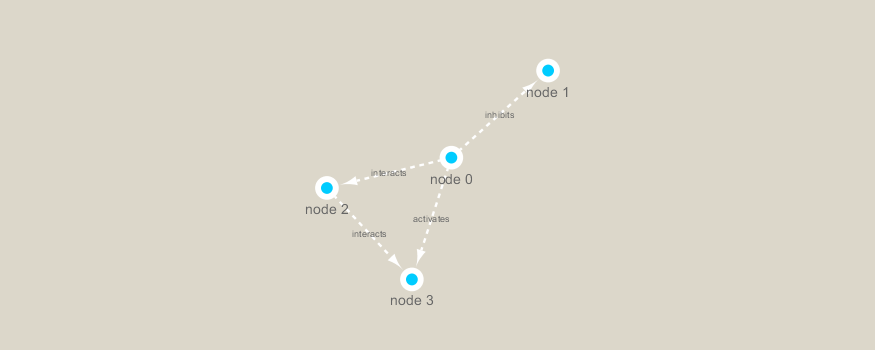

```{r setup, include=FALSE}
knitr::opts_chunk$set(echo = TRUE)
```

### Notes about Networking:
  * Represent biological interactions
    - physical, regulatory, genetic, functional, etc.
  * Useful for discovering relationships in big data
    - Better than tables in Excel
  * Visualize multiple heterogenous data types together
    - Help highlight and see interesting patterns
  * Network analysis
    - Well established quantitive metrics from graph theory
  * Network representations
    - List of relationships
    - Network view: MOST USEFUL when network is sparse
    - Heatmap/Adjacency matrix view

Requirements  
```{r}
library(RCy3)
library(igraph)
library(RColorBrewer)
```

Installation
```{r}
# Test the connection to Cytoscape
cytoscapePing()
```

```{r}
# Check the version
cytoscapeVersionInfo()
```

We can test things further by making a small network (here in igraph format as used by the R **igraph** package) and sending it to Cytoscape:
```{r}
g <- makeSimpleIgraph()
createNetworkFromIgraph(g,"myGraph")
```

If you turn to your Cytoscape window you should now see a simple 4 vertex and 4 edge network displayed (see below).

We can include this Cytoscape rendered network image in our report with the following code:
```{r}
fig <- exportImage(filename="demo", type="png", height=350)
```

Insert this image into this Rmd report
```{r}

```

Change the cytoscope display style
```{r}
setVisualStyle("Marquee")
```

Save and include image here in this report
```{r}
fig <- exportImage(filename="demo_marquee", type="png", height=350)


```

## Read our metagonomics data
```{r}
# scripts for processing located in "inst/data-raw/"
prok_vir_cor <- read.delim("virus_prok_cor_abundant.tsv", stringsAsFactors = FALSE)

# Have a peak at the first 6 rows
head(prok_vir_cor)
```

Here we will use the igraph package to convert the co-occurrence dataframe into a network that we can send to Cytoscape. In this case our graph is undirected (so we will set directed = FALSE) since we do not have any information about the direction of the interactions from this type of data.
```{r}
g <- graph.data.frame(prok_vir_cor, directed = FALSE)
```

Check the class of our new object g and see that it is of class igraph. Use the **print.igraph()** function to allow us to have an informative overview of the graph structure
```{r}
class(g)
```

```{r}
g
```
From the igraph, it is telling us that there are 845 vertices/nodes which represent our bacteria and viruses and 1544 edges/linking lines which indicate their co-occurrence. UNW - network setup: Undirected, Named (i.e. has the 'same' node/vertex attribute set) and Weighted (i.e. the 'weight' edge attribute is set)

```{r}
plot(g)
```

Let's turn of the blue text labels
```{r}
plot(g, vertex.label=NA)
```

The nodes/vertex are too big. Let's make them smaller...
```{r}
plot(g, vertex.size=3, vertex.label=NA)
```

Send it to Cytoscape
```{r}
createNetworkFromIgraph(g, "myigraph")
```


